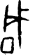

# Multi-instance Visual Comparison / 多实例视觉比较

Object / 对象：`obs-char-000621`

Primary route / 首选路线：`hust-obc-cat-0706`

Review date / 复核日期：2026-08-13

## English

### Purpose, source, and boundary

Five `G_` members were decoded directly from the ignored HUST-OBC raw ZIP.
They were selected across different filename-level catalog and group routes.
No source image was copied into regular Git.

- Source: `src-hust-obc`.
- Package: `large-src-000001`.
- Download route: `dl-hust-obc-figshare-raw`.
- Local ignored ZIP:
  `external_local_archive/source_packages/hust-obc/`
  `dl-hust-obc-figshare-raw.zip`.
- Rights status: `source_marked_risk_noted`.
- Review status: `needs_cross_source_review`.

Catalog and group strings below are filename-derived candidates. This review
does not confirm inscription identity, catalog equivalence, group attribution,
component structure, or an accepted reading.
It is not an accepted reading or a decipherment conclusion.

### Public visual availability / 公开图像可见性

The first instance already has a small, source-marked review derivative in
this object. It is displayed below so a reader can check the corresponding
observation without opening a machine index.

The other four images remain inside the ignored raw package because the HUST
rights signals conflict. Their exact members, hashes, sizes, and pixel
dimensions make the comparison locally reproducible, but they are not public
visual evidence. A reader without the registered package can inspect only
instance 1. This is a blocking visibility limitation, not a completed
five-image public plate.

### Instance 1: Yi 1904 and Heji 1351 candidates

- Member / 成员：`HUST-OBC/deciphered/0706/G_0706_乙1904合1351.png`
- SHA-256：`81ff572ea0c3c777efcf59e25865e2ae1d0ea432d1a9e340f3f8c7d82429a368`
- File size / 文件大小：`1480` bytes；ZIP compressed: `1485` bytes.
- Pixel size / 像素：`44 × 78`
- Mode / 模式：`RGB`
- Filename candidates: Yi `1904`; Heji `1351`.
- Observation: a tall right upright carries a high leftward branch and two
  shorter crossings. A detached, nearly rectangular loop sits at lower left.
- Counterevidence: the loop is separated from the upright, while the upper
  strokes do not form the broad fork visible in instance 5.

### Instance 2: Qian 5.10.5, Heji 11439, and group-string candidate

- Member / 成员：`HUST-OBC/deciphered/0706/G_0706_前5.10.5合11439𠂤賓間.png`
- SHA-256：`ae2800a46f863eb741e9418f3dff3c66d40575d5f58ceddb19102673d4231453`
- File size / 文件大小：`1328` bytes；ZIP compressed: `1333` bytes.
- Pixel size / 像素：`50 × 74`
- Mode / 模式：`RGB`
- Filename candidates: Qian `5.10.5`; Heji `11439`; `𠂤賓間`.
- Observation: two long diagonals cross near the center. A triangular opening
  lies to the left, and a thick curved stroke rises at upper right.
- Counterevidence: it lacks the detached rectangular loop and long straight
  lower upright shared by instances 1, 3, and 4.

### Instance 3: Hou 1.9.1 and Heji 11405 candidates

- Member / 成员：`HUST-OBC/deciphered/0706/G_0706_後1.9.1合11405.png`
- SHA-256：`ef6196de33e2cbe7671587d11d1024e07a6ab50cce378a08c26ec447921dd9a2`
- File size / 文件大小：`1816` bytes；ZIP compressed: `1821` bytes.
- Pixel size / 像素：`64 × 80`
- Mode / 模式：`RGB`
- Filename candidates: Hou `1.9.1`; Heji `11405`.
- Observation: a central upright has two long rightward bars and shorter left
  traces. A detached quadrangular loop lies at lower left; the upright ends in
  a long rightward foot.
- Counterevidence: the two extended right bars and bottom foot are absent or
  much shorter in instances 1 and 4.

### Instance 4: Ye 2 lower.35.15 and Heji 16610 candidates

- Member / 成员：`HUST-OBC/deciphered/0706/G_0706_鄴2下.35.15合16610.png`
- SHA-256：`50878bde077dd8e676600f8ce0a883ab87a7447a387dd4205ac99328287aa9af`
- File size / 文件大小：`1356` bytes；ZIP compressed: `1361` bytes.
- Pixel size / 像素：`39 × 80`
- Mode / 模式：`RGB`
- Filename candidates: Ye `2下.35.15`; Heji `16610`.
- Observation: an upright is crossed by two thin diagonals near the top and
  ends in a short right foot. A small detached diamond lies at lower left.
- Counterevidence: the detached mark is diamond-like rather than rectangular,
  and the upper crossing is thinner and more open than in instances 1 and 3.

### Instance 5: Tie 172.4 and Heji 8553 candidates

- Member / 成员：`HUST-OBC/GuoXueDaShi_1390/0706/G_0706_O_鐵172.4合8553.png`
- SHA-256：`721c93d2220a0e68d41cff711aa8e1605c6a62c4bc60ebd69b8d4f478eb92a2a`
- File size / 文件大小：`1992` bytes；ZIP compressed: `1997` bytes.
- Pixel size / 像素：`60 × 80`
- Mode / 模式：`RGB`
- Filename candidates: Tie `172.4`; Heji `8553`.
- Observation: a large closed rectangular enclosure occupies the lower half.
  A short stem above it divides into three upward prongs. Two thin curved
  traces appear at right.
- Counterevidence: its enclosure is joined to the stem and dominates the lower
  half; this differs sharply from the detached small loops in instances 1, 3,
  and 4 and from the crossed diagonals in instance 2.

### Cross-instance comparison

- Shared route: all five have a strong vertical or diagonal axis and at least
  one enclosed or near-enclosed area, but location and attachment vary.
- Upper structure: instances 1, 3, and 4 use crossings around an upright;
  instance 2 uses a diagonal cross; instance 5 has an upward fork.
- Lower structure: instances 1, 3, and 4 show a detached small loop or diamond;
  instance 2 has no comparable lower loop; instance 5 has a large joined box.

### Near-form mixture risk / 近形混类风险

The dataset category may group forms through a broad visual resemblance while
hiding different signs, joins, or orientations. Instance 5 is the strongest
exclusion candidate; instance 2 is a second exclusion candidate. Conversely,
the small images do not establish that either member belongs elsewhere.

### Alternative explanations / 替代解释

Damage, rubbing density, hand-copy conventions, binarization, orientation,
neighboring traces, and tight cropping can change apparent joins and stroke
counts. The right curves in instance 5 and the detached mark in instance 2
could be neighboring traces or crop artifacts rather than sign features.

### Two-way falsification / 双向可证伪条件

- Split or dispute the category if authoritative plates repeatedly associate
  the joined box, detached loop, and diagonal-cross forms with separate
  contexts or established catalog classes.
- Withdraw the proposed split if multiple rubbings, photographs, or hand copies
  of the same bones show these differences arise from damage, tracing,
  orientation, or cropping.

### Concrete catalog checks

- Open authoritative plates for Heji `1351`, `11439`, `11405`, `16610`, and
  `8553`; record volume, plate, page, full bone, orientation, and neighboring
  signs.
- Locate the proposer and scope of filename group string `𠂤賓間`.
- Verify whether Qian `5.10.5`, Hou `1.9.1`, Ye `2下.35.15`, and Tie `172.4`
  independently map to the stated Heji candidates.
- Obtain rights-permitted full inscription texts and compare the sign position
  and surrounding syntax without inheriting the HUST label as a reading.
- Check collection, findspot, period, batch, transcription history, damage,
  and alternative classifications for each candidate.

## 简体中文

### 目的、来源与边界

本次从已忽略的 HUST-OBC 原始 ZIP 中直接解码 5 个 `G_` 成员，
覆盖不同文件名著录与组类路线。没有把来源图像复制进普通 Git。

- 来源：`src-hust-obc`。
- 来源包：`large-src-000001`。
- 下载路线：`dl-hust-obc-figshare-raw`。
- 权利状态：`source_marked_risk_noted`。
- 复核状态：`needs_cross_source_review`。

以下著录号和组类字符串都只是文件名来源候选。本页不确认
卜辞身份、著录同一性、组类归属、构件结构或已接受释读。

### 公开图像可见性

实例 1 已有带来源和风险标记的小型复核派生图，本页上方直接显示该图，
读者无需先打开机器索引即可核对对应观察。其余四图因 HUST 权利信号冲突，
继续留在已忽略原包中。成员路径、校验和、大小和像素尺寸可供本地复跑，
但它们不是公开可见证据。没有登记原包的读者只能直接核对实例 1；这是
五图公开图版尚未完成的阻断项，不能写成已闭合。

### 五个实例的客观观察

1. 乙1904、合1351 候选：右侧高竖带左向上枝和两道较短交叉；
   左下有分离的近矩形环。其上部不呈实例 5 的宽展分叉。
2. 前5.10.5、合11439、`𠂤賓間` 候选：两条长斜线在中部相交，
   左侧有三角形开口，右上有粗弯笔。不见实例 1、3、4 的分离矩形环。
3. 後1.9.1、合11405 候选：中央竖带两条长右伸横笔和较短左痕；
   左下有分离四边形，竖笔底部向右延长。
4. 鄴2下.35.15、合16610 候选：上部两条细斜笔交叉中竖，底部有
   短右足；左下分离痕近菱形，不同于实例 1、3 的近矩形环。
5. 鐵172.4、合8553 候选：下半部是连接中竖的大型封闭矩形；上部
   分成三个上伸尖笔，右侧另有两道细弯痕。这与其余四例差异最大。

五个实例均有较强的竖向或斜向主轴，也都可见至少一处封闭或
近封闭区域；但封闭区域的位置、尺寸和是否连接主轴并不稳定。

### 近形混类风险

数据集类别可能因宽泛轮廓相似而合并了不同字形、连接方式或方向。
实例 5 是最强的排除候选，实例 2 次之；但小型裁切图本身不足以
证明它们应归入其他类别。

### 替代解释

残损、拓印浓淡、摹写惯例、二值化、方向、邻近痕迹和紧裁切都可能
改变表面上的连接关系与笔画数。实例 5 的右侧弯痕和实例 2 的分离痕
也可能是邻字痕迹或裁切伪影，不一定属于该字。

### 双向可证伪条件

- 若权威图版反复显示“连接大框”、“分离小环”和“斜线交叉”稳定出现于
  不同卜辞语境或已建立字类，应拆分当前类别或明示标争议。
- 若同一甲骨的多份拓片、照片或摹本证明这些差异来自残损、摹写、
  方向或裁切，应撤回近形拆分候选。

### 具体著录待查

- 打开合集 `1351`、`11439`、`11405`、`16610`、`8553` 的权威图版，
  逐一记录卷、图版、页码、整片、方向与邻字。
- 查找文件名组类 `𠂤賓間` 的提出者、定义和适用范围。
- 独立核对前 `5.10.5`、後 `1.9.1`、鄴 `2下.35.15`、鐵 `172.4`
  是否对应所列合集号。
- 取得权利允许的卜辞全文，比较字位和周边句法，不把 HUST 标签
  直接当作释读。
- 逐条核对馆藏、出土地、时期、批次、释读史、残损和其他分类。

### 边界

以上只是预处理阶段视觉记录。它不确认卜辞身份，不是已接受释读、
构件归属、异体合并、组类归属、演化链或破译结论。
