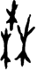

# obs-char-000769 Visual Gallery / obs-char-000769 图像资料页

English:
This human-readable gallery stays inside the same concrete oracle-character
object directory as the structured support packet and visual/source index. It is
a preparation-stage viewing surface for local review images, not a parallel
human-only directory.

简体中文:
本图像资料页与 AI 可读资料包、图像和来源索引放在同一具体甲骨文字对象目录内。它只是准备阶段的人类查看入口，不是另建的并行人类目录。

## Object And Source / 对象与来源

- Project ID / 项目 ID: `obs-char-000769`
- Primary external reference / 首选外部参考: `hust-obc-cat-0873`
- Source / 来源: `src-hust-obc`
- Structured support packet / 结构化辅助包: `01_candidate-character-packet.json`
- Visual/source index / 图像与来源索引: `02_visual-source-index.csv`
- Committed local review images / 已提交本地复核图像数: `1`
- Registered image routes / 已登记图像路线数: `1`

## Research Boundary / 研究边界

English:
Images shown here are source-marked preparation materials for human visual
review. Each image is not an accepted glyph identity, not an accepted reading,
not a component conclusion, and not a decipherment conclusion.

简体中文:
本页展示的图像只是带来源标记的准备阶段材料，用于人工视觉复核。它们不是已确认字形身份，不是已确认释读，不是构件结论，也不是破译结论。

## obs-char-000769-visual-source-001 / 图像条目

- Local image / 本地图像:
  `03_visual-assets/001_asset-000774_hust-obc-cat-0873_glyph.png`
- Local metadata / 本地 metadata:
  `03_visual-assets/001_asset-000774_hust-obc-cat-0873_glyph.yaml`
- Source image path / 来源图像路径:
  `HUST-OBC/deciphered/0873/G_0873_後2.3.2合11323𠂤賓間.png`
- Source package / 来源包: `large-src-000001`
- Download ID / 下载 ID: `dl-hust-obc-figshare-raw`
- Rights status / 权利状态: `source_marked_risk_noted`
- Review status / 复核状态: `needs_human_visual_review`
- Risk note / 风险提示: HUST-OBC image derivative extracted from registered large
  source package for local preparation-stage visual review; rights signals
  conflict between Figshare and article page and this is not decipherment
  evidence.
