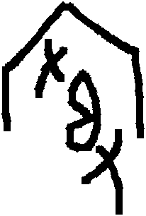

# obs-unk-009079 Visual Gallery / obs-unk-009079 图像资料页

English:
This human-readable gallery stays inside the same concrete candidate directory
as the structured support packet and visual/source index.

简体中文:
本图像资料页与 AI 可读候选包、图像与来源索引放在同一个具体候选目录内。
- Visual/source index / 图像与来源索引: `02_visual-source-index.csv`

## Review Image / 复核图像

- Asset ID / 资产 ID: `asset-010670`
- Local image / 本地图像:
  `03_visual-assets/001_asset-010670_hust-obc-und-YH-009079_glyph.jpg`
- Local metadata / 本地 metadata:
  `03_visual-assets/001_asset-010670_hust-obc-und-YH-009079_glyph.yaml`
- Source image path / 来源图像路径: `HUST-OBC/undeciphered/Y+H/611A4/H_？_611A4_0.png`
- Source package / 来源包: `large-src-000001`
- Download ID / 下载 ID: `dl-hust-obc-figshare-raw`
- Rights status / 权利状态: `source_marked_risk_noted`
- Risk note / 风险提示: HUST-OBC glyph candidate image extracted from registered
  large source package for preparation-stage object-local visual review; rights
  signals conflict between Figshare package metadata and the Scientific Data
  article page.

## Research Boundary / 研究边界

English:
The image shown here is source-marked preparation material for human visual
review. It is not an accepted glyph identity, not an accepted reading, not a
component conclusion, and not a decipherment conclusion.

简体中文:
本页图像是带来源标记的准备阶段材料，用于人工视觉复核。它不是已确认字形身份，不是已确认释读，不是构件结论，也不是破译结论。
