# Component Visual Gallery / 构件图像查看: obs-comp-cand-000001

English:
This page displays OBIMD subcharacter PNG assets extracted into this concrete corpus object directory for human review.

简体中文：
本页展示抽取到当前具体 corpus 对象目录内的 OBIMD subcharacter PNG 资料，供人工复核使用。

Boundary / 边界：dataset image candidate only; not a confirmed component form, component assignment, or decipherment claim.

## asset-021364

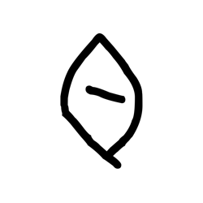

- source_zip_member: `Sub-character Images/p8w7ujqanz/p8w7ujqanz/0k926o2ofl.png`
- checksum_sha256: `a969ae8fa5f99f13dbbe56c6350f101027d0958272e0c12d5d9195235d86a522`
- review_status: `needs_human_visual_review`
- caution: OBIMD subcharacter image is a source-marked review asset only; it is not a confirmed component form, component assignment, or decipherment conclusion.

## asset-021365

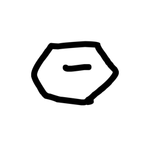

- source_zip_member: `Sub-character Images/p8w7ujqanz/p8w7ujqanz/16vdaya1dz.png`
- checksum_sha256: `f36629e003d4c825ae3f895216b87862aa8cdd9b275f1a8fe9f0dc8f63d24306`
- review_status: `needs_human_visual_review`
- caution: OBIMD subcharacter image is a source-marked review asset only; it is not a confirmed component form, component assignment, or decipherment conclusion.

## asset-021366

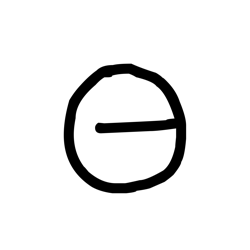

- source_zip_member: `Sub-character Images/p8w7ujqanz/p8w7ujqanz/38vtskybvx.png`
- checksum_sha256: `2a33fb608574bcf9bb33f050fe013d09cde5e262b06a98dc45eca563feb5616d`
- review_status: `needs_human_visual_review`
- caution: OBIMD subcharacter image is a source-marked review asset only; it is not a confirmed component form, component assignment, or decipherment conclusion.

## asset-021367

- source_zip_member: `Sub-character Images/p8w7ujqanz/p8w7ujqanz/3i4zh8matw.png`
- checksum_sha256: `f7c8c9439f22f67fc04743b4ca0b304173bb860effb7679394db2531d6c734ba`
- review_status: `needs_human_visual_review`
- caution: OBIMD subcharacter image is a source-marked review asset only; it is not a confirmed component form, component assignment, or decipherment conclusion.

## asset-021368

- source_zip_member: `Sub-character Images/p8w7ujqanz/p8w7ujqanz/42fiav15xk.png`
- checksum_sha256: `518480c2ebd62bbff67db362aba9573c178a3e6572c71ea34db955adf41c3d7e`
- review_status: `needs_human_visual_review`
- caution: OBIMD subcharacter image is a source-marked review asset only; it is not a confirmed component form, component assignment, or decipherment conclusion.

## asset-021369

- source_zip_member: `Sub-character Images/p8w7ujqanz/p8w7ujqanz/52oao9d52t.png`
- checksum_sha256: `650cec83f245d71197824fcb45714f73849a54befee70fabf886f13d36cbc881`
- review_status: `needs_human_visual_review`
- caution: OBIMD subcharacter image is a source-marked review asset only; it is not a confirmed component form, component assignment, or decipherment conclusion.

## asset-021370

- source_zip_member: `Sub-character Images/p8w7ujqanz/p8w7ujqanz/5qt3iw1rzb.png`
- checksum_sha256: `5db5dbfff808f9b9437f888fdaea59f80f7bca32685c05e47270f826e4f73a2e`
- review_status: `needs_human_visual_review`
- caution: OBIMD subcharacter image is a source-marked review asset only; it is not a confirmed component form, component assignment, or decipherment conclusion.

## asset-021371

- source_zip_member: `Sub-character Images/p8w7ujqanz/p8w7ujqanz/5zpwumgag1.png`
- checksum_sha256: `54dd71858e384c47b619b01435207a8139f046adbe3e892630ad6797e1f9273f`
- review_status: `needs_human_visual_review`
- caution: OBIMD subcharacter image is a source-marked review asset only; it is not a confirmed component form, component assignment, or decipherment conclusion.

## asset-021372

- source_zip_member: `Sub-character Images/p8w7ujqanz/p8w7ujqanz/82gfx29hn8.png`
- checksum_sha256: `f5cbc253eb8f0b4e46c5cb9884ce3c50ca723057ad01d3ef15d9897c49338ece`
- review_status: `needs_human_visual_review`
- caution: OBIMD subcharacter image is a source-marked review asset only; it is not a confirmed component form, component assignment, or decipherment conclusion.

## asset-021373

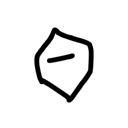

- source_zip_member: `Sub-character Images/p8w7ujqanz/p8w7ujqanz/8fdw155sn8.png`
- checksum_sha256: `870b0b893e4a2aa1c09c1278ed97d3466aa7c52f7553bc64afe86ced9d1baa64`
- review_status: `needs_human_visual_review`
- caution: OBIMD subcharacter image is a source-marked review asset only; it is not a confirmed component form, component assignment, or decipherment conclusion.

## asset-021374

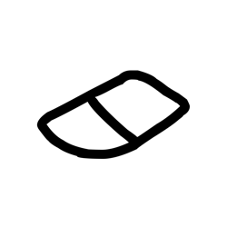

- source_zip_member: `Sub-character Images/p8w7ujqanz/p8w7ujqanz/8nj3kbzjla.png`
- checksum_sha256: `2768afe1338a9b8bd6ba06cbb2c310c8c01b165161c60fc32f8164ed8ea02140`
- review_status: `needs_human_visual_review`
- caution: OBIMD subcharacter image is a source-marked review asset only; it is not a confirmed component form, component assignment, or decipherment conclusion.

## asset-021375

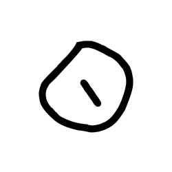

- source_zip_member: `Sub-character Images/p8w7ujqanz/p8w7ujqanz/8qxx1iwmeb.png`
- checksum_sha256: `d540f43b950fe850cdf36b29794593ef4779b6af9a00e269e1fc3221651f0260`
- review_status: `needs_human_visual_review`
- caution: OBIMD subcharacter image is a source-marked review asset only; it is not a confirmed component form, component assignment, or decipherment conclusion.

## asset-021376

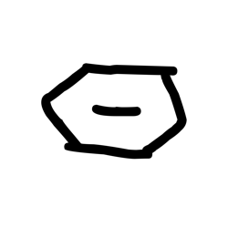

- source_zip_member: `Sub-character Images/p8w7ujqanz/p8w7ujqanz/8td3fwdapq.png`
- checksum_sha256: `1e51a45c576dce9396ac8a5f607e8825aa72666734cc1b9e5eba89979c2b2780`
- review_status: `needs_human_visual_review`
- caution: OBIMD subcharacter image is a source-marked review asset only; it is not a confirmed component form, component assignment, or decipherment conclusion.

## asset-021377

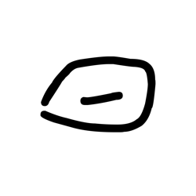

- source_zip_member: `Sub-character Images/p8w7ujqanz/p8w7ujqanz/90tclihzfi.png`
- checksum_sha256: `f94f8120a405b41e21578735c474a72a6dcc1da599358fd12aabe6b7142cd01e`
- review_status: `needs_human_visual_review`
- caution: OBIMD subcharacter image is a source-marked review asset only; it is not a confirmed component form, component assignment, or decipherment conclusion.

## asset-021378

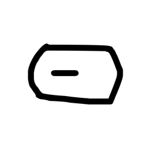

- source_zip_member: `Sub-character Images/p8w7ujqanz/p8w7ujqanz/aodct4vbtf.png`
- checksum_sha256: `499c8f1aa6fe6caf711ebde08142eabcb186e49a9600b3a7b6c8da4d9290ce9e`
- review_status: `needs_human_visual_review`
- caution: OBIMD subcharacter image is a source-marked review asset only; it is not a confirmed component form, component assignment, or decipherment conclusion.

## asset-021379

- source_zip_member: `Sub-character Images/p8w7ujqanz/p8w7ujqanz/bw0xkg1dxs.png`
- checksum_sha256: `d4a8c5c89ca39af3e27ecebcf264a63823134d6dfafdb3773ce655743eaf75d9`
- review_status: `needs_human_visual_review`
- caution: OBIMD subcharacter image is a source-marked review asset only; it is not a confirmed component form, component assignment, or decipherment conclusion.

## asset-021380

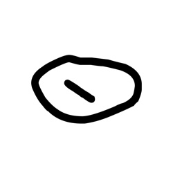

- source_zip_member: `Sub-character Images/p8w7ujqanz/p8w7ujqanz/bxptiwcgwl.png`
- checksum_sha256: `2c74503e7cba29a68f1a3ddb0b6527f0be5c7ad40967c9dac627c5a4e1009799`
- review_status: `needs_human_visual_review`
- caution: OBIMD subcharacter image is a source-marked review asset only; it is not a confirmed component form, component assignment, or decipherment conclusion.

## asset-021381

- source_zip_member: `Sub-character Images/p8w7ujqanz/p8w7ujqanz/dibwgkn5dk.png`
- checksum_sha256: `a566949f64a69af32cefee2bf32678e24a9e30460937ae2fdd7f443728ec7965`
- review_status: `needs_human_visual_review`
- caution: OBIMD subcharacter image is a source-marked review asset only; it is not a confirmed component form, component assignment, or decipherment conclusion.

## asset-021382

- source_zip_member: `Sub-character Images/p8w7ujqanz/p8w7ujqanz/dqqdzyrwli.png`
- checksum_sha256: `5ca56beb6b30a60802375bbe818d526b6bc390013a6db4a5f33b9c9bdf284a78`
- review_status: `needs_human_visual_review`
- caution: OBIMD subcharacter image is a source-marked review asset only; it is not a confirmed component form, component assignment, or decipherment conclusion.

## asset-021383

- source_zip_member: `Sub-character Images/p8w7ujqanz/p8w7ujqanz/dtblt3g9vn.png`
- checksum_sha256: `223619ffb84f9df6e24794a543d1d000a9cd973074ff4535f21614a561156d6e`
- review_status: `needs_human_visual_review`
- caution: OBIMD subcharacter image is a source-marked review asset only; it is not a confirmed component form, component assignment, or decipherment conclusion.

## asset-021384

- source_zip_member: `Sub-character Images/p8w7ujqanz/p8w7ujqanz/dzlb6c0iac.png`
- checksum_sha256: `b8eb4171b2596488023968cfa9d0bc106b76989ad8558fe5f19d3f14f939b418`
- review_status: `needs_human_visual_review`
- caution: OBIMD subcharacter image is a source-marked review asset only; it is not a confirmed component form, component assignment, or decipherment conclusion.

## asset-021385

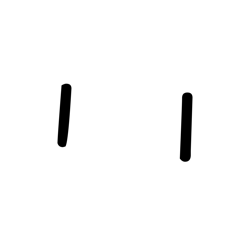

- source_zip_member: `Sub-character Images/p8w7ujqanz/p8w7ujqanz/e7a3ej9fxb.png`
- checksum_sha256: `97b2a8455ed74deb02c5f7f874bb147b42c82a47b9f57c2b24a034c949547181`
- review_status: `needs_human_visual_review`
- caution: OBIMD subcharacter image is a source-marked review asset only; it is not a confirmed component form, component assignment, or decipherment conclusion.

## asset-021386

- source_zip_member: `Sub-character Images/p8w7ujqanz/p8w7ujqanz/eakbm3w8pb.png`
- checksum_sha256: `d45d2484f81a87edac77bceb8bb1e4b934965a318b94eee91f75a5e69beaa0a8`
- review_status: `needs_human_visual_review`
- caution: OBIMD subcharacter image is a source-marked review asset only; it is not a confirmed component form, component assignment, or decipherment conclusion.

## asset-021387

- source_zip_member: `Sub-character Images/p8w7ujqanz/p8w7ujqanz/eit4yvx9xo.png`
- checksum_sha256: `5746a9f3aa97c7e429d5e9a1342b97ff94e81cbb2c6b589c7c4d3420c9dd9542`
- review_status: `needs_human_visual_review`
- caution: OBIMD subcharacter image is a source-marked review asset only; it is not a confirmed component form, component assignment, or decipherment conclusion.

## asset-021388

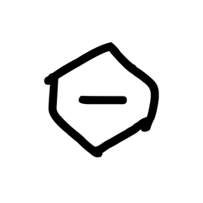

- source_zip_member: `Sub-character Images/p8w7ujqanz/p8w7ujqanz/ept76loiyh.png`
- checksum_sha256: `31d4da440bee3c5dbbeb7cde3f3364c09890693c09a74fd61e7fdb4cb2a8a30f`
- review_status: `needs_human_visual_review`
- caution: OBIMD subcharacter image is a source-marked review asset only; it is not a confirmed component form, component assignment, or decipherment conclusion.

## asset-021389

- source_zip_member: `Sub-character Images/p8w7ujqanz/p8w7ujqanz/ffrxr83yqr.png`
- checksum_sha256: `193dd40a85f2580a6c12b3acdc72b5f4013e935b9dc08b5ce766c7448cf8250e`
- review_status: `needs_human_visual_review`
- caution: OBIMD subcharacter image is a source-marked review asset only; it is not a confirmed component form, component assignment, or decipherment conclusion.

## asset-021390

- source_zip_member: `Sub-character Images/p8w7ujqanz/p8w7ujqanz/gky9w2bpto.png`
- checksum_sha256: `a27d8e0d0d9e5a553e120a3355444d4e6419e271e2a5354fee0ba9c1ce4056b8`
- review_status: `needs_human_visual_review`
- caution: OBIMD subcharacter image is a source-marked review asset only; it is not a confirmed component form, component assignment, or decipherment conclusion.

## asset-021391

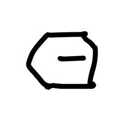

- source_zip_member: `Sub-character Images/p8w7ujqanz/p8w7ujqanz/hb4ye7lmrg.png`
- checksum_sha256: `f0eb05fc3a05b8f037193dfbccae4e1abfbf211c5ab2ab95cf276eb11020c333`
- review_status: `needs_human_visual_review`
- caution: OBIMD subcharacter image is a source-marked review asset only; it is not a confirmed component form, component assignment, or decipherment conclusion.

## asset-021392

- source_zip_member: `Sub-character Images/p8w7ujqanz/p8w7ujqanz/hczlv3xdq7.png`
- checksum_sha256: `a849057c7afa3623f9199b90c965d7c708d7f789b3ba98792bb508320e6d4871`
- review_status: `needs_human_visual_review`
- caution: OBIMD subcharacter image is a source-marked review asset only; it is not a confirmed component form, component assignment, or decipherment conclusion.

## asset-021393

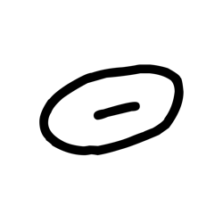

- source_zip_member: `Sub-character Images/p8w7ujqanz/p8w7ujqanz/i18u7ulwx9.png`
- checksum_sha256: `af0f462af2f4f964f96449d4444f0f3a5c01768330b77b27d1caefde8f7ab1e1`
- review_status: `needs_human_visual_review`
- caution: OBIMD subcharacter image is a source-marked review asset only; it is not a confirmed component form, component assignment, or decipherment conclusion.

## asset-021394

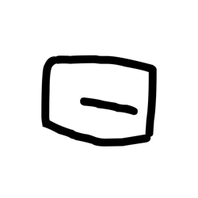

- source_zip_member: `Sub-character Images/p8w7ujqanz/p8w7ujqanz/iapfczh78w.png`
- checksum_sha256: `e19348e27dc9afd2af10334b9dcc0e7c7f7eb2c7dc3f5eac943419460174508e`
- review_status: `needs_human_visual_review`
- caution: OBIMD subcharacter image is a source-marked review asset only; it is not a confirmed component form, component assignment, or decipherment conclusion.

## asset-021395

- source_zip_member: `Sub-character Images/p8w7ujqanz/p8w7ujqanz/km2zpyedb4.png`
- checksum_sha256: `617aae4a4d7ce9d354a2373f2a0bef828c4c3edb55af481fb5682bb0c8035cdf`
- review_status: `needs_human_visual_review`
- caution: OBIMD subcharacter image is a source-marked review asset only; it is not a confirmed component form, component assignment, or decipherment conclusion.

## asset-021396

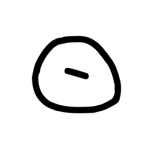

- source_zip_member: `Sub-character Images/p8w7ujqanz/p8w7ujqanz/llaoh4kt61.png`
- checksum_sha256: `b9790c2756ffab5d8f7546ff65763555c86a59add4884bc6515b2cce92f9d55a`
- review_status: `needs_human_visual_review`
- caution: OBIMD subcharacter image is a source-marked review asset only; it is not a confirmed component form, component assignment, or decipherment conclusion.

## asset-021397

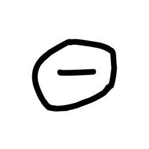

- source_zip_member: `Sub-character Images/p8w7ujqanz/p8w7ujqanz/nw7krdnusj.png`
- checksum_sha256: `5075bb2307d3d30c38e09037950fb4ccbb351e7d08365b3661b1ee282f10d448`
- review_status: `needs_human_visual_review`
- caution: OBIMD subcharacter image is a source-marked review asset only; it is not a confirmed component form, component assignment, or decipherment conclusion.

## asset-021398

- source_zip_member: `Sub-character Images/p8w7ujqanz/p8w7ujqanz/oosdc2cndq.png`
- checksum_sha256: `3f7b9ef1808b87959dee4e0f6f0d45abdb6fd92362f3022fadc65eae08868a64`
- review_status: `needs_human_visual_review`
- caution: OBIMD subcharacter image is a source-marked review asset only; it is not a confirmed component form, component assignment, or decipherment conclusion.

## asset-021399

- source_zip_member: `Sub-character Images/p8w7ujqanz/p8w7ujqanz/p8w7ujqanz.png`
- checksum_sha256: `b97d8e6c00e588a70b301761664e60806570cd85f54d6346180acd8c57bb2dc9`
- review_status: `needs_human_visual_review`
- caution: OBIMD subcharacter image is a source-marked review asset only; it is not a confirmed component form, component assignment, or decipherment conclusion.

## asset-021400

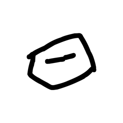

- source_zip_member: `Sub-character Images/p8w7ujqanz/p8w7ujqanz/piwbgqdka1.png`
- checksum_sha256: `947c0406e7f1b2578d332aee4129e0067170ab7ac02af05e2e275bcc202a8253`
- review_status: `needs_human_visual_review`
- caution: OBIMD subcharacter image is a source-marked review asset only; it is not a confirmed component form, component assignment, or decipherment conclusion.

## asset-021401

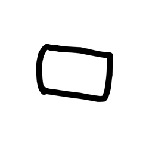

- source_zip_member: `Sub-character Images/p8w7ujqanz/p8w7ujqanz/pm2otht8x9.png`
- checksum_sha256: `3cd1f41f9bcd15399c21ccdfccde48e5240d6ec6fe71570fa2e19667759d8404`
- review_status: `needs_human_visual_review`
- caution: OBIMD subcharacter image is a source-marked review asset only; it is not a confirmed component form, component assignment, or decipherment conclusion.

## asset-021402

- source_zip_member: `Sub-character Images/p8w7ujqanz/p8w7ujqanz/pvklt5rzdt.png`
- checksum_sha256: `957f34376f1f079a73ea096c9b085b8892507d8ab834af595ad94d68fd88dfff`
- review_status: `needs_human_visual_review`
- caution: OBIMD subcharacter image is a source-marked review asset only; it is not a confirmed component form, component assignment, or decipherment conclusion.

## asset-021403

- source_zip_member: `Sub-character Images/p8w7ujqanz/p8w7ujqanz/q40t66wxh6.png`
- checksum_sha256: `a749b271485aaaa6ac12d7af127a2734f7e1ecefd8ba61486b98810f56f806a2`
- review_status: `needs_human_visual_review`
- caution: OBIMD subcharacter image is a source-marked review asset only; it is not a confirmed component form, component assignment, or decipherment conclusion.

## asset-021404

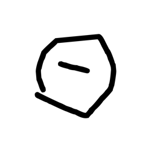

- source_zip_member: `Sub-character Images/p8w7ujqanz/p8w7ujqanz/recwqp24oc.png`
- checksum_sha256: `8287b3ffa2751015f2a8dd0cf6d38c074039b97e9ec52ea6abc94b7201fa3f69`
- review_status: `needs_human_visual_review`
- caution: OBIMD subcharacter image is a source-marked review asset only; it is not a confirmed component form, component assignment, or decipherment conclusion.

## asset-021405

- source_zip_member: `Sub-character Images/p8w7ujqanz/p8w7ujqanz/rev4ced3id.png`
- checksum_sha256: `d004352f1dc58062973094d8ca87b13f6e8719359edf71898580f691787eb4f5`
- review_status: `needs_human_visual_review`
- caution: OBIMD subcharacter image is a source-marked review asset only; it is not a confirmed component form, component assignment, or decipherment conclusion.

## asset-021406

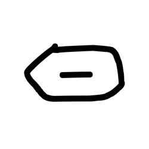

- source_zip_member: `Sub-character Images/p8w7ujqanz/p8w7ujqanz/tfi01ln8dt.png`
- checksum_sha256: `d45e0281005176ff618cd7175ac4d5791167a9a031c3f1ad82d2a4b2b43be6ed`
- review_status: `needs_human_visual_review`
- caution: OBIMD subcharacter image is a source-marked review asset only; it is not a confirmed component form, component assignment, or decipherment conclusion.

## asset-021407

- source_zip_member: `Sub-character Images/p8w7ujqanz/p8w7ujqanz/tsx4rsbete.png`
- checksum_sha256: `48ef02a8ad3a73569934e38896b67fcc7d8ba57136d113e4dcfe6352b40fb3b1`
- review_status: `needs_human_visual_review`
- caution: OBIMD subcharacter image is a source-marked review asset only; it is not a confirmed component form, component assignment, or decipherment conclusion.

## asset-021408

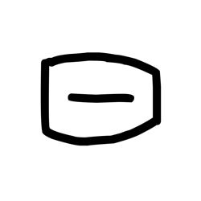

- source_zip_member: `Sub-character Images/p8w7ujqanz/p8w7ujqanz/tx0xaest9x.png`
- checksum_sha256: `9b6438a2ef12c14824583552351ca3c390283cdd58e6ccb70ba19784612a2aea`
- review_status: `needs_human_visual_review`
- caution: OBIMD subcharacter image is a source-marked review asset only; it is not a confirmed component form, component assignment, or decipherment conclusion.

## asset-021409

- source_zip_member: `Sub-character Images/p8w7ujqanz/p8w7ujqanz/ulvvr0qg26.png`
- checksum_sha256: `eefcb49dfd79260e131e4952c55203a0fff0da4c07b9f8fa49007cfe89659497`
- review_status: `needs_human_visual_review`
- caution: OBIMD subcharacter image is a source-marked review asset only; it is not a confirmed component form, component assignment, or decipherment conclusion.

## asset-021410

- source_zip_member: `Sub-character Images/p8w7ujqanz/p8w7ujqanz/uznzdlamfy.png`
- checksum_sha256: `1a2aac8078d750fdc117513038e484ed879f399fc21a540b96925d40daf62fe8`
- review_status: `needs_human_visual_review`
- caution: OBIMD subcharacter image is a source-marked review asset only; it is not a confirmed component form, component assignment, or decipherment conclusion.

## asset-021411

- source_zip_member: `Sub-character Images/p8w7ujqanz/p8w7ujqanz/w9n9n44me4.png`
- checksum_sha256: `8d0ae86f2fc00d96ca3e5f89d3cb7387a8aac191d16e6a5520d656182a58463f`
- review_status: `needs_human_visual_review`
- caution: OBIMD subcharacter image is a source-marked review asset only; it is not a confirmed component form, component assignment, or decipherment conclusion.

## asset-021412

- source_zip_member: `Sub-character Images/p8w7ujqanz/p8w7ujqanz/yn0guem826.png`
- checksum_sha256: `452c0d7754a83d7f721c6f07062a8ae071af300cf99f0ab57b723e1796167492`
- review_status: `needs_human_visual_review`
- caution: OBIMD subcharacter image is a source-marked review asset only; it is not a confirmed component form, component assignment, or decipherment conclusion.

## asset-021413

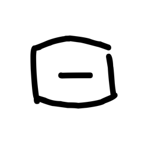

- source_zip_member: `Sub-character Images/p8w7ujqanz/p8w7ujqanz/yrq3xmala7.png`
- checksum_sha256: `ec513f0481ddfd1826fb29fd953cb33fbe98070fd01f9f3cbf44f81a33757f77`
- review_status: `needs_human_visual_review`
- caution: OBIMD subcharacter image is a source-marked review asset only; it is not a confirmed component form, component assignment, or decipherment conclusion.
