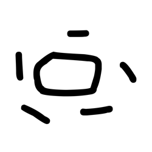
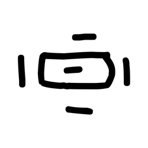

# Component Visual Gallery / 构件图像查看: obs-comp-cand-000004

English:
This page displays OBIMD subcharacter PNG assets extracted into this concrete
corpus object directory for human review.

简体中文：
本页展示抽取到当前具体 corpus 对象目录内的 OBIMD subcharacter PNG 资料，供人工复核使用。

Boundary / 边界：
dataset image candidate only; not a confirmed component form, not a component
assignment, and not a decipherment claim.
- not a confirmed component form
- not a component assignment
- not a decipherment claim

## Concrete Questions To Check / 具体待查问题

- Which local image should be opened first?
- 应先打开哪一张本地构件图像？
- Which source zip member anchors this image?
- 哪一个 source zip member 能定位这张图像？
- Which near-shape or variant comparison is still missing?
- 还缺哪些近形或异体比较？
- Which character or inscription context should be checked next?
- 下一步应核对哪些单字或卜辞上下文？
- What evidence is missing before a component assignment?
- 正式构件归属前还缺哪些证据？

## asset-011052

- source_zip_member: `Sub-character Images/6kf650i4zk/6kf650i4zk/4s6k6ag3fc.png`
- checksum_sha256: see `06_component-visual-index.csv`.
- review_status: `needs_human_visual_review`
- caution: source-marked review image only.

## asset-011053

- source_zip_member: `Sub-character Images/6kf650i4zk/6kf650i4zk/5n59fjofsc.png`
- checksum_sha256: see `06_component-visual-index.csv`.
- review_status: `needs_human_visual_review`
- caution: source-marked review image only.

## asset-011054

- source_zip_member: `Sub-character Images/6kf650i4zk/6kf650i4zk/6kf650i4zk.png`
- checksum_sha256: see `06_component-visual-index.csv`.
- review_status: `needs_human_visual_review`
- caution: source-marked review image only.

## asset-011055

- source_zip_member: `Sub-character Images/6kf650i4zk/6kf650i4zk/7ayxs6tc1e.png`
- checksum_sha256: see `06_component-visual-index.csv`.
- review_status: `needs_human_visual_review`
- caution: source-marked review image only.

## asset-011056

- source_zip_member: `Sub-character Images/6kf650i4zk/6kf650i4zk/8paccsqm3v.png`
- checksum_sha256: see `06_component-visual-index.csv`.
- review_status: `needs_human_visual_review`
- caution: source-marked review image only.

## asset-011057

- source_zip_member: `Sub-character Images/6kf650i4zk/6kf650i4zk/g0s64xwloy.png`
- checksum_sha256: see `06_component-visual-index.csv`.
- review_status: `needs_human_visual_review`
- caution: source-marked review image only.

## asset-011058

- source_zip_member: `Sub-character Images/6kf650i4zk/6kf650i4zk/npx7rb62rp.png`
- checksum_sha256: see `06_component-visual-index.csv`.
- review_status: `needs_human_visual_review`
- caution: source-marked review image only.

## asset-011059

- source_zip_member: `Sub-character Images/6kf650i4zk/6kf650i4zk/pib797z4qs.png`
- checksum_sha256: see `06_component-visual-index.csv`.
- review_status: `needs_human_visual_review`
- caution: source-marked review image only.

## asset-011060

- source_zip_member: `Sub-character Images/6kf650i4zk/6kf650i4zk/wcq95f2bka.png`
- checksum_sha256: see `06_component-visual-index.csv`.
- review_status: `needs_human_visual_review`
- caution: source-marked review image only.

## asset-011061

- source_zip_member: `Sub-character Images/6kf650i4zk/6kf650i4zk/xtawloztvd.png`
- checksum_sha256: see `06_component-visual-index.csv`.
- review_status: `needs_human_visual_review`
- caution: source-marked review image only.
