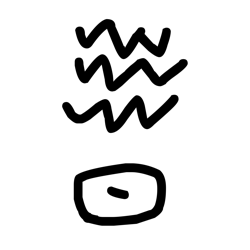
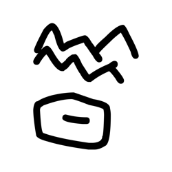
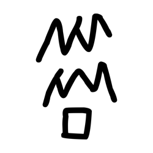
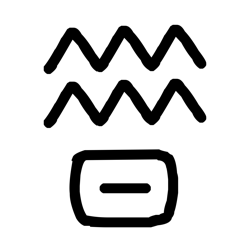
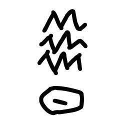

# Component Visual Gallery / 构件图像查看: obs-comp-cand-000007

English:
This page displays OBIMD subcharacter PNG assets extracted into this concrete corpus object directory for human review.

简体中文：
本页展示抽取到当前具体 corpus 对象目录内的 OBIMD subcharacter PNG 资料，供人工复核使用。

Boundary / 边界：dataset image candidate only; not a confirmed component form, component assignment, or decipherment claim.

## asset-011064

- source_zip_member: `Sub-character Images/mg6ldxzwwb/mg6ldxzwwb/7o8jl7x2wu.png`
- checksum_sha256: `75a670858344d9dd330b259a9111c255ec28f4d028272b5fb41799aa4d837cfe`
- review_status: `needs_human_visual_review`
- caution: OBIMD subcharacter image is a source-marked review asset only; it is not a confirmed component form, component assignment, or decipherment conclusion.

## asset-011065

- source_zip_member: `Sub-character Images/mg6ldxzwwb/mg6ldxzwwb/dkgxq0o48j.png`
- checksum_sha256: `e39d3543ceb2b7daadf5f1140b36ff2a4e798bf42df26aaedc8f9bf4aff50b05`
- review_status: `needs_human_visual_review`
- caution: OBIMD subcharacter image is a source-marked review asset only; it is not a confirmed component form, component assignment, or decipherment conclusion.

## asset-011066

- source_zip_member: `Sub-character Images/mg6ldxzwwb/mg6ldxzwwb/dsnc0gtvaz.png`
- checksum_sha256: `f5db0f0df0a983373abe92bc4e1b568489a3662f13b2d1e5e23b48dd232f66af`
- review_status: `needs_human_visual_review`
- caution: OBIMD subcharacter image is a source-marked review asset only; it is not a confirmed component form, component assignment, or decipherment conclusion.

## asset-011067

- source_zip_member: `Sub-character Images/mg6ldxzwwb/mg6ldxzwwb/e2u8ocr4q9.png`
- checksum_sha256: `e0b3d1cc10eb82e933993cceb73290994ad06cd4f9291b79bbb3b02ca66ea871`
- review_status: `needs_human_visual_review`
- caution: OBIMD subcharacter image is a source-marked review asset only; it is not a confirmed component form, component assignment, or decipherment conclusion.

## asset-011068

- source_zip_member: `Sub-character Images/mg6ldxzwwb/mg6ldxzwwb/ivc784wqbc.png`
- checksum_sha256: `e884b0bf0dd34a07f78bfd7154fe828e8437bd55b5349d70e706b6fe72b9441d`
- review_status: `needs_human_visual_review`
- caution: OBIMD subcharacter image is a source-marked review asset only; it is not a confirmed component form, component assignment, or decipherment conclusion.

## asset-011069

- source_zip_member: `Sub-character Images/mg6ldxzwwb/mg6ldxzwwb/mg6ldxzwwb.png`
- checksum_sha256: `aa4e9bdf08d95df0ea88da34b851b11162b21d8e75ded65bea4c7adcef58fa95`
- review_status: `needs_human_visual_review`
- caution: OBIMD subcharacter image is a source-marked review asset only; it is not a confirmed component form, component assignment, or decipherment conclusion.

## asset-011070

- source_zip_member: `Sub-character Images/mg6ldxzwwb/mg6ldxzwwb/mktr3ryr0h.png`
- checksum_sha256: `b37c27b9b0847af73a0ad8de951c0a904ef24b784a7b9245f6dc4e5c88ebf364`
- review_status: `needs_human_visual_review`
- caution: OBIMD subcharacter image is a source-marked review asset only; it is not a confirmed component form, component assignment, or decipherment conclusion.

## asset-011071

- source_zip_member: `Sub-character Images/mg6ldxzwwb/mg6ldxzwwb/rikm799a3f.png`
- checksum_sha256: `42b6e244eda1baa8fbbcbc59d0a6bb29b78654c2dbf0629abf66581315683a41`
- review_status: `needs_human_visual_review`
- caution: OBIMD subcharacter image is a source-marked review asset only; it is not a confirmed component form, component assignment, or decipherment conclusion.

## asset-011072

- source_zip_member: `Sub-character Images/mg6ldxzwwb/mg6ldxzwwb/s2r97pqobe.png`
- checksum_sha256: `37ef84821b64686120e42b0960e0b52e7f42962e9408d55f70c1715584d98ae6`
- review_status: `needs_human_visual_review`
- caution: OBIMD subcharacter image is a source-marked review asset only; it is not a confirmed component form, component assignment, or decipherment conclusion.
