# Component Visual Gallery / 构件图像查看: obs-comp-cand-000014

English:
This page displays OBIMD subcharacter PNG assets extracted into this concrete corpus object directory for human review.

简体中文：
本页展示抽取到当前具体 corpus 对象目录内的 OBIMD subcharacter PNG 资料，供人工复核使用。

Boundary / 边界：dataset image candidate only; not a confirmed component form, component assignment, or decipherment claim.

## asset-011079

- source_zip_member: `Sub-character Images/0wfbo7ml5k/plssynksd8/0hkcyx5cti.png`
- checksum_sha256: `2e7c8678eb24e44e49246638f141070c361db75bba6d181b898565eeeb38f1f6`
- review_status: `needs_human_visual_review`
- caution: OBIMD subcharacter image is a source-marked review asset only; it is not a confirmed component form, component assignment, or decipherment conclusion.

## asset-011080

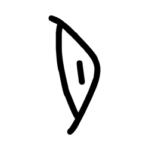

- source_zip_member: `Sub-character Images/0wfbo7ml5k/plssynksd8/1hapc6swel.png`
- checksum_sha256: `ff755755df87d2ad357a8d5bce508f1578297b3f919c4f1cdf55c46494c898a9`
- review_status: `needs_human_visual_review`
- caution: OBIMD subcharacter image is a source-marked review asset only; it is not a confirmed component form, component assignment, or decipherment conclusion.

## asset-011081

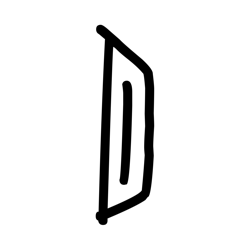

- source_zip_member: `Sub-character Images/0wfbo7ml5k/plssynksd8/2ehqzgjgz5.png`
- checksum_sha256: `1116ce27185d067a3b46b09cd6743506d02d30eff55ab0e553dc84f4ee3dafa7`
- review_status: `needs_human_visual_review`
- caution: OBIMD subcharacter image is a source-marked review asset only; it is not a confirmed component form, component assignment, or decipherment conclusion.

## asset-011082

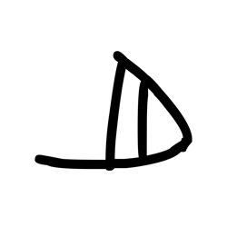

- source_zip_member: `Sub-character Images/0wfbo7ml5k/plssynksd8/2iqigjw06u.png`
- checksum_sha256: `cd5d318d860ce1a34758fa2159155bd2519bee48619ff008c83da5bc4bd53873`
- review_status: `needs_human_visual_review`
- caution: OBIMD subcharacter image is a source-marked review asset only; it is not a confirmed component form, component assignment, or decipherment conclusion.

## asset-011083

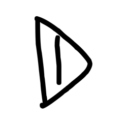

- source_zip_member: `Sub-character Images/0wfbo7ml5k/plssynksd8/3q7xidf4xq.png`
- checksum_sha256: `f55bc1e0a5ca41274f61ea30b77ccab01e88cf0ee5d0f3733dff86b64dd41662`
- review_status: `needs_human_visual_review`
- caution: OBIMD subcharacter image is a source-marked review asset only; it is not a confirmed component form, component assignment, or decipherment conclusion.

## asset-011084

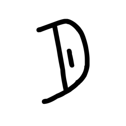

- source_zip_member: `Sub-character Images/0wfbo7ml5k/plssynksd8/4whb5nldms.png`
- checksum_sha256: `a628c318e68af6909f2d8c2bd9dc41546a0f408dfb612c6c765063d1019d5704`
- review_status: `needs_human_visual_review`
- caution: OBIMD subcharacter image is a source-marked review asset only; it is not a confirmed component form, component assignment, or decipherment conclusion.

## asset-011085

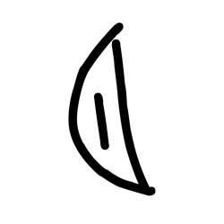

- source_zip_member: `Sub-character Images/0wfbo7ml5k/plssynksd8/55pidozhl5.png`
- checksum_sha256: `3c174a41c24bcfe51d7ae545708a78985f905c2981bb57e45379ace4b83d6e1a`
- review_status: `needs_human_visual_review`
- caution: OBIMD subcharacter image is a source-marked review asset only; it is not a confirmed component form, component assignment, or decipherment conclusion.

## asset-011086

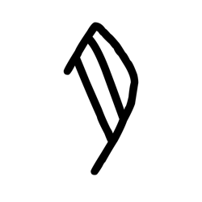

- source_zip_member: `Sub-character Images/0wfbo7ml5k/plssynksd8/6omjoadgbl.png`
- checksum_sha256: `dff070aefe11cca96ed76b6671622e16bff88c9c3696cad422e446be483e42ca`
- review_status: `needs_human_visual_review`
- caution: OBIMD subcharacter image is a source-marked review asset only; it is not a confirmed component form, component assignment, or decipherment conclusion.

## asset-011087

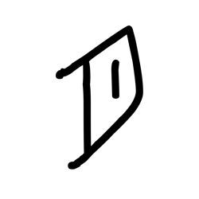

- source_zip_member: `Sub-character Images/0wfbo7ml5k/plssynksd8/82fr1vgp1d.png`
- checksum_sha256: `7fce0a22614ab49bf0fac53dfcdcbf78667702ae3defe451ff21db05abb72835`
- review_status: `needs_human_visual_review`
- caution: OBIMD subcharacter image is a source-marked review asset only; it is not a confirmed component form, component assignment, or decipherment conclusion.

## asset-011088

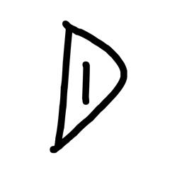

- source_zip_member: `Sub-character Images/0wfbo7ml5k/plssynksd8/9cwvzzpvx9.png`
- checksum_sha256: `ed617c573b108622794cbf789208758182493bfe2e754f58ab288c4a4ab40f71`
- review_status: `needs_human_visual_review`
- caution: OBIMD subcharacter image is a source-marked review asset only; it is not a confirmed component form, component assignment, or decipherment conclusion.

## asset-011089

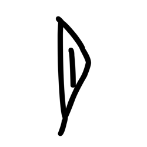

- source_zip_member: `Sub-character Images/0wfbo7ml5k/plssynksd8/ag98nuflnb.png`
- checksum_sha256: `51d3d9cb1b5a856188889cac079f0cd675ed039b76eb255598215a41db13dc72`
- review_status: `needs_human_visual_review`
- caution: OBIMD subcharacter image is a source-marked review asset only; it is not a confirmed component form, component assignment, or decipherment conclusion.

## asset-011090

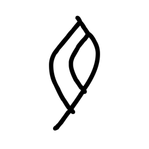

- source_zip_member: `Sub-character Images/0wfbo7ml5k/plssynksd8/bx3up2spb2.png`
- checksum_sha256: `bab4c6ee63aa7808228c479b96aa53efe8e2a0aa80ef8d6132f69abc97dc09ac`
- review_status: `needs_human_visual_review`
- caution: OBIMD subcharacter image is a source-marked review asset only; it is not a confirmed component form, component assignment, or decipherment conclusion.

## asset-011091

- source_zip_member: `Sub-character Images/0wfbo7ml5k/plssynksd8/d2qrw4g0ds.png`
- checksum_sha256: `55d1670abe3b843f7f97c4e9651da50ca126892f98e51ebab3fe416b745cca65`
- review_status: `needs_human_visual_review`
- caution: OBIMD subcharacter image is a source-marked review asset only; it is not a confirmed component form, component assignment, or decipherment conclusion.

## asset-011092

- source_zip_member: `Sub-character Images/0wfbo7ml5k/plssynksd8/f5d9gjjjct.png`
- checksum_sha256: `a2e5163cadd7bd55249b19d85c38dafd7dd3211405972dcaa00edf65cdcba98e`
- review_status: `needs_human_visual_review`
- caution: OBIMD subcharacter image is a source-marked review asset only; it is not a confirmed component form, component assignment, or decipherment conclusion.

## asset-011093

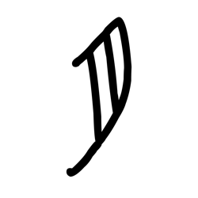

- source_zip_member: `Sub-character Images/0wfbo7ml5k/plssynksd8/lhoo68i2ye.png`
- checksum_sha256: `1e4ccd0b5254ff69f1208b4e9c7d3f14876621e437431c26cafce99d13d0bcc8`
- review_status: `needs_human_visual_review`
- caution: OBIMD subcharacter image is a source-marked review asset only; it is not a confirmed component form, component assignment, or decipherment conclusion.

## asset-011094

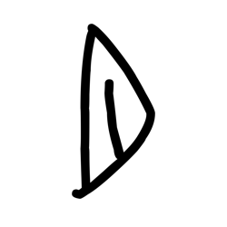

- source_zip_member: `Sub-character Images/0wfbo7ml5k/plssynksd8/n16xw0advm.png`
- checksum_sha256: `d8661c38075f21c0e9fe6a1a88b20137cd1ec710b99187ca57206bf01c5f4695`
- review_status: `needs_human_visual_review`
- caution: OBIMD subcharacter image is a source-marked review asset only; it is not a confirmed component form, component assignment, or decipherment conclusion.

## asset-011095

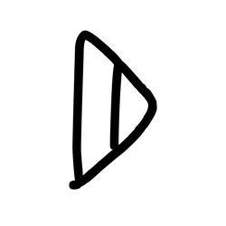

- source_zip_member: `Sub-character Images/0wfbo7ml5k/plssynksd8/opt28z2r5w.png`
- checksum_sha256: `020b5cb2cbea72b4f200448ba41a53f0c6b85ea681ecac5e06a36a9ece86521e`
- review_status: `needs_human_visual_review`
- caution: OBIMD subcharacter image is a source-marked review asset only; it is not a confirmed component form, component assignment, or decipherment conclusion.

## asset-011096

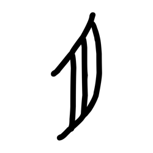

- source_zip_member: `Sub-character Images/0wfbo7ml5k/plssynksd8/p7vordci0v.png`
- checksum_sha256: `f982c676cf2f48ea2a015166172ce150ed0272c8037e642b84ed53ff249791dc`
- review_status: `needs_human_visual_review`
- caution: OBIMD subcharacter image is a source-marked review asset only; it is not a confirmed component form, component assignment, or decipherment conclusion.

## asset-011097

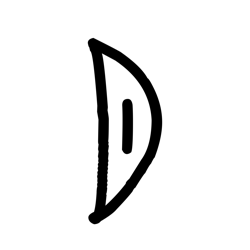

- source_zip_member: `Sub-character Images/0wfbo7ml5k/plssynksd8/plssynksd8.png`
- checksum_sha256: `bda5a1d109c6334b519ae6411daf40d9dc7d6712b33ab73f71155206ff5cde44`
- review_status: `needs_human_visual_review`
- caution: OBIMD subcharacter image is a source-marked review asset only; it is not a confirmed component form, component assignment, or decipherment conclusion.

## asset-011098

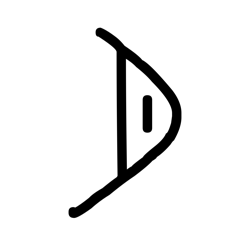

- source_zip_member: `Sub-character Images/0wfbo7ml5k/plssynksd8/pm95yirc65.png`
- checksum_sha256: `fc3eb6fc6a3e2abc5a45ecaebdc89580f403dd31ee0d374c0c04401e1cb7ed9b`
- review_status: `needs_human_visual_review`
- caution: OBIMD subcharacter image is a source-marked review asset only; it is not a confirmed component form, component assignment, or decipherment conclusion.

## asset-011099

- source_zip_member: `Sub-character Images/0wfbo7ml5k/plssynksd8/q71hc94gjs.png`
- checksum_sha256: `95fa20d6d268e133db6cca4f0d18ca9df358fe5d2a346ee979dbaae713618130`
- review_status: `needs_human_visual_review`
- caution: OBIMD subcharacter image is a source-marked review asset only; it is not a confirmed component form, component assignment, or decipherment conclusion.

## asset-011100

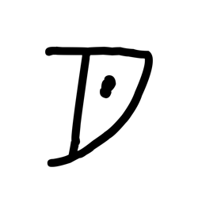

- source_zip_member: `Sub-character Images/0wfbo7ml5k/plssynksd8/srfwtupli0.png`
- checksum_sha256: `cda21bcbed315aeb83d947e8c53447831d728c592fac42e8e61c0730e23d96ec`
- review_status: `needs_human_visual_review`
- caution: OBIMD subcharacter image is a source-marked review asset only; it is not a confirmed component form, component assignment, or decipherment conclusion.
