# Component Visual Gallery / 构件图像查看: obs-comp-cand-000015

English:
This page displays OBIMD subcharacter PNG assets extracted into this concrete corpus object directory for human review.

简体中文：
本页展示抽取到当前具体 corpus 对象目录内的 OBIMD subcharacter PNG 资料，供人工复核使用。

Boundary / 边界：dataset image candidate only; not a confirmed component form, component assignment, or decipherment claim.

## asset-011101

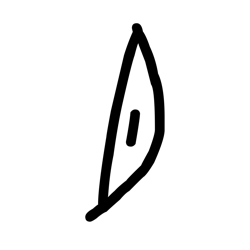

- source_zip_member: `Sub-character Images/no4gdlajf6/no4gdlajf6/083o9tfibd.png`
- checksum_sha256: `93d8e9a073a3c1f50d3290ac189873fc691e7024ef8a988f3e9dad3f296741cf`
- review_status: `needs_human_visual_review`
- caution: OBIMD subcharacter image is a source-marked review asset only; it is not a confirmed component form, component assignment, or decipherment conclusion.

## asset-011102

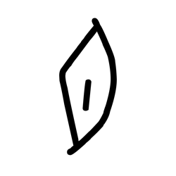

- source_zip_member: `Sub-character Images/no4gdlajf6/no4gdlajf6/0f72cj844f.png`
- checksum_sha256: `d42e126d92917f6311135506ed2833d4b463273a073cba6cb350c9c4ab8bab1f`
- review_status: `needs_human_visual_review`
- caution: OBIMD subcharacter image is a source-marked review asset only; it is not a confirmed component form, component assignment, or decipherment conclusion.

## asset-011103

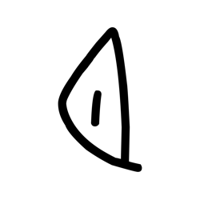

- source_zip_member: `Sub-character Images/no4gdlajf6/no4gdlajf6/0g9vo19eo9.png`
- checksum_sha256: `56933966ee11fce0578badba861f39944ee28cb5e3ed0a98ad615671f982eaf3`
- review_status: `needs_human_visual_review`
- caution: OBIMD subcharacter image is a source-marked review asset only; it is not a confirmed component form, component assignment, or decipherment conclusion.

## asset-011104

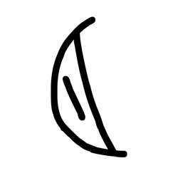

- source_zip_member: `Sub-character Images/no4gdlajf6/no4gdlajf6/161ewbfj1j.png`
- checksum_sha256: `74a87796f240e07fac18a750b536eca4cc6a034be31f437cf09d65786b6b4f8f`
- review_status: `needs_human_visual_review`
- caution: OBIMD subcharacter image is a source-marked review asset only; it is not a confirmed component form, component assignment, or decipherment conclusion.

## asset-011105

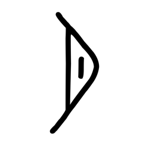

- source_zip_member: `Sub-character Images/no4gdlajf6/no4gdlajf6/1iksupcqkp.png`
- checksum_sha256: `d784bb8f9dfa475b1493e76a650bd5b3b9001b9819e3639b1c8ae8d1ec6538f2`
- review_status: `needs_human_visual_review`
- caution: OBIMD subcharacter image is a source-marked review asset only; it is not a confirmed component form, component assignment, or decipherment conclusion.

## asset-011106

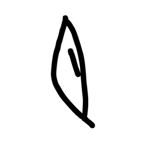

- source_zip_member: `Sub-character Images/no4gdlajf6/no4gdlajf6/2hc8jv5vys.png`
- checksum_sha256: `7e4f5c36465d5fcbfe01fe0cc0f639cba9d0670e57adb6f443fae346507c4dff`
- review_status: `needs_human_visual_review`
- caution: OBIMD subcharacter image is a source-marked review asset only; it is not a confirmed component form, component assignment, or decipherment conclusion.

## asset-011107

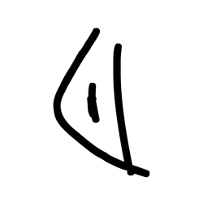

- source_zip_member: `Sub-character Images/no4gdlajf6/no4gdlajf6/2loo3apoem.png`
- checksum_sha256: `1e5842fc7c0321882e0e4c5409b59cf18745c921fd7002bef0b226ccfbf36013`
- review_status: `needs_human_visual_review`
- caution: OBIMD subcharacter image is a source-marked review asset only; it is not a confirmed component form, component assignment, or decipherment conclusion.

## asset-011108

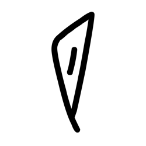

- source_zip_member: `Sub-character Images/no4gdlajf6/no4gdlajf6/4outap0i7c.png`
- checksum_sha256: `7a7be5636f530a2142ac80fac1c1ba4e25cb7b54b4ff600658e01248f9995341`
- review_status: `needs_human_visual_review`
- caution: OBIMD subcharacter image is a source-marked review asset only; it is not a confirmed component form, component assignment, or decipherment conclusion.

## asset-011109

- source_zip_member: `Sub-character Images/no4gdlajf6/no4gdlajf6/6kbfkygfa9.png`
- checksum_sha256: `c50b61d76b23afeac9b516ede8e5e37c26717ff39981ecb5e800007932c6d1ee`
- review_status: `needs_human_visual_review`
- caution: OBIMD subcharacter image is a source-marked review asset only; it is not a confirmed component form, component assignment, or decipherment conclusion.

## asset-011110

- source_zip_member: `Sub-character Images/no4gdlajf6/no4gdlajf6/6onshtjigr.png`
- checksum_sha256: `f3b81101d275ef2270812dc6ca1a1fddd3f27b6dfe5adba5b87a47b672e74da9`
- review_status: `needs_human_visual_review`
- caution: OBIMD subcharacter image is a source-marked review asset only; it is not a confirmed component form, component assignment, or decipherment conclusion.

## asset-011111

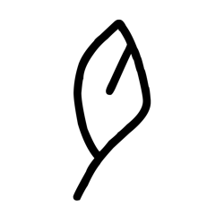

- source_zip_member: `Sub-character Images/no4gdlajf6/no4gdlajf6/6ss83bc36d.png`
- checksum_sha256: `f5f3d0a0f4fbd51a75e29c020c3320194db5715ecb41f8904f37f8680cba85d3`
- review_status: `needs_human_visual_review`
- caution: OBIMD subcharacter image is a source-marked review asset only; it is not a confirmed component form, component assignment, or decipherment conclusion.

## asset-011112

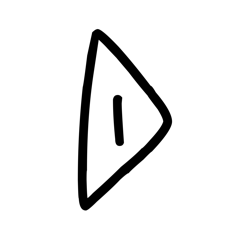

- source_zip_member: `Sub-character Images/no4gdlajf6/no4gdlajf6/7mrjb6c5c1.png`
- checksum_sha256: `5adf90fe8167f43d11498677c2930ad91b1a17f8e2428caa7badfc8b6463e1ab`
- review_status: `needs_human_visual_review`
- caution: OBIMD subcharacter image is a source-marked review asset only; it is not a confirmed component form, component assignment, or decipherment conclusion.

## asset-011113

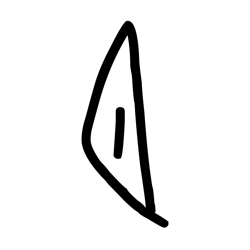

- source_zip_member: `Sub-character Images/no4gdlajf6/no4gdlajf6/8i4jpzgsdb.png`
- checksum_sha256: `7e8100063a329bf51005a482042c26d6f49a31626fdbf5db322fc9522511a0aa`
- review_status: `needs_human_visual_review`
- caution: OBIMD subcharacter image is a source-marked review asset only; it is not a confirmed component form, component assignment, or decipherment conclusion.

## asset-011114

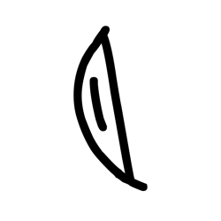

- source_zip_member: `Sub-character Images/no4gdlajf6/no4gdlajf6/8npkh1h3ux.png`
- checksum_sha256: `399278c062040baf1dd5ed08e9b89890d6bcbbf3df6d402b1dd875337eb9d9e9`
- review_status: `needs_human_visual_review`
- caution: OBIMD subcharacter image is a source-marked review asset only; it is not a confirmed component form, component assignment, or decipherment conclusion.

## asset-011115

- source_zip_member: `Sub-character Images/no4gdlajf6/no4gdlajf6/934gz9e6dk.png`
- checksum_sha256: `ee1faa68285986bc4f48f805b9f390e4048332477fdf8cbfe4be488f04e85ae5`
- review_status: `needs_human_visual_review`
- caution: OBIMD subcharacter image is a source-marked review asset only; it is not a confirmed component form, component assignment, or decipherment conclusion.

## asset-011116

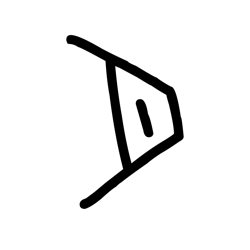

- source_zip_member: `Sub-character Images/no4gdlajf6/no4gdlajf6/9r3oehd2tw.png`
- checksum_sha256: `6b17ac6b18b881c763113dca4495ebff2ac0b010421f220a686f448fef3fa948`
- review_status: `needs_human_visual_review`
- caution: OBIMD subcharacter image is a source-marked review asset only; it is not a confirmed component form, component assignment, or decipherment conclusion.

## asset-011117

- source_zip_member: `Sub-character Images/no4gdlajf6/no4gdlajf6/b3vq1ezvsi.png`
- checksum_sha256: `8f1900f0b6a6a007ae9740ffb6926f17d5f339e3016904891727156c1963a144`
- review_status: `needs_human_visual_review`
- caution: OBIMD subcharacter image is a source-marked review asset only; it is not a confirmed component form, component assignment, or decipherment conclusion.

## asset-011118

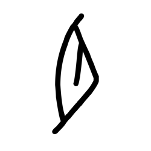

- source_zip_member: `Sub-character Images/no4gdlajf6/no4gdlajf6/chlkvmw6i2.png`
- checksum_sha256: `84fd2c4a74d734eba2c6f9f4dc7464fb18601d0c123af5151698e83bcdefaf50`
- review_status: `needs_human_visual_review`
- caution: OBIMD subcharacter image is a source-marked review asset only; it is not a confirmed component form, component assignment, or decipherment conclusion.

## asset-011119

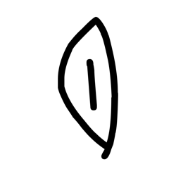

- source_zip_member: `Sub-character Images/no4gdlajf6/no4gdlajf6/d5i31std17.png`
- checksum_sha256: `934e32becb79ab6b0f464ef48938d81cb071abf2424a71115550e352d981472a`
- review_status: `needs_human_visual_review`
- caution: OBIMD subcharacter image is a source-marked review asset only; it is not a confirmed component form, component assignment, or decipherment conclusion.

## asset-011120

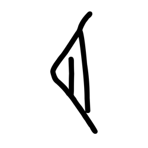

- source_zip_member: `Sub-character Images/no4gdlajf6/no4gdlajf6/dl3dh1aujy.png`
- checksum_sha256: `5efeb33000c426afc2f169d377823ccccd5275d234d356070f8ff34e5a2e4c60`
- review_status: `needs_human_visual_review`
- caution: OBIMD subcharacter image is a source-marked review asset only; it is not a confirmed component form, component assignment, or decipherment conclusion.

## asset-011121

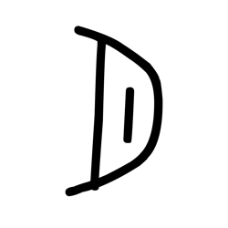

- source_zip_member: `Sub-character Images/no4gdlajf6/no4gdlajf6/dvlwhmjybp.png`
- checksum_sha256: `96227668199031563c721068b16c7ce3c378e92a32953d7da83fd388032b2ce8`
- review_status: `needs_human_visual_review`
- caution: OBIMD subcharacter image is a source-marked review asset only; it is not a confirmed component form, component assignment, or decipherment conclusion.

## asset-011122

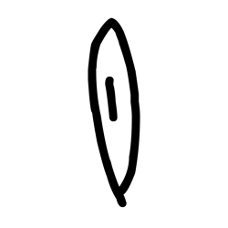

- source_zip_member: `Sub-character Images/no4gdlajf6/no4gdlajf6/e43w7v0ui9.png`
- checksum_sha256: `1ef1cd64814bbc3a5b4463b2312a03ce92f085fdd9c8c961a135daf4096a94cb`
- review_status: `needs_human_visual_review`
- caution: OBIMD subcharacter image is a source-marked review asset only; it is not a confirmed component form, component assignment, or decipherment conclusion.

## asset-011123

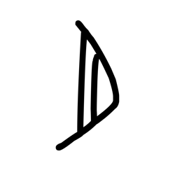

- source_zip_member: `Sub-character Images/no4gdlajf6/no4gdlajf6/edkyjwa2u7.png`
- checksum_sha256: `377dc42305fe76704859825d71341c87f1a585825b256c4f1542fc378314ad3c`
- review_status: `needs_human_visual_review`
- caution: OBIMD subcharacter image is a source-marked review asset only; it is not a confirmed component form, component assignment, or decipherment conclusion.

## asset-011124

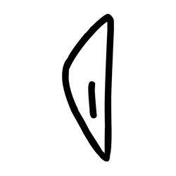

- source_zip_member: `Sub-character Images/no4gdlajf6/no4gdlajf6/f97l8fnnn2.png`
- checksum_sha256: `618e2c895954fc9fd7d014cf7513d8826caaa3d594c04f10858f6919a9e5caee`
- review_status: `needs_human_visual_review`
- caution: OBIMD subcharacter image is a source-marked review asset only; it is not a confirmed component form, component assignment, or decipherment conclusion.

## asset-011125

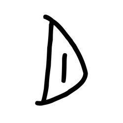

- source_zip_member: `Sub-character Images/no4gdlajf6/no4gdlajf6/g0h2mbcx0v.png`
- checksum_sha256: `430a18b2d2dea94dee39766eae3c589499e32956248e13080ec480c22e2d5a62`
- review_status: `needs_human_visual_review`
- caution: OBIMD subcharacter image is a source-marked review asset only; it is not a confirmed component form, component assignment, or decipherment conclusion.

## asset-011126

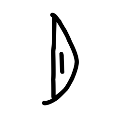

- source_zip_member: `Sub-character Images/no4gdlajf6/no4gdlajf6/ghf7ot5t9o.png`
- checksum_sha256: `b062f0955e92da5cc24594ca3051527b92dfc6ebe4bf1722027afeb3cfb53d47`
- review_status: `needs_human_visual_review`
- caution: OBIMD subcharacter image is a source-marked review asset only; it is not a confirmed component form, component assignment, or decipherment conclusion.

## asset-011127

- source_zip_member: `Sub-character Images/no4gdlajf6/no4gdlajf6/hzyouzg5w1.png`
- checksum_sha256: `2dfdb1a58f4cdc104d47e212fb77369d505175f11457fc1061bfb434412ae23c`
- review_status: `needs_human_visual_review`
- caution: OBIMD subcharacter image is a source-marked review asset only; it is not a confirmed component form, component assignment, or decipherment conclusion.

## asset-011128

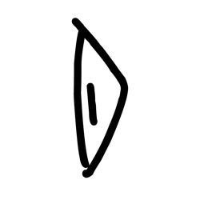

- source_zip_member: `Sub-character Images/no4gdlajf6/no4gdlajf6/i3pmcprxu6.png`
- checksum_sha256: `f8ff3fcbbe6bf6f7d4691eb3bca8b5800796e5203f373bfa7ed2ea41e52a4a5d`
- review_status: `needs_human_visual_review`
- caution: OBIMD subcharacter image is a source-marked review asset only; it is not a confirmed component form, component assignment, or decipherment conclusion.

## asset-011129

- source_zip_member: `Sub-character Images/no4gdlajf6/no4gdlajf6/i6t6ldgawf.png`
- checksum_sha256: `b24df654298d9675abd25489ff6e96141f8cb0f9694b7d7945a4f410e7faa4ce`
- review_status: `needs_human_visual_review`
- caution: OBIMD subcharacter image is a source-marked review asset only; it is not a confirmed component form, component assignment, or decipherment conclusion.

## asset-011130

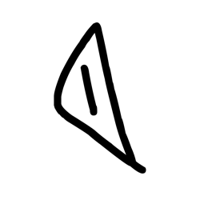

- source_zip_member: `Sub-character Images/no4gdlajf6/no4gdlajf6/k0vazr3d8o.png`
- checksum_sha256: `d9280bbee6355a58e0c066703700f0628b02451ef5d5ee5f76c4b648238ed5eb`
- review_status: `needs_human_visual_review`
- caution: OBIMD subcharacter image is a source-marked review asset only; it is not a confirmed component form, component assignment, or decipherment conclusion.

## asset-011131

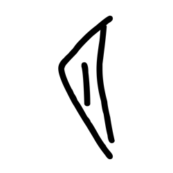

- source_zip_member: `Sub-character Images/no4gdlajf6/no4gdlajf6/l1g7if1jfn.png`
- checksum_sha256: `0df73d242533253d4f9311c7f54ba1b979c0316837d0dd6ba21a8fb6c1129cfe`
- review_status: `needs_human_visual_review`
- caution: OBIMD subcharacter image is a source-marked review asset only; it is not a confirmed component form, component assignment, or decipherment conclusion.

## asset-011132

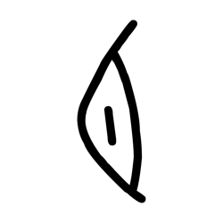

- source_zip_member: `Sub-character Images/no4gdlajf6/no4gdlajf6/lo82e1ayd1.png`
- checksum_sha256: `e14aa5897a2fef55f8d91e76f4807a927207f9faec6ba97bbb9667b00447ec84`
- review_status: `needs_human_visual_review`
- caution: OBIMD subcharacter image is a source-marked review asset only; it is not a confirmed component form, component assignment, or decipherment conclusion.

## asset-011133

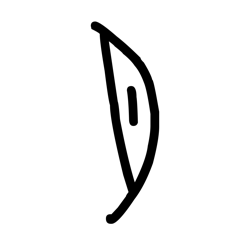

- source_zip_member: `Sub-character Images/no4gdlajf6/no4gdlajf6/mnd53ta9yo.png`
- checksum_sha256: `1b9c7801874722014b3f96ecaa315373c11acbbe5634f558ea61c8e21ac4f089`
- review_status: `needs_human_visual_review`
- caution: OBIMD subcharacter image is a source-marked review asset only; it is not a confirmed component form, component assignment, or decipherment conclusion.

## asset-011134

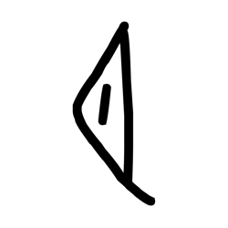

- source_zip_member: `Sub-character Images/no4gdlajf6/no4gdlajf6/n4l3iv9beb.png`
- checksum_sha256: `f908098521a860ba163842fe7490db648aa5ef533e9ee15f9449cf6f27a83555`
- review_status: `needs_human_visual_review`
- caution: OBIMD subcharacter image is a source-marked review asset only; it is not a confirmed component form, component assignment, or decipherment conclusion.

## asset-011135

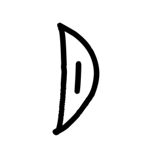

- source_zip_member: `Sub-character Images/no4gdlajf6/no4gdlajf6/no4gdlajf6.png`
- checksum_sha256: `fdd57b4975296002bddd4f35a14a427fc56c67f548dce3b2eefc707ad0928a08`
- review_status: `needs_human_visual_review`
- caution: OBIMD subcharacter image is a source-marked review asset only; it is not a confirmed component form, component assignment, or decipherment conclusion.

## asset-011136

- source_zip_member: `Sub-character Images/no4gdlajf6/no4gdlajf6/oanbg18slo.png`
- checksum_sha256: `593b2f5695e2d8851534f965322027564f883620a2194288661dbc7a90ca990d`
- review_status: `needs_human_visual_review`
- caution: OBIMD subcharacter image is a source-marked review asset only; it is not a confirmed component form, component assignment, or decipherment conclusion.

## asset-011137

- source_zip_member: `Sub-character Images/no4gdlajf6/no4gdlajf6/qixvdbw5ij.png`
- checksum_sha256: `53bd6ef482b0f4f2b56bd025b617132ac2f2c9be7ec74832f23ef76d3abc33e0`
- review_status: `needs_human_visual_review`
- caution: OBIMD subcharacter image is a source-marked review asset only; it is not a confirmed component form, component assignment, or decipherment conclusion.

## asset-011138

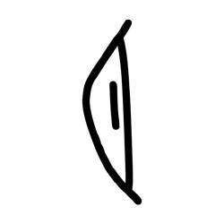

- source_zip_member: `Sub-character Images/no4gdlajf6/no4gdlajf6/rtkff040lw.png`
- checksum_sha256: `5b9f41730e582a77e10bc55e58f3484186fccfad080e0565caa2b3d8aba46845`
- review_status: `needs_human_visual_review`
- caution: OBIMD subcharacter image is a source-marked review asset only; it is not a confirmed component form, component assignment, or decipherment conclusion.

## asset-011139

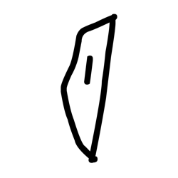

- source_zip_member: `Sub-character Images/no4gdlajf6/no4gdlajf6/sfc0ju2sg5.png`
- checksum_sha256: `67832244b2dcb4a76fe430ebc9734fc977c32418053bfebd90cbcf60e75b76aa`
- review_status: `needs_human_visual_review`
- caution: OBIMD subcharacter image is a source-marked review asset only; it is not a confirmed component form, component assignment, or decipherment conclusion.

## asset-011140

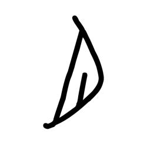

- source_zip_member: `Sub-character Images/no4gdlajf6/no4gdlajf6/tin9rzo1ti.png`
- checksum_sha256: `f2f24cc240c45d56ebc39b48e481abe5c0c31bc2c6da1598e26d58dafb225752`
- review_status: `needs_human_visual_review`
- caution: OBIMD subcharacter image is a source-marked review asset only; it is not a confirmed component form, component assignment, or decipherment conclusion.

## asset-011141

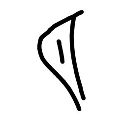

- source_zip_member: `Sub-character Images/no4gdlajf6/no4gdlajf6/ukg88xjhd8.png`
- checksum_sha256: `15dc9edfc27aff7923cc1d8f9a1b400a527e9deff7f38ccdb187e36ad0c7f2e9`
- review_status: `needs_human_visual_review`
- caution: OBIMD subcharacter image is a source-marked review asset only; it is not a confirmed component form, component assignment, or decipherment conclusion.

## asset-011142

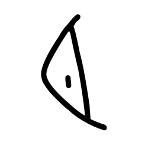

- source_zip_member: `Sub-character Images/no4gdlajf6/no4gdlajf6/w3whz0k4g0.png`
- checksum_sha256: `9bae5adf091e7623638649021fee5b06d76bf4e55b1f4b707a6a6018ed3e26c5`
- review_status: `needs_human_visual_review`
- caution: OBIMD subcharacter image is a source-marked review asset only; it is not a confirmed component form, component assignment, or decipherment conclusion.

## asset-011143

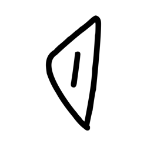

- source_zip_member: `Sub-character Images/no4gdlajf6/no4gdlajf6/w7o4ndrjps.png`
- checksum_sha256: `c37d939191ac62f7e7cfb3c28f55c76e42602d2420c4df3fe7ed7cde1ab6155f`
- review_status: `needs_human_visual_review`
- caution: OBIMD subcharacter image is a source-marked review asset only; it is not a confirmed component form, component assignment, or decipherment conclusion.

## asset-011144

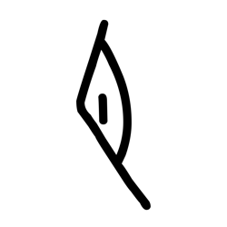

- source_zip_member: `Sub-character Images/no4gdlajf6/no4gdlajf6/wugfojqjzf.png`
- checksum_sha256: `db46d4091a68c52fa27c2849c4e2df180612a92c143ff6a1de98c9b727433a34`
- review_status: `needs_human_visual_review`
- caution: OBIMD subcharacter image is a source-marked review asset only; it is not a confirmed component form, component assignment, or decipherment conclusion.

## asset-011145

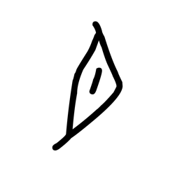

- source_zip_member: `Sub-character Images/no4gdlajf6/no4gdlajf6/yc7agjz96e.png`
- checksum_sha256: `57e9cccc8aafa817cf68f2d7b9f4804cad421cf6d4d81eea49c2f7fa12b7df72`
- review_status: `needs_human_visual_review`
- caution: OBIMD subcharacter image is a source-marked review asset only; it is not a confirmed component form, component assignment, or decipherment conclusion.

## asset-011146

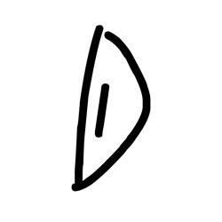

- source_zip_member: `Sub-character Images/no4gdlajf6/no4gdlajf6/yf1arud9xr.png`
- checksum_sha256: `97d76f09e1155408ffab966b8741af73f62b2a0c98873bd758f6ba1fa7bbdb3d`
- review_status: `needs_human_visual_review`
- caution: OBIMD subcharacter image is a source-marked review asset only; it is not a confirmed component form, component assignment, or decipherment conclusion.

## asset-011147

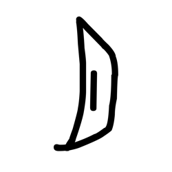

- source_zip_member: `Sub-character Images/no4gdlajf6/no4gdlajf6/z3zbv9onpi.png`
- checksum_sha256: `b518e266a18b2fe03a5beb5f7f9ae873e2679f712397a22f0e123752329168f7`
- review_status: `needs_human_visual_review`
- caution: OBIMD subcharacter image is a source-marked review asset only; it is not a confirmed component form, component assignment, or decipherment conclusion.
