# Component Visual Gallery / 构件图像查看: obs-comp-cand-000016

English:
This page displays OBIMD subcharacter PNG assets extracted into this concrete
corpus object directory for human review.

简体中文：
本页展示抽取到当前具体 corpus 对象目录内的 OBIMD subcharacter PNG 资料，供人工复核使用。

Boundary / 边界：
dataset image candidate only; not a confirmed component form, not a component
assignment, and not a decipherment claim.
- not a confirmed component form
- not a component assignment
- not a decipherment claim

## Concrete Questions To Check / 具体待查问题

- Which local image should be opened first?
- 应先打开哪一张本地构件图像？
- Which source zip member anchors this image?
- 哪一个 source zip member 能定位这张图像？
- Which near-shape or variant comparison is still missing?
- 还缺哪些近形或异体比较？
- Which character or inscription context should be checked next?
- 下一步应核对哪些单字或卜辞上下文？
- What evidence is missing before a component assignment?
- 正式构件归属前还缺哪些证据？

## asset-011148

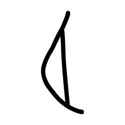

- source_zip_member: `Sub-character Images/no4gdlajf6/dg3rdvnaw9/4m8klzz1jn.png`
- checksum_sha256: see `06_component-visual-index.csv`.
- review_status: `needs_human_visual_review`
- caution: source-marked review image only.

## asset-011149

- source_zip_member: `Sub-character Images/no4gdlajf6/dg3rdvnaw9/4ws5ve732a.png`
- checksum_sha256: see `06_component-visual-index.csv`.
- review_status: `needs_human_visual_review`
- caution: source-marked review image only.

## asset-011150

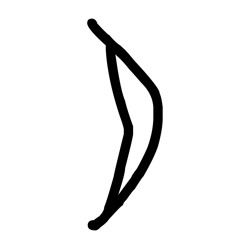

- source_zip_member: `Sub-character Images/no4gdlajf6/dg3rdvnaw9/561frpd8di.png`
- checksum_sha256: see `06_component-visual-index.csv`.
- review_status: `needs_human_visual_review`
- caution: source-marked review image only.

## asset-011151

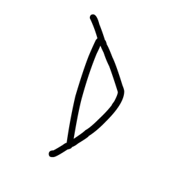

- source_zip_member: `Sub-character Images/no4gdlajf6/dg3rdvnaw9/5zq08spjfc.png`
- checksum_sha256: see `06_component-visual-index.csv`.
- review_status: `needs_human_visual_review`
- caution: source-marked review image only.

## asset-011152

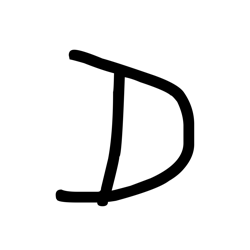

- source_zip_member: `Sub-character Images/no4gdlajf6/dg3rdvnaw9/7ez1k4dgu7.png`
- checksum_sha256: see `06_component-visual-index.csv`.
- review_status: `needs_human_visual_review`
- caution: source-marked review image only.

## asset-011153

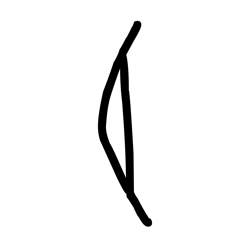

- source_zip_member: `Sub-character Images/no4gdlajf6/dg3rdvnaw9/ad57jex15b.png`
- checksum_sha256: see `06_component-visual-index.csv`.
- review_status: `needs_human_visual_review`
- caution: source-marked review image only.

## asset-011154

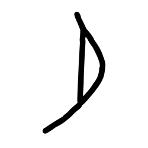

- source_zip_member: `Sub-character Images/no4gdlajf6/dg3rdvnaw9/b4xmdd3729.png`
- checksum_sha256: see `06_component-visual-index.csv`.
- review_status: `needs_human_visual_review`
- caution: source-marked review image only.

## asset-011155

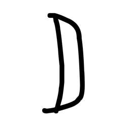

- source_zip_member: `Sub-character Images/no4gdlajf6/dg3rdvnaw9/cjivcg86qs.png`
- checksum_sha256: see `06_component-visual-index.csv`.
- review_status: `needs_human_visual_review`
- caution: source-marked review image only.

## asset-011156

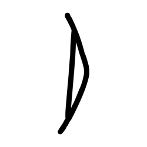

- source_zip_member: `Sub-character Images/no4gdlajf6/dg3rdvnaw9/d0e85equig.png`
- checksum_sha256: see `06_component-visual-index.csv`.
- review_status: `needs_human_visual_review`
- caution: source-marked review image only.

## asset-011157

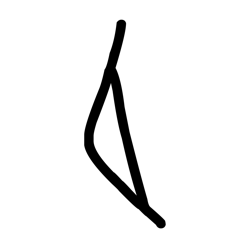

- source_zip_member: `Sub-character Images/no4gdlajf6/dg3rdvnaw9/d2d536zylh.png`
- checksum_sha256: see `06_component-visual-index.csv`.
- review_status: `needs_human_visual_review`
- caution: source-marked review image only.

## asset-011158

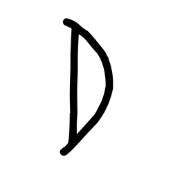

- source_zip_member: `Sub-character Images/no4gdlajf6/dg3rdvnaw9/dg3rdvnaw9.png`
- checksum_sha256: see `06_component-visual-index.csv`.
- review_status: `needs_human_visual_review`
- caution: source-marked review image only.

## asset-011159

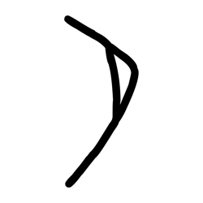

- source_zip_member: `Sub-character Images/no4gdlajf6/dg3rdvnaw9/ee0bjyorja.png`
- checksum_sha256: see `06_component-visual-index.csv`.
- review_status: `needs_human_visual_review`
- caution: source-marked review image only.

## asset-011160

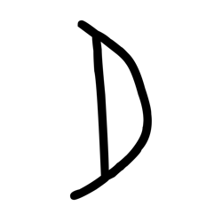

- source_zip_member: `Sub-character Images/no4gdlajf6/dg3rdvnaw9/qo2kni3vzj.png`
- checksum_sha256: see `06_component-visual-index.csv`.
- review_status: `needs_human_visual_review`
- caution: source-marked review image only.

## asset-011161

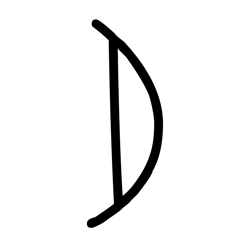

- source_zip_member: `Sub-character Images/no4gdlajf6/dg3rdvnaw9/qu6aa0skxp.png`
- checksum_sha256: see `06_component-visual-index.csv`.
- review_status: `needs_human_visual_review`
- caution: source-marked review image only.

## asset-011162

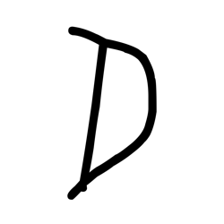

- source_zip_member: `Sub-character Images/no4gdlajf6/dg3rdvnaw9/s3km93mw8j.png`
- checksum_sha256: see `06_component-visual-index.csv`.
- review_status: `needs_human_visual_review`
- caution: source-marked review image only.

## asset-011163

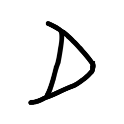

- source_zip_member: `Sub-character Images/no4gdlajf6/dg3rdvnaw9/tehvzof4en.png`
- checksum_sha256: see `06_component-visual-index.csv`.
- review_status: `needs_human_visual_review`
- caution: source-marked review image only.

## asset-011164

- source_zip_member: `Sub-character Images/no4gdlajf6/dg3rdvnaw9/vuaia3l41a.png`
- checksum_sha256: see `06_component-visual-index.csv`.
- review_status: `needs_human_visual_review`
- caution: source-marked review image only.

## asset-011165

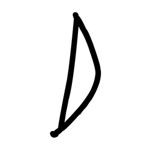

- source_zip_member: `Sub-character Images/no4gdlajf6/dg3rdvnaw9/weui8z1dxt.png`
- checksum_sha256: see `06_component-visual-index.csv`.
- review_status: `needs_human_visual_review`
- caution: source-marked review image only.

## asset-011166

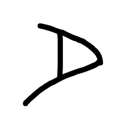

- source_zip_member: `Sub-character Images/no4gdlajf6/dg3rdvnaw9/xg3ojx2z12.png`
- checksum_sha256: see `06_component-visual-index.csv`.
- review_status: `needs_human_visual_review`
- caution: source-marked review image only.

## asset-011167

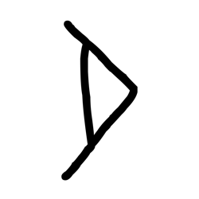

- source_zip_member: `Sub-character Images/no4gdlajf6/dg3rdvnaw9/xo18ebfqhj.png`
- checksum_sha256: see `06_component-visual-index.csv`.
- review_status: `needs_human_visual_review`
- caution: source-marked review image only.

## asset-011168

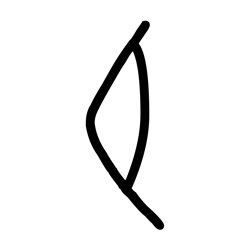

- source_zip_member: `Sub-character Images/no4gdlajf6/dg3rdvnaw9/y4775xrhu7.png`
- checksum_sha256: see `06_component-visual-index.csv`.
- review_status: `needs_human_visual_review`
- caution: source-marked review image only.
