# Component Visual Gallery / 构件图像查看: obs-comp-cand-000029

English:
This page displays OBIMD subcharacter PNG assets extracted into this concrete
corpus object directory for human review.

简体中文：
本页展示抽取到当前具体 corpus 对象目录内的 OBIMD subcharacter PNG 资料，供人工复核使用。

Boundary / 边界：
dataset image candidate only; not a confirmed component form, not a component
assignment, and not a decipherment claim.
- not a confirmed component form
- not a component assignment
- not a decipherment claim

## Concrete Questions To Check / 具体待查问题

- Open 06_component-visual-index.csv and name the local image row.
- 打开 06_component-visual-index.csv，写明本地图像行。
- Open 09_component-visual-route-index.csv and name the source route row.
- 打开 09_component-visual-route-index.csv，写明来源路线行。
- Open 13_component-context-evidence-dossier.md for character context.
- 打开 13_component-context-evidence-dossier.md，核对单字与卜辞上下文。
- Record the missing image, near-shape, source, or context route.
- 记录缺失的图像、近形、来源或上下文路线。

## asset-011181

- source_zip_member: `Sub-character Images/ftj0qy2f7b/ftj0qy2f7b/090sypzuyd.png`
- checksum_sha256: see `06_component-visual-index.csv`.
- review_status: `needs_human_visual_review`
- caution: source-marked review image only.

## asset-011182

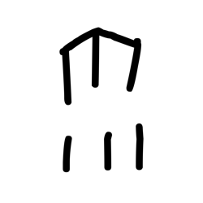

- source_zip_member: `Sub-character Images/ftj0qy2f7b/ftj0qy2f7b/0ie3pg4ki5.png`
- checksum_sha256: see `06_component-visual-index.csv`.
- review_status: `needs_human_visual_review`
- caution: source-marked review image only.

## asset-011183

- source_zip_member: `Sub-character Images/ftj0qy2f7b/ftj0qy2f7b/0xsz5eyu7x.png`
- checksum_sha256: see `06_component-visual-index.csv`.
- review_status: `needs_human_visual_review`
- caution: source-marked review image only.

## asset-011184

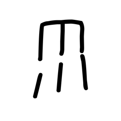

- source_zip_member: `Sub-character Images/ftj0qy2f7b/ftj0qy2f7b/1ul5n6dqxp.png`
- checksum_sha256: see `06_component-visual-index.csv`.
- review_status: `needs_human_visual_review`
- caution: source-marked review image only.

## asset-011185

- source_zip_member: `Sub-character Images/ftj0qy2f7b/ftj0qy2f7b/1va1s8zjiv.png`
- checksum_sha256: see `06_component-visual-index.csv`.
- review_status: `needs_human_visual_review`
- caution: source-marked review image only.

## asset-011186

- source_zip_member: `Sub-character Images/ftj0qy2f7b/ftj0qy2f7b/1wb03juz0h.png`
- checksum_sha256: see `06_component-visual-index.csv`.
- review_status: `needs_human_visual_review`
- caution: source-marked review image only.

## asset-011187

- source_zip_member: `Sub-character Images/ftj0qy2f7b/ftj0qy2f7b/21qed3r4u7.png`
- checksum_sha256: see `06_component-visual-index.csv`.
- review_status: `needs_human_visual_review`
- caution: source-marked review image only.

## asset-011188

- source_zip_member: `Sub-character Images/ftj0qy2f7b/ftj0qy2f7b/25w5mkzwmy.png`
- checksum_sha256: see `06_component-visual-index.csv`.
- review_status: `needs_human_visual_review`
- caution: source-marked review image only.

## asset-011189

- source_zip_member: `Sub-character Images/ftj0qy2f7b/ftj0qy2f7b/32p0ndqvz4.png`
- checksum_sha256: see `06_component-visual-index.csv`.
- review_status: `needs_human_visual_review`
- caution: source-marked review image only.

## asset-011190

- source_zip_member: `Sub-character Images/ftj0qy2f7b/ftj0qy2f7b/3ier7v1msd.png`
- checksum_sha256: see `06_component-visual-index.csv`.
- review_status: `needs_human_visual_review`
- caution: source-marked review image only.

## asset-011191

- source_zip_member: `Sub-character Images/ftj0qy2f7b/ftj0qy2f7b/4mb93p09rp.png`
- checksum_sha256: see `06_component-visual-index.csv`.
- review_status: `needs_human_visual_review`
- caution: source-marked review image only.

## asset-011192

- source_zip_member: `Sub-character Images/ftj0qy2f7b/ftj0qy2f7b/4o5igc23iy.png`
- checksum_sha256: see `06_component-visual-index.csv`.
- review_status: `needs_human_visual_review`
- caution: source-marked review image only.

## asset-011193

- source_zip_member: `Sub-character Images/ftj0qy2f7b/ftj0qy2f7b/4z6ckt047j.png`
- checksum_sha256: see `06_component-visual-index.csv`.
- review_status: `needs_human_visual_review`
- caution: source-marked review image only.

## asset-011194

- source_zip_member: `Sub-character Images/ftj0qy2f7b/ftj0qy2f7b/5e9x95jwxd.png`
- checksum_sha256: see `06_component-visual-index.csv`.
- review_status: `needs_human_visual_review`
- caution: source-marked review image only.

## asset-011195

- source_zip_member: `Sub-character Images/ftj0qy2f7b/ftj0qy2f7b/5kbtdi0w69.png`
- checksum_sha256: see `06_component-visual-index.csv`.
- review_status: `needs_human_visual_review`
- caution: source-marked review image only.

## asset-011196

- source_zip_member: `Sub-character Images/ftj0qy2f7b/ftj0qy2f7b/5mae1f9y10.png`
- checksum_sha256: see `06_component-visual-index.csv`.
- review_status: `needs_human_visual_review`
- caution: source-marked review image only.

## asset-011197

- source_zip_member: `Sub-character Images/ftj0qy2f7b/ftj0qy2f7b/65ztegwvh9.png`
- checksum_sha256: see `06_component-visual-index.csv`.
- review_status: `needs_human_visual_review`
- caution: source-marked review image only.

## asset-011198

- source_zip_member: `Sub-character Images/ftj0qy2f7b/ftj0qy2f7b/71jatxqndj.png`
- checksum_sha256: see `06_component-visual-index.csv`.
- review_status: `needs_human_visual_review`
- caution: source-marked review image only.

## asset-011199

- source_zip_member: `Sub-character Images/ftj0qy2f7b/ftj0qy2f7b/7o2gmjxtzu.png`
- checksum_sha256: see `06_component-visual-index.csv`.
- review_status: `needs_human_visual_review`
- caution: source-marked review image only.

## asset-011200

- source_zip_member: `Sub-character Images/ftj0qy2f7b/ftj0qy2f7b/7zdvxw7ty6.png`
- checksum_sha256: see `06_component-visual-index.csv`.
- review_status: `needs_human_visual_review`
- caution: source-marked review image only.

## asset-011201

- source_zip_member: `Sub-character Images/ftj0qy2f7b/ftj0qy2f7b/87myei85za.png`
- checksum_sha256: see `06_component-visual-index.csv`.
- review_status: `needs_human_visual_review`
- caution: source-marked review image only.

## asset-011202

- source_zip_member: `Sub-character Images/ftj0qy2f7b/ftj0qy2f7b/8b6jse94ex.png`
- checksum_sha256: see `06_component-visual-index.csv`.
- review_status: `needs_human_visual_review`
- caution: source-marked review image only.

## asset-011203

- source_zip_member: `Sub-character Images/ftj0qy2f7b/ftj0qy2f7b/8c94mxht7h.png`
- checksum_sha256: see `06_component-visual-index.csv`.
- review_status: `needs_human_visual_review`
- caution: source-marked review image only.

## asset-011204

- source_zip_member: `Sub-character Images/ftj0qy2f7b/ftj0qy2f7b/8wjtp9rn8p.png`
- checksum_sha256: see `06_component-visual-index.csv`.
- review_status: `needs_human_visual_review`
- caution: source-marked review image only.

## asset-011205

- source_zip_member: `Sub-character Images/ftj0qy2f7b/ftj0qy2f7b/93ke3h481w.png`
- checksum_sha256: see `06_component-visual-index.csv`.
- review_status: `needs_human_visual_review`
- caution: source-marked review image only.

## asset-011206

- source_zip_member: `Sub-character Images/ftj0qy2f7b/ftj0qy2f7b/99noqlqrkx.png`
- checksum_sha256: see `06_component-visual-index.csv`.
- review_status: `needs_human_visual_review`
- caution: source-marked review image only.

## asset-011207

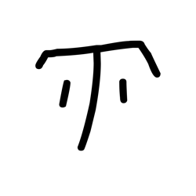

- source_zip_member: `Sub-character Images/ftj0qy2f7b/ftj0qy2f7b/9bhsuwjjrd.png`
- checksum_sha256: see `06_component-visual-index.csv`.
- review_status: `needs_human_visual_review`
- caution: source-marked review image only.

## asset-011208

- source_zip_member: `Sub-character Images/ftj0qy2f7b/ftj0qy2f7b/a20st46r1g.png`
- checksum_sha256: see `06_component-visual-index.csv`.
- review_status: `needs_human_visual_review`
- caution: source-marked review image only.

## asset-011209

- source_zip_member: `Sub-character Images/ftj0qy2f7b/ftj0qy2f7b/a60ql57jgs.png`
- checksum_sha256: see `06_component-visual-index.csv`.
- review_status: `needs_human_visual_review`
- caution: source-marked review image only.

## asset-011210

- source_zip_member: `Sub-character Images/ftj0qy2f7b/ftj0qy2f7b/a95r9x7y9f.png`
- checksum_sha256: see `06_component-visual-index.csv`.
- review_status: `needs_human_visual_review`
- caution: source-marked review image only.

## asset-011211

- source_zip_member: `Sub-character Images/ftj0qy2f7b/ftj0qy2f7b/aax5w4o2fn.png`
- checksum_sha256: see `06_component-visual-index.csv`.
- review_status: `needs_human_visual_review`
- caution: source-marked review image only.

## asset-011212

- source_zip_member: `Sub-character Images/ftj0qy2f7b/ftj0qy2f7b/amft1qw88a.png`
- checksum_sha256: see `06_component-visual-index.csv`.
- review_status: `needs_human_visual_review`
- caution: source-marked review image only.

## asset-011213

- source_zip_member: `Sub-character Images/ftj0qy2f7b/ftj0qy2f7b/bwyu9jciik.png`
- checksum_sha256: see `06_component-visual-index.csv`.
- review_status: `needs_human_visual_review`
- caution: source-marked review image only.

## asset-011214

- source_zip_member: `Sub-character Images/ftj0qy2f7b/ftj0qy2f7b/ddiaabcp5i.png`
- checksum_sha256: see `06_component-visual-index.csv`.
- review_status: `needs_human_visual_review`
- caution: source-marked review image only.

## asset-011215

- source_zip_member: `Sub-character Images/ftj0qy2f7b/ftj0qy2f7b/dkahyysddw.png`
- checksum_sha256: see `06_component-visual-index.csv`.
- review_status: `needs_human_visual_review`
- caution: source-marked review image only.

## asset-011216

- source_zip_member: `Sub-character Images/ftj0qy2f7b/ftj0qy2f7b/dxxnx7ezj1.png`
- checksum_sha256: see `06_component-visual-index.csv`.
- review_status: `needs_human_visual_review`
- caution: source-marked review image only.

## asset-011217

- source_zip_member: `Sub-character Images/ftj0qy2f7b/ftj0qy2f7b/dze6msu45p.png`
- checksum_sha256: see `06_component-visual-index.csv`.
- review_status: `needs_human_visual_review`
- caution: source-marked review image only.

## asset-011218

- source_zip_member: `Sub-character Images/ftj0qy2f7b/ftj0qy2f7b/e425a3qy4u.png`
- checksum_sha256: see `06_component-visual-index.csv`.
- review_status: `needs_human_visual_review`
- caution: source-marked review image only.

## asset-011219

- source_zip_member: `Sub-character Images/ftj0qy2f7b/ftj0qy2f7b/ecsfikn1u6.png`
- checksum_sha256: see `06_component-visual-index.csv`.
- review_status: `needs_human_visual_review`
- caution: source-marked review image only.

## asset-011220

- source_zip_member: `Sub-character Images/ftj0qy2f7b/ftj0qy2f7b/eliuwx7q8s.png`
- checksum_sha256: see `06_component-visual-index.csv`.
- review_status: `needs_human_visual_review`
- caution: source-marked review image only.

## asset-011221

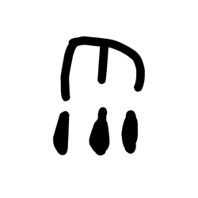

- source_zip_member: `Sub-character Images/ftj0qy2f7b/ftj0qy2f7b/f4xaa2778g.png`
- checksum_sha256: see `06_component-visual-index.csv`.
- review_status: `needs_human_visual_review`
- caution: source-marked review image only.

## asset-011222

- source_zip_member: `Sub-character Images/ftj0qy2f7b/ftj0qy2f7b/fbshuy3nl7.png`
- checksum_sha256: see `06_component-visual-index.csv`.
- review_status: `needs_human_visual_review`
- caution: source-marked review image only.

## asset-011223

- source_zip_member: `Sub-character Images/ftj0qy2f7b/ftj0qy2f7b/ftj0qy2f7b.png`
- checksum_sha256: see `06_component-visual-index.csv`.
- review_status: `needs_human_visual_review`
- caution: source-marked review image only.

## asset-011224

- source_zip_member: `Sub-character Images/ftj0qy2f7b/ftj0qy2f7b/g6dfnahq0m.png`
- checksum_sha256: see `06_component-visual-index.csv`.
- review_status: `needs_human_visual_review`
- caution: source-marked review image only.

## asset-011225

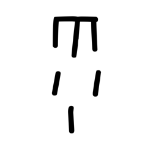

- source_zip_member: `Sub-character Images/ftj0qy2f7b/ftj0qy2f7b/g9ksu2b30y.png`
- checksum_sha256: see `06_component-visual-index.csv`.
- review_status: `needs_human_visual_review`
- caution: source-marked review image only.

## asset-011226

- source_zip_member: `Sub-character Images/ftj0qy2f7b/ftj0qy2f7b/ggcm40f6lq.png`
- checksum_sha256: see `06_component-visual-index.csv`.
- review_status: `needs_human_visual_review`
- caution: source-marked review image only.

## asset-011227

- source_zip_member: `Sub-character Images/ftj0qy2f7b/ftj0qy2f7b/gjqezqtfby.png`
- checksum_sha256: see `06_component-visual-index.csv`.
- review_status: `needs_human_visual_review`
- caution: source-marked review image only.

## asset-011228

- source_zip_member: `Sub-character Images/ftj0qy2f7b/ftj0qy2f7b/glszpa00bd.png`
- checksum_sha256: see `06_component-visual-index.csv`.
- review_status: `needs_human_visual_review`
- caution: source-marked review image only.

## asset-011229

- source_zip_member: `Sub-character Images/ftj0qy2f7b/ftj0qy2f7b/gyupvp9z7c.png`
- checksum_sha256: see `06_component-visual-index.csv`.
- review_status: `needs_human_visual_review`
- caution: source-marked review image only.

## asset-011230

- source_zip_member: `Sub-character Images/ftj0qy2f7b/ftj0qy2f7b/h0pfsln8mp.png`
- checksum_sha256: see `06_component-visual-index.csv`.
- review_status: `needs_human_visual_review`
- caution: source-marked review image only.

## asset-011231

- source_zip_member: `Sub-character Images/ftj0qy2f7b/ftj0qy2f7b/hhyxegzww7.png`
- checksum_sha256: see `06_component-visual-index.csv`.
- review_status: `needs_human_visual_review`
- caution: source-marked review image only.

## asset-011232

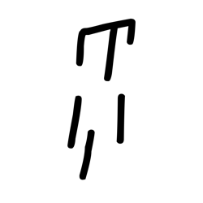

- source_zip_member: `Sub-character Images/ftj0qy2f7b/ftj0qy2f7b/hxzwwleh67.png`
- checksum_sha256: see `06_component-visual-index.csv`.
- review_status: `needs_human_visual_review`
- caution: source-marked review image only.

## asset-011233

- source_zip_member: `Sub-character Images/ftj0qy2f7b/ftj0qy2f7b/hzo19na0m5.png`
- checksum_sha256: see `06_component-visual-index.csv`.
- review_status: `needs_human_visual_review`
- caution: source-marked review image only.

## asset-011234

- source_zip_member: `Sub-character Images/ftj0qy2f7b/ftj0qy2f7b/jy69r7i8tj.png`
- checksum_sha256: see `06_component-visual-index.csv`.
- review_status: `needs_human_visual_review`
- caution: source-marked review image only.

## asset-011235

- source_zip_member: `Sub-character Images/ftj0qy2f7b/ftj0qy2f7b/kckiuaym9c.png`
- checksum_sha256: see `06_component-visual-index.csv`.
- review_status: `needs_human_visual_review`
- caution: source-marked review image only.

## asset-011236

- source_zip_member: `Sub-character Images/ftj0qy2f7b/ftj0qy2f7b/l283qomn6k.png`
- checksum_sha256: see `06_component-visual-index.csv`.
- review_status: `needs_human_visual_review`
- caution: source-marked review image only.

## asset-011237

- source_zip_member: `Sub-character Images/ftj0qy2f7b/ftj0qy2f7b/l7eyhcph3t.png`
- checksum_sha256: see `06_component-visual-index.csv`.
- review_status: `needs_human_visual_review`
- caution: source-marked review image only.

## asset-011238

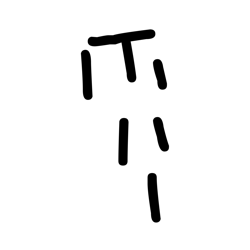

- source_zip_member: `Sub-character Images/ftj0qy2f7b/ftj0qy2f7b/lkiy2jj60j.png`
- checksum_sha256: see `06_component-visual-index.csv`.
- review_status: `needs_human_visual_review`
- caution: source-marked review image only.

## asset-011239

- source_zip_member: `Sub-character Images/ftj0qy2f7b/ftj0qy2f7b/lphirpbayk.png`
- checksum_sha256: see `06_component-visual-index.csv`.
- review_status: `needs_human_visual_review`
- caution: source-marked review image only.

## asset-011240

- source_zip_member: `Sub-character Images/ftj0qy2f7b/ftj0qy2f7b/lztqn9o6nh.png`
- checksum_sha256: see `06_component-visual-index.csv`.
- review_status: `needs_human_visual_review`
- caution: source-marked review image only.

## asset-011241

- source_zip_member: `Sub-character Images/ftj0qy2f7b/ftj0qy2f7b/me3nvtd3dc.png`
- checksum_sha256: see `06_component-visual-index.csv`.
- review_status: `needs_human_visual_review`
- caution: source-marked review image only.

## asset-011242

- source_zip_member: `Sub-character Images/ftj0qy2f7b/ftj0qy2f7b/mft1wom283.png`
- checksum_sha256: see `06_component-visual-index.csv`.
- review_status: `needs_human_visual_review`
- caution: source-marked review image only.

## asset-011243

- source_zip_member: `Sub-character Images/ftj0qy2f7b/ftj0qy2f7b/ncebejc1i8.png`
- checksum_sha256: see `06_component-visual-index.csv`.
- review_status: `needs_human_visual_review`
- caution: source-marked review image only.

## asset-011244

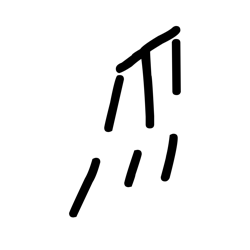

- source_zip_member: `Sub-character Images/ftj0qy2f7b/ftj0qy2f7b/nobohtoq57.png`
- checksum_sha256: see `06_component-visual-index.csv`.
- review_status: `needs_human_visual_review`
- caution: source-marked review image only.

## asset-011245

- source_zip_member: `Sub-character Images/ftj0qy2f7b/ftj0qy2f7b/nrkpjbklpa.png`
- checksum_sha256: see `06_component-visual-index.csv`.
- review_status: `needs_human_visual_review`
- caution: source-marked review image only.

## asset-011246

- source_zip_member: `Sub-character Images/ftj0qy2f7b/ftj0qy2f7b/o3q1kmf67q.png`
- checksum_sha256: see `06_component-visual-index.csv`.
- review_status: `needs_human_visual_review`
- caution: source-marked review image only.

## asset-011247

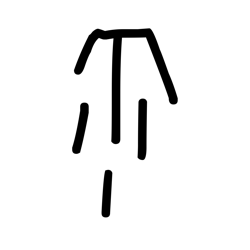

- source_zip_member: `Sub-character Images/ftj0qy2f7b/ftj0qy2f7b/o3yj6ohvlj.png`
- checksum_sha256: see `06_component-visual-index.csv`.
- review_status: `needs_human_visual_review`
- caution: source-marked review image only.

## asset-011248

- source_zip_member: `Sub-character Images/ftj0qy2f7b/ftj0qy2f7b/o5ldnq0jot.png`
- checksum_sha256: see `06_component-visual-index.csv`.
- review_status: `needs_human_visual_review`
- caution: source-marked review image only.

## asset-011249

- source_zip_member: `Sub-character Images/ftj0qy2f7b/ftj0qy2f7b/obkwo2wuey.png`
- checksum_sha256: see `06_component-visual-index.csv`.
- review_status: `needs_human_visual_review`
- caution: source-marked review image only.

## asset-011250

- source_zip_member: `Sub-character Images/ftj0qy2f7b/ftj0qy2f7b/p3tyt5we4q.png`
- checksum_sha256: see `06_component-visual-index.csv`.
- review_status: `needs_human_visual_review`
- caution: source-marked review image only.

## asset-011251

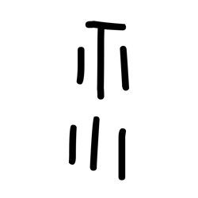

- source_zip_member: `Sub-character Images/ftj0qy2f7b/ftj0qy2f7b/pd40a18b43.png`
- checksum_sha256: see `06_component-visual-index.csv`.
- review_status: `needs_human_visual_review`
- caution: source-marked review image only.

## asset-011252

- source_zip_member: `Sub-character Images/ftj0qy2f7b/ftj0qy2f7b/pi92u7ezji.png`
- checksum_sha256: see `06_component-visual-index.csv`.
- review_status: `needs_human_visual_review`
- caution: source-marked review image only.

## asset-011253

- source_zip_member: `Sub-character Images/ftj0qy2f7b/ftj0qy2f7b/pkgd7ukqfi.png`
- checksum_sha256: see `06_component-visual-index.csv`.
- review_status: `needs_human_visual_review`
- caution: source-marked review image only.

## asset-011254

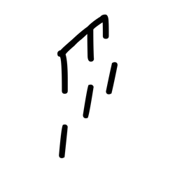

- source_zip_member: `Sub-character Images/ftj0qy2f7b/ftj0qy2f7b/pz90zbo13x.png`
- checksum_sha256: see `06_component-visual-index.csv`.
- review_status: `needs_human_visual_review`
- caution: source-marked review image only.

## asset-011255

- source_zip_member: `Sub-character Images/ftj0qy2f7b/ftj0qy2f7b/qg21xhox08.png`
- checksum_sha256: see `06_component-visual-index.csv`.
- review_status: `needs_human_visual_review`
- caution: source-marked review image only.

## asset-011256

- source_zip_member: `Sub-character Images/ftj0qy2f7b/ftj0qy2f7b/qy8a4317qt.png`
- checksum_sha256: see `06_component-visual-index.csv`.
- review_status: `needs_human_visual_review`
- caution: source-marked review image only.

## asset-011257

- source_zip_member: `Sub-character Images/ftj0qy2f7b/ftj0qy2f7b/qz3ialbqdq.png`
- checksum_sha256: see `06_component-visual-index.csv`.
- review_status: `needs_human_visual_review`
- caution: source-marked review image only.

## asset-011258

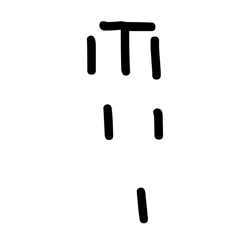

- source_zip_member: `Sub-character Images/ftj0qy2f7b/ftj0qy2f7b/r3zt4hcmbv.png`
- checksum_sha256: see `06_component-visual-index.csv`.
- review_status: `needs_human_visual_review`
- caution: source-marked review image only.

## asset-011259

- source_zip_member: `Sub-character Images/ftj0qy2f7b/ftj0qy2f7b/rhx5ocylf0.png`
- checksum_sha256: see `06_component-visual-index.csv`.
- review_status: `needs_human_visual_review`
- caution: source-marked review image only.

## asset-011260

- source_zip_member: `Sub-character Images/ftj0qy2f7b/ftj0qy2f7b/rktj1q1ca4.png`
- checksum_sha256: see `06_component-visual-index.csv`.
- review_status: `needs_human_visual_review`
- caution: source-marked review image only.

## asset-011261

- source_zip_member: `Sub-character Images/ftj0qy2f7b/ftj0qy2f7b/s04yg6eme1.png`
- checksum_sha256: see `06_component-visual-index.csv`.
- review_status: `needs_human_visual_review`
- caution: source-marked review image only.

## asset-011262

- source_zip_member: `Sub-character Images/ftj0qy2f7b/ftj0qy2f7b/sk51641ij0.png`
- checksum_sha256: see `06_component-visual-index.csv`.
- review_status: `needs_human_visual_review`
- caution: source-marked review image only.

## asset-011263

- source_zip_member: `Sub-character Images/ftj0qy2f7b/ftj0qy2f7b/swit683q80.png`
- checksum_sha256: see `06_component-visual-index.csv`.
- review_status: `needs_human_visual_review`
- caution: source-marked review image only.

## asset-011264

- source_zip_member: `Sub-character Images/ftj0qy2f7b/ftj0qy2f7b/ut7eocutw8.png`
- checksum_sha256: see `06_component-visual-index.csv`.
- review_status: `needs_human_visual_review`
- caution: source-marked review image only.

## asset-011265

- source_zip_member: `Sub-character Images/ftj0qy2f7b/ftj0qy2f7b/v6jso13uc3.png`
- checksum_sha256: see `06_component-visual-index.csv`.
- review_status: `needs_human_visual_review`
- caution: source-marked review image only.

## asset-011266

- source_zip_member: `Sub-character Images/ftj0qy2f7b/ftj0qy2f7b/vccy89t8av.png`
- checksum_sha256: see `06_component-visual-index.csv`.
- review_status: `needs_human_visual_review`
- caution: source-marked review image only.

## asset-011267

- source_zip_member: `Sub-character Images/ftj0qy2f7b/ftj0qy2f7b/vsw7jbvl0q.png`
- checksum_sha256: see `06_component-visual-index.csv`.
- review_status: `needs_human_visual_review`
- caution: source-marked review image only.

## asset-011268

- source_zip_member: `Sub-character Images/ftj0qy2f7b/ftj0qy2f7b/vwy9qkdkam.png`
- checksum_sha256: see `06_component-visual-index.csv`.
- review_status: `needs_human_visual_review`
- caution: source-marked review image only.

## asset-011269

- source_zip_member: `Sub-character Images/ftj0qy2f7b/ftj0qy2f7b/w3306i0xof.png`
- checksum_sha256: see `06_component-visual-index.csv`.
- review_status: `needs_human_visual_review`
- caution: source-marked review image only.

## asset-011270

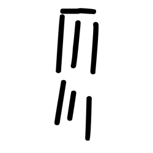

- source_zip_member: `Sub-character Images/ftj0qy2f7b/ftj0qy2f7b/wqfd80yxhu.png`
- checksum_sha256: see `06_component-visual-index.csv`.
- review_status: `needs_human_visual_review`
- caution: source-marked review image only.

## asset-011271

- source_zip_member: `Sub-character Images/ftj0qy2f7b/ftj0qy2f7b/ws5sakdsue.png`
- checksum_sha256: see `06_component-visual-index.csv`.
- review_status: `needs_human_visual_review`
- caution: source-marked review image only.

## asset-011272

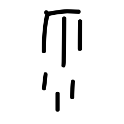

- source_zip_member: `Sub-character Images/ftj0qy2f7b/ftj0qy2f7b/wsm536l8ke.png`
- checksum_sha256: see `06_component-visual-index.csv`.
- review_status: `needs_human_visual_review`
- caution: source-marked review image only.

## asset-011273

- source_zip_member: `Sub-character Images/ftj0qy2f7b/ftj0qy2f7b/wxotodjikr.png`
- checksum_sha256: see `06_component-visual-index.csv`.
- review_status: `needs_human_visual_review`
- caution: source-marked review image only.

## asset-011274

- source_zip_member: `Sub-character Images/ftj0qy2f7b/ftj0qy2f7b/x1rso4bu84.png`
- checksum_sha256: see `06_component-visual-index.csv`.
- review_status: `needs_human_visual_review`
- caution: source-marked review image only.

## asset-011275

- source_zip_member: `Sub-character Images/ftj0qy2f7b/ftj0qy2f7b/xduhu5q141.png`
- checksum_sha256: see `06_component-visual-index.csv`.
- review_status: `needs_human_visual_review`
- caution: source-marked review image only.

## asset-011276

- source_zip_member: `Sub-character Images/ftj0qy2f7b/ftj0qy2f7b/xi7k2xtyih.png`
- checksum_sha256: see `06_component-visual-index.csv`.
- review_status: `needs_human_visual_review`
- caution: source-marked review image only.

## asset-011277

- source_zip_member: `Sub-character Images/ftj0qy2f7b/ftj0qy2f7b/xjzp874e3l.png`
- checksum_sha256: see `06_component-visual-index.csv`.
- review_status: `needs_human_visual_review`
- caution: source-marked review image only.

## asset-011278

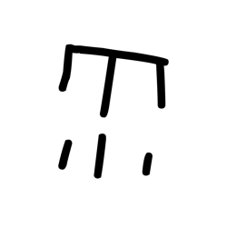

- source_zip_member: `Sub-character Images/ftj0qy2f7b/ftj0qy2f7b/xqfhj89eyi.png`
- checksum_sha256: see `06_component-visual-index.csv`.
- review_status: `needs_human_visual_review`
- caution: source-marked review image only.

## asset-011279

- source_zip_member: `Sub-character Images/ftj0qy2f7b/ftj0qy2f7b/yoo9nrypb2.png`
- checksum_sha256: see `06_component-visual-index.csv`.
- review_status: `needs_human_visual_review`
- caution: source-marked review image only.

## asset-011280

- source_zip_member: `Sub-character Images/ftj0qy2f7b/ftj0qy2f7b/ywlc4pkg81.png`
- checksum_sha256: see `06_component-visual-index.csv`.
- review_status: `needs_human_visual_review`
- caution: source-marked review image only.

## asset-011281

- source_zip_member: `Sub-character Images/ftj0qy2f7b/ftj0qy2f7b/yyhtlq688j.png`
- checksum_sha256: see `06_component-visual-index.csv`.
- review_status: `needs_human_visual_review`
- caution: source-marked review image only.

## asset-011282

- source_zip_member: `Sub-character Images/ftj0qy2f7b/ftj0qy2f7b/zzcgald9rx.png`
- checksum_sha256: see `06_component-visual-index.csv`.
- review_status: `needs_human_visual_review`
- caution: source-marked review image only.
