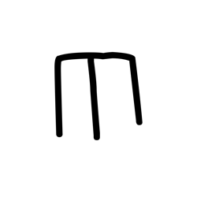
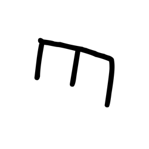
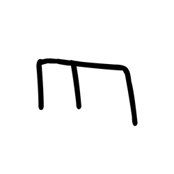

# Component Visual Gallery / 构件图像查看: obs-comp-cand-000033

English:
This page displays OBIMD subcharacter PNG assets extracted into this concrete corpus object directory for human review.

简体中文：
本页展示抽取到当前具体 corpus 对象目录内的 OBIMD subcharacter PNG 资料，供人工复核使用。

Boundary / 边界：dataset image candidate only; not a confirmed component form, component assignment, or decipherment claim.

## asset-011286

- source_zip_member: `Sub-character Images/ftj0qy2f7b/gnzvcvc15x/2t1n8nsxe5.png`
- checksum_sha256: `a4574d0784dce8f3f094cf36e5e59438a08e8003c88f726c8f7fed9e85dc0f80`
- review_status: `needs_human_visual_review`
- caution: OBIMD subcharacter image is a source-marked review asset only; it is not a confirmed component form, component assignment, or decipherment conclusion.

## asset-011287

- source_zip_member: `Sub-character Images/ftj0qy2f7b/gnzvcvc15x/gnzvcvc15x.png`
- checksum_sha256: `cc855961e1cdd5a7059e6302f90756739a7db99a8358243b9179a808870aa4bd`
- review_status: `needs_human_visual_review`
- caution: OBIMD subcharacter image is a source-marked review asset only; it is not a confirmed component form, component assignment, or decipherment conclusion.

## asset-011288

- source_zip_member: `Sub-character Images/ftj0qy2f7b/gnzvcvc15x/hopfedibgv.png`
- checksum_sha256: `2fdab98f59d601e163545dfbb33bd9f7fca773c8b24c7155b2126210d30fee4d`
- review_status: `needs_human_visual_review`
- caution: OBIMD subcharacter image is a source-marked review asset only; it is not a confirmed component form, component assignment, or decipherment conclusion.

## asset-011289

- source_zip_member: `Sub-character Images/ftj0qy2f7b/gnzvcvc15x/kb0ezmfyu5.png`
- checksum_sha256: `1319e82102ab994d998e89096522765fb98954606afc9a7c9b7767b367da00ab`
- review_status: `needs_human_visual_review`
- caution: OBIMD subcharacter image is a source-marked review asset only; it is not a confirmed component form, component assignment, or decipherment conclusion.

## asset-011290

- source_zip_member: `Sub-character Images/ftj0qy2f7b/gnzvcvc15x/kodo1n6xt5.png`
- checksum_sha256: `b31b15d945b63c97d51d140df90c403160aee70915110e4abadfc4fa3f0fd683`
- review_status: `needs_human_visual_review`
- caution: OBIMD subcharacter image is a source-marked review asset only; it is not a confirmed component form, component assignment, or decipherment conclusion.
