# Component Visual Gallery / 构件图像查看: obs-comp-cand-000044

English:
This page displays OBIMD subcharacter PNG assets extracted into this concrete corpus object directory for human review.

简体中文：
本页展示抽取到当前具体 corpus 对象目录内的 OBIMD subcharacter PNG 资料，供人工复核使用。

Boundary / 边界：dataset image candidate only; not a confirmed component form, component assignment, or decipherment claim.

## asset-011301

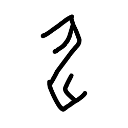

- source_zip_member: `Sub-character Images/rzfokwkc7a/rzfokwkc7a/0nw6g0u36w.png`
- checksum_sha256: `d3e6ce4769cc324893a495261fba377f2dd9305366f71aa03e79377fac3c1b3a`
- review_status: `needs_human_visual_review`
- caution: OBIMD subcharacter image is a source-marked review asset only; it is not a confirmed component form, component assignment, or decipherment conclusion.

## asset-011302

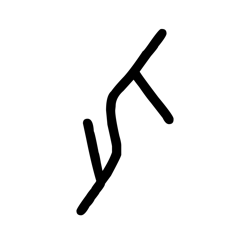

- source_zip_member: `Sub-character Images/rzfokwkc7a/rzfokwkc7a/160dr9b8tz.png`
- checksum_sha256: `ca13fc25a3dc71216415f6b50e8f37c95fd49ac5383c8bc26d89c44d5f68ca6e`
- review_status: `needs_human_visual_review`
- caution: OBIMD subcharacter image is a source-marked review asset only; it is not a confirmed component form, component assignment, or decipherment conclusion.

## asset-011303

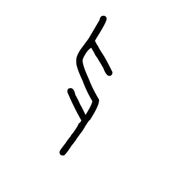

- source_zip_member: `Sub-character Images/rzfokwkc7a/rzfokwkc7a/1tq2thr8dj.png`
- checksum_sha256: `d2b09d9cbafced9af318ade43885c2bcaefa192fdf660d9a7ef0f8fa42f76fb0`
- review_status: `needs_human_visual_review`
- caution: OBIMD subcharacter image is a source-marked review asset only; it is not a confirmed component form, component assignment, or decipherment conclusion.

## asset-011304

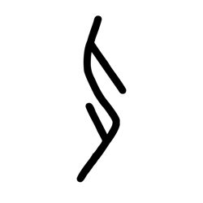

- source_zip_member: `Sub-character Images/rzfokwkc7a/rzfokwkc7a/1yccmhynyi.png`
- checksum_sha256: `5a7295355ee9df1c5e298196090bb2e7e6682322a3aab968a0642ca7c3cbe302`
- review_status: `needs_human_visual_review`
- caution: OBIMD subcharacter image is a source-marked review asset only; it is not a confirmed component form, component assignment, or decipherment conclusion.

## asset-011305

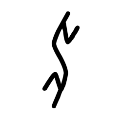

- source_zip_member: `Sub-character Images/rzfokwkc7a/rzfokwkc7a/27589l2zsv.png`
- checksum_sha256: `035e12c225bebadf630d7b956b9a56f0df0c85c88beff6d82dbae2266a0f2edd`
- review_status: `needs_human_visual_review`
- caution: OBIMD subcharacter image is a source-marked review asset only; it is not a confirmed component form, component assignment, or decipherment conclusion.

## asset-011306

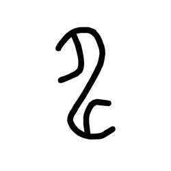

- source_zip_member: `Sub-character Images/rzfokwkc7a/rzfokwkc7a/29olsldi4s.png`
- checksum_sha256: `e0e5ec52d87a07bd081cb4b95cbe4dd7ecfe8115f7cbe7bd77e6105368a68682`
- review_status: `needs_human_visual_review`
- caution: OBIMD subcharacter image is a source-marked review asset only; it is not a confirmed component form, component assignment, or decipherment conclusion.

## asset-011307

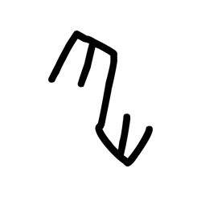

- source_zip_member: `Sub-character Images/rzfokwkc7a/rzfokwkc7a/37fmvns62p.png`
- checksum_sha256: `dc3bdefee2719ee19e8d0631f66153a007baffea595e32ebd481ebf7678ed839`
- review_status: `needs_human_visual_review`
- caution: OBIMD subcharacter image is a source-marked review asset only; it is not a confirmed component form, component assignment, or decipherment conclusion.

## asset-011308

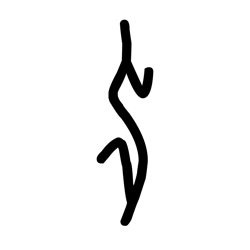

- source_zip_member: `Sub-character Images/rzfokwkc7a/rzfokwkc7a/3hj4zhih8o.png`
- checksum_sha256: `88d737e9f5a6ea5d61b1eb44f6c1874f8a2571075dc900f7c961de2644da392b`
- review_status: `needs_human_visual_review`
- caution: OBIMD subcharacter image is a source-marked review asset only; it is not a confirmed component form, component assignment, or decipherment conclusion.

## asset-011309

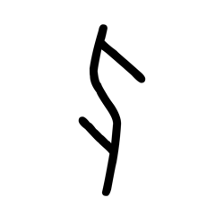

- source_zip_member: `Sub-character Images/rzfokwkc7a/rzfokwkc7a/3n12h8uelx.png`
- checksum_sha256: `cb656f979bfa49af46d4648e658c8540c8819406b94c1eeb6eda87ca7acde8de`
- review_status: `needs_human_visual_review`
- caution: OBIMD subcharacter image is a source-marked review asset only; it is not a confirmed component form, component assignment, or decipherment conclusion.

## asset-011310

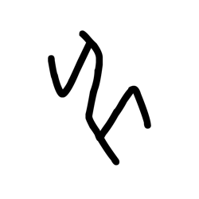

- source_zip_member: `Sub-character Images/rzfokwkc7a/rzfokwkc7a/3ryskou4fn.png`
- checksum_sha256: `fe1279e1f78ca71371c224e666ffadc167346e6592d81fb2619abd7be568448e`
- review_status: `needs_human_visual_review`
- caution: OBIMD subcharacter image is a source-marked review asset only; it is not a confirmed component form, component assignment, or decipherment conclusion.

## asset-011311

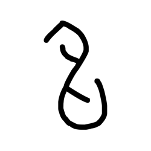

- source_zip_member: `Sub-character Images/rzfokwkc7a/rzfokwkc7a/3tg26sxaf0.png`
- checksum_sha256: `a258a1110f2ebf5cba3ba97579fd19ec5dbeefacde147072fc684682c7e733f3`
- review_status: `needs_human_visual_review`
- caution: OBIMD subcharacter image is a source-marked review asset only; it is not a confirmed component form, component assignment, or decipherment conclusion.

## asset-011312

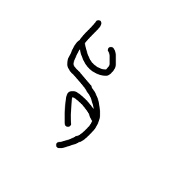

- source_zip_member: `Sub-character Images/rzfokwkc7a/rzfokwkc7a/3xzy88ebdz.png`
- checksum_sha256: `4c105ce53c230a8f0a27bd4c27d59c9678c7f35c21184c76656d951e136c2dea`
- review_status: `needs_human_visual_review`
- caution: OBIMD subcharacter image is a source-marked review asset only; it is not a confirmed component form, component assignment, or decipherment conclusion.

## asset-011313

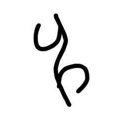

- source_zip_member: `Sub-character Images/rzfokwkc7a/rzfokwkc7a/3zeavzu0jl.png`
- checksum_sha256: `c159478b010418525a0f851b592421326e4da2ad56a81de3ae2364202339e627`
- review_status: `needs_human_visual_review`
- caution: OBIMD subcharacter image is a source-marked review asset only; it is not a confirmed component form, component assignment, or decipherment conclusion.

## asset-011314

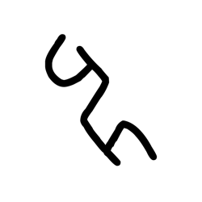

- source_zip_member: `Sub-character Images/rzfokwkc7a/rzfokwkc7a/40gxhfcg8o.png`
- checksum_sha256: `2c4f2d264b7caff8decf795678e836dcfc2feea5d43e8fb78e2101fbdab3c8fb`
- review_status: `needs_human_visual_review`
- caution: OBIMD subcharacter image is a source-marked review asset only; it is not a confirmed component form, component assignment, or decipherment conclusion.

## asset-011315

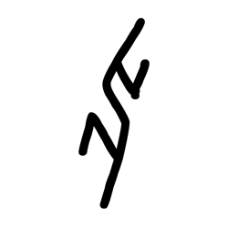

- source_zip_member: `Sub-character Images/rzfokwkc7a/rzfokwkc7a/4iriwe0nfm.png`
- checksum_sha256: `53d5e7cca803bc5da3fe104eec6eff40654a4bd5c45bfabfa4788dece849e834`
- review_status: `needs_human_visual_review`
- caution: OBIMD subcharacter image is a source-marked review asset only; it is not a confirmed component form, component assignment, or decipherment conclusion.

## asset-011316

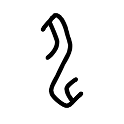

- source_zip_member: `Sub-character Images/rzfokwkc7a/rzfokwkc7a/59x4bqwvvx.png`
- checksum_sha256: `15ce875d9684423a663c7c0d2bc3735e0515faa57f955eb726ecefdd6de28f8e`
- review_status: `needs_human_visual_review`
- caution: OBIMD subcharacter image is a source-marked review asset only; it is not a confirmed component form, component assignment, or decipherment conclusion.

## asset-011317

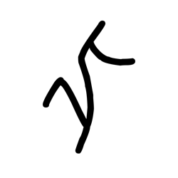

- source_zip_member: `Sub-character Images/rzfokwkc7a/rzfokwkc7a/5pv8j6rv6q.png`
- checksum_sha256: `ebfe3f83eee35d07a848218dd5f5e391bffa0174b603f9c09dd2f7fd16964589`
- review_status: `needs_human_visual_review`
- caution: OBIMD subcharacter image is a source-marked review asset only; it is not a confirmed component form, component assignment, or decipherment conclusion.

## asset-011318

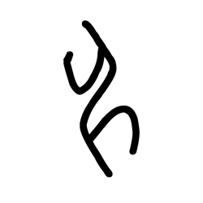

- source_zip_member: `Sub-character Images/rzfokwkc7a/rzfokwkc7a/612i5dad1f.png`
- checksum_sha256: `d69a7cb5d22e99f607480a0e620d10952b5531f6ce604330e840dd451fe69023`
- review_status: `needs_human_visual_review`
- caution: OBIMD subcharacter image is a source-marked review asset only; it is not a confirmed component form, component assignment, or decipherment conclusion.

## asset-011319

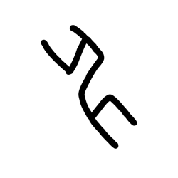

- source_zip_member: `Sub-character Images/rzfokwkc7a/rzfokwkc7a/6vzetcsvan.png`
- checksum_sha256: `fc5ca0bdd28c51232f60f05f8dd0604a7e5eb63eebf8ffeb2fac5295909cb41f`
- review_status: `needs_human_visual_review`
- caution: OBIMD subcharacter image is a source-marked review asset only; it is not a confirmed component form, component assignment, or decipherment conclusion.

## asset-011320

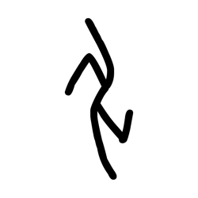

- source_zip_member: `Sub-character Images/rzfokwkc7a/rzfokwkc7a/75kfcup4w1.png`
- checksum_sha256: `d58f5262e1dbfbbc3eb21db22c01fe9deada30a7d9b39dcff166cbcc609bba90`
- review_status: `needs_human_visual_review`
- caution: OBIMD subcharacter image is a source-marked review asset only; it is not a confirmed component form, component assignment, or decipherment conclusion.

## asset-011321

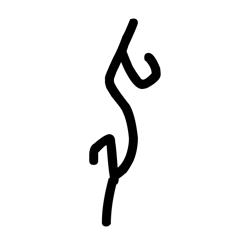

- source_zip_member: `Sub-character Images/rzfokwkc7a/rzfokwkc7a/87l1o02fep.png`
- checksum_sha256: `8cc29cc6ba54d33834d0e56cd6f2991f2e1d4238dd2cc1226f7198b032760528`
- review_status: `needs_human_visual_review`
- caution: OBIMD subcharacter image is a source-marked review asset only; it is not a confirmed component form, component assignment, or decipherment conclusion.

## asset-011322

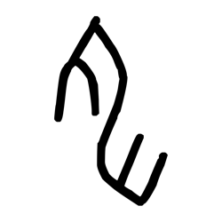

- source_zip_member: `Sub-character Images/rzfokwkc7a/rzfokwkc7a/8d3gvwl7i6.png`
- checksum_sha256: `e88f8794fe0e96ad59923f1b23e11db50801f0dbbd0d3db1c41c5ea02a9b8191`
- review_status: `needs_human_visual_review`
- caution: OBIMD subcharacter image is a source-marked review asset only; it is not a confirmed component form, component assignment, or decipherment conclusion.

## asset-011323

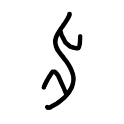

- source_zip_member: `Sub-character Images/rzfokwkc7a/rzfokwkc7a/8g7sjbsujr.png`
- checksum_sha256: `2d96fba8aca91dec3a9f7457b12f31419fd9ba840588c609bfb5430ad3070e86`
- review_status: `needs_human_visual_review`
- caution: OBIMD subcharacter image is a source-marked review asset only; it is not a confirmed component form, component assignment, or decipherment conclusion.

## asset-011324

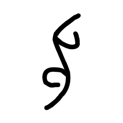

- source_zip_member: `Sub-character Images/rzfokwkc7a/rzfokwkc7a/8qlfx8lll5.png`
- checksum_sha256: `a6e5f2524031835f6e30cb997b39d8241f7a0c61bb2c004afc51e25b32f101b3`
- review_status: `needs_human_visual_review`
- caution: OBIMD subcharacter image is a source-marked review asset only; it is not a confirmed component form, component assignment, or decipherment conclusion.

## asset-011325

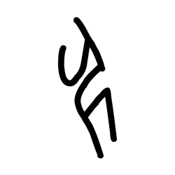

- source_zip_member: `Sub-character Images/rzfokwkc7a/rzfokwkc7a/999953z5j1.png`
- checksum_sha256: `d4d71b50637747215a2e0f1b253bcf2a8ffd5bb469a4471328fa22192201bc99`
- review_status: `needs_human_visual_review`
- caution: OBIMD subcharacter image is a source-marked review asset only; it is not a confirmed component form, component assignment, or decipherment conclusion.

## asset-011326

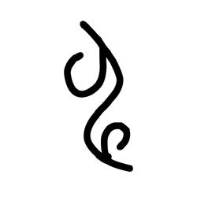

- source_zip_member: `Sub-character Images/rzfokwkc7a/rzfokwkc7a/9icd19v24z.png`
- checksum_sha256: `38702d877eabfd2034ab18e87b968a7ffcae9d23e31e196b248af1ac0fef4ebb`
- review_status: `needs_human_visual_review`
- caution: OBIMD subcharacter image is a source-marked review asset only; it is not a confirmed component form, component assignment, or decipherment conclusion.

## asset-011327

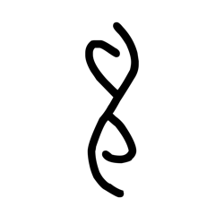

- source_zip_member: `Sub-character Images/rzfokwkc7a/rzfokwkc7a/a1180m7p3o.png`
- checksum_sha256: `b9c3ead420697c5206bdda8865c063dc96d9be895c52d3be923d7e392448399c`
- review_status: `needs_human_visual_review`
- caution: OBIMD subcharacter image is a source-marked review asset only; it is not a confirmed component form, component assignment, or decipherment conclusion.

## asset-011328

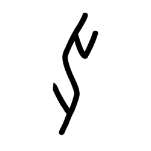

- source_zip_member: `Sub-character Images/rzfokwkc7a/rzfokwkc7a/a4qa8qv650.png`
- checksum_sha256: `e75ba4c629d9fb405c695b13f15823ce342f42d50b7448a2a2dda7acff11d1c7`
- review_status: `needs_human_visual_review`
- caution: OBIMD subcharacter image is a source-marked review asset only; it is not a confirmed component form, component assignment, or decipherment conclusion.

## asset-011329

- source_zip_member: `Sub-character Images/rzfokwkc7a/rzfokwkc7a/a5586heqlr.png`
- checksum_sha256: `6aec81d4a3ee671e05f23d51569b4e0b38cb0e1239861741c71f86378fbb21cb`
- review_status: `needs_human_visual_review`
- caution: OBIMD subcharacter image is a source-marked review asset only; it is not a confirmed component form, component assignment, or decipherment conclusion.

## asset-011330

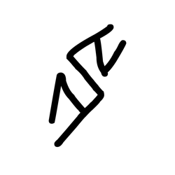

- source_zip_member: `Sub-character Images/rzfokwkc7a/rzfokwkc7a/aixa7b3p18.png`
- checksum_sha256: `6648a9a92b570c72a34a7939dad1d86c4a52f897b9fc97726f11b2fe0481a102`
- review_status: `needs_human_visual_review`
- caution: OBIMD subcharacter image is a source-marked review asset only; it is not a confirmed component form, component assignment, or decipherment conclusion.

## asset-011331

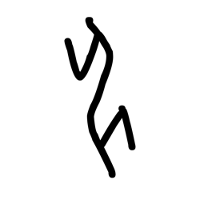

- source_zip_member: `Sub-character Images/rzfokwkc7a/rzfokwkc7a/aj70zyrsvo.png`
- checksum_sha256: `e8ab82fd53dd2d01c711d466a704a3b6db84bb3d4b60a58f31d4720fb5aa0e2b`
- review_status: `needs_human_visual_review`
- caution: OBIMD subcharacter image is a source-marked review asset only; it is not a confirmed component form, component assignment, or decipherment conclusion.

## asset-011332

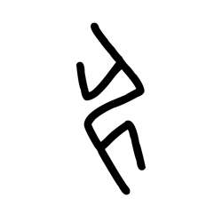

- source_zip_member: `Sub-character Images/rzfokwkc7a/rzfokwkc7a/aws3hs1y08.png`
- checksum_sha256: `8849def67c2481eedcad450e26d04175909137a054e3e175e945dbc1db76e5c7`
- review_status: `needs_human_visual_review`
- caution: OBIMD subcharacter image is a source-marked review asset only; it is not a confirmed component form, component assignment, or decipherment conclusion.

## asset-011333

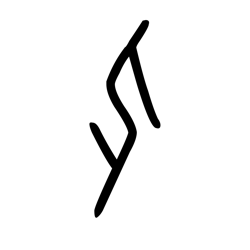

- source_zip_member: `Sub-character Images/rzfokwkc7a/rzfokwkc7a/b0g8o6d7qf.png`
- checksum_sha256: `b4802cb4d04c34eaddb857097ad9975574ab08e1089adeb0c7ab03930ec1f545`
- review_status: `needs_human_visual_review`
- caution: OBIMD subcharacter image is a source-marked review asset only; it is not a confirmed component form, component assignment, or decipherment conclusion.

## asset-011334

- source_zip_member: `Sub-character Images/rzfokwkc7a/rzfokwkc7a/bms62hld6o.png`
- checksum_sha256: `14e029ff44d793d2281daadabb3f391b111c56bcf4917637024b5f7529c0bed2`
- review_status: `needs_human_visual_review`
- caution: OBIMD subcharacter image is a source-marked review asset only; it is not a confirmed component form, component assignment, or decipherment conclusion.

## asset-011335

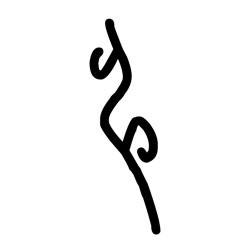

- source_zip_member: `Sub-character Images/rzfokwkc7a/rzfokwkc7a/bsadr8x93l.png`
- checksum_sha256: `b27c991a20247a854890a65c385df6af4adefa24848616980423a0974321593b`
- review_status: `needs_human_visual_review`
- caution: OBIMD subcharacter image is a source-marked review asset only; it is not a confirmed component form, component assignment, or decipherment conclusion.

## asset-011336

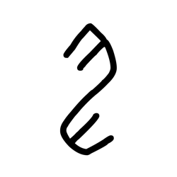

- source_zip_member: `Sub-character Images/rzfokwkc7a/rzfokwkc7a/crhxlg072d.png`
- checksum_sha256: `07842c5f54b5358c002a50ebce00d7fce1d6022b4a684a398c90b35ec2664ed1`
- review_status: `needs_human_visual_review`
- caution: OBIMD subcharacter image is a source-marked review asset only; it is not a confirmed component form, component assignment, or decipherment conclusion.

## asset-011337

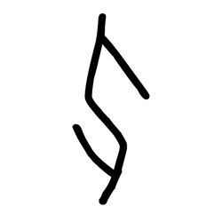

- source_zip_member: `Sub-character Images/rzfokwkc7a/rzfokwkc7a/d94geakj3l.png`
- checksum_sha256: `ab98e53d22d6791984100b58e827c5d338366668bfdc6a97088442e64963cac2`
- review_status: `needs_human_visual_review`
- caution: OBIMD subcharacter image is a source-marked review asset only; it is not a confirmed component form, component assignment, or decipherment conclusion.

## asset-011338

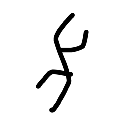

- source_zip_member: `Sub-character Images/rzfokwkc7a/rzfokwkc7a/dzqupxbcic.png`
- checksum_sha256: `6439789f91a8ec74d0afd5e1df659981f2a9fd17a9c6f5b26934a688368e91f8`
- review_status: `needs_human_visual_review`
- caution: OBIMD subcharacter image is a source-marked review asset only; it is not a confirmed component form, component assignment, or decipherment conclusion.

## asset-011339

- source_zip_member: `Sub-character Images/rzfokwkc7a/rzfokwkc7a/e29qfcrdgc.png`
- checksum_sha256: `1604b297e58cdee490a512319986c78b1632a36de64a1a9b7b73f0e9edd0a7a1`
- review_status: `needs_human_visual_review`
- caution: OBIMD subcharacter image is a source-marked review asset only; it is not a confirmed component form, component assignment, or decipherment conclusion.

## asset-011340

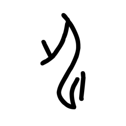

- source_zip_member: `Sub-character Images/rzfokwkc7a/rzfokwkc7a/euue7prx3h.png`
- checksum_sha256: `0e5051101514edd9ebf239f1a4096744e8ed54830a8ae24e28f5229b23878901`
- review_status: `needs_human_visual_review`
- caution: OBIMD subcharacter image is a source-marked review asset only; it is not a confirmed component form, component assignment, or decipherment conclusion.

## asset-011341

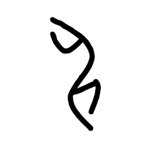

- source_zip_member: `Sub-character Images/rzfokwkc7a/rzfokwkc7a/ezud7nrc4n.png`
- checksum_sha256: `aa501735fb643892149b80bd430e17beddd7ad7ac1ba6485fa53cce2679e3945`
- review_status: `needs_human_visual_review`
- caution: OBIMD subcharacter image is a source-marked review asset only; it is not a confirmed component form, component assignment, or decipherment conclusion.

## asset-011342

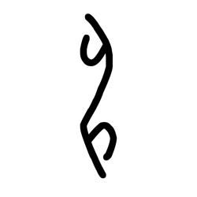

- source_zip_member: `Sub-character Images/rzfokwkc7a/rzfokwkc7a/f174dullpp.png`
- checksum_sha256: `2505013bbdb58f506bc36cbcb11e1fd697aa89251808f438869baeb06cde6aa3`
- review_status: `needs_human_visual_review`
- caution: OBIMD subcharacter image is a source-marked review asset only; it is not a confirmed component form, component assignment, or decipherment conclusion.

## asset-011343

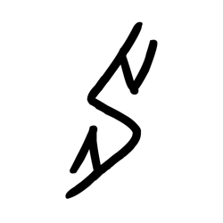

- source_zip_member: `Sub-character Images/rzfokwkc7a/rzfokwkc7a/fdsa422roj.png`
- checksum_sha256: `60784ebced544b1f24815470f5f8e2e8d1671f3fbb16d68ec91127275dd2b5ea`
- review_status: `needs_human_visual_review`
- caution: OBIMD subcharacter image is a source-marked review asset only; it is not a confirmed component form, component assignment, or decipherment conclusion.

## asset-011344

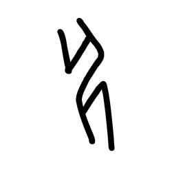

- source_zip_member: `Sub-character Images/rzfokwkc7a/rzfokwkc7a/fgknizzsa3.png`
- checksum_sha256: `18c02a392fda5e2cb3c381b30861e4744f4fe22734aacb4b3946ff346c14d33b`
- review_status: `needs_human_visual_review`
- caution: OBIMD subcharacter image is a source-marked review asset only; it is not a confirmed component form, component assignment, or decipherment conclusion.

## asset-011345

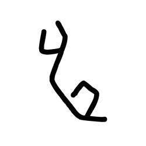

- source_zip_member: `Sub-character Images/rzfokwkc7a/rzfokwkc7a/fizmeh47no.png`
- checksum_sha256: `356cce714735071e49aa2d4b1a87a9487df48a9ea4109e9776da9ad89f3a4f1e`
- review_status: `needs_human_visual_review`
- caution: OBIMD subcharacter image is a source-marked review asset only; it is not a confirmed component form, component assignment, or decipherment conclusion.

## asset-011346

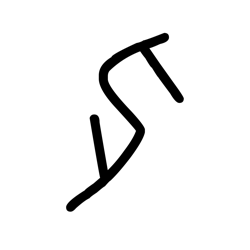

- source_zip_member: `Sub-character Images/rzfokwkc7a/rzfokwkc7a/gd5iwyefbx.png`
- checksum_sha256: `2efe91993526743117aa69d47dcf8f7021a8fa04c8a1dab9e42a08d4e9b9ff0e`
- review_status: `needs_human_visual_review`
- caution: OBIMD subcharacter image is a source-marked review asset only; it is not a confirmed component form, component assignment, or decipherment conclusion.

## asset-011347

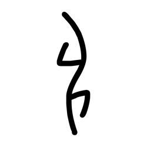

- source_zip_member: `Sub-character Images/rzfokwkc7a/rzfokwkc7a/ge5toy6zmo.png`
- checksum_sha256: `35f3bc8a97b6065cd193be30260d8e2bb106eeab3851ca0c7e392f3e67b7d331`
- review_status: `needs_human_visual_review`
- caution: OBIMD subcharacter image is a source-marked review asset only; it is not a confirmed component form, component assignment, or decipherment conclusion.

## asset-011348

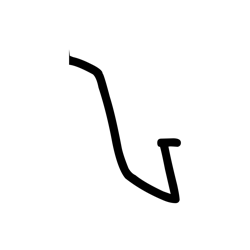

- source_zip_member: `Sub-character Images/rzfokwkc7a/rzfokwkc7a/gu7qfibr4u.png`
- checksum_sha256: `abd0c06e69c36ab464d490ad37b68bb54e33a27f6ecc4230b32bae4cb841b378`
- review_status: `needs_human_visual_review`
- caution: OBIMD subcharacter image is a source-marked review asset only; it is not a confirmed component form, component assignment, or decipherment conclusion.

## asset-011349

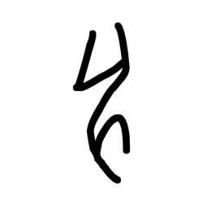

- source_zip_member: `Sub-character Images/rzfokwkc7a/rzfokwkc7a/hic5mxysd6.png`
- checksum_sha256: `4968f6380d657c9bb8b9de9f56a83fa03427c32c947cc3e22aa39c1b7b7c1e76`
- review_status: `needs_human_visual_review`
- caution: OBIMD subcharacter image is a source-marked review asset only; it is not a confirmed component form, component assignment, or decipherment conclusion.

## asset-011350

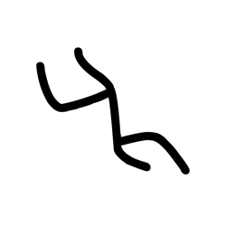

- source_zip_member: `Sub-character Images/rzfokwkc7a/rzfokwkc7a/hu1o0c4v03.png`
- checksum_sha256: `afd417ca213d9ab838f1d7b53ccb8ea2e4fa64b062dfb97c5f1fcaf3ca690519`
- review_status: `needs_human_visual_review`
- caution: OBIMD subcharacter image is a source-marked review asset only; it is not a confirmed component form, component assignment, or decipherment conclusion.

## asset-011351

- source_zip_member: `Sub-character Images/rzfokwkc7a/rzfokwkc7a/i43bblt8fz.png`
- checksum_sha256: `052dc274b6c2da6953cdb8278f522839b8670d89684d704afbf27c0e24b75840`
- review_status: `needs_human_visual_review`
- caution: OBIMD subcharacter image is a source-marked review asset only; it is not a confirmed component form, component assignment, or decipherment conclusion.

## asset-011352

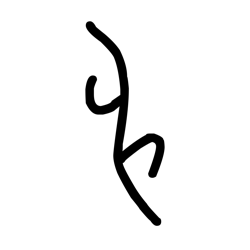

- source_zip_member: `Sub-character Images/rzfokwkc7a/rzfokwkc7a/ipqxli7mwk.png`
- checksum_sha256: `f47e2a6587a3d0161f9f43e84fa4a6383aca0c6dfcd47e33b6864f4c8ff43743`
- review_status: `needs_human_visual_review`
- caution: OBIMD subcharacter image is a source-marked review asset only; it is not a confirmed component form, component assignment, or decipherment conclusion.

## asset-011353

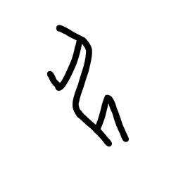

- source_zip_member: `Sub-character Images/rzfokwkc7a/rzfokwkc7a/iszll3g1ex.png`
- checksum_sha256: `641a1519c05551f073e105395ff5a5837828e2cebb87e651edbd1647d0b3035c`
- review_status: `needs_human_visual_review`
- caution: OBIMD subcharacter image is a source-marked review asset only; it is not a confirmed component form, component assignment, or decipherment conclusion.

## asset-011354

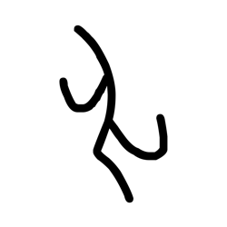

- source_zip_member: `Sub-character Images/rzfokwkc7a/rzfokwkc7a/iw7xe6vkxq.png`
- checksum_sha256: `964d045a6c2132a82bb0763abfa10beb7d8a4ac59766f0c3f0911247b87d11e3`
- review_status: `needs_human_visual_review`
- caution: OBIMD subcharacter image is a source-marked review asset only; it is not a confirmed component form, component assignment, or decipherment conclusion.

## asset-011355

- source_zip_member: `Sub-character Images/rzfokwkc7a/rzfokwkc7a/iwpce9eehy.png`
- checksum_sha256: `a584cb31a70543f307a14a44d09697f96791d710cc687c4fc5c1e4a71802ed07`
- review_status: `needs_human_visual_review`
- caution: OBIMD subcharacter image is a source-marked review asset only; it is not a confirmed component form, component assignment, or decipherment conclusion.

## asset-011356

- source_zip_member: `Sub-character Images/rzfokwkc7a/rzfokwkc7a/j17kqblr8f.png`
- checksum_sha256: `d4886a8b924a18dfd28c70cfecba130de4d0f5764e2586b0a0e437db6a14b7d1`
- review_status: `needs_human_visual_review`
- caution: OBIMD subcharacter image is a source-marked review asset only; it is not a confirmed component form, component assignment, or decipherment conclusion.

## asset-011357

- source_zip_member: `Sub-character Images/rzfokwkc7a/rzfokwkc7a/jpi9388zds.png`
- checksum_sha256: `76343249191eec338101e77aa7a2aaa6ba359eefd6f6e623f09d9c0c2e3af07d`
- review_status: `needs_human_visual_review`
- caution: OBIMD subcharacter image is a source-marked review asset only; it is not a confirmed component form, component assignment, or decipherment conclusion.

## asset-011358

- source_zip_member: `Sub-character Images/rzfokwkc7a/rzfokwkc7a/kcj0q75ojx.png`
- checksum_sha256: `04d6cf2c6c1b762b0edbe50aa7733bafd25376ae346c9fc3258695c229666775`
- review_status: `needs_human_visual_review`
- caution: OBIMD subcharacter image is a source-marked review asset only; it is not a confirmed component form, component assignment, or decipherment conclusion.

## asset-011359

- source_zip_member: `Sub-character Images/rzfokwkc7a/rzfokwkc7a/kdsjujxfdw.png`
- checksum_sha256: `19d6ed570eb561999e7102d44f4f92fc713f13303ded8d8a5617394b1ce80f73`
- review_status: `needs_human_visual_review`
- caution: OBIMD subcharacter image is a source-marked review asset only; it is not a confirmed component form, component assignment, or decipherment conclusion.

## asset-011360

- source_zip_member: `Sub-character Images/rzfokwkc7a/rzfokwkc7a/kev1q86umu.png`
- checksum_sha256: `aa3874e45e39b12a4816984da614afb68847c20ce70d1d1c3982bcad01e286e2`
- review_status: `needs_human_visual_review`
- caution: OBIMD subcharacter image is a source-marked review asset only; it is not a confirmed component form, component assignment, or decipherment conclusion.

## asset-011361

- source_zip_member: `Sub-character Images/rzfokwkc7a/rzfokwkc7a/l4vs86lb02.png`
- checksum_sha256: `452469340996d3f952090a5bb3b8e3df469b18894201b315256a11b9782918d7`
- review_status: `needs_human_visual_review`
- caution: OBIMD subcharacter image is a source-marked review asset only; it is not a confirmed component form, component assignment, or decipherment conclusion.

## asset-011362

- source_zip_member: `Sub-character Images/rzfokwkc7a/rzfokwkc7a/l6nux8d8zm.png`
- checksum_sha256: `98b9ad2cd67a5d3754db544f39ba2aa7fb685975be41af727488f5bce799be13`
- review_status: `needs_human_visual_review`
- caution: OBIMD subcharacter image is a source-marked review asset only; it is not a confirmed component form, component assignment, or decipherment conclusion.

## asset-011363

- source_zip_member: `Sub-character Images/rzfokwkc7a/rzfokwkc7a/l8og072xsw.png`
- checksum_sha256: `28b4ada380a6914ee5cea0f1db2292580bb361e81f89daad4b723ee35b023660`
- review_status: `needs_human_visual_review`
- caution: OBIMD subcharacter image is a source-marked review asset only; it is not a confirmed component form, component assignment, or decipherment conclusion.

## asset-011364

- source_zip_member: `Sub-character Images/rzfokwkc7a/rzfokwkc7a/ltcp8be44j.png`
- checksum_sha256: `608d60c174efd2f3d2c85b741c81e10bcbfd1ccce49e8f176fad59dd70e48cef`
- review_status: `needs_human_visual_review`
- caution: OBIMD subcharacter image is a source-marked review asset only; it is not a confirmed component form, component assignment, or decipherment conclusion.

## asset-011365

- source_zip_member: `Sub-character Images/rzfokwkc7a/rzfokwkc7a/ly32myieik.png`
- checksum_sha256: `3c6db29af9ec04e73157eabd50a97a385378abf4d478719357891f1886e20071`
- review_status: `needs_human_visual_review`
- caution: OBIMD subcharacter image is a source-marked review asset only; it is not a confirmed component form, component assignment, or decipherment conclusion.

## asset-011366

- source_zip_member: `Sub-character Images/rzfokwkc7a/rzfokwkc7a/mkz543vvhr.png`
- checksum_sha256: `f9dbcab564e3564c33c4d20d31df8ef2224ef8e9867b9babf3ab554dd1f5b89b`
- review_status: `needs_human_visual_review`
- caution: OBIMD subcharacter image is a source-marked review asset only; it is not a confirmed component form, component assignment, or decipherment conclusion.

## asset-011367

- source_zip_member: `Sub-character Images/rzfokwkc7a/rzfokwkc7a/nbrfuhdsa3.png`
- checksum_sha256: `47cc39cf1a3114c75784f86cee9ec56f262554956b259667711e1fa48b4bd70d`
- review_status: `needs_human_visual_review`
- caution: OBIMD subcharacter image is a source-marked review asset only; it is not a confirmed component form, component assignment, or decipherment conclusion.

## asset-011368

- source_zip_member: `Sub-character Images/rzfokwkc7a/rzfokwkc7a/nqjdrmod6b.png`
- checksum_sha256: `35791fa3300a9efbef91cb677f1585fb46b9efbd69eb29f78dc8d3199fe4764c`
- review_status: `needs_human_visual_review`
- caution: OBIMD subcharacter image is a source-marked review asset only; it is not a confirmed component form, component assignment, or decipherment conclusion.

## asset-011369

- source_zip_member: `Sub-character Images/rzfokwkc7a/rzfokwkc7a/nyxh15wv1k.png`
- checksum_sha256: `77b2756434c22f7a352f343b5dc3183f4a02c76ff2982d733da63fc2517c2a13`
- review_status: `needs_human_visual_review`
- caution: OBIMD subcharacter image is a source-marked review asset only; it is not a confirmed component form, component assignment, or decipherment conclusion.

## asset-011370

- source_zip_member: `Sub-character Images/rzfokwkc7a/rzfokwkc7a/obmjd4glol.png`
- checksum_sha256: `d4a0f5b6d7c250d63f03e0b499851e73e3bf95801f21a9421bb398271c03a462`
- review_status: `needs_human_visual_review`
- caution: OBIMD subcharacter image is a source-marked review asset only; it is not a confirmed component form, component assignment, or decipherment conclusion.

## asset-011371

- source_zip_member: `Sub-character Images/rzfokwkc7a/rzfokwkc7a/od536swqwj.png`
- checksum_sha256: `032a482fe18071c27575eff3580f0a47bc60eca5ad3e0b37fae3e7c47f592c4f`
- review_status: `needs_human_visual_review`
- caution: OBIMD subcharacter image is a source-marked review asset only; it is not a confirmed component form, component assignment, or decipherment conclusion.

## asset-011372

- source_zip_member: `Sub-character Images/rzfokwkc7a/rzfokwkc7a/oi0w02idq7.png`
- checksum_sha256: `40d4ce01b61f7129d9907de381faffdab60cc2a70f604c715b68712cf835629d`
- review_status: `needs_human_visual_review`
- caution: OBIMD subcharacter image is a source-marked review asset only; it is not a confirmed component form, component assignment, or decipherment conclusion.

## asset-011373

- source_zip_member: `Sub-character Images/rzfokwkc7a/rzfokwkc7a/ouya2vq7bd.png`
- checksum_sha256: `3176794aa09c37b9f1bb42ea23372a30b25bd423f4a3c196cd38d3f408263677`
- review_status: `needs_human_visual_review`
- caution: OBIMD subcharacter image is a source-marked review asset only; it is not a confirmed component form, component assignment, or decipherment conclusion.

## asset-011374

- source_zip_member: `Sub-character Images/rzfokwkc7a/rzfokwkc7a/ovdn0lomuf.png`
- checksum_sha256: `4f22dbe44cdddcb33c02dbe074d55f0d3f1a2ad605f0442b434ac4a128e997e9`
- review_status: `needs_human_visual_review`
- caution: OBIMD subcharacter image is a source-marked review asset only; it is not a confirmed component form, component assignment, or decipherment conclusion.

## asset-011375

- source_zip_member: `Sub-character Images/rzfokwkc7a/rzfokwkc7a/oy6tulsv5b.png`
- checksum_sha256: `46832df93e40a0dc07ba809748490a4e1926cffed2f6747155afdd3cc4ed04ec`
- review_status: `needs_human_visual_review`
- caution: OBIMD subcharacter image is a source-marked review asset only; it is not a confirmed component form, component assignment, or decipherment conclusion.

## asset-011376

- source_zip_member: `Sub-character Images/rzfokwkc7a/rzfokwkc7a/ozlei1zai2.png`
- checksum_sha256: `8c5f366228ae2aeea710a81bb8058556d4a004ad3b6868446573165750897bfe`
- review_status: `needs_human_visual_review`
- caution: OBIMD subcharacter image is a source-marked review asset only; it is not a confirmed component form, component assignment, or decipherment conclusion.

## asset-011377

- source_zip_member: `Sub-character Images/rzfokwkc7a/rzfokwkc7a/p5dx2p2ott.png`
- checksum_sha256: `91a0a752148f7c444f063a21712de032c04f8d88da7358f9dc0d788e179434da`
- review_status: `needs_human_visual_review`
- caution: OBIMD subcharacter image is a source-marked review asset only; it is not a confirmed component form, component assignment, or decipherment conclusion.

## asset-011378

- source_zip_member: `Sub-character Images/rzfokwkc7a/rzfokwkc7a/p7f2ekjf62.png`
- checksum_sha256: `7001a83fabb7d52d1548a9890cf74c157bbf12e07df43171397648876cba7ada`
- review_status: `needs_human_visual_review`
- caution: OBIMD subcharacter image is a source-marked review asset only; it is not a confirmed component form, component assignment, or decipherment conclusion.

## asset-011379

- source_zip_member: `Sub-character Images/rzfokwkc7a/rzfokwkc7a/p9injlz31e.png`
- checksum_sha256: `7513fee2021afdd42aaf2d36eae5ee2986d3a3f705d90a440b986c2d0251d16f`
- review_status: `needs_human_visual_review`
- caution: OBIMD subcharacter image is a source-marked review asset only; it is not a confirmed component form, component assignment, or decipherment conclusion.

## asset-011380

- source_zip_member: `Sub-character Images/rzfokwkc7a/rzfokwkc7a/q306r03qff.png`
- checksum_sha256: `7f41597725288e6ca0903ee056a004d11df500f242946229c9562ed3790ceb5e`
- review_status: `needs_human_visual_review`
- caution: OBIMD subcharacter image is a source-marked review asset only; it is not a confirmed component form, component assignment, or decipherment conclusion.

## asset-011381

- source_zip_member: `Sub-character Images/rzfokwkc7a/rzfokwkc7a/qbawy2leg2.png`
- checksum_sha256: `f9691abdcd5ceba319ffcb23c7b53ff6e29156922434b0fdda91959c806cfd3a`
- review_status: `needs_human_visual_review`
- caution: OBIMD subcharacter image is a source-marked review asset only; it is not a confirmed component form, component assignment, or decipherment conclusion.

## asset-011382

- source_zip_member: `Sub-character Images/rzfokwkc7a/rzfokwkc7a/qn710atkcr.png`
- checksum_sha256: `4ecf8fe6a3db941d7cfac00890c53a84e546af24ef9e7fa13b0eac6a90725ea1`
- review_status: `needs_human_visual_review`
- caution: OBIMD subcharacter image is a source-marked review asset only; it is not a confirmed component form, component assignment, or decipherment conclusion.

## asset-011383

- source_zip_member: `Sub-character Images/rzfokwkc7a/rzfokwkc7a/qnoh4lmvgt.png`
- checksum_sha256: `3ecd49eb2f672b49d564bdd664a1af469d748578d83394433a0aa588719cfe4b`
- review_status: `needs_human_visual_review`
- caution: OBIMD subcharacter image is a source-marked review asset only; it is not a confirmed component form, component assignment, or decipherment conclusion.

## asset-011384

- source_zip_member: `Sub-character Images/rzfokwkc7a/rzfokwkc7a/qqptercfkp.png`
- checksum_sha256: `4a7b67b293734d39bdbc5ce7a5434aa31317a3dd6b2eecd7e01ffb64d4c528ad`
- review_status: `needs_human_visual_review`
- caution: OBIMD subcharacter image is a source-marked review asset only; it is not a confirmed component form, component assignment, or decipherment conclusion.

## asset-011385

- source_zip_member: `Sub-character Images/rzfokwkc7a/rzfokwkc7a/qsjpoulieb.png`
- checksum_sha256: `7cae91ffbe3fb8be0eccdfb3b2834d9250e4598f2284791c3820df820d8d38ed`
- review_status: `needs_human_visual_review`
- caution: OBIMD subcharacter image is a source-marked review asset only; it is not a confirmed component form, component assignment, or decipherment conclusion.

## asset-011386

- source_zip_member: `Sub-character Images/rzfokwkc7a/rzfokwkc7a/r98qjpy2vk.png`
- checksum_sha256: `d583e3d9355b64013ace9776b331e1cfcf68c71e132e3663f105a2ae6c8ea26d`
- review_status: `needs_human_visual_review`
- caution: OBIMD subcharacter image is a source-marked review asset only; it is not a confirmed component form, component assignment, or decipherment conclusion.

## asset-011387

- source_zip_member: `Sub-character Images/rzfokwkc7a/rzfokwkc7a/r9o5pwtpgg.png`
- checksum_sha256: `88a3268b648579294e0177ab17b54202157fa6a03575bf86499c966f58f89716`
- review_status: `needs_human_visual_review`
- caution: OBIMD subcharacter image is a source-marked review asset only; it is not a confirmed component form, component assignment, or decipherment conclusion.

## asset-011388

- source_zip_member: `Sub-character Images/rzfokwkc7a/rzfokwkc7a/rc881y6ber.png`
- checksum_sha256: `0bd03f132ec134251f3b1281c54fad870bc17a03fe2e89d43d39cd8f76b9d2f4`
- review_status: `needs_human_visual_review`
- caution: OBIMD subcharacter image is a source-marked review asset only; it is not a confirmed component form, component assignment, or decipherment conclusion.

## asset-011389

- source_zip_member: `Sub-character Images/rzfokwkc7a/rzfokwkc7a/ryrhpr3e4a.png`
- checksum_sha256: `aa3e3cb24755a97cc0f23bc1434f56972480a494014b1a5b7cfbdcfe5f407144`
- review_status: `needs_human_visual_review`
- caution: OBIMD subcharacter image is a source-marked review asset only; it is not a confirmed component form, component assignment, or decipherment conclusion.

## asset-011390

- source_zip_member: `Sub-character Images/rzfokwkc7a/rzfokwkc7a/rzfokwkc7a.png`
- checksum_sha256: `e79e7d6daec997ccf749215de0f5d15ff08b6fbfcccea81a9e22d7130bca8c21`
- review_status: `needs_human_visual_review`
- caution: OBIMD subcharacter image is a source-marked review asset only; it is not a confirmed component form, component assignment, or decipherment conclusion.

## asset-011391

- source_zip_member: `Sub-character Images/rzfokwkc7a/rzfokwkc7a/sc4a0n1t9n.png`
- checksum_sha256: `f460d262805299c18af8bea27638c6d4721be867c111a22d6ae7fea61dc9dea5`
- review_status: `needs_human_visual_review`
- caution: OBIMD subcharacter image is a source-marked review asset only; it is not a confirmed component form, component assignment, or decipherment conclusion.

## asset-011392

- source_zip_member: `Sub-character Images/rzfokwkc7a/rzfokwkc7a/t01lkpdtuv.png`
- checksum_sha256: `5842194f5084c20cbf3b867f7085f87d0a5b2eccce3e3007d1356d0d7eee8f80`
- review_status: `needs_human_visual_review`
- caution: OBIMD subcharacter image is a source-marked review asset only; it is not a confirmed component form, component assignment, or decipherment conclusion.

## asset-011393

- source_zip_member: `Sub-character Images/rzfokwkc7a/rzfokwkc7a/t0t3nivj4s.png`
- checksum_sha256: `6ba7fe5ae51786992a8728839934673fa459448561167155f51b925d585f3164`
- review_status: `needs_human_visual_review`
- caution: OBIMD subcharacter image is a source-marked review asset only; it is not a confirmed component form, component assignment, or decipherment conclusion.

## asset-011394

- source_zip_member: `Sub-character Images/rzfokwkc7a/rzfokwkc7a/t4o9srj1gt.png`
- checksum_sha256: `7096f2c778f2b0e1fa12896bb08f1ee5fcb1118b00f6476ab66a9e292fec6ae8`
- review_status: `needs_human_visual_review`
- caution: OBIMD subcharacter image is a source-marked review asset only; it is not a confirmed component form, component assignment, or decipherment conclusion.

## asset-011395

- source_zip_member: `Sub-character Images/rzfokwkc7a/rzfokwkc7a/tk95zv8tw4.png`
- checksum_sha256: `a5573bf69db79ac540a115fd389890f29551a865882cf134fd94ec206792a511`
- review_status: `needs_human_visual_review`
- caution: OBIMD subcharacter image is a source-marked review asset only; it is not a confirmed component form, component assignment, or decipherment conclusion.

## asset-011396

- source_zip_member: `Sub-character Images/rzfokwkc7a/rzfokwkc7a/vh0o7i2mc7.png`
- checksum_sha256: `7533e22f43808a2ccc7b4679504b331802e16e8dec7800c359477d79201a1198`
- review_status: `needs_human_visual_review`
- caution: OBIMD subcharacter image is a source-marked review asset only; it is not a confirmed component form, component assignment, or decipherment conclusion.

## asset-011397

- source_zip_member: `Sub-character Images/rzfokwkc7a/rzfokwkc7a/vobn744tbr.png`
- checksum_sha256: `cd5e45904e17f96ffe8f256a09f2dcbf73343034b0e674039183d80c91ee9c1b`
- review_status: `needs_human_visual_review`
- caution: OBIMD subcharacter image is a source-marked review asset only; it is not a confirmed component form, component assignment, or decipherment conclusion.

## asset-011398

- source_zip_member: `Sub-character Images/rzfokwkc7a/rzfokwkc7a/w5exot8bzq.png`
- checksum_sha256: `b7fda073636e2fa611a6426e68e0f9001468b2b35fc77a91643f52aa3007e75c`
- review_status: `needs_human_visual_review`
- caution: OBIMD subcharacter image is a source-marked review asset only; it is not a confirmed component form, component assignment, or decipherment conclusion.

## asset-011399

- source_zip_member: `Sub-character Images/rzfokwkc7a/rzfokwkc7a/w8hmx1y2po.png`
- checksum_sha256: `524f40b81233635c8ec68c438cee87eb99544a69a562d9168c691a78718a89e7`
- review_status: `needs_human_visual_review`
- caution: OBIMD subcharacter image is a source-marked review asset only; it is not a confirmed component form, component assignment, or decipherment conclusion.

## asset-011400

- source_zip_member: `Sub-character Images/rzfokwkc7a/rzfokwkc7a/waqgnyyj5c.png`
- checksum_sha256: `655660219db8495b77b398629ca4dca29f0eab532e82f740f3995e3d185efacc`
- review_status: `needs_human_visual_review`
- caution: OBIMD subcharacter image is a source-marked review asset only; it is not a confirmed component form, component assignment, or decipherment conclusion.

## asset-011401

- source_zip_member: `Sub-character Images/rzfokwkc7a/rzfokwkc7a/wf7d6o2r3y.png`
- checksum_sha256: `692ac8ca25873df4bed670baebd6e785319c260e4696038ea9321777c431e056`
- review_status: `needs_human_visual_review`
- caution: OBIMD subcharacter image is a source-marked review asset only; it is not a confirmed component form, component assignment, or decipherment conclusion.

## asset-011402

- source_zip_member: `Sub-character Images/rzfokwkc7a/rzfokwkc7a/wwyujyxgnv.png`
- checksum_sha256: `17ef43a3f17363da659220ca185589e738aedfeaac3cd6aa99e2fe3d6e29e0f2`
- review_status: `needs_human_visual_review`
- caution: OBIMD subcharacter image is a source-marked review asset only; it is not a confirmed component form, component assignment, or decipherment conclusion.

## asset-011403

- source_zip_member: `Sub-character Images/rzfokwkc7a/rzfokwkc7a/x2mibjyrz4.png`
- checksum_sha256: `0b5cdfa3db6c788b6ce0c2970cc0eac95f1c116fad1a89a9c98af6e87aaad460`
- review_status: `needs_human_visual_review`
- caution: OBIMD subcharacter image is a source-marked review asset only; it is not a confirmed component form, component assignment, or decipherment conclusion.

## asset-011404

- source_zip_member: `Sub-character Images/rzfokwkc7a/rzfokwkc7a/xhu10m5vr3.png`
- checksum_sha256: `6e3dca0ab9cf9df530647b2783a73cf68c813946311a6f41c09a698134e6808e`
- review_status: `needs_human_visual_review`
- caution: OBIMD subcharacter image is a source-marked review asset only; it is not a confirmed component form, component assignment, or decipherment conclusion.

## asset-011405

- source_zip_member: `Sub-character Images/rzfokwkc7a/rzfokwkc7a/xufk1xnywk.png`
- checksum_sha256: `d355f9786ab5f0e2e5173ddb1c8da85197ab8128976ba4752e66e9a111d4e3e9`
- review_status: `needs_human_visual_review`
- caution: OBIMD subcharacter image is a source-marked review asset only; it is not a confirmed component form, component assignment, or decipherment conclusion.

## asset-011406

- source_zip_member: `Sub-character Images/rzfokwkc7a/rzfokwkc7a/ylj10y4a0t.png`
- checksum_sha256: `dff560690ec5899ad8b800e53a0cf69a7d27ad4353b0cfeb56ad620277c263d8`
- review_status: `needs_human_visual_review`
- caution: OBIMD subcharacter image is a source-marked review asset only; it is not a confirmed component form, component assignment, or decipherment conclusion.

## asset-011407

- source_zip_member: `Sub-character Images/rzfokwkc7a/rzfokwkc7a/yu5smcz95e.png`
- checksum_sha256: `36ef06cf5ce6fa1ba8691a0366fd6546f47b27b907d92fee9ff5dee12d897962`
- review_status: `needs_human_visual_review`
- caution: OBIMD subcharacter image is a source-marked review asset only; it is not a confirmed component form, component assignment, or decipherment conclusion.

## asset-011408

- source_zip_member: `Sub-character Images/rzfokwkc7a/rzfokwkc7a/z0x5efs4bi.png`
- checksum_sha256: `27be13c703c7f0f2d12bc0f03a253357b9777e10f0d6f3f51a4c2a7e57d41d85`
- review_status: `needs_human_visual_review`
- caution: OBIMD subcharacter image is a source-marked review asset only; it is not a confirmed component form, component assignment, or decipherment conclusion.

## asset-011409

- source_zip_member: `Sub-character Images/rzfokwkc7a/rzfokwkc7a/zgywx0901h.png`
- checksum_sha256: `39de6e618fdaa66dc92ea0405927c9bdecbf124d035b174dd74cd0408c0a7643`
- review_status: `needs_human_visual_review`
- caution: OBIMD subcharacter image is a source-marked review asset only; it is not a confirmed component form, component assignment, or decipherment conclusion.

## asset-011410

- source_zip_member: `Sub-character Images/rzfokwkc7a/rzfokwkc7a/zlh4pz19ym.png`
- checksum_sha256: `e32dad3ad384d2a00f1b67d493cfd68562e08e68c32901cd4cd3bf6d949c3410`
- review_status: `needs_human_visual_review`
- caution: OBIMD subcharacter image is a source-marked review asset only; it is not a confirmed component form, component assignment, or decipherment conclusion.
