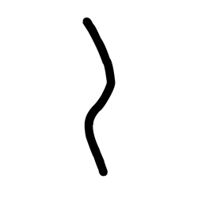
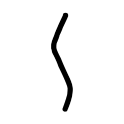
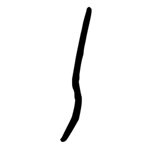
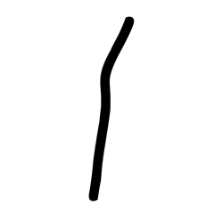
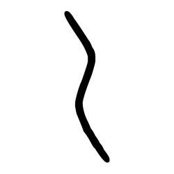
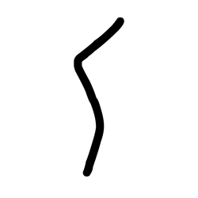
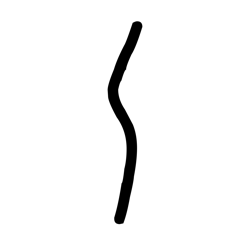
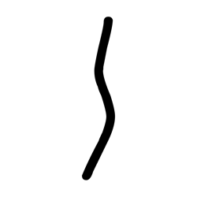
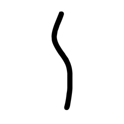
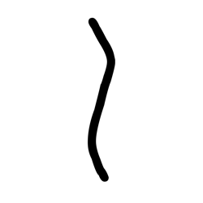

# Component Visual Gallery / 构件图像查看: obs-comp-cand-000049

English:
This page displays OBIMD subcharacter PNG assets extracted into this concrete
corpus object directory for human review.

简体中文：
本页展示抽取到当前具体 corpus 对象目录内的 OBIMD subcharacter PNG 资料，供人工复核使用。

Boundary / 边界：
dataset image candidate only; not a confirmed component form, not a component
assignment, and not a decipherment claim.
- not a confirmed component form
- not a component assignment
- not a decipherment claim

## Concrete Questions To Check / 具体待查问题

- Which local image should be opened first?
- 应先打开哪一张本地构件图像？
- Which source zip member anchors this image?
- 哪一个 source zip member 能定位这张图像？
- Which near-shape or variant comparison is still missing?
- 还缺哪些近形或异体比较？
- Which character or inscription context should be checked next?
- 下一步应核对哪些单字或卜辞上下文？
- What evidence is missing before a component assignment?
- 正式构件归属前还缺哪些证据？

## asset-011415

- source_zip_member: `Sub-character Images/jbgbxt897u/jbgbxt897u/3v7cvwdbgv.png`
- checksum_sha256: see `06_component-visual-index.csv`.
- review_status: `needs_human_visual_review`
- caution: source-marked review image only.

## asset-011416

- source_zip_member: `Sub-character Images/jbgbxt897u/jbgbxt897u/3vgsxhdm8x.png`
- checksum_sha256: see `06_component-visual-index.csv`.
- review_status: `needs_human_visual_review`
- caution: source-marked review image only.

## asset-011417

- source_zip_member: `Sub-character Images/jbgbxt897u/jbgbxt897u/4cnszgohey.png`
- checksum_sha256: see `06_component-visual-index.csv`.
- review_status: `needs_human_visual_review`
- caution: source-marked review image only.

## asset-011418

- source_zip_member: `Sub-character Images/jbgbxt897u/jbgbxt897u/4m5dnw5kct.png`
- checksum_sha256: see `06_component-visual-index.csv`.
- review_status: `needs_human_visual_review`
- caution: source-marked review image only.

## asset-011419

- source_zip_member: `Sub-character Images/jbgbxt897u/jbgbxt897u/4xagzllriz.png`
- checksum_sha256: see `06_component-visual-index.csv`.
- review_status: `needs_human_visual_review`
- caution: source-marked review image only.

## asset-011420

- source_zip_member: `Sub-character Images/jbgbxt897u/jbgbxt897u/78tu2qmopn.png`
- checksum_sha256: see `06_component-visual-index.csv`.
- review_status: `needs_human_visual_review`
- caution: source-marked review image only.

## asset-011421

- source_zip_member: `Sub-character Images/jbgbxt897u/jbgbxt897u/8v644vq3gm.png`
- checksum_sha256: see `06_component-visual-index.csv`.
- review_status: `needs_human_visual_review`
- caution: source-marked review image only.

## asset-011422

- source_zip_member: `Sub-character Images/jbgbxt897u/jbgbxt897u/a3q6fay6qv.png`
- checksum_sha256: see `06_component-visual-index.csv`.
- review_status: `needs_human_visual_review`
- caution: source-marked review image only.

## asset-011423

- source_zip_member: `Sub-character Images/jbgbxt897u/jbgbxt897u/byvcn6ydm1.png`
- checksum_sha256: see `06_component-visual-index.csv`.
- review_status: `needs_human_visual_review`
- caution: source-marked review image only.

## asset-011424

- source_zip_member: `Sub-character Images/jbgbxt897u/jbgbxt897u/c8cl3yucth.png`
- checksum_sha256: see `06_component-visual-index.csv`.
- review_status: `needs_human_visual_review`
- caution: source-marked review image only.

## asset-011425

- source_zip_member: `Sub-character Images/jbgbxt897u/jbgbxt897u/ek2qpuljaf.png`
- checksum_sha256: see `06_component-visual-index.csv`.
- review_status: `needs_human_visual_review`
- caution: source-marked review image only.

## asset-011426

- source_zip_member: `Sub-character Images/jbgbxt897u/jbgbxt897u/fh3j71tnfb.png`
- checksum_sha256: see `06_component-visual-index.csv`.
- review_status: `needs_human_visual_review`
- caution: source-marked review image only.

## asset-011427

- source_zip_member: `Sub-character Images/jbgbxt897u/jbgbxt897u/fx00ohm3i6.png`
- checksum_sha256: see `06_component-visual-index.csv`.
- review_status: `needs_human_visual_review`
- caution: source-marked review image only.

## asset-011428

- source_zip_member: `Sub-character Images/jbgbxt897u/jbgbxt897u/hcar9nz9p9.png`
- checksum_sha256: see `06_component-visual-index.csv`.
- review_status: `needs_human_visual_review`
- caution: source-marked review image only.

## asset-011429

- source_zip_member: `Sub-character Images/jbgbxt897u/jbgbxt897u/j7xfyict68.png`
- checksum_sha256: see `06_component-visual-index.csv`.
- review_status: `needs_human_visual_review`
- caution: source-marked review image only.

## asset-011430

- source_zip_member: `Sub-character Images/jbgbxt897u/jbgbxt897u/jbgbxt897u.png`
- checksum_sha256: see `06_component-visual-index.csv`.
- review_status: `needs_human_visual_review`
- caution: source-marked review image only.

## asset-011431

- source_zip_member: `Sub-character Images/jbgbxt897u/jbgbxt897u/jc5v6cjm3k.png`
- checksum_sha256: see `06_component-visual-index.csv`.
- review_status: `needs_human_visual_review`
- caution: source-marked review image only.

## asset-011432

- source_zip_member: `Sub-character Images/jbgbxt897u/jbgbxt897u/k651g2bvsd.png`
- checksum_sha256: see `06_component-visual-index.csv`.
- review_status: `needs_human_visual_review`
- caution: source-marked review image only.

## asset-011433

- source_zip_member: `Sub-character Images/jbgbxt897u/jbgbxt897u/mhmdow19a6.png`
- checksum_sha256: see `06_component-visual-index.csv`.
- review_status: `needs_human_visual_review`
- caution: source-marked review image only.

## asset-011434

- source_zip_member: `Sub-character Images/jbgbxt897u/jbgbxt897u/nb9dl1loh0.png`
- checksum_sha256: see `06_component-visual-index.csv`.
- review_status: `needs_human_visual_review`
- caution: source-marked review image only.

## asset-011435

- source_zip_member: `Sub-character Images/jbgbxt897u/jbgbxt897u/ps7d5g8af2.png`
- checksum_sha256: see `06_component-visual-index.csv`.
- review_status: `needs_human_visual_review`
- caution: source-marked review image only.

## asset-011436

- source_zip_member: `Sub-character Images/jbgbxt897u/jbgbxt897u/q3a0vu8kjp.png`
- checksum_sha256: see `06_component-visual-index.csv`.
- review_status: `needs_human_visual_review`
- caution: source-marked review image only.

## asset-011437

- source_zip_member: `Sub-character Images/jbgbxt897u/jbgbxt897u/s7i3cuwaed.png`
- checksum_sha256: see `06_component-visual-index.csv`.
- review_status: `needs_human_visual_review`
- caution: source-marked review image only.

## asset-011438

- source_zip_member: `Sub-character Images/jbgbxt897u/jbgbxt897u/slwbxwqs1p.png`
- checksum_sha256: see `06_component-visual-index.csv`.
- review_status: `needs_human_visual_review`
- caution: source-marked review image only.

## asset-011439

- source_zip_member: `Sub-character Images/jbgbxt897u/jbgbxt897u/u0v1awvw4x.png`
- checksum_sha256: see `06_component-visual-index.csv`.
- review_status: `needs_human_visual_review`
- caution: source-marked review image only.

## asset-011440

- source_zip_member: `Sub-character Images/jbgbxt897u/jbgbxt897u/u4rjgvkq05.png`
- checksum_sha256: see `06_component-visual-index.csv`.
- review_status: `needs_human_visual_review`
- caution: source-marked review image only.

## asset-011441

- source_zip_member: `Sub-character Images/jbgbxt897u/jbgbxt897u/v0soyzplxa.png`
- checksum_sha256: see `06_component-visual-index.csv`.
- review_status: `needs_human_visual_review`
- caution: source-marked review image only.

## asset-011442

- source_zip_member: `Sub-character Images/jbgbxt897u/jbgbxt897u/w3qi4olwor.png`
- checksum_sha256: see `06_component-visual-index.csv`.
- review_status: `needs_human_visual_review`
- caution: source-marked review image only.

## asset-011443

- source_zip_member: `Sub-character Images/jbgbxt897u/jbgbxt897u/ww91mwgygn.png`
- checksum_sha256: see `06_component-visual-index.csv`.
- review_status: `needs_human_visual_review`
- caution: source-marked review image only.

## asset-011444

- source_zip_member: `Sub-character Images/jbgbxt897u/jbgbxt897u/x3xxqemkkv.png`
- checksum_sha256: see `06_component-visual-index.csv`.
- review_status: `needs_human_visual_review`
- caution: source-marked review image only.

## asset-011445

- source_zip_member: `Sub-character Images/jbgbxt897u/jbgbxt897u/y00oz0jmkz.png`
- checksum_sha256: see `06_component-visual-index.csv`.
- review_status: `needs_human_visual_review`
- caution: source-marked review image only.
