# Component Visual Gallery / 构件图像查看: obs-comp-cand-000053

English:
This page displays OBIMD subcharacter PNG assets extracted into this concrete
corpus object directory for human review.

简体中文：
本页展示抽取到当前具体 corpus 对象目录内的 OBIMD subcharacter PNG 资料，供人工复核使用。

Boundary / 边界：
dataset image candidate only; not a confirmed component form, not a component
assignment, and not a decipherment claim.
- not a confirmed component form
- not a component assignment
- not a decipherment claim

## Concrete Questions To Check / 具体待查问题

- Which local image should be opened first?
- 应先打开哪一张本地构件图像？
- Which source zip member anchors this image?
- 哪一个 source zip member 能定位这张图像？
- Which near-shape or variant comparison is still missing?
- 还缺哪些近形或异体比较？
- Which character or inscription context should be checked next?
- 下一步应核对哪些单字或卜辞上下文？
- What evidence is missing before a component assignment?
- 正式构件归属前还缺哪些证据？

## asset-011449

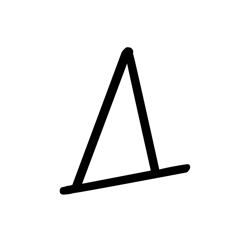

- source_zip_member: `Sub-character Images/pkibwuo4bv/tv3occt3a7/1v1pbhpn8j.png`
- checksum_sha256: see `06_component-visual-index.csv`.
- review_status: `needs_human_visual_review`
- caution: source-marked review image only.

## asset-011450

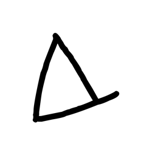

- source_zip_member: `Sub-character Images/pkibwuo4bv/tv3occt3a7/2av937dtja.png`
- checksum_sha256: see `06_component-visual-index.csv`.
- review_status: `needs_human_visual_review`
- caution: source-marked review image only.

## asset-011451

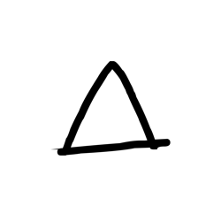

- source_zip_member: `Sub-character Images/pkibwuo4bv/tv3occt3a7/2qqe20gyqm.png`
- checksum_sha256: see `06_component-visual-index.csv`.
- review_status: `needs_human_visual_review`
- caution: source-marked review image only.

## asset-011452

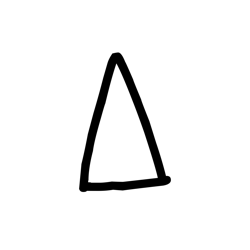

- source_zip_member: `Sub-character Images/pkibwuo4bv/tv3occt3a7/8m3e9oi7qt.png`
- checksum_sha256: see `06_component-visual-index.csv`.
- review_status: `needs_human_visual_review`
- caution: source-marked review image only.

## asset-011453

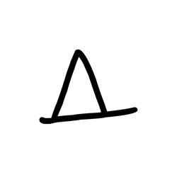

- source_zip_member: `Sub-character Images/pkibwuo4bv/tv3occt3a7/azxot8fio4.png`
- checksum_sha256: see `06_component-visual-index.csv`.
- review_status: `needs_human_visual_review`
- caution: source-marked review image only.

## asset-011454

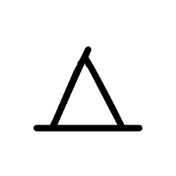

- source_zip_member: `Sub-character Images/pkibwuo4bv/tv3occt3a7/bwo0yl4io4.png`
- checksum_sha256: see `06_component-visual-index.csv`.
- review_status: `needs_human_visual_review`
- caution: source-marked review image only.

## asset-011455

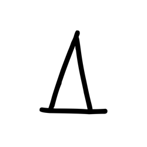

- source_zip_member: `Sub-character Images/pkibwuo4bv/tv3occt3a7/drsctqruww.png`
- checksum_sha256: see `06_component-visual-index.csv`.
- review_status: `needs_human_visual_review`
- caution: source-marked review image only.

## asset-011456

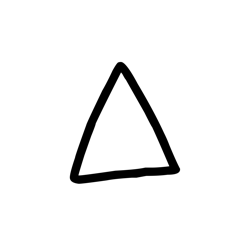

- source_zip_member: `Sub-character Images/pkibwuo4bv/tv3occt3a7/eoxeyimt01.png`
- checksum_sha256: see `06_component-visual-index.csv`.
- review_status: `needs_human_visual_review`
- caution: source-marked review image only.

## asset-011457

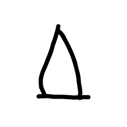

- source_zip_member: `Sub-character Images/pkibwuo4bv/tv3occt3a7/eur7x9j3id.png`
- checksum_sha256: see `06_component-visual-index.csv`.
- review_status: `needs_human_visual_review`
- caution: source-marked review image only.

## asset-011458

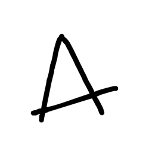

- source_zip_member: `Sub-character Images/pkibwuo4bv/tv3occt3a7/ght6d140f1.png`
- checksum_sha256: see `06_component-visual-index.csv`.
- review_status: `needs_human_visual_review`
- caution: source-marked review image only.

## asset-011459

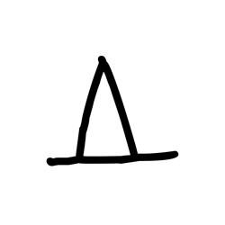

- source_zip_member: `Sub-character Images/pkibwuo4bv/tv3occt3a7/ijso4ov9q2.png`
- checksum_sha256: see `06_component-visual-index.csv`.
- review_status: `needs_human_visual_review`
- caution: source-marked review image only.

## asset-011460

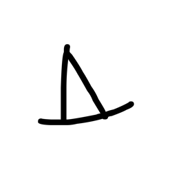

- source_zip_member: `Sub-character Images/pkibwuo4bv/tv3occt3a7/njdmzdqtsr.png`
- checksum_sha256: see `06_component-visual-index.csv`.
- review_status: `needs_human_visual_review`
- caution: source-marked review image only.

## asset-011461

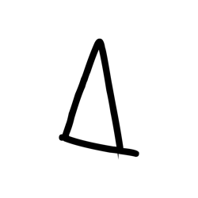

- source_zip_member: `Sub-character Images/pkibwuo4bv/tv3occt3a7/q538o6np3n.png`
- checksum_sha256: see `06_component-visual-index.csv`.
- review_status: `needs_human_visual_review`
- caution: source-marked review image only.

## asset-011462

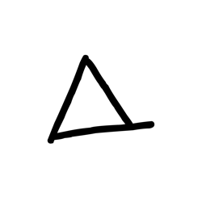

- source_zip_member: `Sub-character Images/pkibwuo4bv/tv3occt3a7/tpb70wzc7g.png`
- checksum_sha256: see `06_component-visual-index.csv`.
- review_status: `needs_human_visual_review`
- caution: source-marked review image only.

## asset-011463

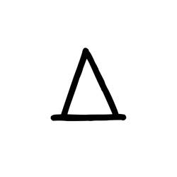

- source_zip_member: `Sub-character Images/pkibwuo4bv/tv3occt3a7/tv3occt3a7.png`
- checksum_sha256: see `06_component-visual-index.csv`.
- review_status: `needs_human_visual_review`
- caution: source-marked review image only.
