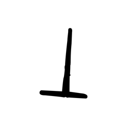
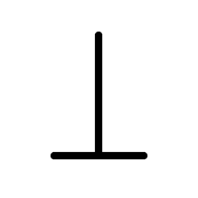
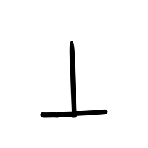
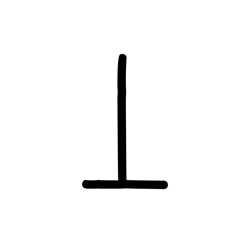

# Component Visual Gallery / 构件图像查看: obs-comp-cand-000054

English:
This page displays OBIMD subcharacter PNG assets extracted into this concrete corpus object directory for human review.

简体中文：
本页展示抽取到当前具体 corpus 对象目录内的 OBIMD subcharacter PNG 资料，供人工复核使用。

Boundary / 边界：dataset image candidate only; not a confirmed component form, component assignment, or decipherment claim.

## asset-011464

- source_zip_member: `Sub-character Images/pkibwuo4bv/h8jm2odi3q/5h85dol85n.png`
- checksum_sha256: `203f92c6bbfd818e219cdf2d32b73ecdb4fbbf262a64667ff138fe1573484b2f`
- review_status: `needs_human_visual_review`
- caution: OBIMD subcharacter image is a source-marked review asset only; it is not a confirmed component form, component assignment, or decipherment conclusion.

## asset-011465

- source_zip_member: `Sub-character Images/pkibwuo4bv/h8jm2odi3q/h8jm2odi3q.png`
- checksum_sha256: `6fc9777e444b36f6f67f6525cfd65c8c9aa130e4d772d12cad3e8371c40fe5b7`
- review_status: `needs_human_visual_review`
- caution: OBIMD subcharacter image is a source-marked review asset only; it is not a confirmed component form, component assignment, or decipherment conclusion.

## asset-011466

- source_zip_member: `Sub-character Images/pkibwuo4bv/h8jm2odi3q/npy2ye6o6e.png`
- checksum_sha256: `076f0c7f9116aa4d18ed010a7590a42737add7712cf5aae2ca247f99e6a1835d`
- review_status: `needs_human_visual_review`
- caution: OBIMD subcharacter image is a source-marked review asset only; it is not a confirmed component form, component assignment, or decipherment conclusion.

## asset-011467

- source_zip_member: `Sub-character Images/pkibwuo4bv/h8jm2odi3q/tt6bc1zglc.png`
- checksum_sha256: `a002567ab00be031c593a39bd54d0d13d7331f1bef04a8ab6fc714f5cd2f1d57`
- review_status: `needs_human_visual_review`
- caution: OBIMD subcharacter image is a source-marked review asset only; it is not a confirmed component form, component assignment, or decipherment conclusion.
