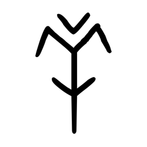

# Component Visual Gallery / 构件图像查看: obs-comp-cand-000071

English:
This page displays OBIMD subcharacter PNG assets extracted into this concrete corpus object directory for human review.

简体中文：
本页展示抽取到当前具体 corpus 对象目录内的 OBIMD subcharacter PNG 资料，供人工复核使用。

Boundary / 边界：dataset image candidate only; not a confirmed component form, component assignment, or decipherment claim.

## asset-011483

- source_zip_member: `Sub-character Images/nscqmvthk1/oky3iml3ww/oky3iml3ww.png`
- checksum_sha256: `2ef8373ace4b8bceca54d72d98b3e826cb6119caaad5cdc457d9c28408ccd147`
- review_status: `needs_human_visual_review`
- caution: OBIMD subcharacter image is a source-marked review asset only; it is not a confirmed component form, component assignment, or decipherment conclusion.
