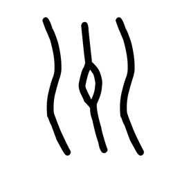

# Component Visual Gallery / 构件图像查看: obs-comp-cand-000132

English:
This page displays OBIMD subcharacter PNG assets extracted into this concrete corpus object directory for human review.

简体中文：
本页展示抽取到当前具体 corpus 对象目录内的 OBIMD subcharacter PNG 资料，供人工复核使用。

Boundary / 边界：dataset image candidate only; not a confirmed component form, component assignment, or decipherment claim.

## asset-011544

- source_zip_member: `Sub-character Images/o080wcrzq5/o080wcrzq5/o080wcrzq5.png`
- checksum_sha256: `cf3976c1e29500fc6f023b8deda30c2d84ce6d62d9d5663445c62e1a9c86150f`
- review_status: `needs_human_visual_review`
- caution: OBIMD subcharacter image is a source-marked review asset only; it is not a confirmed component form, component assignment, or decipherment conclusion.
