# Component Visual Gallery / 构件图像查看: obs-comp-cand-000186

English:
This page displays OBIMD subcharacter PNG assets extracted into this concrete
corpus object directory for human review.

简体中文：
本页展示抽取到当前具体 corpus 对象目录内的 OBIMD subcharacter PNG 资料，供人工复核使用。

Boundary / 边界：
dataset image candidate only; not a confirmed component form, not a component
assignment, and not a decipherment claim.
- not a confirmed component form
- not a component assignment
- not a decipherment claim

## Concrete Questions To Check / 具体待查问题

- Which local image should be opened first?
- 应先打开哪一张本地构件图像？
- Which source zip member anchors this image?
- 哪一个 source zip member 能定位这张图像？
- Which near-shape or variant comparison is still missing?
- 还缺哪些近形或异体比较？
- Which character or inscription context should be checked next?
- 下一步应核对哪些单字或卜辞上下文？
- What evidence is missing before a component assignment?
- 正式构件归属前还缺哪些证据？

## asset-011598

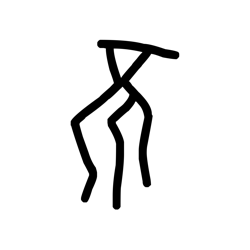

- source_zip_member: `Sub-character Images/h2mhpxskhk/h2mhpxskhk/0w9lg11bab.png`
- checksum_sha256: see `06_component-visual-index.csv`.
- review_status: `needs_human_visual_review`
- caution: source-marked review image only.

## asset-011599

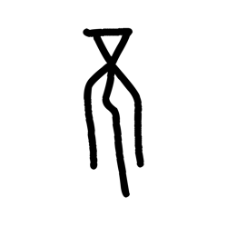

- source_zip_member: `Sub-character Images/h2mhpxskhk/h2mhpxskhk/14ttdm4pv9.png`
- checksum_sha256: see `06_component-visual-index.csv`.
- review_status: `needs_human_visual_review`
- caution: source-marked review image only.

## asset-011600

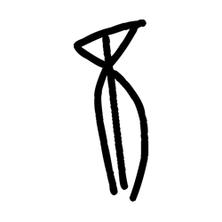

- source_zip_member: `Sub-character Images/h2mhpxskhk/h2mhpxskhk/1g9tolrkey.png`
- checksum_sha256: see `06_component-visual-index.csv`.
- review_status: `needs_human_visual_review`
- caution: source-marked review image only.

## asset-011601

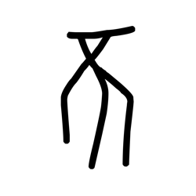

- source_zip_member: `Sub-character Images/h2mhpxskhk/h2mhpxskhk/1kngis80n9.png`
- checksum_sha256: see `06_component-visual-index.csv`.
- review_status: `needs_human_visual_review`
- caution: source-marked review image only.

## asset-011602

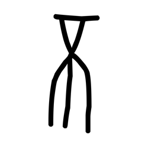

- source_zip_member: `Sub-character Images/h2mhpxskhk/h2mhpxskhk/20pdk9inhc.png`
- checksum_sha256: see `06_component-visual-index.csv`.
- review_status: `needs_human_visual_review`
- caution: source-marked review image only.

## asset-011603

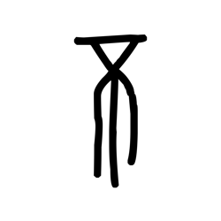

- source_zip_member: `Sub-character Images/h2mhpxskhk/h2mhpxskhk/3k31s2kyjs.png`
- checksum_sha256: see `06_component-visual-index.csv`.
- review_status: `needs_human_visual_review`
- caution: source-marked review image only.

## asset-011604

- source_zip_member: `Sub-character Images/h2mhpxskhk/h2mhpxskhk/3sw6nifyax.png`
- checksum_sha256: see `06_component-visual-index.csv`.
- review_status: `needs_human_visual_review`
- caution: source-marked review image only.

## asset-011605

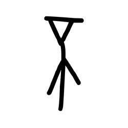

- source_zip_member: `Sub-character Images/h2mhpxskhk/h2mhpxskhk/4qmxcwrh82.png`
- checksum_sha256: see `06_component-visual-index.csv`.
- review_status: `needs_human_visual_review`
- caution: source-marked review image only.

## asset-011606

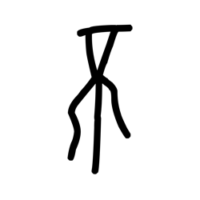

- source_zip_member: `Sub-character Images/h2mhpxskhk/h2mhpxskhk/5gd7fsbp9b.png`
- checksum_sha256: see `06_component-visual-index.csv`.
- review_status: `needs_human_visual_review`
- caution: source-marked review image only.

## asset-011607

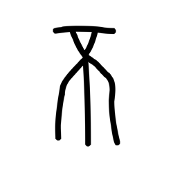

- source_zip_member: `Sub-character Images/h2mhpxskhk/h2mhpxskhk/5ndrwnoj7r.png`
- checksum_sha256: see `06_component-visual-index.csv`.
- review_status: `needs_human_visual_review`
- caution: source-marked review image only.

## asset-011608

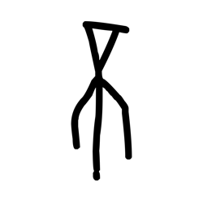

- source_zip_member: `Sub-character Images/h2mhpxskhk/h2mhpxskhk/5oxufx28vu.png`
- checksum_sha256: see `06_component-visual-index.csv`.
- review_status: `needs_human_visual_review`
- caution: source-marked review image only.

## asset-011609

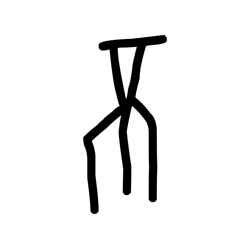

- source_zip_member: `Sub-character Images/h2mhpxskhk/h2mhpxskhk/63qeux54on.png`
- checksum_sha256: see `06_component-visual-index.csv`.
- review_status: `needs_human_visual_review`
- caution: source-marked review image only.

## asset-011610

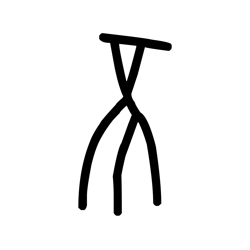

- source_zip_member: `Sub-character Images/h2mhpxskhk/h2mhpxskhk/6ar5x687mx.png`
- checksum_sha256: see `06_component-visual-index.csv`.
- review_status: `needs_human_visual_review`
- caution: source-marked review image only.

## asset-011611

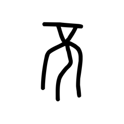

- source_zip_member: `Sub-character Images/h2mhpxskhk/h2mhpxskhk/7h2kctqcmi.png`
- checksum_sha256: see `06_component-visual-index.csv`.
- review_status: `needs_human_visual_review`
- caution: source-marked review image only.

## asset-011612

- source_zip_member: `Sub-character Images/h2mhpxskhk/h2mhpxskhk/844smquw43.png`
- checksum_sha256: see `06_component-visual-index.csv`.
- review_status: `needs_human_visual_review`
- caution: source-marked review image only.

## asset-011613

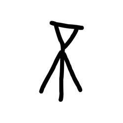

- source_zip_member: `Sub-character Images/h2mhpxskhk/h2mhpxskhk/857gsme3o4.png`
- checksum_sha256: see `06_component-visual-index.csv`.
- review_status: `needs_human_visual_review`
- caution: source-marked review image only.

## asset-011614

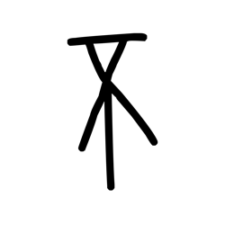

- source_zip_member: `Sub-character Images/h2mhpxskhk/h2mhpxskhk/8hs0ymq8x3.png`
- checksum_sha256: see `06_component-visual-index.csv`.
- review_status: `needs_human_visual_review`
- caution: source-marked review image only.

## asset-011615

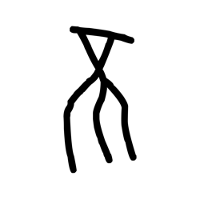

- source_zip_member: `Sub-character Images/h2mhpxskhk/h2mhpxskhk/8teiovqvam.png`
- checksum_sha256: see `06_component-visual-index.csv`.
- review_status: `needs_human_visual_review`
- caution: source-marked review image only.

## asset-011616

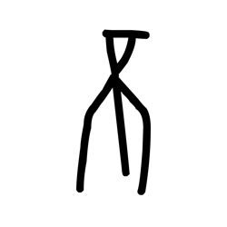

- source_zip_member: `Sub-character Images/h2mhpxskhk/h2mhpxskhk/99udt17qj8.png`
- checksum_sha256: see `06_component-visual-index.csv`.
- review_status: `needs_human_visual_review`
- caution: source-marked review image only.

## asset-011617

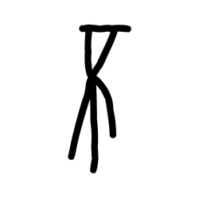

- source_zip_member: `Sub-character Images/h2mhpxskhk/h2mhpxskhk/9n7r8tmqeu.png`
- checksum_sha256: see `06_component-visual-index.csv`.
- review_status: `needs_human_visual_review`
- caution: source-marked review image only.

## asset-011618

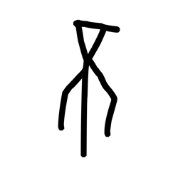

- source_zip_member: `Sub-character Images/h2mhpxskhk/h2mhpxskhk/9wbqbzmiix.png`
- checksum_sha256: see `06_component-visual-index.csv`.
- review_status: `needs_human_visual_review`
- caution: source-marked review image only.

## asset-011619

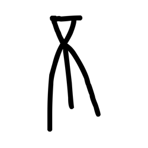

- source_zip_member: `Sub-character Images/h2mhpxskhk/h2mhpxskhk/b7vmijcz7r.png`
- checksum_sha256: see `06_component-visual-index.csv`.
- review_status: `needs_human_visual_review`
- caution: source-marked review image only.

## asset-011620

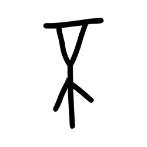

- source_zip_member: `Sub-character Images/h2mhpxskhk/h2mhpxskhk/bo8eqn37nz.png`
- checksum_sha256: see `06_component-visual-index.csv`.
- review_status: `needs_human_visual_review`
- caution: source-marked review image only.

## asset-011621

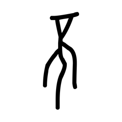

- source_zip_member: `Sub-character Images/h2mhpxskhk/h2mhpxskhk/btj6wuetkd.png`
- checksum_sha256: see `06_component-visual-index.csv`.
- review_status: `needs_human_visual_review`
- caution: source-marked review image only.

## asset-011622

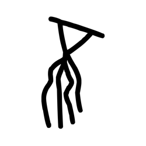

- source_zip_member: `Sub-character Images/h2mhpxskhk/h2mhpxskhk/by1aaw1riq.png`
- checksum_sha256: see `06_component-visual-index.csv`.
- review_status: `needs_human_visual_review`
- caution: source-marked review image only.

## asset-011623

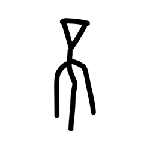

- source_zip_member: `Sub-character Images/h2mhpxskhk/h2mhpxskhk/c5ujmycgmh.png`
- checksum_sha256: see `06_component-visual-index.csv`.
- review_status: `needs_human_visual_review`
- caution: source-marked review image only.

## asset-011624

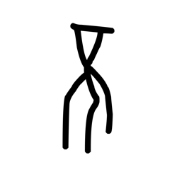

- source_zip_member: `Sub-character Images/h2mhpxskhk/h2mhpxskhk/cttpvt5guc.png`
- checksum_sha256: see `06_component-visual-index.csv`.
- review_status: `needs_human_visual_review`
- caution: source-marked review image only.

## asset-011625

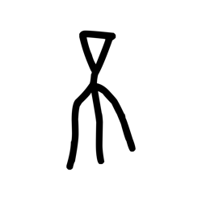

- source_zip_member: `Sub-character Images/h2mhpxskhk/h2mhpxskhk/ctv82ea0hn.png`
- checksum_sha256: see `06_component-visual-index.csv`.
- review_status: `needs_human_visual_review`
- caution: source-marked review image only.

## asset-011626

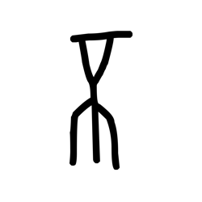

- source_zip_member: `Sub-character Images/h2mhpxskhk/h2mhpxskhk/cygks5cx4y.png`
- checksum_sha256: see `06_component-visual-index.csv`.
- review_status: `needs_human_visual_review`
- caution: source-marked review image only.

## asset-011627

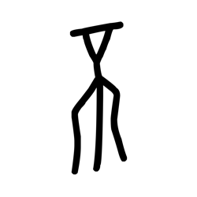

- source_zip_member: `Sub-character Images/h2mhpxskhk/h2mhpxskhk/d26pvrfzyg.png`
- checksum_sha256: see `06_component-visual-index.csv`.
- review_status: `needs_human_visual_review`
- caution: source-marked review image only.

## asset-011628

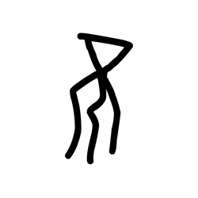

- source_zip_member: `Sub-character Images/h2mhpxskhk/h2mhpxskhk/d3nyn2wgut.png`
- checksum_sha256: see `06_component-visual-index.csv`.
- review_status: `needs_human_visual_review`
- caution: source-marked review image only.

## asset-011629

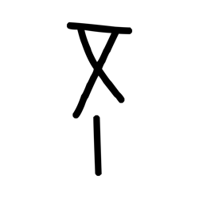

- source_zip_member: `Sub-character Images/h2mhpxskhk/h2mhpxskhk/du83dplyhm.png`
- checksum_sha256: see `06_component-visual-index.csv`.
- review_status: `needs_human_visual_review`
- caution: source-marked review image only.

## asset-011630

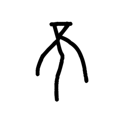

- source_zip_member: `Sub-character Images/h2mhpxskhk/h2mhpxskhk/dui9lak629.png`
- checksum_sha256: see `06_component-visual-index.csv`.
- review_status: `needs_human_visual_review`
- caution: source-marked review image only.

## asset-011631

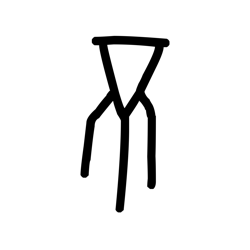

- source_zip_member: `Sub-character Images/h2mhpxskhk/h2mhpxskhk/dy11i9zhto.png`
- checksum_sha256: see `06_component-visual-index.csv`.
- review_status: `needs_human_visual_review`
- caution: source-marked review image only.

## asset-011632

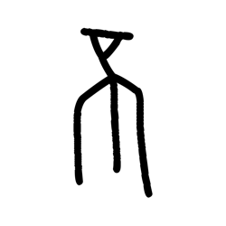

- source_zip_member: `Sub-character Images/h2mhpxskhk/h2mhpxskhk/ehvp3abmo8.png`
- checksum_sha256: see `06_component-visual-index.csv`.
- review_status: `needs_human_visual_review`
- caution: source-marked review image only.

## asset-011633

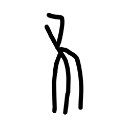

- source_zip_member: `Sub-character Images/h2mhpxskhk/h2mhpxskhk/epjeumc4h3.png`
- checksum_sha256: see `06_component-visual-index.csv`.
- review_status: `needs_human_visual_review`
- caution: source-marked review image only.

## asset-011634

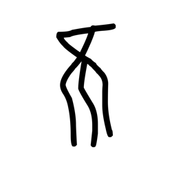

- source_zip_member: `Sub-character Images/h2mhpxskhk/h2mhpxskhk/ffs94w8jyk.png`
- checksum_sha256: see `06_component-visual-index.csv`.
- review_status: `needs_human_visual_review`
- caution: source-marked review image only.

## asset-011635

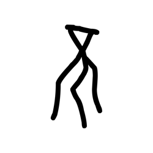

- source_zip_member: `Sub-character Images/h2mhpxskhk/h2mhpxskhk/fgceqw669g.png`
- checksum_sha256: see `06_component-visual-index.csv`.
- review_status: `needs_human_visual_review`
- caution: source-marked review image only.

## asset-011636

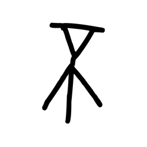

- source_zip_member: `Sub-character Images/h2mhpxskhk/h2mhpxskhk/g132aov6dp.png`
- checksum_sha256: see `06_component-visual-index.csv`.
- review_status: `needs_human_visual_review`
- caution: source-marked review image only.

## asset-011637

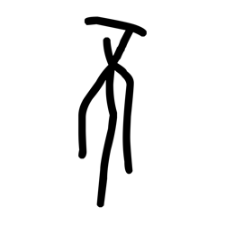

- source_zip_member: `Sub-character Images/h2mhpxskhk/h2mhpxskhk/g648p6rro7.png`
- checksum_sha256: see `06_component-visual-index.csv`.
- review_status: `needs_human_visual_review`
- caution: source-marked review image only.

## asset-011638

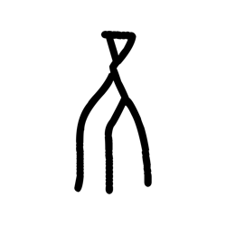

- source_zip_member: `Sub-character Images/h2mhpxskhk/h2mhpxskhk/g96k2j84vf.png`
- checksum_sha256: see `06_component-visual-index.csv`.
- review_status: `needs_human_visual_review`
- caution: source-marked review image only.

## asset-011639

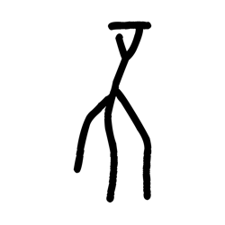

- source_zip_member: `Sub-character Images/h2mhpxskhk/h2mhpxskhk/gtaie2xdua.png`
- checksum_sha256: see `06_component-visual-index.csv`.
- review_status: `needs_human_visual_review`
- caution: source-marked review image only.

## asset-011640

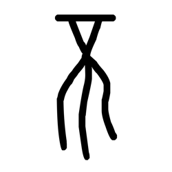

- source_zip_member: `Sub-character Images/h2mhpxskhk/h2mhpxskhk/h2mhpxskhk.png`
- checksum_sha256: see `06_component-visual-index.csv`.
- review_status: `needs_human_visual_review`
- caution: source-marked review image only.

## asset-011641

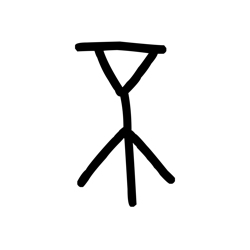

- source_zip_member: `Sub-character Images/h2mhpxskhk/h2mhpxskhk/he0daxfc3f.png`
- checksum_sha256: see `06_component-visual-index.csv`.
- review_status: `needs_human_visual_review`
- caution: source-marked review image only.

## asset-011642

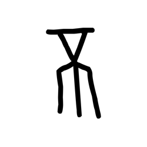

- source_zip_member: `Sub-character Images/h2mhpxskhk/h2mhpxskhk/hy6oo8kmqk.png`
- checksum_sha256: see `06_component-visual-index.csv`.
- review_status: `needs_human_visual_review`
- caution: source-marked review image only.

## asset-011643

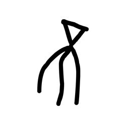

- source_zip_member: `Sub-character Images/h2mhpxskhk/h2mhpxskhk/i5st6zehii.png`
- checksum_sha256: see `06_component-visual-index.csv`.
- review_status: `needs_human_visual_review`
- caution: source-marked review image only.

## asset-011644

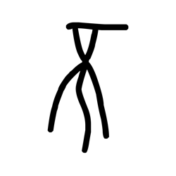

- source_zip_member: `Sub-character Images/h2mhpxskhk/h2mhpxskhk/iqhauziea8.png`
- checksum_sha256: see `06_component-visual-index.csv`.
- review_status: `needs_human_visual_review`
- caution: source-marked review image only.

## asset-011645

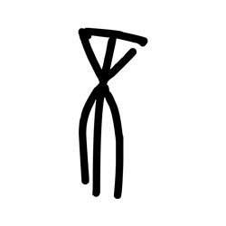

- source_zip_member: `Sub-character Images/h2mhpxskhk/h2mhpxskhk/kbwvukar2s.png`
- checksum_sha256: see `06_component-visual-index.csv`.
- review_status: `needs_human_visual_review`
- caution: source-marked review image only.

## asset-011646

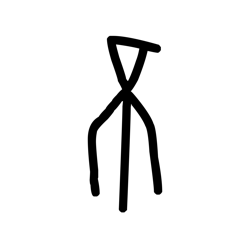

- source_zip_member: `Sub-character Images/h2mhpxskhk/h2mhpxskhk/khr1jnpc8o.png`
- checksum_sha256: see `06_component-visual-index.csv`.
- review_status: `needs_human_visual_review`
- caution: source-marked review image only.

## asset-011647

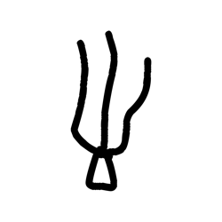

- source_zip_member: `Sub-character Images/h2mhpxskhk/h2mhpxskhk/ki8m15ousb.png`
- checksum_sha256: see `06_component-visual-index.csv`.
- review_status: `needs_human_visual_review`
- caution: source-marked review image only.

## asset-011648

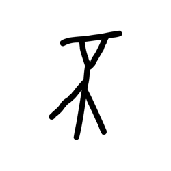

- source_zip_member: `Sub-character Images/h2mhpxskhk/h2mhpxskhk/kiqing51ci.png`
- checksum_sha256: see `06_component-visual-index.csv`.
- review_status: `needs_human_visual_review`
- caution: source-marked review image only.

## asset-011649

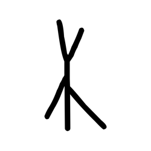

- source_zip_member: `Sub-character Images/h2mhpxskhk/h2mhpxskhk/kw3t0e6uqs.png`
- checksum_sha256: see `06_component-visual-index.csv`.
- review_status: `needs_human_visual_review`
- caution: source-marked review image only.

## asset-011650

- source_zip_member: `Sub-character Images/h2mhpxskhk/h2mhpxskhk/le17sapbou.png`
- checksum_sha256: see `06_component-visual-index.csv`.
- review_status: `needs_human_visual_review`
- caution: source-marked review image only.

## asset-011651

- source_zip_member: `Sub-character Images/h2mhpxskhk/h2mhpxskhk/lworcb8z6j.png`
- checksum_sha256: see `06_component-visual-index.csv`.
- review_status: `needs_human_visual_review`
- caution: source-marked review image only.

## asset-011652

- source_zip_member: `Sub-character Images/h2mhpxskhk/h2mhpxskhk/ml3y7fxs60.png`
- checksum_sha256: see `06_component-visual-index.csv`.
- review_status: `needs_human_visual_review`
- caution: source-marked review image only.

## asset-011653

- source_zip_member: `Sub-character Images/h2mhpxskhk/h2mhpxskhk/mnbv7ynmpu.png`
- checksum_sha256: see `06_component-visual-index.csv`.
- review_status: `needs_human_visual_review`
- caution: source-marked review image only.

## asset-011654

- source_zip_member: `Sub-character Images/h2mhpxskhk/h2mhpxskhk/mshbtktwco.png`
- checksum_sha256: see `06_component-visual-index.csv`.
- review_status: `needs_human_visual_review`
- caution: source-marked review image only.

## asset-011655

- source_zip_member: `Sub-character Images/h2mhpxskhk/h2mhpxskhk/mu9ldkaawp.png`
- checksum_sha256: see `06_component-visual-index.csv`.
- review_status: `needs_human_visual_review`
- caution: source-marked review image only.

## asset-011656

- source_zip_member: `Sub-character Images/h2mhpxskhk/h2mhpxskhk/n47xsnvtlf.png`
- checksum_sha256: see `06_component-visual-index.csv`.
- review_status: `needs_human_visual_review`
- caution: source-marked review image only.

## asset-011657

- source_zip_member: `Sub-character Images/h2mhpxskhk/h2mhpxskhk/nrzjte7cz0.png`
- checksum_sha256: see `06_component-visual-index.csv`.
- review_status: `needs_human_visual_review`
- caution: source-marked review image only.

## asset-011658

- source_zip_member: `Sub-character Images/h2mhpxskhk/h2mhpxskhk/o9mp5rt0gh.png`
- checksum_sha256: see `06_component-visual-index.csv`.
- review_status: `needs_human_visual_review`
- caution: source-marked review image only.

## asset-011659

- source_zip_member: `Sub-character Images/h2mhpxskhk/h2mhpxskhk/ohyxll3w6t.png`
- checksum_sha256: see `06_component-visual-index.csv`.
- review_status: `needs_human_visual_review`
- caution: source-marked review image only.

## asset-011660

- source_zip_member: `Sub-character Images/h2mhpxskhk/h2mhpxskhk/pbhx2prsp3.png`
- checksum_sha256: see `06_component-visual-index.csv`.
- review_status: `needs_human_visual_review`
- caution: source-marked review image only.

## asset-011661

- source_zip_member: `Sub-character Images/h2mhpxskhk/h2mhpxskhk/pptzj4cgta.png`
- checksum_sha256: see `06_component-visual-index.csv`.
- review_status: `needs_human_visual_review`
- caution: source-marked review image only.

## asset-011662

- source_zip_member: `Sub-character Images/h2mhpxskhk/h2mhpxskhk/qogbdy8ghe.png`
- checksum_sha256: see `06_component-visual-index.csv`.
- review_status: `needs_human_visual_review`
- caution: source-marked review image only.

## asset-011663

- source_zip_member: `Sub-character Images/h2mhpxskhk/h2mhpxskhk/rd7w6onbk1.png`
- checksum_sha256: see `06_component-visual-index.csv`.
- review_status: `needs_human_visual_review`
- caution: source-marked review image only.

## asset-011664

- source_zip_member: `Sub-character Images/h2mhpxskhk/h2mhpxskhk/s3w6lvhzoy.png`
- checksum_sha256: see `06_component-visual-index.csv`.
- review_status: `needs_human_visual_review`
- caution: source-marked review image only.

## asset-011665

- source_zip_member: `Sub-character Images/h2mhpxskhk/h2mhpxskhk/sn3a8hexhy.png`
- checksum_sha256: see `06_component-visual-index.csv`.
- review_status: `needs_human_visual_review`
- caution: source-marked review image only.

## asset-011666

- source_zip_member: `Sub-character Images/h2mhpxskhk/h2mhpxskhk/so223vitwy.png`
- checksum_sha256: see `06_component-visual-index.csv`.
- review_status: `needs_human_visual_review`
- caution: source-marked review image only.

## asset-011667

- source_zip_member: `Sub-character Images/h2mhpxskhk/h2mhpxskhk/tjkauh0c62.png`
- checksum_sha256: see `06_component-visual-index.csv`.
- review_status: `needs_human_visual_review`
- caution: source-marked review image only.

## asset-011668

- source_zip_member: `Sub-character Images/h2mhpxskhk/h2mhpxskhk/uan3b99904.png`
- checksum_sha256: see `06_component-visual-index.csv`.
- review_status: `needs_human_visual_review`
- caution: source-marked review image only.

## asset-011669

- source_zip_member: `Sub-character Images/h2mhpxskhk/h2mhpxskhk/ucoquod3zp.png`
- checksum_sha256: see `06_component-visual-index.csv`.
- review_status: `needs_human_visual_review`
- caution: source-marked review image only.

## asset-011670

- source_zip_member: `Sub-character Images/h2mhpxskhk/h2mhpxskhk/w4o5u7v83z.png`
- checksum_sha256: see `06_component-visual-index.csv`.
- review_status: `needs_human_visual_review`
- caution: source-marked review image only.

## asset-011671

- source_zip_member: `Sub-character Images/h2mhpxskhk/h2mhpxskhk/wm888qfwcj.png`
- checksum_sha256: see `06_component-visual-index.csv`.
- review_status: `needs_human_visual_review`
- caution: source-marked review image only.

## asset-011672

- source_zip_member: `Sub-character Images/h2mhpxskhk/h2mhpxskhk/ws57ciwyyw.png`
- checksum_sha256: see `06_component-visual-index.csv`.
- review_status: `needs_human_visual_review`
- caution: source-marked review image only.

## asset-011673

- source_zip_member: `Sub-character Images/h2mhpxskhk/h2mhpxskhk/wz9clpfpf4.png`
- checksum_sha256: see `06_component-visual-index.csv`.
- review_status: `needs_human_visual_review`
- caution: source-marked review image only.

## asset-011674

- source_zip_member: `Sub-character Images/h2mhpxskhk/h2mhpxskhk/xbs8nxpd3w.png`
- checksum_sha256: see `06_component-visual-index.csv`.
- review_status: `needs_human_visual_review`
- caution: source-marked review image only.

## asset-011675

- source_zip_member: `Sub-character Images/h2mhpxskhk/h2mhpxskhk/xu1u02r96g.png`
- checksum_sha256: see `06_component-visual-index.csv`.
- review_status: `needs_human_visual_review`
- caution: source-marked review image only.

## asset-011676

- source_zip_member: `Sub-character Images/h2mhpxskhk/h2mhpxskhk/xwsijre78e.png`
- checksum_sha256: see `06_component-visual-index.csv`.
- review_status: `needs_human_visual_review`
- caution: source-marked review image only.

## asset-011677

- source_zip_member: `Sub-character Images/h2mhpxskhk/h2mhpxskhk/yms5w74j77.png`
- checksum_sha256: see `06_component-visual-index.csv`.
- review_status: `needs_human_visual_review`
- caution: source-marked review image only.

## asset-011678

- source_zip_member: `Sub-character Images/h2mhpxskhk/h2mhpxskhk/ziql3xv49v.png`
- checksum_sha256: see `06_component-visual-index.csv`.
- review_status: `needs_human_visual_review`
- caution: source-marked review image only.

## asset-011679

- source_zip_member: `Sub-character Images/h2mhpxskhk/h2mhpxskhk/zpbl6vice0.png`
- checksum_sha256: see `06_component-visual-index.csv`.
- review_status: `needs_human_visual_review`
- caution: source-marked review image only.
