# Component Visual Gallery / 构件图像查看: obs-comp-cand-000189

English:
This page displays OBIMD subcharacter PNG assets extracted into this concrete corpus object directory for human review.

简体中文：
本页展示抽取到当前具体 corpus 对象目录内的 OBIMD subcharacter PNG 资料，供人工复核使用。

Boundary / 边界：dataset image candidate only; not a confirmed component form, component assignment, or decipherment claim.

## asset-011682

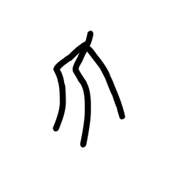

- source_zip_member: `Sub-character Images/h2mhpxskhk/xw3dfo77bt/0685dbdcan.png`
- checksum_sha256: `2285e987fe2140588df69d568ae163924fac8a257b277cf72ae6bc4120a96683`
- review_status: `needs_human_visual_review`
- caution: OBIMD subcharacter image is a source-marked review asset only; it is not a confirmed component form, component assignment, or decipherment conclusion.

## asset-011683

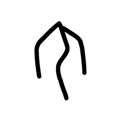

- source_zip_member: `Sub-character Images/h2mhpxskhk/xw3dfo77bt/1ko7k4dxt3.png`
- checksum_sha256: `7c265fa94e3ed09c070168153e9117ddd55444a85dc14912e48e112562a65704`
- review_status: `needs_human_visual_review`
- caution: OBIMD subcharacter image is a source-marked review asset only; it is not a confirmed component form, component assignment, or decipherment conclusion.

## asset-011684

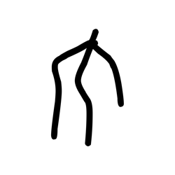

- source_zip_member: `Sub-character Images/h2mhpxskhk/xw3dfo77bt/1oj47vvt3t.png`
- checksum_sha256: `7626ce81848bcb1341f3c6c293741df023a26ed07710879b55691e1543141acd`
- review_status: `needs_human_visual_review`
- caution: OBIMD subcharacter image is a source-marked review asset only; it is not a confirmed component form, component assignment, or decipherment conclusion.

## asset-011685

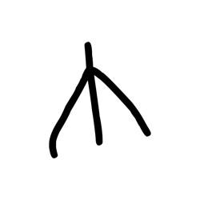

- source_zip_member: `Sub-character Images/h2mhpxskhk/xw3dfo77bt/20l5qd8ig8.png`
- checksum_sha256: `7e4d050fbbba8c6ee2bb605e33e5e9cb3f24c10d10055a1802a8f1e6a2417e14`
- review_status: `needs_human_visual_review`
- caution: OBIMD subcharacter image is a source-marked review asset only; it is not a confirmed component form, component assignment, or decipherment conclusion.

## asset-011686

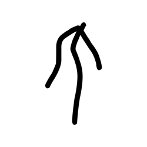

- source_zip_member: `Sub-character Images/h2mhpxskhk/xw3dfo77bt/2fdwhxo7gj.png`
- checksum_sha256: `7a35355c9a0f2650e7318ab3797882d9963db27da9caf606793d5c8e54726a2a`
- review_status: `needs_human_visual_review`
- caution: OBIMD subcharacter image is a source-marked review asset only; it is not a confirmed component form, component assignment, or decipherment conclusion.

## asset-011687

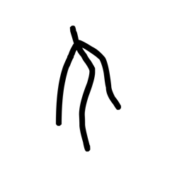

- source_zip_member: `Sub-character Images/h2mhpxskhk/xw3dfo77bt/3bp1sgu841.png`
- checksum_sha256: `380b36390d60ce85723a7c4d3c7004a92c90e34a39f4e0e0461febce292d2133`
- review_status: `needs_human_visual_review`
- caution: OBIMD subcharacter image is a source-marked review asset only; it is not a confirmed component form, component assignment, or decipherment conclusion.

## asset-011688

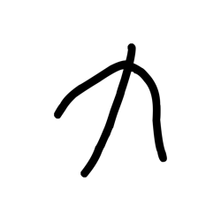

- source_zip_member: `Sub-character Images/h2mhpxskhk/xw3dfo77bt/3n5bj6wmyg.png`
- checksum_sha256: `77379d47e38be02eb0835c7bf8cd1ef41455ba81d01f1ffb9792d5963c8e0c68`
- review_status: `needs_human_visual_review`
- caution: OBIMD subcharacter image is a source-marked review asset only; it is not a confirmed component form, component assignment, or decipherment conclusion.

## asset-011689

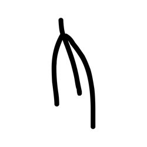

- source_zip_member: `Sub-character Images/h2mhpxskhk/xw3dfo77bt/4x6jeeg33x.png`
- checksum_sha256: `733fd23d7ac243bff73e305634cb0ef3ad0e93e1d2db26ea6f150fbd6ef615c8`
- review_status: `needs_human_visual_review`
- caution: OBIMD subcharacter image is a source-marked review asset only; it is not a confirmed component form, component assignment, or decipherment conclusion.

## asset-011690

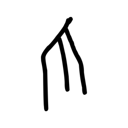

- source_zip_member: `Sub-character Images/h2mhpxskhk/xw3dfo77bt/4y548r1l3u.png`
- checksum_sha256: `ecc52b9d5904e62da1027591ce69a175eba495759db89f20cd966f21b5f66336`
- review_status: `needs_human_visual_review`
- caution: OBIMD subcharacter image is a source-marked review asset only; it is not a confirmed component form, component assignment, or decipherment conclusion.

## asset-011691

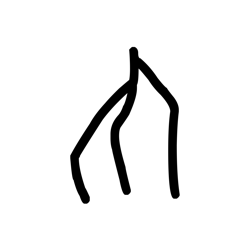

- source_zip_member: `Sub-character Images/h2mhpxskhk/xw3dfo77bt/5au188m978.png`
- checksum_sha256: `dad54b410c63b8201c321a1c04541e667468e66a6bf16f23700d2b578eea7111`
- review_status: `needs_human_visual_review`
- caution: OBIMD subcharacter image is a source-marked review asset only; it is not a confirmed component form, component assignment, or decipherment conclusion.

## asset-011692

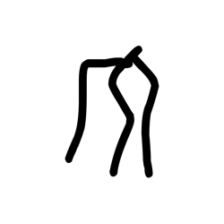

- source_zip_member: `Sub-character Images/h2mhpxskhk/xw3dfo77bt/5u1ku9j0yy.png`
- checksum_sha256: `c3d9944b7cae19744ebb2e448d6b34af167921e56560ecef5e7e507a6373222e`
- review_status: `needs_human_visual_review`
- caution: OBIMD subcharacter image is a source-marked review asset only; it is not a confirmed component form, component assignment, or decipherment conclusion.

## asset-011693

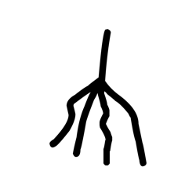

- source_zip_member: `Sub-character Images/h2mhpxskhk/xw3dfo77bt/5zt4z6gg8y.png`
- checksum_sha256: `2882a90b976223fe30f4f1ec01850538b508c5f83987d18c42bf38c09b3c4f4d`
- review_status: `needs_human_visual_review`
- caution: OBIMD subcharacter image is a source-marked review asset only; it is not a confirmed component form, component assignment, or decipherment conclusion.

## asset-011694

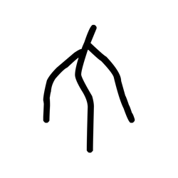

- source_zip_member: `Sub-character Images/h2mhpxskhk/xw3dfo77bt/6nhim8kpoj.png`
- checksum_sha256: `7ea63c0575e72fc3c6f271cec2222dc182fc7ed5c7aaed3b476ab26207e76b9b`
- review_status: `needs_human_visual_review`
- caution: OBIMD subcharacter image is a source-marked review asset only; it is not a confirmed component form, component assignment, or decipherment conclusion.

## asset-011695

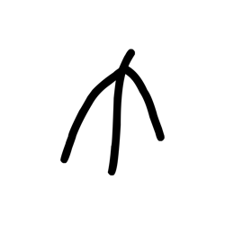

- source_zip_member: `Sub-character Images/h2mhpxskhk/xw3dfo77bt/6qi04020ff.png`
- checksum_sha256: `7ccbc01111f950aab8e881f556ed3afdfeef14c3155ceeb39f56962095a20549`
- review_status: `needs_human_visual_review`
- caution: OBIMD subcharacter image is a source-marked review asset only; it is not a confirmed component form, component assignment, or decipherment conclusion.

## asset-011696

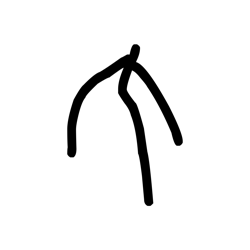

- source_zip_member: `Sub-character Images/h2mhpxskhk/xw3dfo77bt/7cwbayrh3a.png`
- checksum_sha256: `ccf14facb1b4d427f289d2e94531458631e203e577c6c37fd6d9e1066de711ed`
- review_status: `needs_human_visual_review`
- caution: OBIMD subcharacter image is a source-marked review asset only; it is not a confirmed component form, component assignment, or decipherment conclusion.

## asset-011697

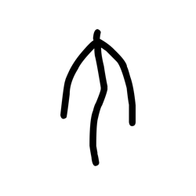

- source_zip_member: `Sub-character Images/h2mhpxskhk/xw3dfo77bt/7v7gloe2mx.png`
- checksum_sha256: `88df7419671858c9d42a3f74e9524d132a2c61ce5ce2e6b70d2ef7fb32c333ef`
- review_status: `needs_human_visual_review`
- caution: OBIMD subcharacter image is a source-marked review asset only; it is not a confirmed component form, component assignment, or decipherment conclusion.

## asset-011698

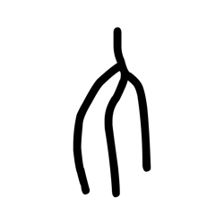

- source_zip_member: `Sub-character Images/h2mhpxskhk/xw3dfo77bt/839t5gi3w4.png`
- checksum_sha256: `d42e3a5c47150dc00507ef630f8ee0d0ec2a8b4a65149e17bacf272e608eb0c8`
- review_status: `needs_human_visual_review`
- caution: OBIMD subcharacter image is a source-marked review asset only; it is not a confirmed component form, component assignment, or decipherment conclusion.

## asset-011699

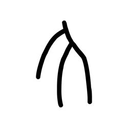

- source_zip_member: `Sub-character Images/h2mhpxskhk/xw3dfo77bt/8fphcai9ri.png`
- checksum_sha256: `93cbd8013f961759154c74519e74e1a15795d2b249c2a6803ab2ad41ccaab6ae`
- review_status: `needs_human_visual_review`
- caution: OBIMD subcharacter image is a source-marked review asset only; it is not a confirmed component form, component assignment, or decipherment conclusion.

## asset-011700

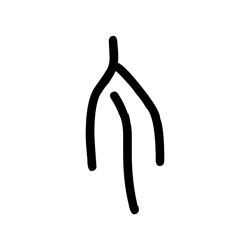

- source_zip_member: `Sub-character Images/h2mhpxskhk/xw3dfo77bt/8tzs3rx560.png`
- checksum_sha256: `19250ec5e1bb0517c968e346b6027fb895343204229b9ad62cc22d05a8564267`
- review_status: `needs_human_visual_review`
- caution: OBIMD subcharacter image is a source-marked review asset only; it is not a confirmed component form, component assignment, or decipherment conclusion.

## asset-011701

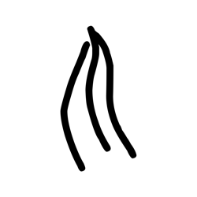

- source_zip_member: `Sub-character Images/h2mhpxskhk/xw3dfo77bt/am3tm0768c.png`
- checksum_sha256: `c10ce0ea946b4c61c058cdfebcd1e49084567cf2cba42be48eadc36fbe3b8362`
- review_status: `needs_human_visual_review`
- caution: OBIMD subcharacter image is a source-marked review asset only; it is not a confirmed component form, component assignment, or decipherment conclusion.

## asset-011702

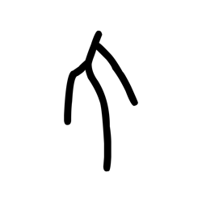

- source_zip_member: `Sub-character Images/h2mhpxskhk/xw3dfo77bt/b8l4uqhyu6.png`
- checksum_sha256: `b8160b4791fc673171f07988e4e3d0655a1e9fb2fbd79dc993e1f48d487411a6`
- review_status: `needs_human_visual_review`
- caution: OBIMD subcharacter image is a source-marked review asset only; it is not a confirmed component form, component assignment, or decipherment conclusion.

## asset-011703

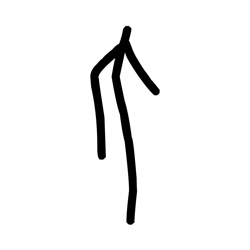

- source_zip_member: `Sub-character Images/h2mhpxskhk/xw3dfo77bt/bryabmixjd.png`
- checksum_sha256: `5dbb677975d57c4acf5a2d88c92e2c386e8c053f4944fc2e458c935a69d6e722`
- review_status: `needs_human_visual_review`
- caution: OBIMD subcharacter image is a source-marked review asset only; it is not a confirmed component form, component assignment, or decipherment conclusion.

## asset-011704

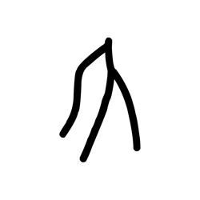

- source_zip_member: `Sub-character Images/h2mhpxskhk/xw3dfo77bt/dec06bkhin.png`
- checksum_sha256: `884ec721657318a99dc8425723a8d95036fe390556548be575427fb60a5b7ac7`
- review_status: `needs_human_visual_review`
- caution: OBIMD subcharacter image is a source-marked review asset only; it is not a confirmed component form, component assignment, or decipherment conclusion.

## asset-011705

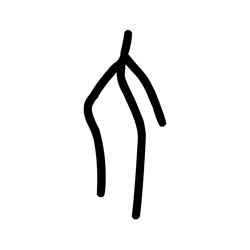

- source_zip_member: `Sub-character Images/h2mhpxskhk/xw3dfo77bt/dh6fqoieyo.png`
- checksum_sha256: `c5f36a5ceea033bfaeb3a5a7387be7ef9a0296e544918912fb2a6b06d5acffab`
- review_status: `needs_human_visual_review`
- caution: OBIMD subcharacter image is a source-marked review asset only; it is not a confirmed component form, component assignment, or decipherment conclusion.

## asset-011706

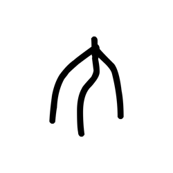

- source_zip_member: `Sub-character Images/h2mhpxskhk/xw3dfo77bt/diu3v1rkt2.png`
- checksum_sha256: `c54cdfe0b541501f45f6bd84ff3b8c567ec386a79163b8d56fa52e99892eae98`
- review_status: `needs_human_visual_review`
- caution: OBIMD subcharacter image is a source-marked review asset only; it is not a confirmed component form, component assignment, or decipherment conclusion.

## asset-011707

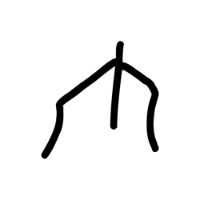

- source_zip_member: `Sub-character Images/h2mhpxskhk/xw3dfo77bt/ej1v8os7ht.png`
- checksum_sha256: `62bf86c91e94f49342960d9c0ce7881f6454e891768e1dcba280112d46826791`
- review_status: `needs_human_visual_review`
- caution: OBIMD subcharacter image is a source-marked review asset only; it is not a confirmed component form, component assignment, or decipherment conclusion.

## asset-011708

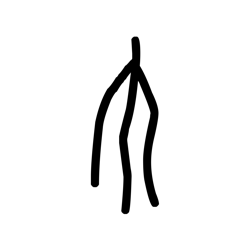

- source_zip_member: `Sub-character Images/h2mhpxskhk/xw3dfo77bt/enmo52lgwv.png`
- checksum_sha256: `bed1f2369b1c47ab12874a9a6783e8010a0c989da479ec47469691c8ef264978`
- review_status: `needs_human_visual_review`
- caution: OBIMD subcharacter image is a source-marked review asset only; it is not a confirmed component form, component assignment, or decipherment conclusion.

## asset-011709

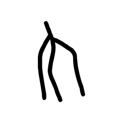

- source_zip_member: `Sub-character Images/h2mhpxskhk/xw3dfo77bt/fvies8hh9d.png`
- checksum_sha256: `8b7d77df571395592f47162067defc316524e057a87e5fae54b8dd36ec65c068`
- review_status: `needs_human_visual_review`
- caution: OBIMD subcharacter image is a source-marked review asset only; it is not a confirmed component form, component assignment, or decipherment conclusion.

## asset-011710

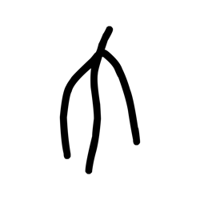

- source_zip_member: `Sub-character Images/h2mhpxskhk/xw3dfo77bt/hqs7798wmw.png`
- checksum_sha256: `5937ab8d300ff4f1e8dea8153f8aaaa3a05c567bc3942267244d4324b0d213f6`
- review_status: `needs_human_visual_review`
- caution: OBIMD subcharacter image is a source-marked review asset only; it is not a confirmed component form, component assignment, or decipherment conclusion.

## asset-011711

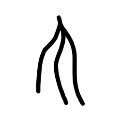

- source_zip_member: `Sub-character Images/h2mhpxskhk/xw3dfo77bt/is1tkvx7ej.png`
- checksum_sha256: `66663f9e8e6550b395057fe16f2615afaa80dcad81c979ccec4f51c67897426b`
- review_status: `needs_human_visual_review`
- caution: OBIMD subcharacter image is a source-marked review asset only; it is not a confirmed component form, component assignment, or decipherment conclusion.

## asset-011712

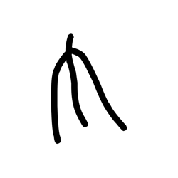

- source_zip_member: `Sub-character Images/h2mhpxskhk/xw3dfo77bt/jar237pfz0.png`
- checksum_sha256: `9fc5163440b111f63c82bf87ca6ee276a73d4d7638c29efd66d62db866cb47cc`
- review_status: `needs_human_visual_review`
- caution: OBIMD subcharacter image is a source-marked review asset only; it is not a confirmed component form, component assignment, or decipherment conclusion.

## asset-011713

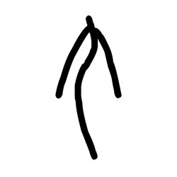

- source_zip_member: `Sub-character Images/h2mhpxskhk/xw3dfo77bt/jvfvrflyls.png`
- checksum_sha256: `f231b80a510db7b0461f9cc8cc1763c2d9fd6b3d3f6925fa16a77c9352e79f24`
- review_status: `needs_human_visual_review`
- caution: OBIMD subcharacter image is a source-marked review asset only; it is not a confirmed component form, component assignment, or decipherment conclusion.

## asset-011714

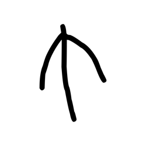

- source_zip_member: `Sub-character Images/h2mhpxskhk/xw3dfo77bt/k7xvp0f0g4.png`
- checksum_sha256: `77b66233a0c85276b67dd090a68eca948e29e40600f6493a99860d75f5539deb`
- review_status: `needs_human_visual_review`
- caution: OBIMD subcharacter image is a source-marked review asset only; it is not a confirmed component form, component assignment, or decipherment conclusion.

## asset-011715

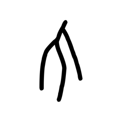

- source_zip_member: `Sub-character Images/h2mhpxskhk/xw3dfo77bt/l1r3qha6zn.png`
- checksum_sha256: `a49908b37d99ce7f808cb0ee6ff3df68fd361436807d1820045e0d1ef972f903`
- review_status: `needs_human_visual_review`
- caution: OBIMD subcharacter image is a source-marked review asset only; it is not a confirmed component form, component assignment, or decipherment conclusion.

## asset-011716

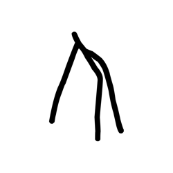

- source_zip_member: `Sub-character Images/h2mhpxskhk/xw3dfo77bt/lq8tx919ao.png`
- checksum_sha256: `6eb8baa753c7fe071ac4bcca8f07e107c6fe5dbf61e6a0143fbf4cc0a13f66b5`
- review_status: `needs_human_visual_review`
- caution: OBIMD subcharacter image is a source-marked review asset only; it is not a confirmed component form, component assignment, or decipherment conclusion.

## asset-011717

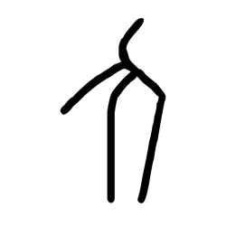

- source_zip_member: `Sub-character Images/h2mhpxskhk/xw3dfo77bt/ltwb4p4tpw.png`
- checksum_sha256: `ad5be294802280e5dd898019dafae8675cb122cb09764b4f04257518871857b7`
- review_status: `needs_human_visual_review`
- caution: OBIMD subcharacter image is a source-marked review asset only; it is not a confirmed component form, component assignment, or decipherment conclusion.

## asset-011718

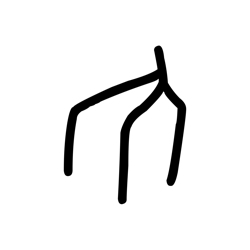

- source_zip_member: `Sub-character Images/h2mhpxskhk/xw3dfo77bt/m70co6eunq.png`
- checksum_sha256: `7b0d979ed985776505c2928e77d3352f99742ae4d39cadf55547017a1e2400ab`
- review_status: `needs_human_visual_review`
- caution: OBIMD subcharacter image is a source-marked review asset only; it is not a confirmed component form, component assignment, or decipherment conclusion.

## asset-011719

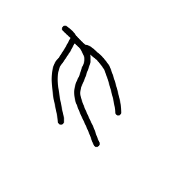

- source_zip_member: `Sub-character Images/h2mhpxskhk/xw3dfo77bt/myycm5s9o5.png`
- checksum_sha256: `2440ddfe66fa565ce7b35fbf9851164b43bab42671f1314e0ee20716e9431b90`
- review_status: `needs_human_visual_review`
- caution: OBIMD subcharacter image is a source-marked review asset only; it is not a confirmed component form, component assignment, or decipherment conclusion.

## asset-011720

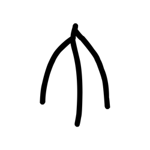

- source_zip_member: `Sub-character Images/h2mhpxskhk/xw3dfo77bt/mzqe7cwqas.png`
- checksum_sha256: `28d9ada8e7c06a129008e8b3d54e7fee262b3aff729388a523a2c136e134fc03`
- review_status: `needs_human_visual_review`
- caution: OBIMD subcharacter image is a source-marked review asset only; it is not a confirmed component form, component assignment, or decipherment conclusion.

## asset-011721

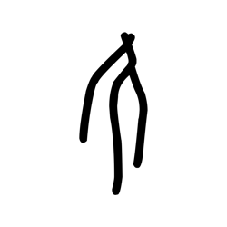

- source_zip_member: `Sub-character Images/h2mhpxskhk/xw3dfo77bt/n42mxwponr.png`
- checksum_sha256: `728093d9c4211af80bd7da6a512eea64e1e968dd5dc9f2ebede2f957087cb252`
- review_status: `needs_human_visual_review`
- caution: OBIMD subcharacter image is a source-marked review asset only; it is not a confirmed component form, component assignment, or decipherment conclusion.

## asset-011722

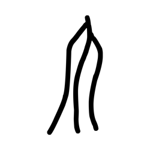

- source_zip_member: `Sub-character Images/h2mhpxskhk/xw3dfo77bt/n4ssefqnet.png`
- checksum_sha256: `a7ace83d92ff585df24075ec1fcfabf0af8c2d1053e7d66e8b5625cf3c94c3d3`
- review_status: `needs_human_visual_review`
- caution: OBIMD subcharacter image is a source-marked review asset only; it is not a confirmed component form, component assignment, or decipherment conclusion.

## asset-011723

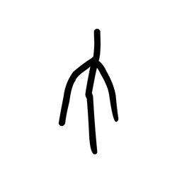

- source_zip_member: `Sub-character Images/h2mhpxskhk/xw3dfo77bt/nd8gr9ewbv.png`
- checksum_sha256: `73b0406c9e8087d2c37da3689a26ddf86449032e67f2e02b8a684e00b3d95b41`
- review_status: `needs_human_visual_review`
- caution: OBIMD subcharacter image is a source-marked review asset only; it is not a confirmed component form, component assignment, or decipherment conclusion.

## asset-011724

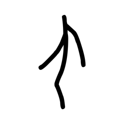

- source_zip_member: `Sub-character Images/h2mhpxskhk/xw3dfo77bt/qjsqud9koc.png`
- checksum_sha256: `3c59f2c78ebf4ddcab1879b878e99ca8781b3c491962ea51f60bd58568d0b19e`
- review_status: `needs_human_visual_review`
- caution: OBIMD subcharacter image is a source-marked review asset only; it is not a confirmed component form, component assignment, or decipherment conclusion.

## asset-011725

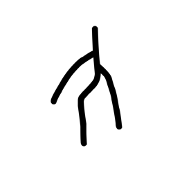

- source_zip_member: `Sub-character Images/h2mhpxskhk/xw3dfo77bt/rklx61xclp.png`
- checksum_sha256: `bf0c34b66c9faab949d79b16bee153b9d7ec9a225fa34ed797d587c28655d986`
- review_status: `needs_human_visual_review`
- caution: OBIMD subcharacter image is a source-marked review asset only; it is not a confirmed component form, component assignment, or decipherment conclusion.

## asset-011726

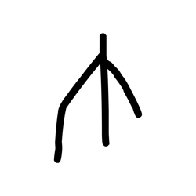

- source_zip_member: `Sub-character Images/h2mhpxskhk/xw3dfo77bt/rps0a570pt.png`
- checksum_sha256: `f20482be9101a9b233779c765886b1ea0ff804fcb9ee80b9ea1d69155d118c73`
- review_status: `needs_human_visual_review`
- caution: OBIMD subcharacter image is a source-marked review asset only; it is not a confirmed component form, component assignment, or decipherment conclusion.

## asset-011727

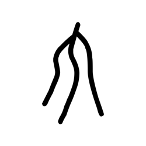

- source_zip_member: `Sub-character Images/h2mhpxskhk/xw3dfo77bt/ruvwxmzvfi.png`
- checksum_sha256: `5a20dd49f862bb8b254b5535d8edc483e4c0181e88adbe0484c0328049c5c649`
- review_status: `needs_human_visual_review`
- caution: OBIMD subcharacter image is a source-marked review asset only; it is not a confirmed component form, component assignment, or decipherment conclusion.

## asset-011728

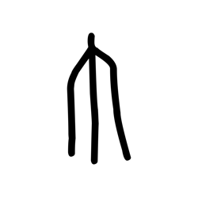

- source_zip_member: `Sub-character Images/h2mhpxskhk/xw3dfo77bt/sbv1rmcsch.png`
- checksum_sha256: `8162c74c85aea9fea46223ef1eaa9581dfec88810620dde0ad26aaf6b211c4d6`
- review_status: `needs_human_visual_review`
- caution: OBIMD subcharacter image is a source-marked review asset only; it is not a confirmed component form, component assignment, or decipherment conclusion.

## asset-011729

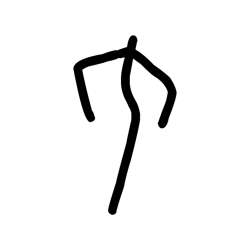

- source_zip_member: `Sub-character Images/h2mhpxskhk/xw3dfo77bt/sluwjfatpy.png`
- checksum_sha256: `eee229260a92c508d550a0baad17723361125dee548146bd5d53a0673e52f706`
- review_status: `needs_human_visual_review`
- caution: OBIMD subcharacter image is a source-marked review asset only; it is not a confirmed component form, component assignment, or decipherment conclusion.

## asset-011730

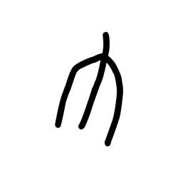

- source_zip_member: `Sub-character Images/h2mhpxskhk/xw3dfo77bt/svo19wbmba.png`
- checksum_sha256: `81ce61d86d955646cddfd6c16190611990602c60db9cb8fcdf9936adef41b000`
- review_status: `needs_human_visual_review`
- caution: OBIMD subcharacter image is a source-marked review asset only; it is not a confirmed component form, component assignment, or decipherment conclusion.

## asset-011731

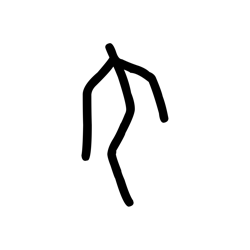

- source_zip_member: `Sub-character Images/h2mhpxskhk/xw3dfo77bt/t5sv9z1udy.png`
- checksum_sha256: `2a9af04f8610c1c4b6562f969cbe6cb306d717bccbfd80fb5af6f85183813b87`
- review_status: `needs_human_visual_review`
- caution: OBIMD subcharacter image is a source-marked review asset only; it is not a confirmed component form, component assignment, or decipherment conclusion.

## asset-011732

- source_zip_member: `Sub-character Images/h2mhpxskhk/xw3dfo77bt/tidzn45pgl.png`
- checksum_sha256: `20849a68c4fe0edc322c6937411bb2ceb37d745b11dbadd5fc684eb869e5b827`
- review_status: `needs_human_visual_review`
- caution: OBIMD subcharacter image is a source-marked review asset only; it is not a confirmed component form, component assignment, or decipherment conclusion.

## asset-011733

- source_zip_member: `Sub-character Images/h2mhpxskhk/xw3dfo77bt/tplcx5iavy.png`
- checksum_sha256: `1a3f805b18944e9a66b32149dff5c1899077bf5cd6565d3526245c3738f89bd5`
- review_status: `needs_human_visual_review`
- caution: OBIMD subcharacter image is a source-marked review asset only; it is not a confirmed component form, component assignment, or decipherment conclusion.

## asset-011734

- source_zip_member: `Sub-character Images/h2mhpxskhk/xw3dfo77bt/u95rgtqd32.png`
- checksum_sha256: `d695a7dbb3db769a5e67051a61bdc41f753d01d0719fc849dc659cda7e6edda8`
- review_status: `needs_human_visual_review`
- caution: OBIMD subcharacter image is a source-marked review asset only; it is not a confirmed component form, component assignment, or decipherment conclusion.

## asset-011735

- source_zip_member: `Sub-character Images/h2mhpxskhk/xw3dfo77bt/ud59j9f65g.png`
- checksum_sha256: `2da3ef199c7b8914f3379f7b8756fb0b858a4d0f9de5a3f393fe170f70f3d850`
- review_status: `needs_human_visual_review`
- caution: OBIMD subcharacter image is a source-marked review asset only; it is not a confirmed component form, component assignment, or decipherment conclusion.

## asset-011736

- source_zip_member: `Sub-character Images/h2mhpxskhk/xw3dfo77bt/uj5815qfml.png`
- checksum_sha256: `1500fadc215de77985129a5404baa9b82e3818f16e37460540cf25687194e8cf`
- review_status: `needs_human_visual_review`
- caution: OBIMD subcharacter image is a source-marked review asset only; it is not a confirmed component form, component assignment, or decipherment conclusion.

## asset-011737

- source_zip_member: `Sub-character Images/h2mhpxskhk/xw3dfo77bt/un0tc0prgj.png`
- checksum_sha256: `7a49ea45ce79ea527a403579baa036c26dcec951a4a09793bd4f3b19e3f3cc7b`
- review_status: `needs_human_visual_review`
- caution: OBIMD subcharacter image is a source-marked review asset only; it is not a confirmed component form, component assignment, or decipherment conclusion.

## asset-011738

- source_zip_member: `Sub-character Images/h2mhpxskhk/xw3dfo77bt/vr2jd922dd.png`
- checksum_sha256: `41d5149609aecc38ec18763da7c9c1cccc09ca7e421706f4e7392997da773f35`
- review_status: `needs_human_visual_review`
- caution: OBIMD subcharacter image is a source-marked review asset only; it is not a confirmed component form, component assignment, or decipherment conclusion.

## asset-011739

- source_zip_member: `Sub-character Images/h2mhpxskhk/xw3dfo77bt/w5gd74li26.png`
- checksum_sha256: `c8c674b981319fd3bbe0d65bc8dfb86c96e6b96fe2439ef2c168c903465e0504`
- review_status: `needs_human_visual_review`
- caution: OBIMD subcharacter image is a source-marked review asset only; it is not a confirmed component form, component assignment, or decipherment conclusion.

## asset-011740

- source_zip_member: `Sub-character Images/h2mhpxskhk/xw3dfo77bt/wii74kp41k.png`
- checksum_sha256: `3456f452dad1d5bb72fe40a10257d3e48a2359d50d1799639e493f2439c439ce`
- review_status: `needs_human_visual_review`
- caution: OBIMD subcharacter image is a source-marked review asset only; it is not a confirmed component form, component assignment, or decipherment conclusion.

## asset-011741

- source_zip_member: `Sub-character Images/h2mhpxskhk/xw3dfo77bt/x3gt8vypt6.png`
- checksum_sha256: `6725df706c63c1715b92684e92ae08df574058143f7e7c76b089a679a0671b47`
- review_status: `needs_human_visual_review`
- caution: OBIMD subcharacter image is a source-marked review asset only; it is not a confirmed component form, component assignment, or decipherment conclusion.

## asset-011742

- source_zip_member: `Sub-character Images/h2mhpxskhk/xw3dfo77bt/x8hdwqmeo5.png`
- checksum_sha256: `902c1c066d175e6189cd7fb8c87f2d60caed39380605b4700ea63cd44c5493b2`
- review_status: `needs_human_visual_review`
- caution: OBIMD subcharacter image is a source-marked review asset only; it is not a confirmed component form, component assignment, or decipherment conclusion.

## asset-011743

- source_zip_member: `Sub-character Images/h2mhpxskhk/xw3dfo77bt/xw3dfo77bt.png`
- checksum_sha256: `96591123e863ab7ec078ae65e94d77ac5afb3e0bc7b33e2cbaea929b522c966b`
- review_status: `needs_human_visual_review`
- caution: OBIMD subcharacter image is a source-marked review asset only; it is not a confirmed component form, component assignment, or decipherment conclusion.

## asset-011744

- source_zip_member: `Sub-character Images/h2mhpxskhk/xw3dfo77bt/y9eio5xtac.png`
- checksum_sha256: `80cac0c41711b08e440e07ef9ab2b5ac949a478037ad9569b0f7003b0806707a`
- review_status: `needs_human_visual_review`
- caution: OBIMD subcharacter image is a source-marked review asset only; it is not a confirmed component form, component assignment, or decipherment conclusion.

## asset-011745

- source_zip_member: `Sub-character Images/h2mhpxskhk/xw3dfo77bt/yahbtrkadz.png`
- checksum_sha256: `e0ebd385b7a2f3e48a6d0549805bab3d0dda66f0e1dd342cad1367e9367ccd87`
- review_status: `needs_human_visual_review`
- caution: OBIMD subcharacter image is a source-marked review asset only; it is not a confirmed component form, component assignment, or decipherment conclusion.

## asset-011746

- source_zip_member: `Sub-character Images/h2mhpxskhk/xw3dfo77bt/yuhs2rkzb7.png`
- checksum_sha256: `40540dafe13f43701072135d7cea88cb2c53b897ed59f374151897cd90ac10bd`
- review_status: `needs_human_visual_review`
- caution: OBIMD subcharacter image is a source-marked review asset only; it is not a confirmed component form, component assignment, or decipherment conclusion.

## asset-011747

- source_zip_member: `Sub-character Images/h2mhpxskhk/xw3dfo77bt/z6q44e257v.png`
- checksum_sha256: `9e72549085df8ac671dcb6fd1b183d842e2a41e2de91103d7117ff55272d4d1b`
- review_status: `needs_human_visual_review`
- caution: OBIMD subcharacter image is a source-marked review asset only; it is not a confirmed component form, component assignment, or decipherment conclusion.

## asset-011748

- source_zip_member: `Sub-character Images/h2mhpxskhk/xw3dfo77bt/zbuzpjvnd3.png`
- checksum_sha256: `d21536b9df6b8b0f606d51634b596b60b405e67e8063c8b21d1ac700672ff2ff`
- review_status: `needs_human_visual_review`
- caution: OBIMD subcharacter image is a source-marked review asset only; it is not a confirmed component form, component assignment, or decipherment conclusion.

## asset-011749

- source_zip_member: `Sub-character Images/h2mhpxskhk/xw3dfo77bt/zrctvz5bhk.png`
- checksum_sha256: `bc4672214f098f91d891bfa72dd20870917ea042eab54a7b35b1c075bb55f8fb`
- review_status: `needs_human_visual_review`
- caution: OBIMD subcharacter image is a source-marked review asset only; it is not a confirmed component form, component assignment, or decipherment conclusion.

## asset-011750

- source_zip_member: `Sub-character Images/h2mhpxskhk/xw3dfo77bt/zx8u4nyiw9.png`
- checksum_sha256: `28b87dae9f9f67fcdb51c5fa5554a5df391fce3838205c7fa5577d11191c0700`
- review_status: `needs_human_visual_review`
- caution: OBIMD subcharacter image is a source-marked review asset only; it is not a confirmed component form, component assignment, or decipherment conclusion.
