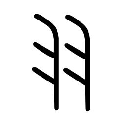

# Component Visual Gallery / 构件图像查看: obs-comp-cand-000194

English:
This page displays OBIMD subcharacter PNG assets extracted into this concrete corpus object directory for human review.

简体中文：
本页展示抽取到当前具体 corpus 对象目录内的 OBIMD subcharacter PNG 资料，供人工复核使用。

Boundary / 边界：dataset image candidate only; not a confirmed component form, component assignment, or decipherment claim.

## asset-011755

- source_zip_member: `Sub-character Images/k6l649jf98/k6l649jf98/k6l649jf98.png`
- checksum_sha256: `e3e084109f08e30ef6cc6e6cf53b358aac3b90e73fdf28b42a91332c1f66d94c`
- review_status: `needs_human_visual_review`
- caution: OBIMD subcharacter image is a source-marked review asset only; it is not a confirmed component form, component assignment, or decipherment conclusion.
