# Component Visual Gallery / 构件图像查看: obs-comp-cand-000208

English:
This page displays OBIMD subcharacter PNG assets extracted into this concrete
corpus object directory for human review.

简体中文：
本页展示抽取到当前具体 corpus 对象目录内的 OBIMD subcharacter PNG 资料，供人工复核使用。

Boundary / 边界：
dataset image candidate only; not a confirmed component form, not a component
assignment, and not a decipherment claim.
- not a confirmed component form
- not a component assignment
- not a decipherment claim

## Concrete Questions To Check / 具体待查问题

- Which local image should be opened first?
- 应先打开哪一张本地构件图像？
- Which source zip member anchors this image?
- 哪一个 source zip member 能定位这张图像？
- Which near-shape or variant comparison is still missing?
- 还缺哪些近形或异体比较？
- Which character or inscription context should be checked next?
- 下一步应核对哪些单字或卜辞上下文？
- What evidence is missing before a component assignment?
- 正式构件归属前还缺哪些证据？

## asset-011769

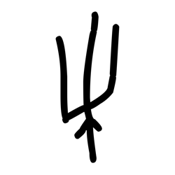

- source_zip_member: `Sub-character Images/pa13rewdd9/pa13rewdd9/06h1p8u7hn.png`
- checksum_sha256: see `06_component-visual-index.csv`.
- review_status: `needs_human_visual_review`
- caution: source-marked review image only.

## asset-011770

- source_zip_member: `Sub-character Images/pa13rewdd9/pa13rewdd9/0lz5se3t63.png`
- checksum_sha256: see `06_component-visual-index.csv`.
- review_status: `needs_human_visual_review`
- caution: source-marked review image only.

## asset-011771

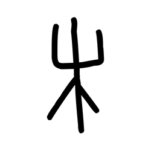

- source_zip_member: `Sub-character Images/pa13rewdd9/pa13rewdd9/2fi2lbv1vy.png`
- checksum_sha256: see `06_component-visual-index.csv`.
- review_status: `needs_human_visual_review`
- caution: source-marked review image only.

## asset-011772

- source_zip_member: `Sub-character Images/pa13rewdd9/pa13rewdd9/2r7f5dtah3.png`
- checksum_sha256: see `06_component-visual-index.csv`.
- review_status: `needs_human_visual_review`
- caution: source-marked review image only.

## asset-011773

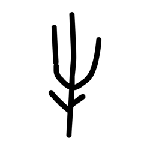

- source_zip_member: `Sub-character Images/pa13rewdd9/pa13rewdd9/47oxo1ihau.png`
- checksum_sha256: see `06_component-visual-index.csv`.
- review_status: `needs_human_visual_review`
- caution: source-marked review image only.

## asset-011774

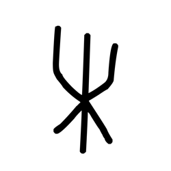

- source_zip_member: `Sub-character Images/pa13rewdd9/pa13rewdd9/496s1dqhb6.png`
- checksum_sha256: see `06_component-visual-index.csv`.
- review_status: `needs_human_visual_review`
- caution: source-marked review image only.

## asset-011775

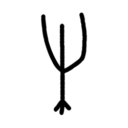

- source_zip_member: `Sub-character Images/pa13rewdd9/pa13rewdd9/4p7whwqqw5.png`
- checksum_sha256: see `06_component-visual-index.csv`.
- review_status: `needs_human_visual_review`
- caution: source-marked review image only.

## asset-011776

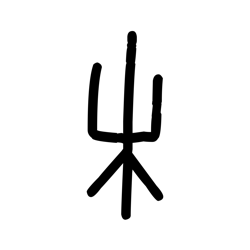

- source_zip_member: `Sub-character Images/pa13rewdd9/pa13rewdd9/5fx5d2g9d8.png`
- checksum_sha256: see `06_component-visual-index.csv`.
- review_status: `needs_human_visual_review`
- caution: source-marked review image only.

## asset-011777

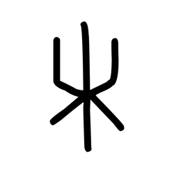

- source_zip_member: `Sub-character Images/pa13rewdd9/pa13rewdd9/637e5oda1g.png`
- checksum_sha256: see `06_component-visual-index.csv`.
- review_status: `needs_human_visual_review`
- caution: source-marked review image only.

## asset-011778

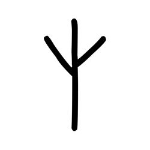

- source_zip_member: `Sub-character Images/pa13rewdd9/pa13rewdd9/798ovk3fc3.png`
- checksum_sha256: see `06_component-visual-index.csv`.
- review_status: `needs_human_visual_review`
- caution: source-marked review image only.

## asset-011779

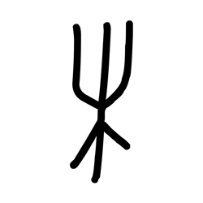

- source_zip_member: `Sub-character Images/pa13rewdd9/pa13rewdd9/7xssy204ok.png`
- checksum_sha256: see `06_component-visual-index.csv`.
- review_status: `needs_human_visual_review`
- caution: source-marked review image only.

## asset-011780

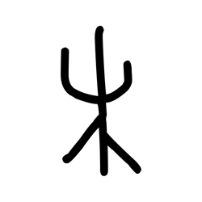

- source_zip_member: `Sub-character Images/pa13rewdd9/pa13rewdd9/8ba9hgff11.png`
- checksum_sha256: see `06_component-visual-index.csv`.
- review_status: `needs_human_visual_review`
- caution: source-marked review image only.

## asset-011781

- source_zip_member: `Sub-character Images/pa13rewdd9/pa13rewdd9/8oxul3z83c.png`
- checksum_sha256: see `06_component-visual-index.csv`.
- review_status: `needs_human_visual_review`
- caution: source-marked review image only.

## asset-011782

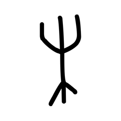

- source_zip_member: `Sub-character Images/pa13rewdd9/pa13rewdd9/91maax1uf7.png`
- checksum_sha256: see `06_component-visual-index.csv`.
- review_status: `needs_human_visual_review`
- caution: source-marked review image only.

## asset-011783

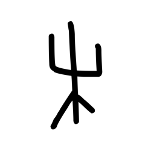

- source_zip_member: `Sub-character Images/pa13rewdd9/pa13rewdd9/9vww7yxqkg.png`
- checksum_sha256: see `06_component-visual-index.csv`.
- review_status: `needs_human_visual_review`
- caution: source-marked review image only.

## asset-011784

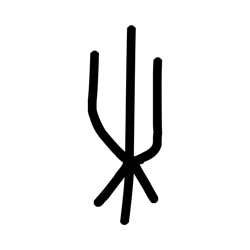

- source_zip_member: `Sub-character Images/pa13rewdd9/pa13rewdd9/c080t8x6gs.png`
- checksum_sha256: see `06_component-visual-index.csv`.
- review_status: `needs_human_visual_review`
- caution: source-marked review image only.

## asset-011785

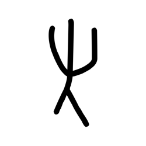

- source_zip_member: `Sub-character Images/pa13rewdd9/pa13rewdd9/d0rnmly58o.png`
- checksum_sha256: see `06_component-visual-index.csv`.
- review_status: `needs_human_visual_review`
- caution: source-marked review image only.

## asset-011786

- source_zip_member: `Sub-character Images/pa13rewdd9/pa13rewdd9/d2exdfrgvi.png`
- checksum_sha256: see `06_component-visual-index.csv`.
- review_status: `needs_human_visual_review`
- caution: source-marked review image only.

## asset-011787

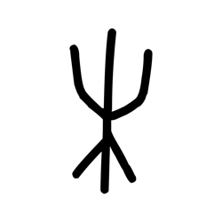

- source_zip_member: `Sub-character Images/pa13rewdd9/pa13rewdd9/d5mf7zt78d.png`
- checksum_sha256: see `06_component-visual-index.csv`.
- review_status: `needs_human_visual_review`
- caution: source-marked review image only.

## asset-011788

- source_zip_member: `Sub-character Images/pa13rewdd9/pa13rewdd9/ews37w1tj3.png`
- checksum_sha256: see `06_component-visual-index.csv`.
- review_status: `needs_human_visual_review`
- caution: source-marked review image only.

## asset-011789

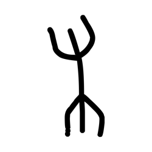

- source_zip_member: `Sub-character Images/pa13rewdd9/pa13rewdd9/fs5cb07257.png`
- checksum_sha256: see `06_component-visual-index.csv`.
- review_status: `needs_human_visual_review`
- caution: source-marked review image only.

## asset-011790

- source_zip_member: `Sub-character Images/pa13rewdd9/pa13rewdd9/gsyc43djd7.png`
- checksum_sha256: see `06_component-visual-index.csv`.
- review_status: `needs_human_visual_review`
- caution: source-marked review image only.

## asset-011791

- source_zip_member: `Sub-character Images/pa13rewdd9/pa13rewdd9/hrpp7dof3x.png`
- checksum_sha256: see `06_component-visual-index.csv`.
- review_status: `needs_human_visual_review`
- caution: source-marked review image only.

## asset-011792

- source_zip_member: `Sub-character Images/pa13rewdd9/pa13rewdd9/hxotsect9x.png`
- checksum_sha256: see `06_component-visual-index.csv`.
- review_status: `needs_human_visual_review`
- caution: source-marked review image only.

## asset-011793

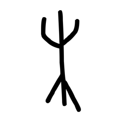

- source_zip_member: `Sub-character Images/pa13rewdd9/pa13rewdd9/ijwc6u2q8v.png`
- checksum_sha256: see `06_component-visual-index.csv`.
- review_status: `needs_human_visual_review`
- caution: source-marked review image only.

## asset-011794

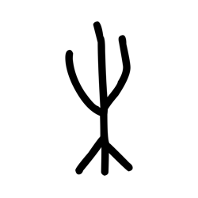

- source_zip_member: `Sub-character Images/pa13rewdd9/pa13rewdd9/ipabh4v3dy.png`
- checksum_sha256: see `06_component-visual-index.csv`.
- review_status: `needs_human_visual_review`
- caution: source-marked review image only.

## asset-011795

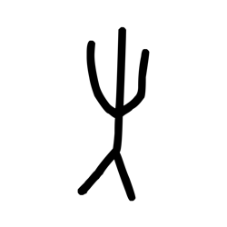

- source_zip_member: `Sub-character Images/pa13rewdd9/pa13rewdd9/j1c5yss8cn.png`
- checksum_sha256: see `06_component-visual-index.csv`.
- review_status: `needs_human_visual_review`
- caution: source-marked review image only.

## asset-011796

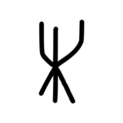

- source_zip_member: `Sub-character Images/pa13rewdd9/pa13rewdd9/jaryq8vrr3.png`
- checksum_sha256: see `06_component-visual-index.csv`.
- review_status: `needs_human_visual_review`
- caution: source-marked review image only.

## asset-011797

- source_zip_member: `Sub-character Images/pa13rewdd9/pa13rewdd9/jdi4f31loy.png`
- checksum_sha256: see `06_component-visual-index.csv`.
- review_status: `needs_human_visual_review`
- caution: source-marked review image only.

## asset-011798

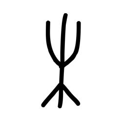

- source_zip_member: `Sub-character Images/pa13rewdd9/pa13rewdd9/k6rn8spu15.png`
- checksum_sha256: see `06_component-visual-index.csv`.
- review_status: `needs_human_visual_review`
- caution: source-marked review image only.

## asset-011799

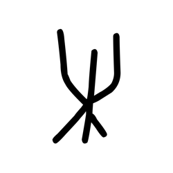

- source_zip_member: `Sub-character Images/pa13rewdd9/pa13rewdd9/lws2x00iwb.png`
- checksum_sha256: see `06_component-visual-index.csv`.
- review_status: `needs_human_visual_review`
- caution: source-marked review image only.

## asset-011800

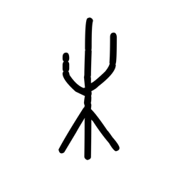

- source_zip_member: `Sub-character Images/pa13rewdd9/pa13rewdd9/m0giftnk5u.png`
- checksum_sha256: see `06_component-visual-index.csv`.
- review_status: `needs_human_visual_review`
- caution: source-marked review image only.

## asset-011801

- source_zip_member: `Sub-character Images/pa13rewdd9/pa13rewdd9/mduzxja3x5.png`
- checksum_sha256: see `06_component-visual-index.csv`.
- review_status: `needs_human_visual_review`
- caution: source-marked review image only.

## asset-011802

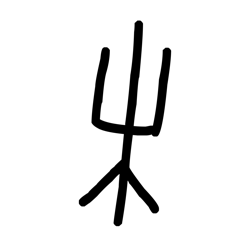

- source_zip_member: `Sub-character Images/pa13rewdd9/pa13rewdd9/mn5q1p4ivr.png`
- checksum_sha256: see `06_component-visual-index.csv`.
- review_status: `needs_human_visual_review`
- caution: source-marked review image only.

## asset-011803

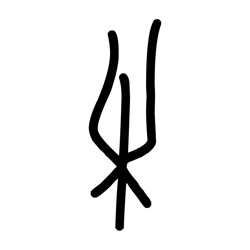

- source_zip_member: `Sub-character Images/pa13rewdd9/pa13rewdd9/nr0cf1npko.png`
- checksum_sha256: see `06_component-visual-index.csv`.
- review_status: `needs_human_visual_review`
- caution: source-marked review image only.

## asset-011804

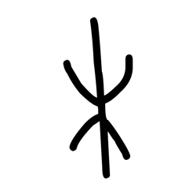

- source_zip_member: `Sub-character Images/pa13rewdd9/pa13rewdd9/og361cin85.png`
- checksum_sha256: see `06_component-visual-index.csv`.
- review_status: `needs_human_visual_review`
- caution: source-marked review image only.

## asset-011805

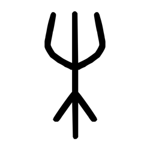

- source_zip_member: `Sub-character Images/pa13rewdd9/pa13rewdd9/pa13rewdd9.png`
- checksum_sha256: see `06_component-visual-index.csv`.
- review_status: `needs_human_visual_review`
- caution: source-marked review image only.

## asset-011806

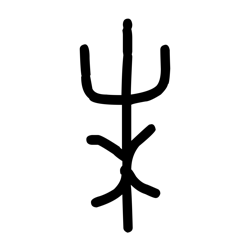

- source_zip_member: `Sub-character Images/pa13rewdd9/pa13rewdd9/pbe8v0ccyo.png`
- checksum_sha256: see `06_component-visual-index.csv`.
- review_status: `needs_human_visual_review`
- caution: source-marked review image only.

## asset-011807

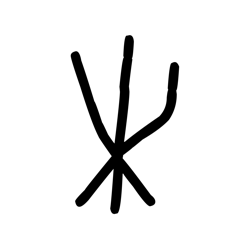

- source_zip_member: `Sub-character Images/pa13rewdd9/pa13rewdd9/pu4b1ber8z.png`
- checksum_sha256: see `06_component-visual-index.csv`.
- review_status: `needs_human_visual_review`
- caution: source-marked review image only.

## asset-011808

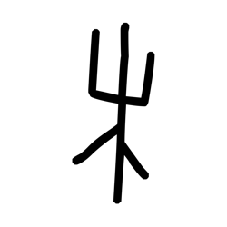

- source_zip_member: `Sub-character Images/pa13rewdd9/pa13rewdd9/ru4upogxai.png`
- checksum_sha256: see `06_component-visual-index.csv`.
- review_status: `needs_human_visual_review`
- caution: source-marked review image only.

## asset-011809

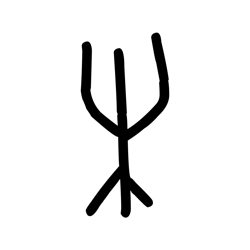

- source_zip_member: `Sub-character Images/pa13rewdd9/pa13rewdd9/t4zxq0dgsf.png`
- checksum_sha256: see `06_component-visual-index.csv`.
- review_status: `needs_human_visual_review`
- caution: source-marked review image only.

## asset-011810

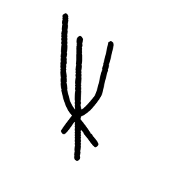

- source_zip_member: `Sub-character Images/pa13rewdd9/pa13rewdd9/usfzqhytah.png`
- checksum_sha256: see `06_component-visual-index.csv`.
- review_status: `needs_human_visual_review`
- caution: source-marked review image only.

## asset-011811

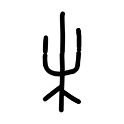

- source_zip_member: `Sub-character Images/pa13rewdd9/pa13rewdd9/wdk7m4srvq.png`
- checksum_sha256: see `06_component-visual-index.csv`.
- review_status: `needs_human_visual_review`
- caution: source-marked review image only.

## asset-011812

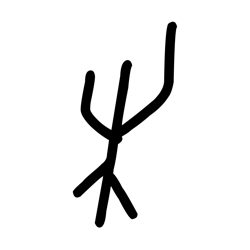

- source_zip_member: `Sub-character Images/pa13rewdd9/pa13rewdd9/wyd8h79z7a.png`
- checksum_sha256: see `06_component-visual-index.csv`.
- review_status: `needs_human_visual_review`
- caution: source-marked review image only.

## asset-011813

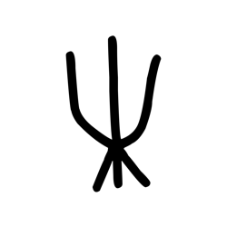

- source_zip_member: `Sub-character Images/pa13rewdd9/pa13rewdd9/x1wd7tbbje.png`
- checksum_sha256: see `06_component-visual-index.csv`.
- review_status: `needs_human_visual_review`
- caution: source-marked review image only.

## asset-011814

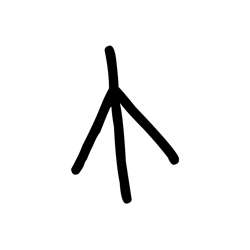

- source_zip_member: `Sub-character Images/pa13rewdd9/pa13rewdd9/y3c13vm0fc.png`
- checksum_sha256: see `06_component-visual-index.csv`.
- review_status: `needs_human_visual_review`
- caution: source-marked review image only.

## asset-011815

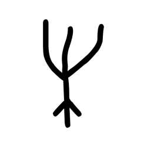

- source_zip_member: `Sub-character Images/pa13rewdd9/pa13rewdd9/yf36tglcxh.png`
- checksum_sha256: see `06_component-visual-index.csv`.
- review_status: `needs_human_visual_review`
- caution: source-marked review image only.

## asset-011816

- source_zip_member: `Sub-character Images/pa13rewdd9/pa13rewdd9/ykrej3unno.png`
- checksum_sha256: see `06_component-visual-index.csv`.
- review_status: `needs_human_visual_review`
- caution: source-marked review image only.

## asset-011817

- source_zip_member: `Sub-character Images/pa13rewdd9/pa13rewdd9/yqfjjm0nmx.png`
- checksum_sha256: see `06_component-visual-index.csv`.
- review_status: `needs_human_visual_review`
- caution: source-marked review image only.

## asset-011818

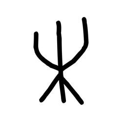

- source_zip_member: `Sub-character Images/pa13rewdd9/pa13rewdd9/yu5og8mt98.png`
- checksum_sha256: see `06_component-visual-index.csv`.
- review_status: `needs_human_visual_review`
- caution: source-marked review image only.

## asset-011819

- source_zip_member: `Sub-character Images/pa13rewdd9/pa13rewdd9/yzscb6s57v.png`
- checksum_sha256: see `06_component-visual-index.csv`.
- review_status: `needs_human_visual_review`
- caution: source-marked review image only.

## asset-011820

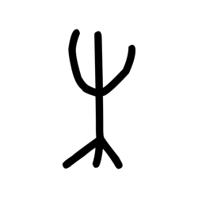

- source_zip_member: `Sub-character Images/pa13rewdd9/pa13rewdd9/zdl2g0cl16.png`
- checksum_sha256: see `06_component-visual-index.csv`.
- review_status: `needs_human_visual_review`
- caution: source-marked review image only.
