# Component Visual Gallery / 构件图像查看: obs-comp-cand-000209

English:
This page displays OBIMD subcharacter PNG assets extracted into this concrete
corpus object directory for human review.

简体中文：
本页展示抽取到当前具体 corpus 对象目录内的 OBIMD subcharacter PNG 资料，供人工复核使用。

Boundary / 边界：
dataset image candidate only; not a confirmed component form, not a component
assignment, and not a decipherment claim.
- not a confirmed component form
- not a component assignment
- not a decipherment claim

## Concrete Questions To Check / 具体待查问题

- Which local image should be opened first?
- 应先打开哪一张本地构件图像？
- Which source zip member anchors this image?
- 哪一个 source zip member 能定位这张图像？
- Which near-shape or variant comparison is still missing?
- 还缺哪些近形或异体比较？
- Which character or inscription context should be checked next?
- 下一步应核对哪些单字或卜辞上下文？
- What evidence is missing before a component assignment?
- 正式构件归属前还缺哪些证据？

## asset-011821

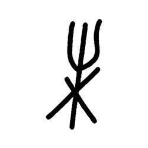

- source_zip_member: `Sub-character Images/pa13rewdd9/ce3fl75gg7/12u1ldsljy.png`
- checksum_sha256: see `06_component-visual-index.csv`.
- review_status: `needs_human_visual_review`
- caution: source-marked review image only.

## asset-011822

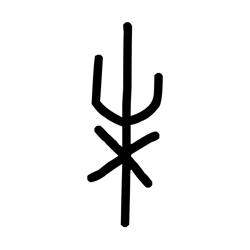

- source_zip_member: `Sub-character Images/pa13rewdd9/ce3fl75gg7/2a4grpr7d7.png`
- checksum_sha256: see `06_component-visual-index.csv`.
- review_status: `needs_human_visual_review`
- caution: source-marked review image only.

## asset-011823

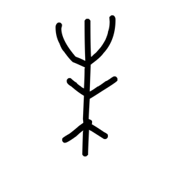

- source_zip_member: `Sub-character Images/pa13rewdd9/ce3fl75gg7/2r2q14ia4b.png`
- checksum_sha256: see `06_component-visual-index.csv`.
- review_status: `needs_human_visual_review`
- caution: source-marked review image only.

## asset-011824

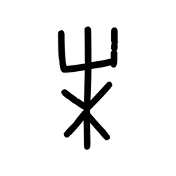

- source_zip_member: `Sub-character Images/pa13rewdd9/ce3fl75gg7/3r6oak1ejc.png`
- checksum_sha256: see `06_component-visual-index.csv`.
- review_status: `needs_human_visual_review`
- caution: source-marked review image only.

## asset-011825

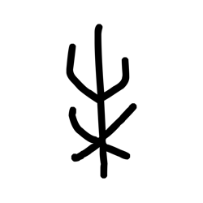

- source_zip_member: `Sub-character Images/pa13rewdd9/ce3fl75gg7/3takvx9nyt.png`
- checksum_sha256: see `06_component-visual-index.csv`.
- review_status: `needs_human_visual_review`
- caution: source-marked review image only.

## asset-011826

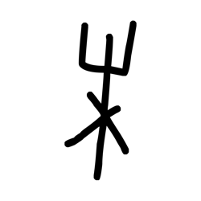

- source_zip_member: `Sub-character Images/pa13rewdd9/ce3fl75gg7/5ma682txv9.png`
- checksum_sha256: see `06_component-visual-index.csv`.
- review_status: `needs_human_visual_review`
- caution: source-marked review image only.

## asset-011827

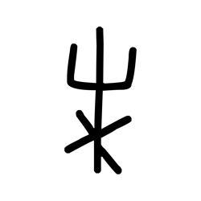

- source_zip_member: `Sub-character Images/pa13rewdd9/ce3fl75gg7/5mv8iog9e1.png`
- checksum_sha256: see `06_component-visual-index.csv`.
- review_status: `needs_human_visual_review`
- caution: source-marked review image only.

## asset-011828

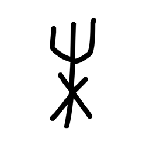

- source_zip_member: `Sub-character Images/pa13rewdd9/ce3fl75gg7/6uyto9kg0m.png`
- checksum_sha256: see `06_component-visual-index.csv`.
- review_status: `needs_human_visual_review`
- caution: source-marked review image only.

## asset-011829

- source_zip_member: `Sub-character Images/pa13rewdd9/ce3fl75gg7/8jxqy4jzwh.png`
- checksum_sha256: see `06_component-visual-index.csv`.
- review_status: `needs_human_visual_review`
- caution: source-marked review image only.

## asset-011830

- source_zip_member: `Sub-character Images/pa13rewdd9/ce3fl75gg7/97ypvm7owy.png`
- checksum_sha256: see `06_component-visual-index.csv`.
- review_status: `needs_human_visual_review`
- caution: source-marked review image only.

## asset-011831

- source_zip_member: `Sub-character Images/pa13rewdd9/ce3fl75gg7/a40vd9zt4t.png`
- checksum_sha256: see `06_component-visual-index.csv`.
- review_status: `needs_human_visual_review`
- caution: source-marked review image only.

## asset-011832

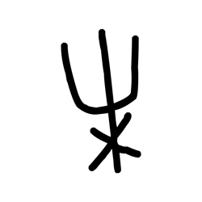

- source_zip_member: `Sub-character Images/pa13rewdd9/ce3fl75gg7/bj0s86ccf3.png`
- checksum_sha256: see `06_component-visual-index.csv`.
- review_status: `needs_human_visual_review`
- caution: source-marked review image only.

## asset-011833

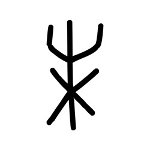

- source_zip_member: `Sub-character Images/pa13rewdd9/ce3fl75gg7/c18urdfmrp.png`
- checksum_sha256: see `06_component-visual-index.csv`.
- review_status: `needs_human_visual_review`
- caution: source-marked review image only.

## asset-011834

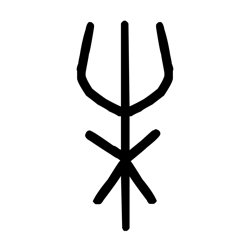

- source_zip_member: `Sub-character Images/pa13rewdd9/ce3fl75gg7/ce3fl75gg7.png`
- checksum_sha256: see `06_component-visual-index.csv`.
- review_status: `needs_human_visual_review`
- caution: source-marked review image only.

## asset-011835

- source_zip_member: `Sub-character Images/pa13rewdd9/ce3fl75gg7/cv3kbkobxr.png`
- checksum_sha256: see `06_component-visual-index.csv`.
- review_status: `needs_human_visual_review`
- caution: source-marked review image only.

## asset-011836

- source_zip_member: `Sub-character Images/pa13rewdd9/ce3fl75gg7/cyeqa2b04y.png`
- checksum_sha256: see `06_component-visual-index.csv`.
- review_status: `needs_human_visual_review`
- caution: source-marked review image only.

## asset-011837

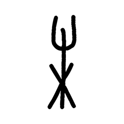

- source_zip_member: `Sub-character Images/pa13rewdd9/ce3fl75gg7/d3co4xgtil.png`
- checksum_sha256: see `06_component-visual-index.csv`.
- review_status: `needs_human_visual_review`
- caution: source-marked review image only.

## asset-011838

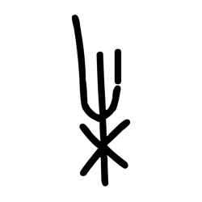

- source_zip_member: `Sub-character Images/pa13rewdd9/ce3fl75gg7/e872hzrs9r.png`
- checksum_sha256: see `06_component-visual-index.csv`.
- review_status: `needs_human_visual_review`
- caution: source-marked review image only.

## asset-011839

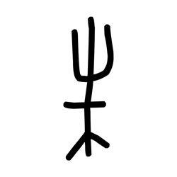

- source_zip_member: `Sub-character Images/pa13rewdd9/ce3fl75gg7/f2vghe5s25.png`
- checksum_sha256: see `06_component-visual-index.csv`.
- review_status: `needs_human_visual_review`
- caution: source-marked review image only.

## asset-011840

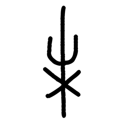

- source_zip_member: `Sub-character Images/pa13rewdd9/ce3fl75gg7/fpax38lfq3.png`
- checksum_sha256: see `06_component-visual-index.csv`.
- review_status: `needs_human_visual_review`
- caution: source-marked review image only.

## asset-011841

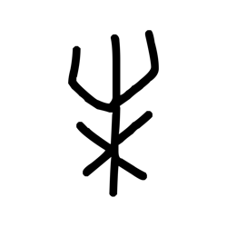

- source_zip_member: `Sub-character Images/pa13rewdd9/ce3fl75gg7/frwmd4ae63.png`
- checksum_sha256: see `06_component-visual-index.csv`.
- review_status: `needs_human_visual_review`
- caution: source-marked review image only.

## asset-011842

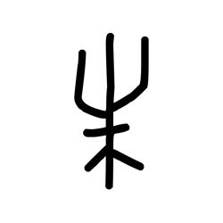

- source_zip_member: `Sub-character Images/pa13rewdd9/ce3fl75gg7/hb41a1ain3.png`
- checksum_sha256: see `06_component-visual-index.csv`.
- review_status: `needs_human_visual_review`
- caution: source-marked review image only.

## asset-011843

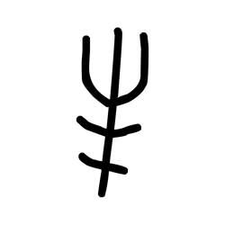

- source_zip_member: `Sub-character Images/pa13rewdd9/ce3fl75gg7/jnli9z3f8z.png`
- checksum_sha256: see `06_component-visual-index.csv`.
- review_status: `needs_human_visual_review`
- caution: source-marked review image only.

## asset-011844

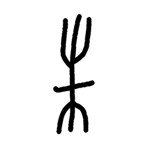

- source_zip_member: `Sub-character Images/pa13rewdd9/ce3fl75gg7/jxctrgtfut.png`
- checksum_sha256: see `06_component-visual-index.csv`.
- review_status: `needs_human_visual_review`
- caution: source-marked review image only.

## asset-011845

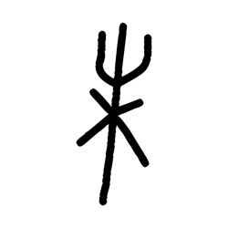

- source_zip_member: `Sub-character Images/pa13rewdd9/ce3fl75gg7/kb2vvujuml.png`
- checksum_sha256: see `06_component-visual-index.csv`.
- review_status: `needs_human_visual_review`
- caution: source-marked review image only.

## asset-011846

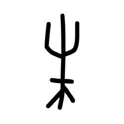

- source_zip_member: `Sub-character Images/pa13rewdd9/ce3fl75gg7/lbunxfjo8v.png`
- checksum_sha256: see `06_component-visual-index.csv`.
- review_status: `needs_human_visual_review`
- caution: source-marked review image only.

## asset-011847

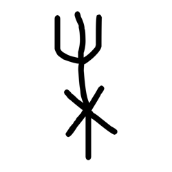

- source_zip_member: `Sub-character Images/pa13rewdd9/ce3fl75gg7/pv1kwy3arf.png`
- checksum_sha256: see `06_component-visual-index.csv`.
- review_status: `needs_human_visual_review`
- caution: source-marked review image only.

## asset-011848

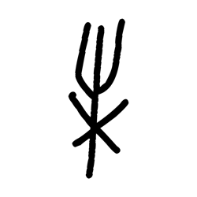

- source_zip_member: `Sub-character Images/pa13rewdd9/ce3fl75gg7/q9xpkh0bhf.png`
- checksum_sha256: see `06_component-visual-index.csv`.
- review_status: `needs_human_visual_review`
- caution: source-marked review image only.

## asset-011849

- source_zip_member: `Sub-character Images/pa13rewdd9/ce3fl75gg7/rqpb8nshxh.png`
- checksum_sha256: see `06_component-visual-index.csv`.
- review_status: `needs_human_visual_review`
- caution: source-marked review image only.

## asset-011850

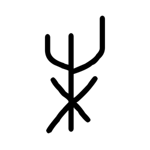

- source_zip_member: `Sub-character Images/pa13rewdd9/ce3fl75gg7/rx2s8tgu41.png`
- checksum_sha256: see `06_component-visual-index.csv`.
- review_status: `needs_human_visual_review`
- caution: source-marked review image only.

## asset-011851

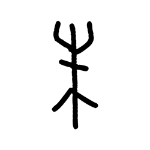

- source_zip_member: `Sub-character Images/pa13rewdd9/ce3fl75gg7/sbnqo0fwb6.png`
- checksum_sha256: see `06_component-visual-index.csv`.
- review_status: `needs_human_visual_review`
- caution: source-marked review image only.

## asset-011852

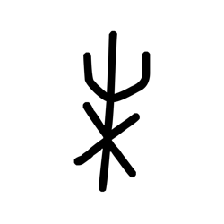

- source_zip_member: `Sub-character Images/pa13rewdd9/ce3fl75gg7/thto61c9h7.png`
- checksum_sha256: see `06_component-visual-index.csv`.
- review_status: `needs_human_visual_review`
- caution: source-marked review image only.

## asset-011853

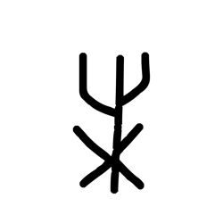

- source_zip_member: `Sub-character Images/pa13rewdd9/ce3fl75gg7/urjqsnmpmq.png`
- checksum_sha256: see `06_component-visual-index.csv`.
- review_status: `needs_human_visual_review`
- caution: source-marked review image only.

## asset-011854

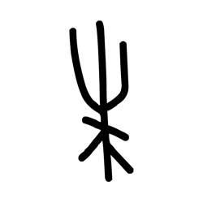

- source_zip_member: `Sub-character Images/pa13rewdd9/ce3fl75gg7/yfhjx8s8d3.png`
- checksum_sha256: see `06_component-visual-index.csv`.
- review_status: `needs_human_visual_review`
- caution: source-marked review image only.
