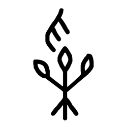

# Component Visual Gallery / 构件图像查看: obs-comp-cand-000221

English:
This page displays OBIMD subcharacter PNG assets extracted into this concrete corpus object directory for human review.

简体中文：
本页展示抽取到当前具体 corpus 对象目录内的 OBIMD subcharacter PNG 资料，供人工复核使用。

Boundary / 边界：dataset image candidate only; not a confirmed component form, component assignment, or decipherment claim.

## asset-011866

- source_zip_member: `Sub-character Images/7z5dh17d4b/7z5dh17d4b/7z5dh17d4b.png`
- checksum_sha256: `09fdea788ae5def13774b87439298ecd562461cc37d6abdc25bec8a48594bb0f`
- review_status: `needs_human_visual_review`
- caution: OBIMD subcharacter image is a source-marked review asset only; it is not a confirmed component form, component assignment, or decipherment conclusion.
