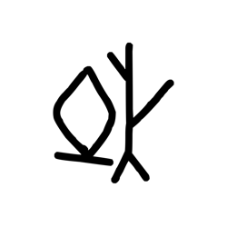
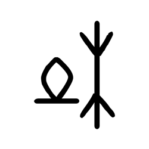
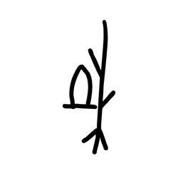

# Component Visual Gallery / 构件图像查看: obs-comp-cand-000225

English:
This page displays OBIMD subcharacter PNG assets extracted into this concrete corpus object directory for human review.

简体中文：
本页展示抽取到当前具体 corpus 对象目录内的 OBIMD subcharacter PNG 资料，供人工复核使用。

Boundary / 边界：dataset image candidate only; not a confirmed component form, component assignment, or decipherment claim.

## asset-011870

- source_zip_member: `Sub-character Images/e4cn4k8l46/e4cn4k8l46/dqrcpum33k.png`
- checksum_sha256: `68d2474410f1eb805243c032b01914af6632aaae294794bc3254384e9d53553e`
- review_status: `needs_human_visual_review`
- caution: OBIMD subcharacter image is a source-marked review asset only; it is not a confirmed component form, component assignment, or decipherment conclusion.

## asset-011871

- source_zip_member: `Sub-character Images/e4cn4k8l46/e4cn4k8l46/e4cn4k8l46.png`
- checksum_sha256: `3d86ce7ede09a449ed3f44f11c189b142be43d9b14cf1339b4a6b70b90a8ef65`
- review_status: `needs_human_visual_review`
- caution: OBIMD subcharacter image is a source-marked review asset only; it is not a confirmed component form, component assignment, or decipherment conclusion.

## asset-011872

- source_zip_member: `Sub-character Images/e4cn4k8l46/e4cn4k8l46/y6gjad16n6.png`
- checksum_sha256: `c4ccecfd8125f3f521751ffeb4f5b5409bf3f4e5cb878fc48b06ca8a365c0f2e`
- review_status: `needs_human_visual_review`
- caution: OBIMD subcharacter image is a source-marked review asset only; it is not a confirmed component form, component assignment, or decipherment conclusion.
