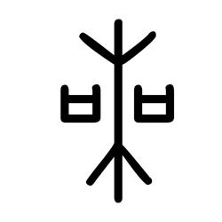

# Component Visual Gallery / 构件图像查看: obs-comp-cand-000247

English:
This page displays OBIMD subcharacter PNG assets extracted into this concrete corpus object directory for human review.

简体中文：
本页展示抽取到当前具体 corpus 对象目录内的 OBIMD subcharacter PNG 资料，供人工复核使用。

Boundary / 边界：dataset image candidate only; not a confirmed component form, component assignment, or decipherment claim.

## asset-011893

- source_zip_member: `Sub-character Images/49lxhylgu1/w7t16ks9wr/w7t16ks9wr.png`
- checksum_sha256: `b8285fe9875c00e5707fb3966c720ccc68aa4684de032c88b773bd1ff9f3a815`
- review_status: `needs_human_visual_review`
- caution: OBIMD subcharacter image is a source-marked review asset only; it is not a confirmed component form, component assignment, or decipherment conclusion.
