# Component Visual Gallery / 构件图像查看: obs-comp-cand-000286

English:
This page displays OBIMD subcharacter PNG assets extracted into this concrete
corpus object directory for human review.

简体中文：
本页展示抽取到当前具体 corpus 对象目录内的 OBIMD subcharacter PNG 资料，供人工复核使用。

Boundary / 边界：
dataset image candidate only; not a confirmed component form, not a component
assignment, and not a decipherment claim.
- not a confirmed component form
- not a component assignment
- not a decipherment claim

## Concrete Questions To Check / 具体待查问题

- Open 06_component-visual-index.csv and name the local image row.
- 打开 06_component-visual-index.csv，写明本地图像行。
- Open 09_component-visual-route-index.csv and name the source route row.
- 打开 09_component-visual-route-index.csv，写明来源路线行。
- Open 13_component-context-evidence-dossier.md for character context.
- 打开 13_component-context-evidence-dossier.md，核对单字与卜辞上下文。
- Record the missing image, near-shape, source, or context route.
- 记录缺失的图像、近形、来源或上下文路线。

## asset-011928

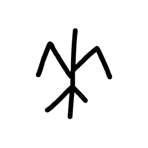

- source_zip_member: `Sub-character Images/rlx0knkq0v/rlx0knkq0v/0o4upl2dmk.png`
- checksum_sha256: see `06_component-visual-index.csv`.
- review_status: `needs_human_visual_review`
- caution: source-marked review image only.

## asset-011929

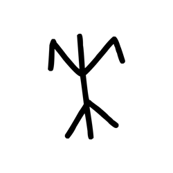

- source_zip_member: `Sub-character Images/rlx0knkq0v/rlx0knkq0v/0ocm3jrtyr.png`
- checksum_sha256: see `06_component-visual-index.csv`.
- review_status: `needs_human_visual_review`
- caution: source-marked review image only.

## asset-011930

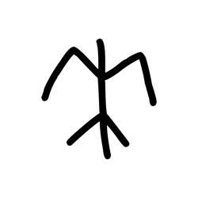

- source_zip_member: `Sub-character Images/rlx0knkq0v/rlx0knkq0v/54z1r1filw.png`
- checksum_sha256: see `06_component-visual-index.csv`.
- review_status: `needs_human_visual_review`
- caution: source-marked review image only.

## asset-011931

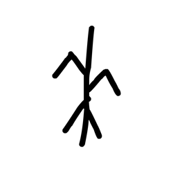

- source_zip_member: `Sub-character Images/rlx0knkq0v/rlx0knkq0v/609ukcpznr.png`
- checksum_sha256: see `06_component-visual-index.csv`.
- review_status: `needs_human_visual_review`
- caution: source-marked review image only.

## asset-011932

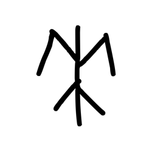

- source_zip_member: `Sub-character Images/rlx0knkq0v/rlx0knkq0v/6w1rg4bmzs.png`
- checksum_sha256: see `06_component-visual-index.csv`.
- review_status: `needs_human_visual_review`
- caution: source-marked review image only.

## asset-011933

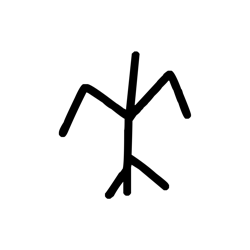

- source_zip_member: `Sub-character Images/rlx0knkq0v/rlx0knkq0v/8a43u6h93t.png`
- checksum_sha256: see `06_component-visual-index.csv`.
- review_status: `needs_human_visual_review`
- caution: source-marked review image only.

## asset-011934

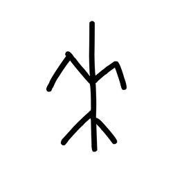

- source_zip_member: `Sub-character Images/rlx0knkq0v/rlx0knkq0v/aw7rqe5zzd.png`
- checksum_sha256: see `06_component-visual-index.csv`.
- review_status: `needs_human_visual_review`
- caution: source-marked review image only.

## asset-011935

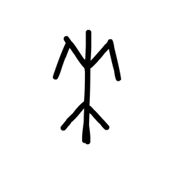

- source_zip_member: `Sub-character Images/rlx0knkq0v/rlx0knkq0v/axbwhypqg0.png`
- checksum_sha256: see `06_component-visual-index.csv`.
- review_status: `needs_human_visual_review`
- caution: source-marked review image only.

## asset-011936

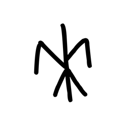

- source_zip_member: `Sub-character Images/rlx0knkq0v/rlx0knkq0v/d6ix7q4xrs.png`
- checksum_sha256: see `06_component-visual-index.csv`.
- review_status: `needs_human_visual_review`
- caution: source-marked review image only.

## asset-011937

- source_zip_member: `Sub-character Images/rlx0knkq0v/rlx0knkq0v/d7nz1eds1c.png`
- checksum_sha256: see `06_component-visual-index.csv`.
- review_status: `needs_human_visual_review`
- caution: source-marked review image only.

## asset-011938

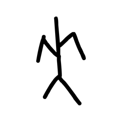

- source_zip_member: `Sub-character Images/rlx0knkq0v/rlx0knkq0v/ie6u58zmcx.png`
- checksum_sha256: see `06_component-visual-index.csv`.
- review_status: `needs_human_visual_review`
- caution: source-marked review image only.

## asset-011939

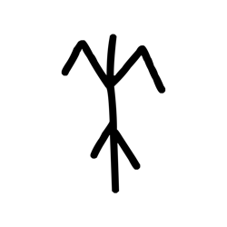

- source_zip_member: `Sub-character Images/rlx0knkq0v/rlx0knkq0v/l4kjhlr9og.png`
- checksum_sha256: see `06_component-visual-index.csv`.
- review_status: `needs_human_visual_review`
- caution: source-marked review image only.

## asset-011940

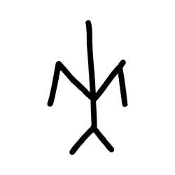

- source_zip_member: `Sub-character Images/rlx0knkq0v/rlx0knkq0v/lbior0mahx.png`
- checksum_sha256: see `06_component-visual-index.csv`.
- review_status: `needs_human_visual_review`
- caution: source-marked review image only.

## asset-011941

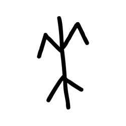

- source_zip_member: `Sub-character Images/rlx0knkq0v/rlx0knkq0v/lrg41rg45p.png`
- checksum_sha256: see `06_component-visual-index.csv`.
- review_status: `needs_human_visual_review`
- caution: source-marked review image only.

## asset-011942

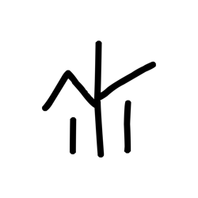

- source_zip_member: `Sub-character Images/rlx0knkq0v/rlx0knkq0v/lufe74qpt0.png`
- checksum_sha256: see `06_component-visual-index.csv`.
- review_status: `needs_human_visual_review`
- caution: source-marked review image only.

## asset-011943

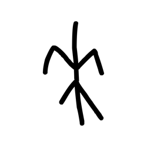

- source_zip_member: `Sub-character Images/rlx0knkq0v/rlx0knkq0v/meusm3nhlu.png`
- checksum_sha256: see `06_component-visual-index.csv`.
- review_status: `needs_human_visual_review`
- caution: source-marked review image only.

## asset-011944

- source_zip_member: `Sub-character Images/rlx0knkq0v/rlx0knkq0v/q0qwqkgjwo.png`
- checksum_sha256: see `06_component-visual-index.csv`.
- review_status: `needs_human_visual_review`
- caution: source-marked review image only.

## asset-011945

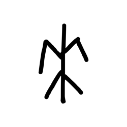

- source_zip_member: `Sub-character Images/rlx0knkq0v/rlx0knkq0v/q90mn23ave.png`
- checksum_sha256: see `06_component-visual-index.csv`.
- review_status: `needs_human_visual_review`
- caution: source-marked review image only.

## asset-011946

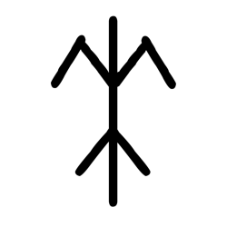

- source_zip_member: `Sub-character Images/rlx0knkq0v/rlx0knkq0v/rlx0knkq0v.png`
- checksum_sha256: see `06_component-visual-index.csv`.
- review_status: `needs_human_visual_review`
- caution: source-marked review image only.

## asset-011947

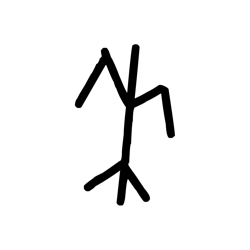

- source_zip_member: `Sub-character Images/rlx0knkq0v/rlx0knkq0v/sma74zz9vn.png`
- checksum_sha256: see `06_component-visual-index.csv`.
- review_status: `needs_human_visual_review`
- caution: source-marked review image only.

## asset-011948

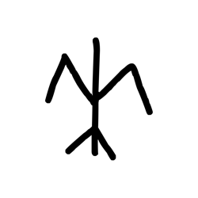

- source_zip_member: `Sub-character Images/rlx0knkq0v/rlx0knkq0v/tkuqfbejfw.png`
- checksum_sha256: see `06_component-visual-index.csv`.
- review_status: `needs_human_visual_review`
- caution: source-marked review image only.

## asset-011949

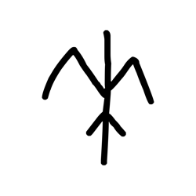

- source_zip_member: `Sub-character Images/rlx0knkq0v/rlx0knkq0v/w6c579vtgq.png`
- checksum_sha256: see `06_component-visual-index.csv`.
- review_status: `needs_human_visual_review`
- caution: source-marked review image only.
