# Component Visual Gallery / 构件图像查看: obs-comp-cand-000287

English:
This page displays OBIMD subcharacter PNG assets extracted into this concrete
corpus object directory for human review.

简体中文：
本页展示抽取到当前具体 corpus 对象目录内的 OBIMD subcharacter PNG 资料，供人工复核使用。

Boundary / 边界：
dataset image candidate only; not a confirmed component form, not a component
assignment, and not a decipherment claim.
- not a confirmed component form
- not a component assignment
- not a decipherment claim

## Concrete Questions To Check / 具体待查问题

- Open 06_component-visual-index.csv and name the local image row.
- 打开 06_component-visual-index.csv，写明本地图像行。
- Open 09_component-visual-route-index.csv and name the source route row.
- 打开 09_component-visual-route-index.csv，写明来源路线行。
- Open 13_component-context-evidence-dossier.md for character context.
- 打开 13_component-context-evidence-dossier.md，核对单字与卜辞上下文。
- Record the missing image, near-shape, source, or context route.
- 记录缺失的图像、近形、来源或上下文路线。

## asset-011950

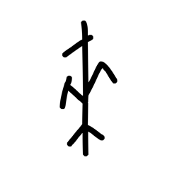

- source_zip_member: `Sub-character Images/rlx0knkq0v/cdi7snpjks/02ufik6rl9.png`
- checksum_sha256: see `06_component-visual-index.csv`.
- review_status: `needs_human_visual_review`
- caution: source-marked review image only.

## asset-011951

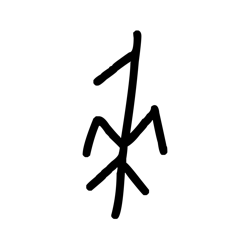

- source_zip_member: `Sub-character Images/rlx0knkq0v/cdi7snpjks/0cu4cs7jmu.png`
- checksum_sha256: see `06_component-visual-index.csv`.
- review_status: `needs_human_visual_review`
- caution: source-marked review image only.

## asset-011952

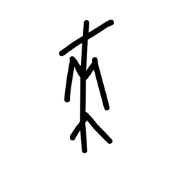

- source_zip_member: `Sub-character Images/rlx0knkq0v/cdi7snpjks/0uznkgcgdy.png`
- checksum_sha256: see `06_component-visual-index.csv`.
- review_status: `needs_human_visual_review`
- caution: source-marked review image only.

## asset-011953

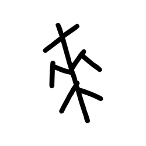

- source_zip_member: `Sub-character Images/rlx0knkq0v/cdi7snpjks/1mn6j7jc7h.png`
- checksum_sha256: see `06_component-visual-index.csv`.
- review_status: `needs_human_visual_review`
- caution: source-marked review image only.

## asset-011954

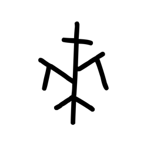

- source_zip_member: `Sub-character Images/rlx0knkq0v/cdi7snpjks/43dsrbvcys.png`
- checksum_sha256: see `06_component-visual-index.csv`.
- review_status: `needs_human_visual_review`
- caution: source-marked review image only.

## asset-011955

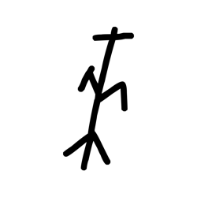

- source_zip_member: `Sub-character Images/rlx0knkq0v/cdi7snpjks/47p7lc0pxg.png`
- checksum_sha256: see `06_component-visual-index.csv`.
- review_status: `needs_human_visual_review`
- caution: source-marked review image only.

## asset-011956

- source_zip_member: `Sub-character Images/rlx0knkq0v/cdi7snpjks/5jtn0oejfe.png`
- checksum_sha256: see `06_component-visual-index.csv`.
- review_status: `needs_human_visual_review`
- caution: source-marked review image only.

## asset-011957

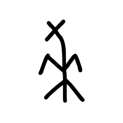

- source_zip_member: `Sub-character Images/rlx0knkq0v/cdi7snpjks/6sl81sxmth.png`
- checksum_sha256: see `06_component-visual-index.csv`.
- review_status: `needs_human_visual_review`
- caution: source-marked review image only.

## asset-011958

- source_zip_member: `Sub-character Images/rlx0knkq0v/cdi7snpjks/72lg3o6b0w.png`
- checksum_sha256: see `06_component-visual-index.csv`.
- review_status: `needs_human_visual_review`
- caution: source-marked review image only.

## asset-011959

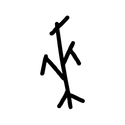

- source_zip_member: `Sub-character Images/rlx0knkq0v/cdi7snpjks/74ov5jlmtz.png`
- checksum_sha256: see `06_component-visual-index.csv`.
- review_status: `needs_human_visual_review`
- caution: source-marked review image only.

## asset-011960

- source_zip_member: `Sub-character Images/rlx0knkq0v/cdi7snpjks/7li9netmst.png`
- checksum_sha256: see `06_component-visual-index.csv`.
- review_status: `needs_human_visual_review`
- caution: source-marked review image only.

## asset-011961

- source_zip_member: `Sub-character Images/rlx0knkq0v/cdi7snpjks/7psnnjicl1.png`
- checksum_sha256: see `06_component-visual-index.csv`.
- review_status: `needs_human_visual_review`
- caution: source-marked review image only.

## asset-011962

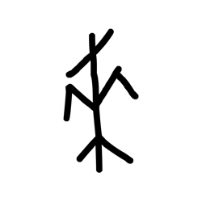

- source_zip_member: `Sub-character Images/rlx0knkq0v/cdi7snpjks/ackdj1zm79.png`
- checksum_sha256: see `06_component-visual-index.csv`.
- review_status: `needs_human_visual_review`
- caution: source-marked review image only.

## asset-011963

- source_zip_member: `Sub-character Images/rlx0knkq0v/cdi7snpjks/bjt70w5yvo.png`
- checksum_sha256: see `06_component-visual-index.csv`.
- review_status: `needs_human_visual_review`
- caution: source-marked review image only.

## asset-011964

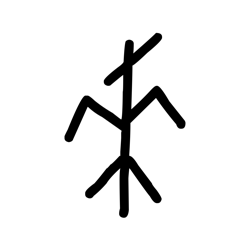

- source_zip_member: `Sub-character Images/rlx0knkq0v/cdi7snpjks/cdi7snpjks.png`
- checksum_sha256: see `06_component-visual-index.csv`.
- review_status: `needs_human_visual_review`
- caution: source-marked review image only.

## asset-011965

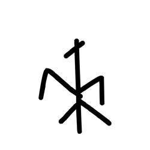

- source_zip_member: `Sub-character Images/rlx0knkq0v/cdi7snpjks/d8g1myvx5w.png`
- checksum_sha256: see `06_component-visual-index.csv`.
- review_status: `needs_human_visual_review`
- caution: source-marked review image only.

## asset-011966

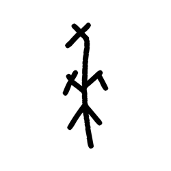

- source_zip_member: `Sub-character Images/rlx0knkq0v/cdi7snpjks/ecocvmmtsm.png`
- checksum_sha256: see `06_component-visual-index.csv`.
- review_status: `needs_human_visual_review`
- caution: source-marked review image only.

## asset-011967

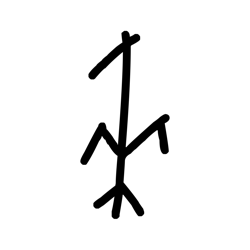

- source_zip_member: `Sub-character Images/rlx0knkq0v/cdi7snpjks/fa0d0g306p.png`
- checksum_sha256: see `06_component-visual-index.csv`.
- review_status: `needs_human_visual_review`
- caution: source-marked review image only.

## asset-011968

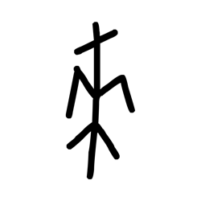

- source_zip_member: `Sub-character Images/rlx0knkq0v/cdi7snpjks/fa31amjd3a.png`
- checksum_sha256: see `06_component-visual-index.csv`.
- review_status: `needs_human_visual_review`
- caution: source-marked review image only.

## asset-011969

- source_zip_member: `Sub-character Images/rlx0knkq0v/cdi7snpjks/flofnb60vk.png`
- checksum_sha256: see `06_component-visual-index.csv`.
- review_status: `needs_human_visual_review`
- caution: source-marked review image only.

## asset-011970

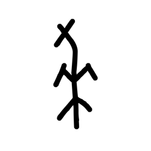

- source_zip_member: `Sub-character Images/rlx0knkq0v/cdi7snpjks/fsu3yjh5f5.png`
- checksum_sha256: see `06_component-visual-index.csv`.
- review_status: `needs_human_visual_review`
- caution: source-marked review image only.

## asset-011971

- source_zip_member: `Sub-character Images/rlx0knkq0v/cdi7snpjks/gam472wh0q.png`
- checksum_sha256: see `06_component-visual-index.csv`.
- review_status: `needs_human_visual_review`
- caution: source-marked review image only.

## asset-011972

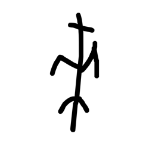

- source_zip_member: `Sub-character Images/rlx0knkq0v/cdi7snpjks/hhw6tc8xke.png`
- checksum_sha256: see `06_component-visual-index.csv`.
- review_status: `needs_human_visual_review`
- caution: source-marked review image only.

## asset-011973

- source_zip_member: `Sub-character Images/rlx0knkq0v/cdi7snpjks/ifhk7yehjo.png`
- checksum_sha256: see `06_component-visual-index.csv`.
- review_status: `needs_human_visual_review`
- caution: source-marked review image only.

## asset-011974

- source_zip_member: `Sub-character Images/rlx0knkq0v/cdi7snpjks/j7j09ks950.png`
- checksum_sha256: see `06_component-visual-index.csv`.
- review_status: `needs_human_visual_review`
- caution: source-marked review image only.

## asset-011975

- source_zip_member: `Sub-character Images/rlx0knkq0v/cdi7snpjks/jr1uj03l57.png`
- checksum_sha256: see `06_component-visual-index.csv`.
- review_status: `needs_human_visual_review`
- caution: source-marked review image only.

## asset-011976

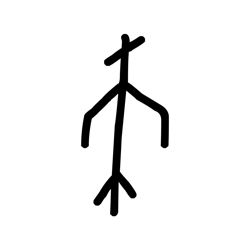

- source_zip_member: `Sub-character Images/rlx0knkq0v/cdi7snpjks/k2y56nvobj.png`
- checksum_sha256: see `06_component-visual-index.csv`.
- review_status: `needs_human_visual_review`
- caution: source-marked review image only.

## asset-011977

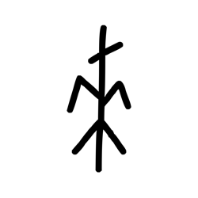

- source_zip_member: `Sub-character Images/rlx0knkq0v/cdi7snpjks/lkj4e20nga.png`
- checksum_sha256: see `06_component-visual-index.csv`.
- review_status: `needs_human_visual_review`
- caution: source-marked review image only.

## asset-011978

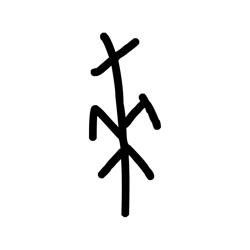

- source_zip_member: `Sub-character Images/rlx0knkq0v/cdi7snpjks/m99aug2luj.png`
- checksum_sha256: see `06_component-visual-index.csv`.
- review_status: `needs_human_visual_review`
- caution: source-marked review image only.

## asset-011979

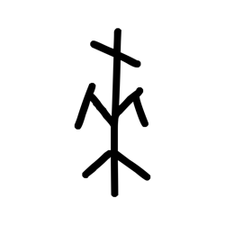

- source_zip_member: `Sub-character Images/rlx0knkq0v/cdi7snpjks/mho6jri43i.png`
- checksum_sha256: see `06_component-visual-index.csv`.
- review_status: `needs_human_visual_review`
- caution: source-marked review image only.

## asset-011980

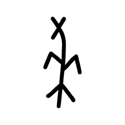

- source_zip_member: `Sub-character Images/rlx0knkq0v/cdi7snpjks/oqazsrx83g.png`
- checksum_sha256: see `06_component-visual-index.csv`.
- review_status: `needs_human_visual_review`
- caution: source-marked review image only.

## asset-011981

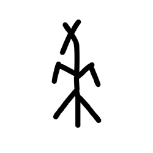

- source_zip_member: `Sub-character Images/rlx0knkq0v/cdi7snpjks/pabz2tz1pk.png`
- checksum_sha256: see `06_component-visual-index.csv`.
- review_status: `needs_human_visual_review`
- caution: source-marked review image only.

## asset-011982

- source_zip_member: `Sub-character Images/rlx0knkq0v/cdi7snpjks/pcdwbmiabt.png`
- checksum_sha256: see `06_component-visual-index.csv`.
- review_status: `needs_human_visual_review`
- caution: source-marked review image only.

## asset-011983

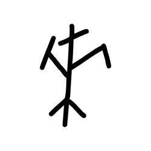

- source_zip_member: `Sub-character Images/rlx0knkq0v/cdi7snpjks/pd4s5dn4m0.png`
- checksum_sha256: see `06_component-visual-index.csv`.
- review_status: `needs_human_visual_review`
- caution: source-marked review image only.

## asset-011984

- source_zip_member: `Sub-character Images/rlx0knkq0v/cdi7snpjks/pvz95t8afp.png`
- checksum_sha256: see `06_component-visual-index.csv`.
- review_status: `needs_human_visual_review`
- caution: source-marked review image only.

## asset-011985

- source_zip_member: `Sub-character Images/rlx0knkq0v/cdi7snpjks/qlfepthmdc.png`
- checksum_sha256: see `06_component-visual-index.csv`.
- review_status: `needs_human_visual_review`
- caution: source-marked review image only.

## asset-011986

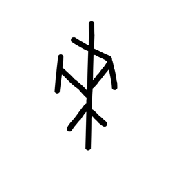

- source_zip_member: `Sub-character Images/rlx0knkq0v/cdi7snpjks/rna0ivcdum.png`
- checksum_sha256: see `06_component-visual-index.csv`.
- review_status: `needs_human_visual_review`
- caution: source-marked review image only.

## asset-011987

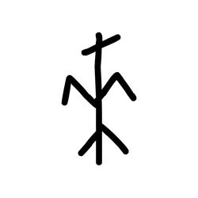

- source_zip_member: `Sub-character Images/rlx0knkq0v/cdi7snpjks/srcb7o7gej.png`
- checksum_sha256: see `06_component-visual-index.csv`.
- review_status: `needs_human_visual_review`
- caution: source-marked review image only.

## asset-011988

- source_zip_member: `Sub-character Images/rlx0knkq0v/cdi7snpjks/t0mk8lvqmx.png`
- checksum_sha256: see `06_component-visual-index.csv`.
- review_status: `needs_human_visual_review`
- caution: source-marked review image only.

## asset-011989

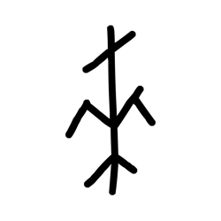

- source_zip_member: `Sub-character Images/rlx0knkq0v/cdi7snpjks/t3q8ocoagl.png`
- checksum_sha256: see `06_component-visual-index.csv`.
- review_status: `needs_human_visual_review`
- caution: source-marked review image only.

## asset-011990

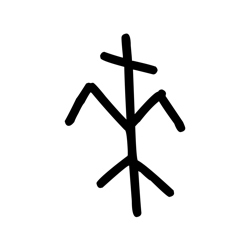

- source_zip_member: `Sub-character Images/rlx0knkq0v/cdi7snpjks/tob5xswz94.png`
- checksum_sha256: see `06_component-visual-index.csv`.
- review_status: `needs_human_visual_review`
- caution: source-marked review image only.

## asset-011991

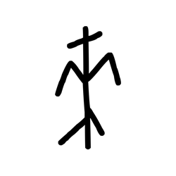

- source_zip_member: `Sub-character Images/rlx0knkq0v/cdi7snpjks/unv0y7i2fp.png`
- checksum_sha256: see `06_component-visual-index.csv`.
- review_status: `needs_human_visual_review`
- caution: source-marked review image only.

## asset-011992

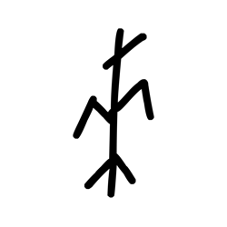

- source_zip_member: `Sub-character Images/rlx0knkq0v/cdi7snpjks/y6wstnxi9w.png`
- checksum_sha256: see `06_component-visual-index.csv`.
- review_status: `needs_human_visual_review`
- caution: source-marked review image only.

## asset-011993

- source_zip_member: `Sub-character Images/rlx0knkq0v/cdi7snpjks/ygiv6sx39f.png`
- checksum_sha256: see `06_component-visual-index.csv`.
- review_status: `needs_human_visual_review`
- caution: source-marked review image only.

## asset-011994

- source_zip_member: `Sub-character Images/rlx0knkq0v/cdi7snpjks/yi1ur8sn5r.png`
- checksum_sha256: see `06_component-visual-index.csv`.
- review_status: `needs_human_visual_review`
- caution: source-marked review image only.

## asset-011995

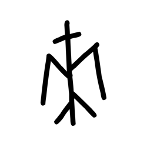

- source_zip_member: `Sub-character Images/rlx0knkq0v/cdi7snpjks/yrp1ehhz8l.png`
- checksum_sha256: see `06_component-visual-index.csv`.
- review_status: `needs_human_visual_review`
- caution: source-marked review image only.

## asset-011996

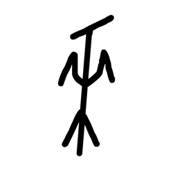

- source_zip_member: `Sub-character Images/rlx0knkq0v/cdi7snpjks/ztt7dnye4b.png`
- checksum_sha256: see `06_component-visual-index.csv`.
- review_status: `needs_human_visual_review`
- caution: source-marked review image only.
