# Component Visual Gallery / 构件图像查看: obs-comp-cand-000294

English:
This page displays OBIMD subcharacter PNG assets extracted into this concrete
corpus object directory for human review.

简体中文：
本页展示抽取到当前具体 corpus 对象目录内的 OBIMD subcharacter PNG 资料，供人工复核使用。

Boundary / 边界：
dataset image candidate only; not a confirmed component form, not a component
assignment, and not a decipherment claim.
- not a confirmed component form
- not a component assignment
- not a decipherment claim

## Concrete Questions To Check / 具体待查问题

- Open 06_component-visual-index.csv and name the local image row.
- 打开 06_component-visual-index.csv，写明本地图像行。
- Open 09_component-visual-route-index.csv and name the source route row.
- 打开 09_component-visual-route-index.csv，写明来源路线行。
- Open 13_component-context-evidence-dossier.md for character context.
- 打开 13_component-context-evidence-dossier.md，核对单字与卜辞上下文。
- Record the missing image, near-shape, source, or context route.
- 记录缺失的图像、近形、来源或上下文路线。

## asset-012002

- source_zip_member: `Sub-character Images/1wismy95hz/1wismy95hz/12aqk63c3h.png`
- checksum_sha256: see `06_component-visual-index.csv`.
- review_status: `needs_human_visual_review`
- caution: source-marked review image only.

## asset-012003

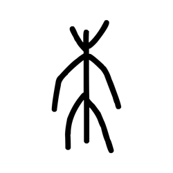

- source_zip_member: `Sub-character Images/1wismy95hz/1wismy95hz/1gx4ecinj8.png`
- checksum_sha256: see `06_component-visual-index.csv`.
- review_status: `needs_human_visual_review`
- caution: source-marked review image only.

## asset-012004

- source_zip_member: `Sub-character Images/1wismy95hz/1wismy95hz/1wismy95hz.png`
- checksum_sha256: see `06_component-visual-index.csv`.
- review_status: `needs_human_visual_review`
- caution: source-marked review image only.

## asset-012005

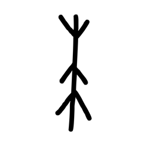

- source_zip_member: `Sub-character Images/1wismy95hz/1wismy95hz/2a6f9hteux.png`
- checksum_sha256: see `06_component-visual-index.csv`.
- review_status: `needs_human_visual_review`
- caution: source-marked review image only.

## asset-012006

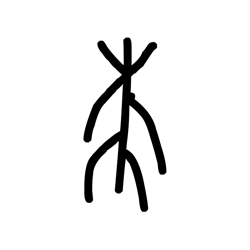

- source_zip_member: `Sub-character Images/1wismy95hz/1wismy95hz/2b4wsxxaeo.png`
- checksum_sha256: see `06_component-visual-index.csv`.
- review_status: `needs_human_visual_review`
- caution: source-marked review image only.

## asset-012007

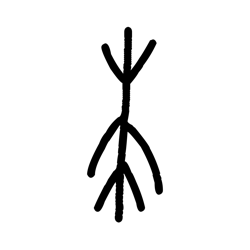

- source_zip_member: `Sub-character Images/1wismy95hz/1wismy95hz/2gnpp0bjwr.png`
- checksum_sha256: see `06_component-visual-index.csv`.
- review_status: `needs_human_visual_review`
- caution: source-marked review image only.

## asset-012008

- source_zip_member: `Sub-character Images/1wismy95hz/1wismy95hz/2zqwiglasq.png`
- checksum_sha256: see `06_component-visual-index.csv`.
- review_status: `needs_human_visual_review`
- caution: source-marked review image only.

## asset-012009

- source_zip_member: `Sub-character Images/1wismy95hz/1wismy95hz/35dxjub8zy.png`
- checksum_sha256: see `06_component-visual-index.csv`.
- review_status: `needs_human_visual_review`
- caution: source-marked review image only.

## asset-012010

- source_zip_member: `Sub-character Images/1wismy95hz/1wismy95hz/41bym7tyfc.png`
- checksum_sha256: see `06_component-visual-index.csv`.
- review_status: `needs_human_visual_review`
- caution: source-marked review image only.

## asset-012011

- source_zip_member: `Sub-character Images/1wismy95hz/1wismy95hz/4y99c47m7b.png`
- checksum_sha256: see `06_component-visual-index.csv`.
- review_status: `needs_human_visual_review`
- caution: source-marked review image only.

## asset-012012

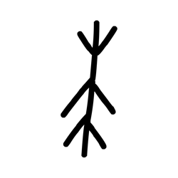

- source_zip_member: `Sub-character Images/1wismy95hz/1wismy95hz/5igonbjoen.png`
- checksum_sha256: see `06_component-visual-index.csv`.
- review_status: `needs_human_visual_review`
- caution: source-marked review image only.

## asset-012013

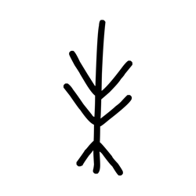

- source_zip_member: `Sub-character Images/1wismy95hz/1wismy95hz/5jlwl0l5im.png`
- checksum_sha256: see `06_component-visual-index.csv`.
- review_status: `needs_human_visual_review`
- caution: source-marked review image only.

## asset-012014

- source_zip_member: `Sub-character Images/1wismy95hz/1wismy95hz/7bp8lz36y3.png`
- checksum_sha256: see `06_component-visual-index.csv`.
- review_status: `needs_human_visual_review`
- caution: source-marked review image only.

## asset-012015

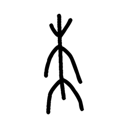

- source_zip_member: `Sub-character Images/1wismy95hz/1wismy95hz/8reukcx54k.png`
- checksum_sha256: see `06_component-visual-index.csv`.
- review_status: `needs_human_visual_review`
- caution: source-marked review image only.

## asset-012016

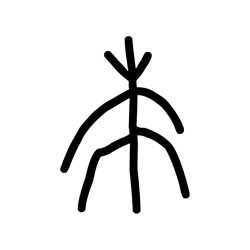

- source_zip_member: `Sub-character Images/1wismy95hz/1wismy95hz/8vko4vsnl7.png`
- checksum_sha256: see `06_component-visual-index.csv`.
- review_status: `needs_human_visual_review`
- caution: source-marked review image only.

## asset-012017

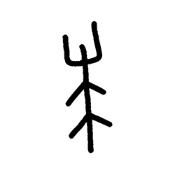

- source_zip_member: `Sub-character Images/1wismy95hz/1wismy95hz/9zv7oze6rw.png`
- checksum_sha256: see `06_component-visual-index.csv`.
- review_status: `needs_human_visual_review`
- caution: source-marked review image only.

## asset-012018

- source_zip_member: `Sub-character Images/1wismy95hz/1wismy95hz/b6o5cezg1k.png`
- checksum_sha256: see `06_component-visual-index.csv`.
- review_status: `needs_human_visual_review`
- caution: source-marked review image only.

## asset-012019

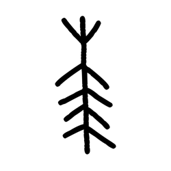

- source_zip_member: `Sub-character Images/1wismy95hz/1wismy95hz/bfcf798rdo.png`
- checksum_sha256: see `06_component-visual-index.csv`.
- review_status: `needs_human_visual_review`
- caution: source-marked review image only.

## asset-012020

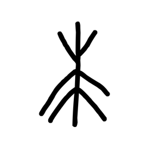

- source_zip_member: `Sub-character Images/1wismy95hz/1wismy95hz/cddmm2zpvn.png`
- checksum_sha256: see `06_component-visual-index.csv`.
- review_status: `needs_human_visual_review`
- caution: source-marked review image only.

## asset-012021

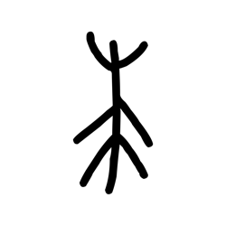

- source_zip_member: `Sub-character Images/1wismy95hz/1wismy95hz/crpztrf2v7.png`
- checksum_sha256: see `06_component-visual-index.csv`.
- review_status: `needs_human_visual_review`
- caution: source-marked review image only.

## asset-012022

- source_zip_member: `Sub-character Images/1wismy95hz/1wismy95hz/cy875uvo5u.png`
- checksum_sha256: see `06_component-visual-index.csv`.
- review_status: `needs_human_visual_review`
- caution: source-marked review image only.

## asset-012023

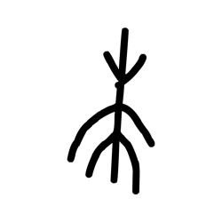

- source_zip_member: `Sub-character Images/1wismy95hz/1wismy95hz/dql0kjjqgd.png`
- checksum_sha256: see `06_component-visual-index.csv`.
- review_status: `needs_human_visual_review`
- caution: source-marked review image only.

## asset-012024

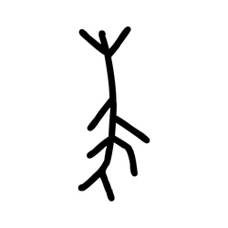

- source_zip_member: `Sub-character Images/1wismy95hz/1wismy95hz/excwyzzlr4.png`
- checksum_sha256: see `06_component-visual-index.csv`.
- review_status: `needs_human_visual_review`
- caution: source-marked review image only.

## asset-012025

- source_zip_member: `Sub-character Images/1wismy95hz/1wismy95hz/flc34ndxuk.png`
- checksum_sha256: see `06_component-visual-index.csv`.
- review_status: `needs_human_visual_review`
- caution: source-marked review image only.

## asset-012026

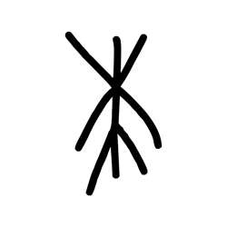

- source_zip_member: `Sub-character Images/1wismy95hz/1wismy95hz/fy2g9kp0f8.png`
- checksum_sha256: see `06_component-visual-index.csv`.
- review_status: `needs_human_visual_review`
- caution: source-marked review image only.

## asset-012027

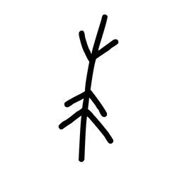

- source_zip_member: `Sub-character Images/1wismy95hz/1wismy95hz/g1u56a0qnq.png`
- checksum_sha256: see `06_component-visual-index.csv`.
- review_status: `needs_human_visual_review`
- caution: source-marked review image only.

## asset-012028

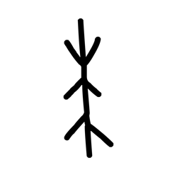

- source_zip_member: `Sub-character Images/1wismy95hz/1wismy95hz/g5wftcxv0d.png`
- checksum_sha256: see `06_component-visual-index.csv`.
- review_status: `needs_human_visual_review`
- caution: source-marked review image only.

## asset-012029

- source_zip_member: `Sub-character Images/1wismy95hz/1wismy95hz/gvp1yvlqss.png`
- checksum_sha256: see `06_component-visual-index.csv`.
- review_status: `needs_human_visual_review`
- caution: source-marked review image only.

## asset-012030

- source_zip_member: `Sub-character Images/1wismy95hz/1wismy95hz/hjrnfxoryi.png`
- checksum_sha256: see `06_component-visual-index.csv`.
- review_status: `needs_human_visual_review`
- caution: source-marked review image only.

## asset-012031

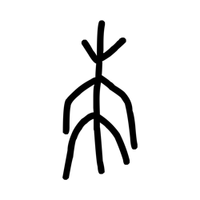

- source_zip_member: `Sub-character Images/1wismy95hz/1wismy95hz/igxap4e3hp.png`
- checksum_sha256: see `06_component-visual-index.csv`.
- review_status: `needs_human_visual_review`
- caution: source-marked review image only.

## asset-012032

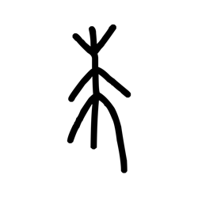

- source_zip_member: `Sub-character Images/1wismy95hz/1wismy95hz/kkoc302l0q.png`
- checksum_sha256: see `06_component-visual-index.csv`.
- review_status: `needs_human_visual_review`
- caution: source-marked review image only.

## asset-012033

- source_zip_member: `Sub-character Images/1wismy95hz/1wismy95hz/lr97a3kp8h.png`
- checksum_sha256: see `06_component-visual-index.csv`.
- review_status: `needs_human_visual_review`
- caution: source-marked review image only.

## asset-012034

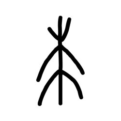

- source_zip_member: `Sub-character Images/1wismy95hz/1wismy95hz/lwe0dwu4mc.png`
- checksum_sha256: see `06_component-visual-index.csv`.
- review_status: `needs_human_visual_review`
- caution: source-marked review image only.

## asset-012035

- source_zip_member: `Sub-character Images/1wismy95hz/1wismy95hz/mhf53qbj9g.png`
- checksum_sha256: see `06_component-visual-index.csv`.
- review_status: `needs_human_visual_review`
- caution: source-marked review image only.

## asset-012036

- source_zip_member: `Sub-character Images/1wismy95hz/1wismy95hz/mr6idwxltr.png`
- checksum_sha256: see `06_component-visual-index.csv`.
- review_status: `needs_human_visual_review`
- caution: source-marked review image only.

## asset-012037

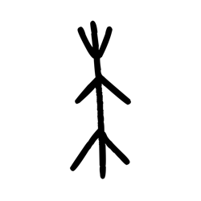

- source_zip_member: `Sub-character Images/1wismy95hz/1wismy95hz/pjfm79yo7n.png`
- checksum_sha256: see `06_component-visual-index.csv`.
- review_status: `needs_human_visual_review`
- caution: source-marked review image only.

## asset-012038

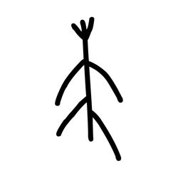

- source_zip_member: `Sub-character Images/1wismy95hz/1wismy95hz/pl6rxvqtij.png`
- checksum_sha256: see `06_component-visual-index.csv`.
- review_status: `needs_human_visual_review`
- caution: source-marked review image only.

## asset-012039

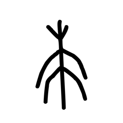

- source_zip_member: `Sub-character Images/1wismy95hz/1wismy95hz/pqqsx1zof2.png`
- checksum_sha256: see `06_component-visual-index.csv`.
- review_status: `needs_human_visual_review`
- caution: source-marked review image only.

## asset-012040

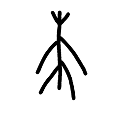

- source_zip_member: `Sub-character Images/1wismy95hz/1wismy95hz/pwymce71ob.png`
- checksum_sha256: see `06_component-visual-index.csv`.
- review_status: `needs_human_visual_review`
- caution: source-marked review image only.

## asset-012041

- source_zip_member: `Sub-character Images/1wismy95hz/1wismy95hz/q7tuv3cz12.png`
- checksum_sha256: see `06_component-visual-index.csv`.
- review_status: `needs_human_visual_review`
- caution: source-marked review image only.

## asset-012042

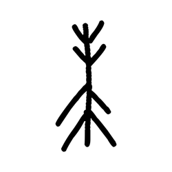

- source_zip_member: `Sub-character Images/1wismy95hz/1wismy95hz/qezgfqoisc.png`
- checksum_sha256: see `06_component-visual-index.csv`.
- review_status: `needs_human_visual_review`
- caution: source-marked review image only.

## asset-012043

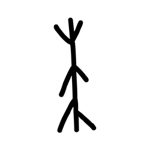

- source_zip_member: `Sub-character Images/1wismy95hz/1wismy95hz/sq62ya2fns.png`
- checksum_sha256: see `06_component-visual-index.csv`.
- review_status: `needs_human_visual_review`
- caution: source-marked review image only.

## asset-012044

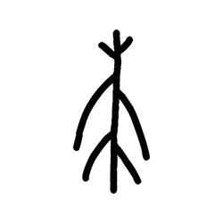

- source_zip_member: `Sub-character Images/1wismy95hz/1wismy95hz/sv25vjbqe9.png`
- checksum_sha256: see `06_component-visual-index.csv`.
- review_status: `needs_human_visual_review`
- caution: source-marked review image only.

## asset-012045

- source_zip_member: `Sub-character Images/1wismy95hz/1wismy95hz/sxy0j6wu83.png`
- checksum_sha256: see `06_component-visual-index.csv`.
- review_status: `needs_human_visual_review`
- caution: source-marked review image only.

## asset-012046

- source_zip_member: `Sub-character Images/1wismy95hz/1wismy95hz/szbg4d22u4.png`
- checksum_sha256: see `06_component-visual-index.csv`.
- review_status: `needs_human_visual_review`
- caution: source-marked review image only.

## asset-012047

- source_zip_member: `Sub-character Images/1wismy95hz/1wismy95hz/t6pe5hpxba.png`
- checksum_sha256: see `06_component-visual-index.csv`.
- review_status: `needs_human_visual_review`
- caution: source-marked review image only.

## asset-012048

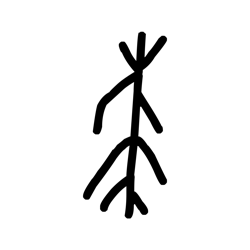

- source_zip_member: `Sub-character Images/1wismy95hz/1wismy95hz/tmgbol6fr5.png`
- checksum_sha256: see `06_component-visual-index.csv`.
- review_status: `needs_human_visual_review`
- caution: source-marked review image only.

## asset-012049

- source_zip_member: `Sub-character Images/1wismy95hz/1wismy95hz/up5f2i1g7a.png`
- checksum_sha256: see `06_component-visual-index.csv`.
- review_status: `needs_human_visual_review`
- caution: source-marked review image only.

## asset-012050

- source_zip_member: `Sub-character Images/1wismy95hz/1wismy95hz/uw5pyu1yjn.png`
- checksum_sha256: see `06_component-visual-index.csv`.
- review_status: `needs_human_visual_review`
- caution: source-marked review image only.

## asset-012051

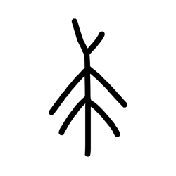

- source_zip_member: `Sub-character Images/1wismy95hz/1wismy95hz/uzag7ybvxu.png`
- checksum_sha256: see `06_component-visual-index.csv`.
- review_status: `needs_human_visual_review`
- caution: source-marked review image only.

## asset-012052

- source_zip_member: `Sub-character Images/1wismy95hz/1wismy95hz/v00e873ch9.png`
- checksum_sha256: see `06_component-visual-index.csv`.
- review_status: `needs_human_visual_review`
- caution: source-marked review image only.

## asset-012053

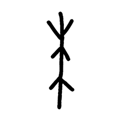

- source_zip_member: `Sub-character Images/1wismy95hz/1wismy95hz/v7o50roltv.png`
- checksum_sha256: see `06_component-visual-index.csv`.
- review_status: `needs_human_visual_review`
- caution: source-marked review image only.

## asset-012054

- source_zip_member: `Sub-character Images/1wismy95hz/1wismy95hz/vro3me47mf.png`
- checksum_sha256: see `06_component-visual-index.csv`.
- review_status: `needs_human_visual_review`
- caution: source-marked review image only.

## asset-012055

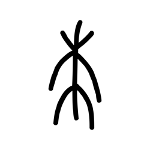

- source_zip_member: `Sub-character Images/1wismy95hz/1wismy95hz/wb5upony6z.png`
- checksum_sha256: see `06_component-visual-index.csv`.
- review_status: `needs_human_visual_review`
- caution: source-marked review image only.

## asset-012056

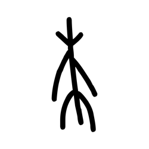

- source_zip_member: `Sub-character Images/1wismy95hz/1wismy95hz/x94ohdtxf3.png`
- checksum_sha256: see `06_component-visual-index.csv`.
- review_status: `needs_human_visual_review`
- caution: source-marked review image only.

## asset-012057

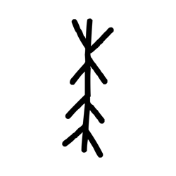

- source_zip_member: `Sub-character Images/1wismy95hz/1wismy95hz/xijbrt2cow.png`
- checksum_sha256: see `06_component-visual-index.csv`.
- review_status: `needs_human_visual_review`
- caution: source-marked review image only.

## asset-012058

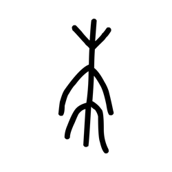

- source_zip_member: `Sub-character Images/1wismy95hz/1wismy95hz/ydp3chobgb.png`
- checksum_sha256: see `06_component-visual-index.csv`.
- review_status: `needs_human_visual_review`
- caution: source-marked review image only.

## asset-012059

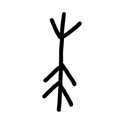

- source_zip_member: `Sub-character Images/1wismy95hz/1wismy95hz/yl6q7gpe4n.png`
- checksum_sha256: see `06_component-visual-index.csv`.
- review_status: `needs_human_visual_review`
- caution: source-marked review image only.

## asset-012060

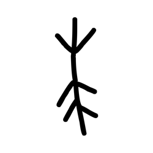

- source_zip_member: `Sub-character Images/1wismy95hz/1wismy95hz/yuiyum9dhg.png`
- checksum_sha256: see `06_component-visual-index.csv`.
- review_status: `needs_human_visual_review`
- caution: source-marked review image only.
