# Component Visual Gallery / 构件图像查看: obs-comp-cand-000304

English:
This page displays OBIMD subcharacter PNG assets extracted into this concrete
corpus object directory for human review.

简体中文：
本页展示抽取到当前具体 corpus 对象目录内的 OBIMD subcharacter PNG 资料，供人工复核使用。

Boundary / 边界：
dataset image candidate only; not a confirmed component form, not a component
assignment, and not a decipherment claim.
- not a confirmed component form
- not a component assignment
- not a decipherment claim

## Concrete Questions To Check / 具体待查问题

- Open 06_component-visual-index.csv and name the local image row.
- 打开 06_component-visual-index.csv，写明本地图像行。
- Open 09_component-visual-route-index.csv and name the source route row.
- 打开 09_component-visual-route-index.csv，写明来源路线行。
- Open 13_component-context-evidence-dossier.md for character context.
- 打开 13_component-context-evidence-dossier.md，核对单字与卜辞上下文。
- Record the missing image, near-shape, source, or context route.
- 记录缺失的图像、近形、来源或上下文路线。

## asset-012070

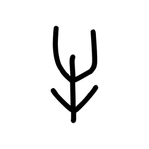

- source_zip_member: `Sub-character Images/66iowpdbuc/66iowpdbuc/060m8jhc19.png`
- checksum_sha256: see `06_component-visual-index.csv`.
- review_status: `needs_human_visual_review`
- caution: source-marked review image only.

## asset-012071

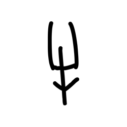

- source_zip_member: `Sub-character Images/66iowpdbuc/66iowpdbuc/0k4tj4do9r.png`
- checksum_sha256: see `06_component-visual-index.csv`.
- review_status: `needs_human_visual_review`
- caution: source-marked review image only.

## asset-012072

- source_zip_member: `Sub-character Images/66iowpdbuc/66iowpdbuc/0mif89aety.png`
- checksum_sha256: see `06_component-visual-index.csv`.
- review_status: `needs_human_visual_review`
- caution: source-marked review image only.

## asset-012073

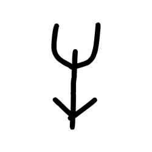

- source_zip_member: `Sub-character Images/66iowpdbuc/66iowpdbuc/10svgcw3bg.png`
- checksum_sha256: see `06_component-visual-index.csv`.
- review_status: `needs_human_visual_review`
- caution: source-marked review image only.

## asset-012074

- source_zip_member: `Sub-character Images/66iowpdbuc/66iowpdbuc/1ajagaadaq.png`
- checksum_sha256: see `06_component-visual-index.csv`.
- review_status: `needs_human_visual_review`
- caution: source-marked review image only.

## asset-012075

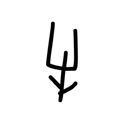

- source_zip_member: `Sub-character Images/66iowpdbuc/66iowpdbuc/1gfhi5f3nf.png`
- checksum_sha256: see `06_component-visual-index.csv`.
- review_status: `needs_human_visual_review`
- caution: source-marked review image only.

## asset-012076

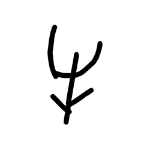

- source_zip_member: `Sub-character Images/66iowpdbuc/66iowpdbuc/2yldfb2a42.png`
- checksum_sha256: see `06_component-visual-index.csv`.
- review_status: `needs_human_visual_review`
- caution: source-marked review image only.

## asset-012077

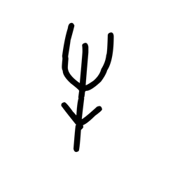

- source_zip_member: `Sub-character Images/66iowpdbuc/66iowpdbuc/3574oub4h4.png`
- checksum_sha256: see `06_component-visual-index.csv`.
- review_status: `needs_human_visual_review`
- caution: source-marked review image only.

## asset-012078

- source_zip_member: `Sub-character Images/66iowpdbuc/66iowpdbuc/38d2hoc8y7.png`
- checksum_sha256: see `06_component-visual-index.csv`.
- review_status: `needs_human_visual_review`
- caution: source-marked review image only.

## asset-012079

- source_zip_member: `Sub-character Images/66iowpdbuc/66iowpdbuc/3e0zvgux9w.png`
- checksum_sha256: see `06_component-visual-index.csv`.
- review_status: `needs_human_visual_review`
- caution: source-marked review image only.

## asset-012080

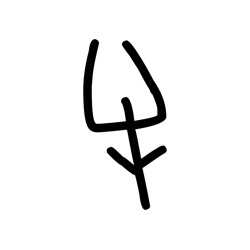

- source_zip_member: `Sub-character Images/66iowpdbuc/66iowpdbuc/3xj9esgo1a.png`
- checksum_sha256: see `06_component-visual-index.csv`.
- review_status: `needs_human_visual_review`
- caution: source-marked review image only.

## asset-012081

- source_zip_member: `Sub-character Images/66iowpdbuc/66iowpdbuc/3z5tt8ffqj.png`
- checksum_sha256: see `06_component-visual-index.csv`.
- review_status: `needs_human_visual_review`
- caution: source-marked review image only.

## asset-012082

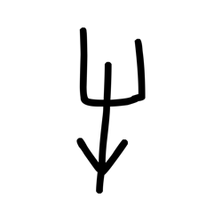

- source_zip_member: `Sub-character Images/66iowpdbuc/66iowpdbuc/46irz8qsr4.png`
- checksum_sha256: see `06_component-visual-index.csv`.
- review_status: `needs_human_visual_review`
- caution: source-marked review image only.

## asset-012083

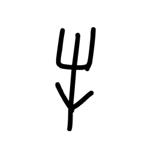

- source_zip_member: `Sub-character Images/66iowpdbuc/66iowpdbuc/46kqdkmipu.png`
- checksum_sha256: see `06_component-visual-index.csv`.
- review_status: `needs_human_visual_review`
- caution: source-marked review image only.

## asset-012084

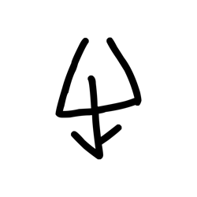

- source_zip_member: `Sub-character Images/66iowpdbuc/66iowpdbuc/4ewjfpilmq.png`
- checksum_sha256: see `06_component-visual-index.csv`.
- review_status: `needs_human_visual_review`
- caution: source-marked review image only.

## asset-012085

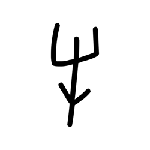

- source_zip_member: `Sub-character Images/66iowpdbuc/66iowpdbuc/4i08sqjpb7.png`
- checksum_sha256: see `06_component-visual-index.csv`.
- review_status: `needs_human_visual_review`
- caution: source-marked review image only.

## asset-012086

- source_zip_member: `Sub-character Images/66iowpdbuc/66iowpdbuc/4w9iayv3o6.png`
- checksum_sha256: see `06_component-visual-index.csv`.
- review_status: `needs_human_visual_review`
- caution: source-marked review image only.

## asset-012087

- source_zip_member: `Sub-character Images/66iowpdbuc/66iowpdbuc/5j9ov1a9e8.png`
- checksum_sha256: see `06_component-visual-index.csv`.
- review_status: `needs_human_visual_review`
- caution: source-marked review image only.

## asset-012088

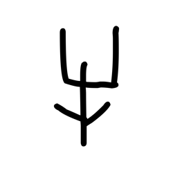

- source_zip_member: `Sub-character Images/66iowpdbuc/66iowpdbuc/5rs0puqvpe.png`
- checksum_sha256: see `06_component-visual-index.csv`.
- review_status: `needs_human_visual_review`
- caution: source-marked review image only.

## asset-012089

- source_zip_member: `Sub-character Images/66iowpdbuc/66iowpdbuc/66iowpdbuc.png`
- checksum_sha256: see `06_component-visual-index.csv`.
- review_status: `needs_human_visual_review`
- caution: source-marked review image only.

## asset-012090

- source_zip_member: `Sub-character Images/66iowpdbuc/66iowpdbuc/6nvg6dpgoq.png`
- checksum_sha256: see `06_component-visual-index.csv`.
- review_status: `needs_human_visual_review`
- caution: source-marked review image only.

## asset-012091

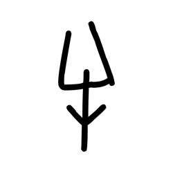

- source_zip_member: `Sub-character Images/66iowpdbuc/66iowpdbuc/74y4bts3d9.png`
- checksum_sha256: see `06_component-visual-index.csv`.
- review_status: `needs_human_visual_review`
- caution: source-marked review image only.

## asset-012092

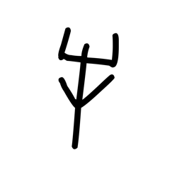

- source_zip_member: `Sub-character Images/66iowpdbuc/66iowpdbuc/7slly516hq.png`
- checksum_sha256: see `06_component-visual-index.csv`.
- review_status: `needs_human_visual_review`
- caution: source-marked review image only.

## asset-012093

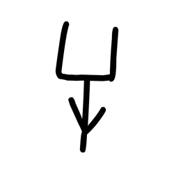

- source_zip_member: `Sub-character Images/66iowpdbuc/66iowpdbuc/827aca509b.png`
- checksum_sha256: see `06_component-visual-index.csv`.
- review_status: `needs_human_visual_review`
- caution: source-marked review image only.

## asset-012094

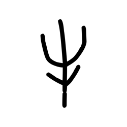

- source_zip_member: `Sub-character Images/66iowpdbuc/66iowpdbuc/8a5il1xzek.png`
- checksum_sha256: see `06_component-visual-index.csv`.
- review_status: `needs_human_visual_review`
- caution: source-marked review image only.

## asset-012095

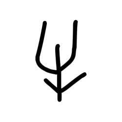

- source_zip_member: `Sub-character Images/66iowpdbuc/66iowpdbuc/8p7oo40euk.png`
- checksum_sha256: see `06_component-visual-index.csv`.
- review_status: `needs_human_visual_review`
- caution: source-marked review image only.

## asset-012096

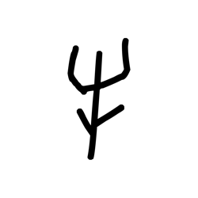

- source_zip_member: `Sub-character Images/66iowpdbuc/66iowpdbuc/8r6pffstwe.png`
- checksum_sha256: see `06_component-visual-index.csv`.
- review_status: `needs_human_visual_review`
- caution: source-marked review image only.

## asset-012097

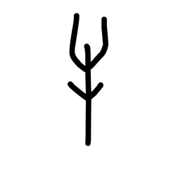

- source_zip_member: `Sub-character Images/66iowpdbuc/66iowpdbuc/90npyo3ffl.png`
- checksum_sha256: see `06_component-visual-index.csv`.
- review_status: `needs_human_visual_review`
- caution: source-marked review image only.

## asset-012098

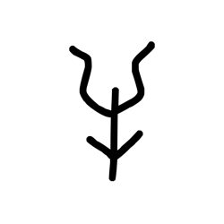

- source_zip_member: `Sub-character Images/66iowpdbuc/66iowpdbuc/91mlbxbjhc.png`
- checksum_sha256: see `06_component-visual-index.csv`.
- review_status: `needs_human_visual_review`
- caution: source-marked review image only.

## asset-012099

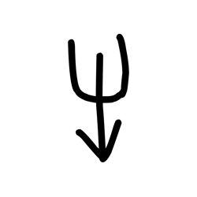

- source_zip_member: `Sub-character Images/66iowpdbuc/66iowpdbuc/9zpm6gnfa5.png`
- checksum_sha256: see `06_component-visual-index.csv`.
- review_status: `needs_human_visual_review`
- caution: source-marked review image only.

## asset-012100

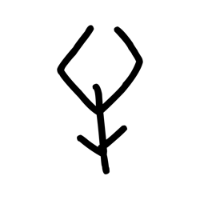

- source_zip_member: `Sub-character Images/66iowpdbuc/66iowpdbuc/ajmryj173c.png`
- checksum_sha256: see `06_component-visual-index.csv`.
- review_status: `needs_human_visual_review`
- caution: source-marked review image only.

## asset-012101

- source_zip_member: `Sub-character Images/66iowpdbuc/66iowpdbuc/ak0i4snsq1.png`
- checksum_sha256: see `06_component-visual-index.csv`.
- review_status: `needs_human_visual_review`
- caution: source-marked review image only.

## asset-012102

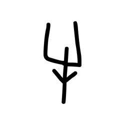

- source_zip_member: `Sub-character Images/66iowpdbuc/66iowpdbuc/anogower1s.png`
- checksum_sha256: see `06_component-visual-index.csv`.
- review_status: `needs_human_visual_review`
- caution: source-marked review image only.

## asset-012103

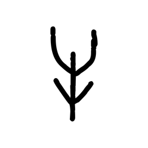

- source_zip_member: `Sub-character Images/66iowpdbuc/66iowpdbuc/arfj8y05ad.png`
- checksum_sha256: see `06_component-visual-index.csv`.
- review_status: `needs_human_visual_review`
- caution: source-marked review image only.

## asset-012104

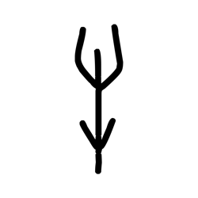

- source_zip_member: `Sub-character Images/66iowpdbuc/66iowpdbuc/atifzxmyqq.png`
- checksum_sha256: see `06_component-visual-index.csv`.
- review_status: `needs_human_visual_review`
- caution: source-marked review image only.

## asset-012105

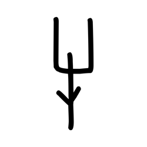

- source_zip_member: `Sub-character Images/66iowpdbuc/66iowpdbuc/auzhl6rllx.png`
- checksum_sha256: see `06_component-visual-index.csv`.
- review_status: `needs_human_visual_review`
- caution: source-marked review image only.

## asset-012106

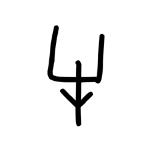

- source_zip_member: `Sub-character Images/66iowpdbuc/66iowpdbuc/azn412cw0o.png`
- checksum_sha256: see `06_component-visual-index.csv`.
- review_status: `needs_human_visual_review`
- caution: source-marked review image only.

## asset-012107

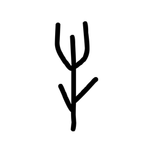

- source_zip_member: `Sub-character Images/66iowpdbuc/66iowpdbuc/bf7ezwvmb6.png`
- checksum_sha256: see `06_component-visual-index.csv`.
- review_status: `needs_human_visual_review`
- caution: source-marked review image only.

## asset-012108

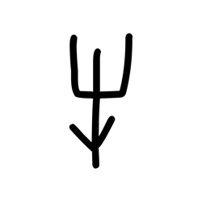

- source_zip_member: `Sub-character Images/66iowpdbuc/66iowpdbuc/bryqcr7jl2.png`
- checksum_sha256: see `06_component-visual-index.csv`.
- review_status: `needs_human_visual_review`
- caution: source-marked review image only.

## asset-012109

- source_zip_member: `Sub-character Images/66iowpdbuc/66iowpdbuc/bsdc2bna2e.png`
- checksum_sha256: see `06_component-visual-index.csv`.
- review_status: `needs_human_visual_review`
- caution: source-marked review image only.

## asset-012110

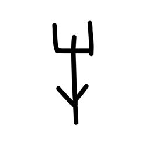

- source_zip_member: `Sub-character Images/66iowpdbuc/66iowpdbuc/c2xp6rrt72.png`
- checksum_sha256: see `06_component-visual-index.csv`.
- review_status: `needs_human_visual_review`
- caution: source-marked review image only.

## asset-012111

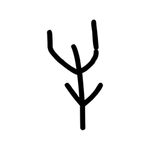

- source_zip_member: `Sub-character Images/66iowpdbuc/66iowpdbuc/cm4zqsjuzz.png`
- checksum_sha256: see `06_component-visual-index.csv`.
- review_status: `needs_human_visual_review`
- caution: source-marked review image only.

## asset-012112

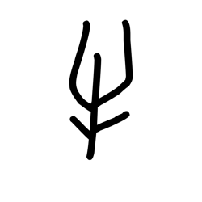

- source_zip_member: `Sub-character Images/66iowpdbuc/66iowpdbuc/d5fk8pw3xf.png`
- checksum_sha256: see `06_component-visual-index.csv`.
- review_status: `needs_human_visual_review`
- caution: source-marked review image only.

## asset-012113

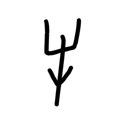

- source_zip_member: `Sub-character Images/66iowpdbuc/66iowpdbuc/d7mdmtqcbv.png`
- checksum_sha256: see `06_component-visual-index.csv`.
- review_status: `needs_human_visual_review`
- caution: source-marked review image only.

## asset-012114

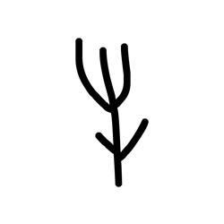

- source_zip_member: `Sub-character Images/66iowpdbuc/66iowpdbuc/dkave0uwcl.png`
- checksum_sha256: see `06_component-visual-index.csv`.
- review_status: `needs_human_visual_review`
- caution: source-marked review image only.

## asset-012115

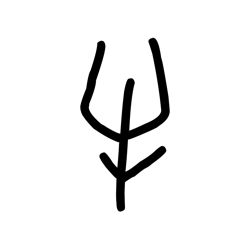

- source_zip_member: `Sub-character Images/66iowpdbuc/66iowpdbuc/dpunvaxzc4.png`
- checksum_sha256: see `06_component-visual-index.csv`.
- review_status: `needs_human_visual_review`
- caution: source-marked review image only.

## asset-012116

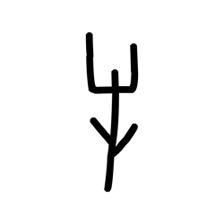

- source_zip_member: `Sub-character Images/66iowpdbuc/66iowpdbuc/f4l9iaw7ab.png`
- checksum_sha256: see `06_component-visual-index.csv`.
- review_status: `needs_human_visual_review`
- caution: source-marked review image only.

## asset-012117

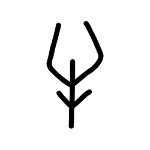

- source_zip_member: `Sub-character Images/66iowpdbuc/66iowpdbuc/h04939cg1w.png`
- checksum_sha256: see `06_component-visual-index.csv`.
- review_status: `needs_human_visual_review`
- caution: source-marked review image only.

## asset-012118

- source_zip_member: `Sub-character Images/66iowpdbuc/66iowpdbuc/h1tl7vbyi9.png`
- checksum_sha256: see `06_component-visual-index.csv`.
- review_status: `needs_human_visual_review`
- caution: source-marked review image only.

## asset-012119

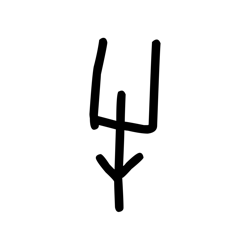

- source_zip_member: `Sub-character Images/66iowpdbuc/66iowpdbuc/h3xdxoc5k7.png`
- checksum_sha256: see `06_component-visual-index.csv`.
- review_status: `needs_human_visual_review`
- caution: source-marked review image only.

## asset-012120

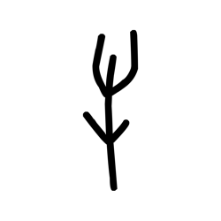

- source_zip_member: `Sub-character Images/66iowpdbuc/66iowpdbuc/hu80zial46.png`
- checksum_sha256: see `06_component-visual-index.csv`.
- review_status: `needs_human_visual_review`
- caution: source-marked review image only.

## asset-012121

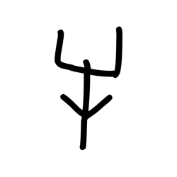

- source_zip_member: `Sub-character Images/66iowpdbuc/66iowpdbuc/ilna3jkyso.png`
- checksum_sha256: see `06_component-visual-index.csv`.
- review_status: `needs_human_visual_review`
- caution: source-marked review image only.

## asset-012122

- source_zip_member: `Sub-character Images/66iowpdbuc/66iowpdbuc/imggcntl5f.png`
- checksum_sha256: see `06_component-visual-index.csv`.
- review_status: `needs_human_visual_review`
- caution: source-marked review image only.

## asset-012123

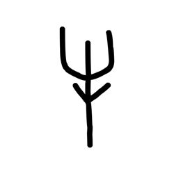

- source_zip_member: `Sub-character Images/66iowpdbuc/66iowpdbuc/imp0mkqj5g.png`
- checksum_sha256: see `06_component-visual-index.csv`.
- review_status: `needs_human_visual_review`
- caution: source-marked review image only.

## asset-012124

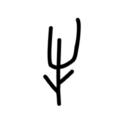

- source_zip_member: `Sub-character Images/66iowpdbuc/66iowpdbuc/iqqyg3k2j3.png`
- checksum_sha256: see `06_component-visual-index.csv`.
- review_status: `needs_human_visual_review`
- caution: source-marked review image only.

## asset-012125

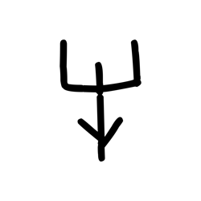

- source_zip_member: `Sub-character Images/66iowpdbuc/66iowpdbuc/j6uux3ndna.png`
- checksum_sha256: see `06_component-visual-index.csv`.
- review_status: `needs_human_visual_review`
- caution: source-marked review image only.

## asset-012126

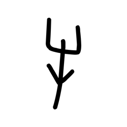

- source_zip_member: `Sub-character Images/66iowpdbuc/66iowpdbuc/jgg95cfics.png`
- checksum_sha256: see `06_component-visual-index.csv`.
- review_status: `needs_human_visual_review`
- caution: source-marked review image only.

## asset-012127

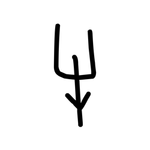

- source_zip_member: `Sub-character Images/66iowpdbuc/66iowpdbuc/jgwh6tts92.png`
- checksum_sha256: see `06_component-visual-index.csv`.
- review_status: `needs_human_visual_review`
- caution: source-marked review image only.

## asset-012128

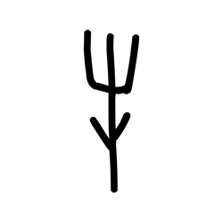

- source_zip_member: `Sub-character Images/66iowpdbuc/66iowpdbuc/kah6b8h5w0.png`
- checksum_sha256: see `06_component-visual-index.csv`.
- review_status: `needs_human_visual_review`
- caution: source-marked review image only.

## asset-012129

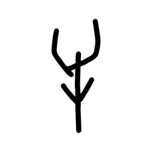

- source_zip_member: `Sub-character Images/66iowpdbuc/66iowpdbuc/kaxor45t4r.png`
- checksum_sha256: see `06_component-visual-index.csv`.
- review_status: `needs_human_visual_review`
- caution: source-marked review image only.

## asset-012130

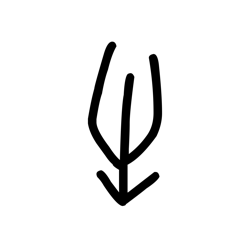

- source_zip_member: `Sub-character Images/66iowpdbuc/66iowpdbuc/ke50j9i7z2.png`
- checksum_sha256: see `06_component-visual-index.csv`.
- review_status: `needs_human_visual_review`
- caution: source-marked review image only.

## asset-012131

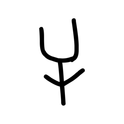

- source_zip_member: `Sub-character Images/66iowpdbuc/66iowpdbuc/ld5t4to19j.png`
- checksum_sha256: see `06_component-visual-index.csv`.
- review_status: `needs_human_visual_review`
- caution: source-marked review image only.

## asset-012132

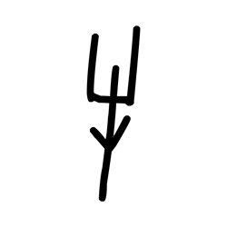

- source_zip_member: `Sub-character Images/66iowpdbuc/66iowpdbuc/lrmsjsw00r.png`
- checksum_sha256: see `06_component-visual-index.csv`.
- review_status: `needs_human_visual_review`
- caution: source-marked review image only.

## asset-012133

- source_zip_member: `Sub-character Images/66iowpdbuc/66iowpdbuc/m4mv1mq09h.png`
- checksum_sha256: see `06_component-visual-index.csv`.
- review_status: `needs_human_visual_review`
- caution: source-marked review image only.

## asset-012134

- source_zip_member: `Sub-character Images/66iowpdbuc/66iowpdbuc/m4wwz8mwve.png`
- checksum_sha256: see `06_component-visual-index.csv`.
- review_status: `needs_human_visual_review`
- caution: source-marked review image only.

## asset-012135

- source_zip_member: `Sub-character Images/66iowpdbuc/66iowpdbuc/m652ja2m6o.png`
- checksum_sha256: see `06_component-visual-index.csv`.
- review_status: `needs_human_visual_review`
- caution: source-marked review image only.

## asset-012136

- source_zip_member: `Sub-character Images/66iowpdbuc/66iowpdbuc/m65b2fk3ga.png`
- checksum_sha256: see `06_component-visual-index.csv`.
- review_status: `needs_human_visual_review`
- caution: source-marked review image only.

## asset-012137

- source_zip_member: `Sub-character Images/66iowpdbuc/66iowpdbuc/mbfrx8jeil.png`
- checksum_sha256: see `06_component-visual-index.csv`.
- review_status: `needs_human_visual_review`
- caution: source-marked review image only.

## asset-012138

- source_zip_member: `Sub-character Images/66iowpdbuc/66iowpdbuc/mp98l2uh4t.png`
- checksum_sha256: see `06_component-visual-index.csv`.
- review_status: `needs_human_visual_review`
- caution: source-marked review image only.

## asset-012139

- source_zip_member: `Sub-character Images/66iowpdbuc/66iowpdbuc/mvh20rszcd.png`
- checksum_sha256: see `06_component-visual-index.csv`.
- review_status: `needs_human_visual_review`
- caution: source-marked review image only.

## asset-012140

- source_zip_member: `Sub-character Images/66iowpdbuc/66iowpdbuc/mwhjbwvz65.png`
- checksum_sha256: see `06_component-visual-index.csv`.
- review_status: `needs_human_visual_review`
- caution: source-marked review image only.

## asset-012141

- source_zip_member: `Sub-character Images/66iowpdbuc/66iowpdbuc/mwppfgutbn.png`
- checksum_sha256: see `06_component-visual-index.csv`.
- review_status: `needs_human_visual_review`
- caution: source-marked review image only.

## asset-012142

- source_zip_member: `Sub-character Images/66iowpdbuc/66iowpdbuc/nkn01i3fvh.png`
- checksum_sha256: see `06_component-visual-index.csv`.
- review_status: `needs_human_visual_review`
- caution: source-marked review image only.

## asset-012143

- source_zip_member: `Sub-character Images/66iowpdbuc/66iowpdbuc/oosccj6pjz.png`
- checksum_sha256: see `06_component-visual-index.csv`.
- review_status: `needs_human_visual_review`
- caution: source-marked review image only.

## asset-012144

- source_zip_member: `Sub-character Images/66iowpdbuc/66iowpdbuc/opniqvs5g5.png`
- checksum_sha256: see `06_component-visual-index.csv`.
- review_status: `needs_human_visual_review`
- caution: source-marked review image only.

## asset-012145

- source_zip_member: `Sub-character Images/66iowpdbuc/66iowpdbuc/opzzazkepv.png`
- checksum_sha256: see `06_component-visual-index.csv`.
- review_status: `needs_human_visual_review`
- caution: source-marked review image only.

## asset-012146

- source_zip_member: `Sub-character Images/66iowpdbuc/66iowpdbuc/orbhit47cf.png`
- checksum_sha256: see `06_component-visual-index.csv`.
- review_status: `needs_human_visual_review`
- caution: source-marked review image only.

## asset-012147

- source_zip_member: `Sub-character Images/66iowpdbuc/66iowpdbuc/phjorgi0k8.png`
- checksum_sha256: see `06_component-visual-index.csv`.
- review_status: `needs_human_visual_review`
- caution: source-marked review image only.

## asset-012148

- source_zip_member: `Sub-character Images/66iowpdbuc/66iowpdbuc/pu9hqforzw.png`
- checksum_sha256: see `06_component-visual-index.csv`.
- review_status: `needs_human_visual_review`
- caution: source-marked review image only.

## asset-012149

- source_zip_member: `Sub-character Images/66iowpdbuc/66iowpdbuc/pvlanrnw6f.png`
- checksum_sha256: see `06_component-visual-index.csv`.
- review_status: `needs_human_visual_review`
- caution: source-marked review image only.

## asset-012150

- source_zip_member: `Sub-character Images/66iowpdbuc/66iowpdbuc/pyqyprfgha.png`
- checksum_sha256: see `06_component-visual-index.csv`.
- review_status: `needs_human_visual_review`
- caution: source-marked review image only.

## asset-012151

- source_zip_member: `Sub-character Images/66iowpdbuc/66iowpdbuc/q7yl9ud4oj.png`
- checksum_sha256: see `06_component-visual-index.csv`.
- review_status: `needs_human_visual_review`
- caution: source-marked review image only.

## asset-012152

- source_zip_member: `Sub-character Images/66iowpdbuc/66iowpdbuc/q96cjeoexm.png`
- checksum_sha256: see `06_component-visual-index.csv`.
- review_status: `needs_human_visual_review`
- caution: source-marked review image only.

## asset-012153

- source_zip_member: `Sub-character Images/66iowpdbuc/66iowpdbuc/r5w6h32a7r.png`
- checksum_sha256: see `06_component-visual-index.csv`.
- review_status: `needs_human_visual_review`
- caution: source-marked review image only.

## asset-012154

- source_zip_member: `Sub-character Images/66iowpdbuc/66iowpdbuc/ryfif5qlg6.png`
- checksum_sha256: see `06_component-visual-index.csv`.
- review_status: `needs_human_visual_review`
- caution: source-marked review image only.

## asset-012155

- source_zip_member: `Sub-character Images/66iowpdbuc/66iowpdbuc/u3p8qjikix.png`
- checksum_sha256: see `06_component-visual-index.csv`.
- review_status: `needs_human_visual_review`
- caution: source-marked review image only.

## asset-012156

- source_zip_member: `Sub-character Images/66iowpdbuc/66iowpdbuc/um8hs6t33w.png`
- checksum_sha256: see `06_component-visual-index.csv`.
- review_status: `needs_human_visual_review`
- caution: source-marked review image only.

## asset-012157

- source_zip_member: `Sub-character Images/66iowpdbuc/66iowpdbuc/v4r75c1fb1.png`
- checksum_sha256: see `06_component-visual-index.csv`.
- review_status: `needs_human_visual_review`
- caution: source-marked review image only.

## asset-012158

- source_zip_member: `Sub-character Images/66iowpdbuc/66iowpdbuc/vdzylsswin.png`
- checksum_sha256: see `06_component-visual-index.csv`.
- review_status: `needs_human_visual_review`
- caution: source-marked review image only.

## asset-012159

- source_zip_member: `Sub-character Images/66iowpdbuc/66iowpdbuc/wnwa0v5qzo.png`
- checksum_sha256: see `06_component-visual-index.csv`.
- review_status: `needs_human_visual_review`
- caution: source-marked review image only.

## asset-012160

- source_zip_member: `Sub-character Images/66iowpdbuc/66iowpdbuc/wyfyt0qewp.png`
- checksum_sha256: see `06_component-visual-index.csv`.
- review_status: `needs_human_visual_review`
- caution: source-marked review image only.

## asset-012161

- source_zip_member: `Sub-character Images/66iowpdbuc/66iowpdbuc/x9m1h1nr1m.png`
- checksum_sha256: see `06_component-visual-index.csv`.
- review_status: `needs_human_visual_review`
- caution: source-marked review image only.

## asset-012162

- source_zip_member: `Sub-character Images/66iowpdbuc/66iowpdbuc/xvpa8jk824.png`
- checksum_sha256: see `06_component-visual-index.csv`.
- review_status: `needs_human_visual_review`
- caution: source-marked review image only.

## asset-012163

- source_zip_member: `Sub-character Images/66iowpdbuc/66iowpdbuc/y0c4qo9rw0.png`
- checksum_sha256: see `06_component-visual-index.csv`.
- review_status: `needs_human_visual_review`
- caution: source-marked review image only.

## asset-012164

- source_zip_member: `Sub-character Images/66iowpdbuc/66iowpdbuc/y8gy4cu3yq.png`
- checksum_sha256: see `06_component-visual-index.csv`.
- review_status: `needs_human_visual_review`
- caution: source-marked review image only.

## asset-012165

- source_zip_member: `Sub-character Images/66iowpdbuc/66iowpdbuc/zi38edk9vy.png`
- checksum_sha256: see `06_component-visual-index.csv`.
- review_status: `needs_human_visual_review`
- caution: source-marked review image only.

## asset-012166

- source_zip_member: `Sub-character Images/66iowpdbuc/66iowpdbuc/zpi980jjpa.png`
- checksum_sha256: see `06_component-visual-index.csv`.
- review_status: `needs_human_visual_review`
- caution: source-marked review image only.
