# Component Visual Gallery / 构件图像查看: obs-comp-cand-000310

English:
This page displays OBIMD subcharacter PNG assets extracted into this concrete corpus object directory for human review.

简体中文：
本页展示抽取到当前具体 corpus 对象目录内的 OBIMD subcharacter PNG 资料，供人工复核使用。

Boundary / 边界：dataset image candidate only; not a confirmed component form, component assignment, or decipherment claim.

## asset-012172

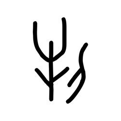

- source_zip_member: `Sub-character Images/nllrzldww6/nllrzldww6/0ayhmmqscg.png`
- checksum_sha256: `89e2f239e3a734278c32865cf42b7b9a63f6c6d8cc80ad04da57ecb5ad898d88`
- review_status: `needs_human_visual_review`
- caution: OBIMD subcharacter image is a source-marked review asset only; it is not a confirmed component form, component assignment, or decipherment conclusion.

## asset-012173

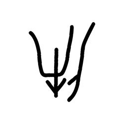

- source_zip_member: `Sub-character Images/nllrzldww6/nllrzldww6/0fnfme36w8.png`
- checksum_sha256: `01fcf115e1aaebf8fed32cf2185f2649326c08720c4acdb5933ef96c138b7b17`
- review_status: `needs_human_visual_review`
- caution: OBIMD subcharacter image is a source-marked review asset only; it is not a confirmed component form, component assignment, or decipherment conclusion.

## asset-012174

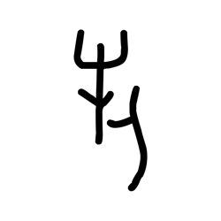

- source_zip_member: `Sub-character Images/nllrzldww6/nllrzldww6/0zcvb8fv9g.png`
- checksum_sha256: `7efe2fe21694e1caccd6d86f4db94bdfe3efd420cc7845407117e0f3c99a7387`
- review_status: `needs_human_visual_review`
- caution: OBIMD subcharacter image is a source-marked review asset only; it is not a confirmed component form, component assignment, or decipherment conclusion.

## asset-012175

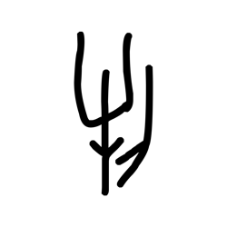

- source_zip_member: `Sub-character Images/nllrzldww6/nllrzldww6/1ojj1mgl8q.png`
- checksum_sha256: `4ac17b16f701a8c06422940809be16a2cc6ea29954f90bb804ff0b4fac9ecf29`
- review_status: `needs_human_visual_review`
- caution: OBIMD subcharacter image is a source-marked review asset only; it is not a confirmed component form, component assignment, or decipherment conclusion.

## asset-012176

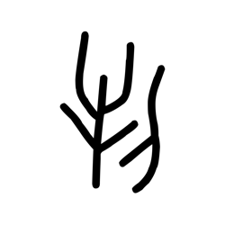

- source_zip_member: `Sub-character Images/nllrzldww6/nllrzldww6/2xjykkfnl8.png`
- checksum_sha256: `5854c494a280a6b834c73266b05006a974125b27c36d24494864bb1905016128`
- review_status: `needs_human_visual_review`
- caution: OBIMD subcharacter image is a source-marked review asset only; it is not a confirmed component form, component assignment, or decipherment conclusion.

## asset-012177

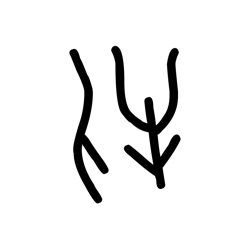

- source_zip_member: `Sub-character Images/nllrzldww6/nllrzldww6/36ubxe1mec.png`
- checksum_sha256: `bbdf7764c6bee0391d7a2698b244b0bbabf2f87d149b15435e34abd5ad331e43`
- review_status: `needs_human_visual_review`
- caution: OBIMD subcharacter image is a source-marked review asset only; it is not a confirmed component form, component assignment, or decipherment conclusion.

## asset-012178

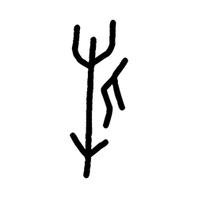

- source_zip_member: `Sub-character Images/nllrzldww6/nllrzldww6/5k9ewh91zr.png`
- checksum_sha256: `ad9f8d95f8dec86dbb84df6220dbb0c0008bbe65ba0c2a363f13a6b61c6ae7b7`
- review_status: `needs_human_visual_review`
- caution: OBIMD subcharacter image is a source-marked review asset only; it is not a confirmed component form, component assignment, or decipherment conclusion.

## asset-012179

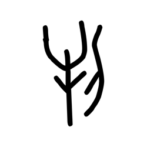

- source_zip_member: `Sub-character Images/nllrzldww6/nllrzldww6/5zm0xp24mw.png`
- checksum_sha256: `36d437e718e1125533acd71750b73cbb7d9fba30a744cd7e4e5263680ff5591e`
- review_status: `needs_human_visual_review`
- caution: OBIMD subcharacter image is a source-marked review asset only; it is not a confirmed component form, component assignment, or decipherment conclusion.

## asset-012180

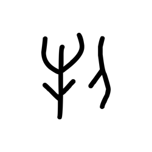

- source_zip_member: `Sub-character Images/nllrzldww6/nllrzldww6/643zs7tsi2.png`
- checksum_sha256: `bacdcd55af1ba44c0472dd3d5856925c5ed946302a13bc9510e592c02fa1ead3`
- review_status: `needs_human_visual_review`
- caution: OBIMD subcharacter image is a source-marked review asset only; it is not a confirmed component form, component assignment, or decipherment conclusion.

## asset-012181

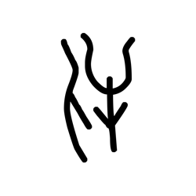

- source_zip_member: `Sub-character Images/nllrzldww6/nllrzldww6/6eyzsvgua4.png`
- checksum_sha256: `48ae884dfadc9eb7c2087dd16b35affbefd726ed89065b5d260806de9b1918b7`
- review_status: `needs_human_visual_review`
- caution: OBIMD subcharacter image is a source-marked review asset only; it is not a confirmed component form, component assignment, or decipherment conclusion.

## asset-012182

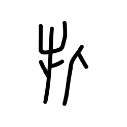

- source_zip_member: `Sub-character Images/nllrzldww6/nllrzldww6/7bmrnj146p.png`
- checksum_sha256: `5bd0905768a4b1bd44ca9df5c61da00fd3b1782ffbaa89f7f8306f3eb15bd01c`
- review_status: `needs_human_visual_review`
- caution: OBIMD subcharacter image is a source-marked review asset only; it is not a confirmed component form, component assignment, or decipherment conclusion.

## asset-012183

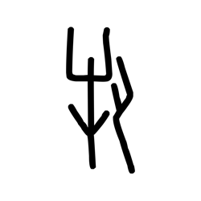

- source_zip_member: `Sub-character Images/nllrzldww6/nllrzldww6/7ixn0pkndm.png`
- checksum_sha256: `22de62049182a4924752e6f23c8b3a9c70e9e40a865ec5f54c078208e0ebda63`
- review_status: `needs_human_visual_review`
- caution: OBIMD subcharacter image is a source-marked review asset only; it is not a confirmed component form, component assignment, or decipherment conclusion.

## asset-012184

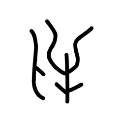

- source_zip_member: `Sub-character Images/nllrzldww6/nllrzldww6/7kkm9gs33w.png`
- checksum_sha256: `a15a4789dfca70f83247abe7bab9c2cb1784f7721019956192f262d6d04939e5`
- review_status: `needs_human_visual_review`
- caution: OBIMD subcharacter image is a source-marked review asset only; it is not a confirmed component form, component assignment, or decipherment conclusion.

## asset-012185

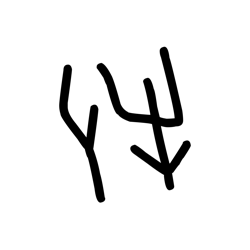

- source_zip_member: `Sub-character Images/nllrzldww6/nllrzldww6/am49fn37mm.png`
- checksum_sha256: `deae31fdd98dede082e0388bcff4997a799167c5c6804d0d0786e4f9be5e1393`
- review_status: `needs_human_visual_review`
- caution: OBIMD subcharacter image is a source-marked review asset only; it is not a confirmed component form, component assignment, or decipherment conclusion.

## asset-012186

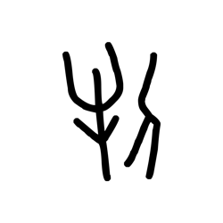

- source_zip_member: `Sub-character Images/nllrzldww6/nllrzldww6/amwpnkpjxs.png`
- checksum_sha256: `fa518c270da4e4fa8f2685951a29144e1e952142ac4b025883c1c75576ac4576`
- review_status: `needs_human_visual_review`
- caution: OBIMD subcharacter image is a source-marked review asset only; it is not a confirmed component form, component assignment, or decipherment conclusion.

## asset-012187

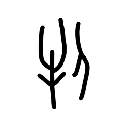

- source_zip_member: `Sub-character Images/nllrzldww6/nllrzldww6/ao609ugvor.png`
- checksum_sha256: `0c19f83ebdca43f7dfa309a1e76f4fab7272d74e4c17c0d31537be5437e3c3a9`
- review_status: `needs_human_visual_review`
- caution: OBIMD subcharacter image is a source-marked review asset only; it is not a confirmed component form, component assignment, or decipherment conclusion.

## asset-012188

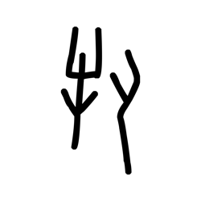

- source_zip_member: `Sub-character Images/nllrzldww6/nllrzldww6/apsseie0zx.png`
- checksum_sha256: `97957b5646bed5364210206f23486bfb84bd8778e99b6fa6c3126799e36c1042`
- review_status: `needs_human_visual_review`
- caution: OBIMD subcharacter image is a source-marked review asset only; it is not a confirmed component form, component assignment, or decipherment conclusion.

## asset-012189

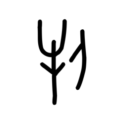

- source_zip_member: `Sub-character Images/nllrzldww6/nllrzldww6/asfidqs92w.png`
- checksum_sha256: `84cfbf26c9b5fabe5b36d07c15a81e5e04da44111eb037a1fefa78df63d30eb9`
- review_status: `needs_human_visual_review`
- caution: OBIMD subcharacter image is a source-marked review asset only; it is not a confirmed component form, component assignment, or decipherment conclusion.

## asset-012190

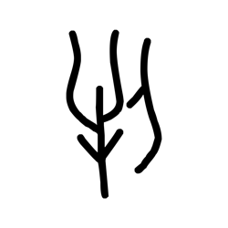

- source_zip_member: `Sub-character Images/nllrzldww6/nllrzldww6/bu6l0e08t1.png`
- checksum_sha256: `6769a01dbfed9de6171406e5f1103389256a049ff5082cc09269782312497b1a`
- review_status: `needs_human_visual_review`
- caution: OBIMD subcharacter image is a source-marked review asset only; it is not a confirmed component form, component assignment, or decipherment conclusion.

## asset-012191

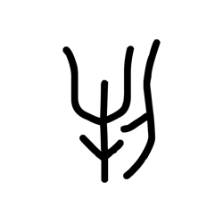

- source_zip_member: `Sub-character Images/nllrzldww6/nllrzldww6/c8xg0dmsgg.png`
- checksum_sha256: `194ef400c9c45b74d6044f026eecc442af3377db2894c99b5471c5cc55e8a485`
- review_status: `needs_human_visual_review`
- caution: OBIMD subcharacter image is a source-marked review asset only; it is not a confirmed component form, component assignment, or decipherment conclusion.

## asset-012192

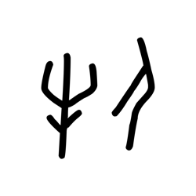

- source_zip_member: `Sub-character Images/nllrzldww6/nllrzldww6/d06hbjtki4.png`
- checksum_sha256: `4ba680d6d42fbdd056aa93eeac659d1c03d13527553d4d191ead2d2e2342f097`
- review_status: `needs_human_visual_review`
- caution: OBIMD subcharacter image is a source-marked review asset only; it is not a confirmed component form, component assignment, or decipherment conclusion.

## asset-012193

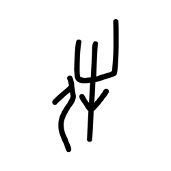

- source_zip_member: `Sub-character Images/nllrzldww6/nllrzldww6/dea6gv40ob.png`
- checksum_sha256: `1be662ae6e83e698bedba8e5d3f7c545b853e1c22fd0e7df0f35d153661c46d7`
- review_status: `needs_human_visual_review`
- caution: OBIMD subcharacter image is a source-marked review asset only; it is not a confirmed component form, component assignment, or decipherment conclusion.

## asset-012194

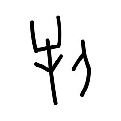

- source_zip_member: `Sub-character Images/nllrzldww6/nllrzldww6/e415d3wfia.png`
- checksum_sha256: `0428553b44cf66315a56cdde26f2636ce0bda44b54d93dac196363e4997479a1`
- review_status: `needs_human_visual_review`
- caution: OBIMD subcharacter image is a source-marked review asset only; it is not a confirmed component form, component assignment, or decipherment conclusion.

## asset-012195

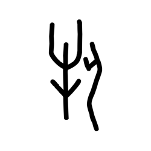

- source_zip_member: `Sub-character Images/nllrzldww6/nllrzldww6/ea8pccobav.png`
- checksum_sha256: `19c5bab55f63200ede4d1e3dffc8428c4087a17118964bce5b8727afa977317b`
- review_status: `needs_human_visual_review`
- caution: OBIMD subcharacter image is a source-marked review asset only; it is not a confirmed component form, component assignment, or decipherment conclusion.

## asset-012196

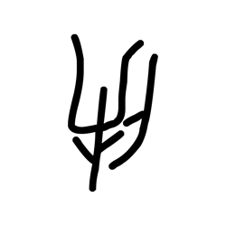

- source_zip_member: `Sub-character Images/nllrzldww6/nllrzldww6/gt7x1gxj0t.png`
- checksum_sha256: `5900d4664dec84a25905579564dbc6c7601d45f4038a9e48e1652b0d9972e31b`
- review_status: `needs_human_visual_review`
- caution: OBIMD subcharacter image is a source-marked review asset only; it is not a confirmed component form, component assignment, or decipherment conclusion.

## asset-012197

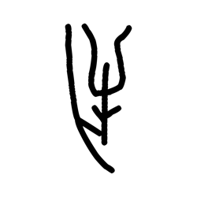

- source_zip_member: `Sub-character Images/nllrzldww6/nllrzldww6/gwt72gnisl.png`
- checksum_sha256: `b1431a771175b91b7f988a78293db7bac2336f90b7882ad512645e95fb8b1740`
- review_status: `needs_human_visual_review`
- caution: OBIMD subcharacter image is a source-marked review asset only; it is not a confirmed component form, component assignment, or decipherment conclusion.

## asset-012198

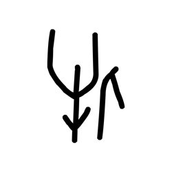

- source_zip_member: `Sub-character Images/nllrzldww6/nllrzldww6/h3r3thj3d3.png`
- checksum_sha256: `930a92ece64e3593bc47514620f0c17eedd7fb10753f9dcb5515b72b00312735`
- review_status: `needs_human_visual_review`
- caution: OBIMD subcharacter image is a source-marked review asset only; it is not a confirmed component form, component assignment, or decipherment conclusion.

## asset-012199

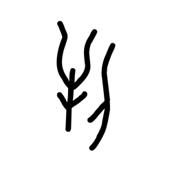

- source_zip_member: `Sub-character Images/nllrzldww6/nllrzldww6/hi21nwvepf.png`
- checksum_sha256: `efb222f59d2fed466a50912e031cc4fc969ced3aa362b75051de118881296d7d`
- review_status: `needs_human_visual_review`
- caution: OBIMD subcharacter image is a source-marked review asset only; it is not a confirmed component form, component assignment, or decipherment conclusion.

## asset-012200

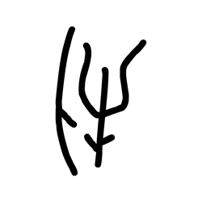

- source_zip_member: `Sub-character Images/nllrzldww6/nllrzldww6/j10qo07bn9.png`
- checksum_sha256: `f6cc221f9deb940fc7a5550097f47b64fc5b053776c277ea99b0d788142e1ac5`
- review_status: `needs_human_visual_review`
- caution: OBIMD subcharacter image is a source-marked review asset only; it is not a confirmed component form, component assignment, or decipherment conclusion.

## asset-012201

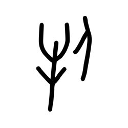

- source_zip_member: `Sub-character Images/nllrzldww6/nllrzldww6/j1pb02glrw.png`
- checksum_sha256: `622d43f755e686b0310a0840ea15fcd559d4cc7887a06137364ea7b37c17e6fa`
- review_status: `needs_human_visual_review`
- caution: OBIMD subcharacter image is a source-marked review asset only; it is not a confirmed component form, component assignment, or decipherment conclusion.

## asset-012202

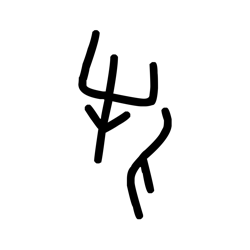

- source_zip_member: `Sub-character Images/nllrzldww6/nllrzldww6/jlnd4p39uy.png`
- checksum_sha256: `a4c7cbd74ad513369fdd3c016dd0ff90a05972e327661e1e30abeff2bb841956`
- review_status: `needs_human_visual_review`
- caution: OBIMD subcharacter image is a source-marked review asset only; it is not a confirmed component form, component assignment, or decipherment conclusion.

## asset-012203

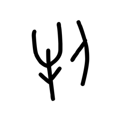

- source_zip_member: `Sub-character Images/nllrzldww6/nllrzldww6/k18kor95z0.png`
- checksum_sha256: `a5ae57173fb2162923bb6bec45f0e33e34ad3e3b587ff36e41cc87567844813f`
- review_status: `needs_human_visual_review`
- caution: OBIMD subcharacter image is a source-marked review asset only; it is not a confirmed component form, component assignment, or decipherment conclusion.

## asset-012204

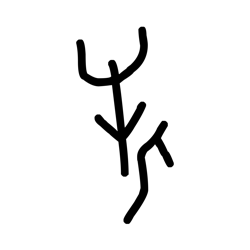

- source_zip_member: `Sub-character Images/nllrzldww6/nllrzldww6/kjdz58kzlk.png`
- checksum_sha256: `aad545cb1452597db3e33a93ba827a565e959c01d36a6ede3858a51623646fd9`
- review_status: `needs_human_visual_review`
- caution: OBIMD subcharacter image is a source-marked review asset only; it is not a confirmed component form, component assignment, or decipherment conclusion.

## asset-012205

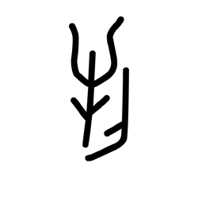

- source_zip_member: `Sub-character Images/nllrzldww6/nllrzldww6/lv7go8phte.png`
- checksum_sha256: `100382c04096d2f18c1dc99cd94d93c4fb2f254eca3eeac4766adc34724bfe0f`
- review_status: `needs_human_visual_review`
- caution: OBIMD subcharacter image is a source-marked review asset only; it is not a confirmed component form, component assignment, or decipherment conclusion.

## asset-012206

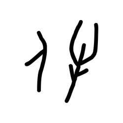

- source_zip_member: `Sub-character Images/nllrzldww6/nllrzldww6/m9cqkg3iji.png`
- checksum_sha256: `b2dd7c99b19e3cca915754bcb31dd49e26f2cb365f64b457db84d25869eed447`
- review_status: `needs_human_visual_review`
- caution: OBIMD subcharacter image is a source-marked review asset only; it is not a confirmed component form, component assignment, or decipherment conclusion.

## asset-012207

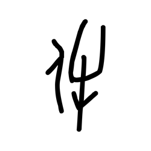

- source_zip_member: `Sub-character Images/nllrzldww6/nllrzldww6/n8astib6dp.png`
- checksum_sha256: `f79d6d027221a9c75606df5251381124a0ab1256651494a759db015fdee1b11a`
- review_status: `needs_human_visual_review`
- caution: OBIMD subcharacter image is a source-marked review asset only; it is not a confirmed component form, component assignment, or decipherment conclusion.

## asset-012208

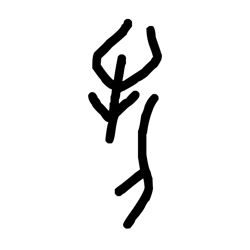

- source_zip_member: `Sub-character Images/nllrzldww6/nllrzldww6/nl33mif2s4.png`
- checksum_sha256: `ae2728d66ee1b21ef7c66bbc9dabc2f46f2ed004d13a600b8dd6091ca3c06527`
- review_status: `needs_human_visual_review`
- caution: OBIMD subcharacter image is a source-marked review asset only; it is not a confirmed component form, component assignment, or decipherment conclusion.

## asset-012209

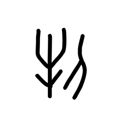

- source_zip_member: `Sub-character Images/nllrzldww6/nllrzldww6/nllrzldww6.png`
- checksum_sha256: `bac41b55fd9d8068715bbbe33b614ac0a8e443a01998cdb18d758fec66426418`
- review_status: `needs_human_visual_review`
- caution: OBIMD subcharacter image is a source-marked review asset only; it is not a confirmed component form, component assignment, or decipherment conclusion.

## asset-012210

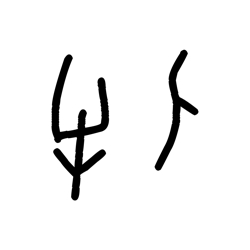

- source_zip_member: `Sub-character Images/nllrzldww6/nllrzldww6/o1kq1gztzu.png`
- checksum_sha256: `6f61c9d524668e37c8491540a2285c6588242e348c00e6aead139a0cbe60520c`
- review_status: `needs_human_visual_review`
- caution: OBIMD subcharacter image is a source-marked review asset only; it is not a confirmed component form, component assignment, or decipherment conclusion.

## asset-012211

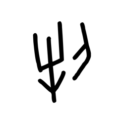

- source_zip_member: `Sub-character Images/nllrzldww6/nllrzldww6/p8l2hfqs74.png`
- checksum_sha256: `d8751bd75a3f2f47ee88b47552827a619315451d5b5e6d4125febaf8cee2e4dc`
- review_status: `needs_human_visual_review`
- caution: OBIMD subcharacter image is a source-marked review asset only; it is not a confirmed component form, component assignment, or decipherment conclusion.

## asset-012212

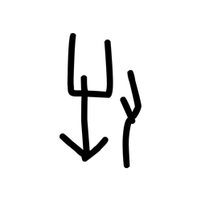

- source_zip_member: `Sub-character Images/nllrzldww6/nllrzldww6/q3proihmi2.png`
- checksum_sha256: `aa55ef404e0f467e9155f9894047446bf2cf1f7c33cb33c96c3f229cd13497b2`
- review_status: `needs_human_visual_review`
- caution: OBIMD subcharacter image is a source-marked review asset only; it is not a confirmed component form, component assignment, or decipherment conclusion.

## asset-012213

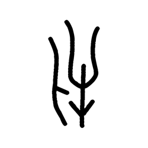

- source_zip_member: `Sub-character Images/nllrzldww6/nllrzldww6/qeidakv1it.png`
- checksum_sha256: `11475a75b60ad17ed7fa9902f9185c9966286c7101f32a4e064e5546c408f4ad`
- review_status: `needs_human_visual_review`
- caution: OBIMD subcharacter image is a source-marked review asset only; it is not a confirmed component form, component assignment, or decipherment conclusion.

## asset-012214

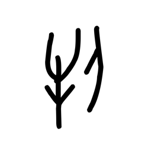

- source_zip_member: `Sub-character Images/nllrzldww6/nllrzldww6/qtadyesmwm.png`
- checksum_sha256: `30f0ce94db8a91b8162167f2075bc049459ce34fb0341d9d3c99a4506e858517`
- review_status: `needs_human_visual_review`
- caution: OBIMD subcharacter image is a source-marked review asset only; it is not a confirmed component form, component assignment, or decipherment conclusion.

## asset-012215

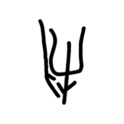

- source_zip_member: `Sub-character Images/nllrzldww6/nllrzldww6/r4irsnva6e.png`
- checksum_sha256: `735fda0273efcaa42ad081b56b9e913749408b02e58864d1768788a126b8bd0b`
- review_status: `needs_human_visual_review`
- caution: OBIMD subcharacter image is a source-marked review asset only; it is not a confirmed component form, component assignment, or decipherment conclusion.

## asset-012216

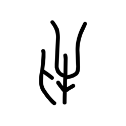

- source_zip_member: `Sub-character Images/nllrzldww6/nllrzldww6/sd30o0mb7r.png`
- checksum_sha256: `0108bbf24c63d40c6fda6af368b3a85d0750d41e8e6922c0af7af76569caa411`
- review_status: `needs_human_visual_review`
- caution: OBIMD subcharacter image is a source-marked review asset only; it is not a confirmed component form, component assignment, or decipherment conclusion.

## asset-012217

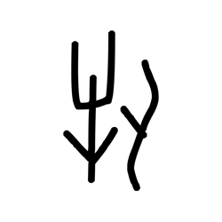

- source_zip_member: `Sub-character Images/nllrzldww6/nllrzldww6/siar9xwl1p.png`
- checksum_sha256: `f07f34ad479cb658af5df34d494d5684739fd1a9172892152454a8331fc5ac37`
- review_status: `needs_human_visual_review`
- caution: OBIMD subcharacter image is a source-marked review asset only; it is not a confirmed component form, component assignment, or decipherment conclusion.

## asset-012218

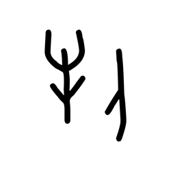

- source_zip_member: `Sub-character Images/nllrzldww6/nllrzldww6/ss30kxyeeo.png`
- checksum_sha256: `a9b287d6b2f9f8821df074d37bfef12908f66d86df053e1069d3a0f8cfc3d30e`
- review_status: `needs_human_visual_review`
- caution: OBIMD subcharacter image is a source-marked review asset only; it is not a confirmed component form, component assignment, or decipherment conclusion.

## asset-012219

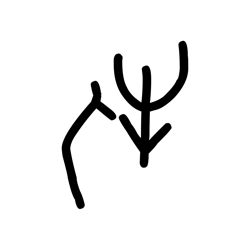

- source_zip_member: `Sub-character Images/nllrzldww6/nllrzldww6/subthirfdz.png`
- checksum_sha256: `fa34b10a21d52cffe15600ddcd87411d909c661a10f605e8a11c85fc841a711d`
- review_status: `needs_human_visual_review`
- caution: OBIMD subcharacter image is a source-marked review asset only; it is not a confirmed component form, component assignment, or decipherment conclusion.

## asset-012220

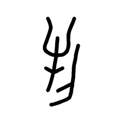

- source_zip_member: `Sub-character Images/nllrzldww6/nllrzldww6/t8eppww8ed.png`
- checksum_sha256: `6498b55996e02cf5ef7f93219631dc128ffa174364167b03531d25b16b60da96`
- review_status: `needs_human_visual_review`
- caution: OBIMD subcharacter image is a source-marked review asset only; it is not a confirmed component form, component assignment, or decipherment conclusion.

## asset-012221

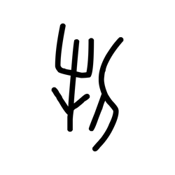

- source_zip_member: `Sub-character Images/nllrzldww6/nllrzldww6/td0op7mup7.png`
- checksum_sha256: `4bc798a1a72bad2874bd5fe4943ce1f86d02a73def3f49ad52c978ef43b11501`
- review_status: `needs_human_visual_review`
- caution: OBIMD subcharacter image is a source-marked review asset only; it is not a confirmed component form, component assignment, or decipherment conclusion.

## asset-012222

- source_zip_member: `Sub-character Images/nllrzldww6/nllrzldww6/ub26iy7cc9.png`
- checksum_sha256: `46b817c71f6e784548cdc925b0b76171c22979be8773945c644c614cd455cb22`
- review_status: `needs_human_visual_review`
- caution: OBIMD subcharacter image is a source-marked review asset only; it is not a confirmed component form, component assignment, or decipherment conclusion.

## asset-012223

- source_zip_member: `Sub-character Images/nllrzldww6/nllrzldww6/vngrd0h5at.png`
- checksum_sha256: `740d4c064bb1c8e675ef5432d1daf2b9a50059d131bee0caefb7a1f0d2bac7ac`
- review_status: `needs_human_visual_review`
- caution: OBIMD subcharacter image is a source-marked review asset only; it is not a confirmed component form, component assignment, or decipherment conclusion.

## asset-012224

- source_zip_member: `Sub-character Images/nllrzldww6/nllrzldww6/w2e9qamco2.png`
- checksum_sha256: `d485e1c3bf1e5b7929bb762690647d30b4a32ef17b2dcf07b14377cece66b736`
- review_status: `needs_human_visual_review`
- caution: OBIMD subcharacter image is a source-marked review asset only; it is not a confirmed component form, component assignment, or decipherment conclusion.

## asset-012225

- source_zip_member: `Sub-character Images/nllrzldww6/nllrzldww6/w37vmmnfml.png`
- checksum_sha256: `f03c81d9c2ffc560c95284bd413f56b39763c49e971cfa2d22dbfd51b69f54ce`
- review_status: `needs_human_visual_review`
- caution: OBIMD subcharacter image is a source-marked review asset only; it is not a confirmed component form, component assignment, or decipherment conclusion.

## asset-012226

- source_zip_member: `Sub-character Images/nllrzldww6/nllrzldww6/wju8pxfzyd.png`
- checksum_sha256: `5e8560cc3dcf853c0a4dff459b7b2e9d7cabb54219eaeff2d5d3991a0410d4a2`
- review_status: `needs_human_visual_review`
- caution: OBIMD subcharacter image is a source-marked review asset only; it is not a confirmed component form, component assignment, or decipherment conclusion.

## asset-012227

- source_zip_member: `Sub-character Images/nllrzldww6/nllrzldww6/wrjrg5b9gc.png`
- checksum_sha256: `40f55cf8e811ea5d494a7cb3698186ac8e1b24b9880aa835923099d6d1faac59`
- review_status: `needs_human_visual_review`
- caution: OBIMD subcharacter image is a source-marked review asset only; it is not a confirmed component form, component assignment, or decipherment conclusion.

## asset-012228

- source_zip_member: `Sub-character Images/nllrzldww6/nllrzldww6/wuldcvmd0o.png`
- checksum_sha256: `4799285e83008b7a23938f0b578378950bd5657ecf7afb649e7f1710a03bce42`
- review_status: `needs_human_visual_review`
- caution: OBIMD subcharacter image is a source-marked review asset only; it is not a confirmed component form, component assignment, or decipherment conclusion.

## asset-012229

- source_zip_member: `Sub-character Images/nllrzldww6/nllrzldww6/x08t9ewinq.png`
- checksum_sha256: `6785d2480c89f1ebb816cc3b9f54e8208b066f6a1522a671759b8b8fbfbf1414`
- review_status: `needs_human_visual_review`
- caution: OBIMD subcharacter image is a source-marked review asset only; it is not a confirmed component form, component assignment, or decipherment conclusion.

## asset-012230

- source_zip_member: `Sub-character Images/nllrzldww6/nllrzldww6/xummhjxjeo.png`
- checksum_sha256: `7f2facb2b04b4344595e204ddad76f041359545140d4606137174de58721550c`
- review_status: `needs_human_visual_review`
- caution: OBIMD subcharacter image is a source-marked review asset only; it is not a confirmed component form, component assignment, or decipherment conclusion.

## asset-012231

- source_zip_member: `Sub-character Images/nllrzldww6/nllrzldww6/yhyp1zd0lh.png`
- checksum_sha256: `84a855238ffef4bb41bf0f7c7fb9ed434311f23c8203281f898709fa884325e9`
- review_status: `needs_human_visual_review`
- caution: OBIMD subcharacter image is a source-marked review asset only; it is not a confirmed component form, component assignment, or decipherment conclusion.

## asset-012232

- source_zip_member: `Sub-character Images/nllrzldww6/nllrzldww6/ykmk6m1ll2.png`
- checksum_sha256: `7dc5d86e3d6127850bd3bd5a0c39b6a685de838240e292ed332367b8be5689fa`
- review_status: `needs_human_visual_review`
- caution: OBIMD subcharacter image is a source-marked review asset only; it is not a confirmed component form, component assignment, or decipherment conclusion.

## asset-012233

- source_zip_member: `Sub-character Images/nllrzldww6/nllrzldww6/ymu2e4i358.png`
- checksum_sha256: `89911345e791b852726ed0299ac8d4f02426768a707f2828a21f29138eb6b43e`
- review_status: `needs_human_visual_review`
- caution: OBIMD subcharacter image is a source-marked review asset only; it is not a confirmed component form, component assignment, or decipherment conclusion.

## asset-012234

- source_zip_member: `Sub-character Images/nllrzldww6/nllrzldww6/yngotpz1ja.png`
- checksum_sha256: `344d081564e5b5dd3c0017229c8c9b7e41ef56e24669feac186104e3ff222221`
- review_status: `needs_human_visual_review`
- caution: OBIMD subcharacter image is a source-marked review asset only; it is not a confirmed component form, component assignment, or decipherment conclusion.

## asset-012235

- source_zip_member: `Sub-character Images/nllrzldww6/nllrzldww6/yo1gyeug2m.png`
- checksum_sha256: `100aa1a56c59dea2649bf092363d763a42280f1adf222ce388cdee0d38459c9b`
- review_status: `needs_human_visual_review`
- caution: OBIMD subcharacter image is a source-marked review asset only; it is not a confirmed component form, component assignment, or decipherment conclusion.

## asset-012236

- source_zip_member: `Sub-character Images/nllrzldww6/nllrzldww6/zfrirzose8.png`
- checksum_sha256: `6cb1a65032707d1ddd3a0c824a7fa7d2620573461f5f544f40a29d4c8fd1aec8`
- review_status: `needs_human_visual_review`
- caution: OBIMD subcharacter image is a source-marked review asset only; it is not a confirmed component form, component assignment, or decipherment conclusion.

## asset-012237

- source_zip_member: `Sub-character Images/nllrzldww6/nllrzldww6/zwcb8mrctr.png`
- checksum_sha256: `fb215d3d6234c9db8c6b49f76e50b96ff641b1a1d1065f8bd40a631dac71abca`
- review_status: `needs_human_visual_review`
- caution: OBIMD subcharacter image is a source-marked review asset only; it is not a confirmed component form, component assignment, or decipherment conclusion.
