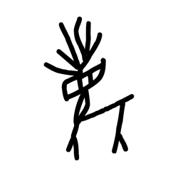

# Component Visual Gallery / 构件图像查看: obs-comp-cand-000431

English:
This page displays OBIMD subcharacter PNG assets extracted into this concrete corpus object directory for human review.

简体中文：
本页展示抽取到当前具体 corpus 对象目录内的 OBIMD subcharacter PNG 资料，供人工复核使用。

Boundary / 边界：dataset image candidate only; not a confirmed component form, component assignment, or decipherment claim.

## asset-012354

- source_zip_member: `Sub-character Images/ewiqwj2bq8/fd1fnfizin/fd1fnfizin.png`
- checksum_sha256: `a77072c7bda070ca0603a79fe803613af283e90391be91962a991c7c7b29cc00`
- review_status: `needs_human_visual_review`
- caution: OBIMD subcharacter image is a source-marked review asset only; it is not a confirmed component form, component assignment, or decipherment conclusion.
