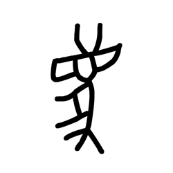

# Component Visual Gallery / 构件图像查看: obs-comp-cand-000440

English:
This page displays OBIMD subcharacter PNG assets extracted into this concrete corpus object directory for human review.

简体中文：
本页展示抽取到当前具体 corpus 对象目录内的 OBIMD subcharacter PNG 资料，供人工复核使用。

Boundary / 边界：dataset image candidate only; not a confirmed component form, component assignment, or decipherment claim.

## asset-012363

- source_zip_member: `Sub-character Images/nqghhf5br6/nqghhf5br6/nqghhf5br6.png`
- checksum_sha256: `a5e6201d19e5b00af253cfa982ea3633af0cd85eced632bdcf3c062d951ed148`
- review_status: `needs_human_visual_review`
- caution: OBIMD subcharacter image is a source-marked review asset only; it is not a confirmed component form, component assignment, or decipherment conclusion.
