# Component Visual Gallery / 构件图像查看: obs-comp-cand-000451

English:
This page displays OBIMD subcharacter PNG assets extracted into this concrete
corpus object directory for human review.

简体中文：
本页展示抽取到当前具体 corpus 对象目录内的 OBIMD subcharacter PNG 资料，供人工复核使用。

Boundary / 边界：
dataset image candidate only; not a confirmed component form, not a component
assignment, and not a decipherment claim.
- not a confirmed component form
- not a component assignment
- not a decipherment claim

## Concrete Questions To Check / 具体待查问题

- Which local image should be opened first?
- 应先打开哪一张本地构件图像？
- Which source zip member anchors this image?
- 哪一个 source zip member 能定位这张图像？
- Which near-shape or variant comparison is still missing?
- 还缺哪些近形或异体比较？
- Which character or inscription context should be checked next?
- 下一步应核对哪些单字或卜辞上下文？
- What evidence is missing before a component assignment?
- 正式构件归属前还缺哪些证据？

## asset-012374

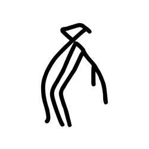

- source_zip_member: `Sub-character Images/y0f5gu3q0a/y0f5gu3q0a/0419t8srdw.png`
- checksum_sha256: see `06_component-visual-index.csv`.
- review_status: `needs_human_visual_review`
- caution: source-marked review image only.

## asset-012375

- source_zip_member: `Sub-character Images/y0f5gu3q0a/y0f5gu3q0a/0ae07ug5vx.png`
- checksum_sha256: see `06_component-visual-index.csv`.
- review_status: `needs_human_visual_review`
- caution: source-marked review image only.

## asset-012376

- source_zip_member: `Sub-character Images/y0f5gu3q0a/y0f5gu3q0a/0eriszps4k.png`
- checksum_sha256: see `06_component-visual-index.csv`.
- review_status: `needs_human_visual_review`
- caution: source-marked review image only.

## asset-012377

- source_zip_member: `Sub-character Images/y0f5gu3q0a/y0f5gu3q0a/0jt8p7pyqr.png`
- checksum_sha256: see `06_component-visual-index.csv`.
- review_status: `needs_human_visual_review`
- caution: source-marked review image only.

## asset-012378

- source_zip_member: `Sub-character Images/y0f5gu3q0a/y0f5gu3q0a/0r02br9p46.png`
- checksum_sha256: see `06_component-visual-index.csv`.
- review_status: `needs_human_visual_review`
- caution: source-marked review image only.

## asset-012379

- source_zip_member: `Sub-character Images/y0f5gu3q0a/y0f5gu3q0a/0uig27mrh1.png`
- checksum_sha256: see `06_component-visual-index.csv`.
- review_status: `needs_human_visual_review`
- caution: source-marked review image only.

## asset-012380

- source_zip_member: `Sub-character Images/y0f5gu3q0a/y0f5gu3q0a/0uupouk7zj.png`
- checksum_sha256: see `06_component-visual-index.csv`.
- review_status: `needs_human_visual_review`
- caution: source-marked review image only.

## asset-012381

- source_zip_member: `Sub-character Images/y0f5gu3q0a/y0f5gu3q0a/134ia24l1g.png`
- checksum_sha256: see `06_component-visual-index.csv`.
- review_status: `needs_human_visual_review`
- caution: source-marked review image only.

## asset-012382

- source_zip_member: `Sub-character Images/y0f5gu3q0a/y0f5gu3q0a/16iazq0d3c.png`
- checksum_sha256: see `06_component-visual-index.csv`.
- review_status: `needs_human_visual_review`
- caution: source-marked review image only.

## asset-012383

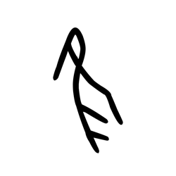

- source_zip_member: `Sub-character Images/y0f5gu3q0a/y0f5gu3q0a/17a6kaqpi7.png`
- checksum_sha256: see `06_component-visual-index.csv`.
- review_status: `needs_human_visual_review`
- caution: source-marked review image only.

## asset-012384

- source_zip_member: `Sub-character Images/y0f5gu3q0a/y0f5gu3q0a/1gkxug0eq4.png`
- checksum_sha256: see `06_component-visual-index.csv`.
- review_status: `needs_human_visual_review`
- caution: source-marked review image only.

## asset-012385

- source_zip_member: `Sub-character Images/y0f5gu3q0a/y0f5gu3q0a/1o3k6atvtq.png`
- checksum_sha256: see `06_component-visual-index.csv`.
- review_status: `needs_human_visual_review`
- caution: source-marked review image only.

## asset-012386

- source_zip_member: `Sub-character Images/y0f5gu3q0a/y0f5gu3q0a/1o4js8et9r.png`
- checksum_sha256: see `06_component-visual-index.csv`.
- review_status: `needs_human_visual_review`
- caution: source-marked review image only.

## asset-012387

- source_zip_member: `Sub-character Images/y0f5gu3q0a/y0f5gu3q0a/1pysyt2ldg.png`
- checksum_sha256: see `06_component-visual-index.csv`.
- review_status: `needs_human_visual_review`
- caution: source-marked review image only.

## asset-012388

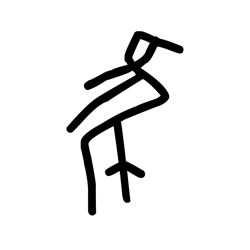

- source_zip_member: `Sub-character Images/y0f5gu3q0a/y0f5gu3q0a/1vjwookkpg.png`
- checksum_sha256: see `06_component-visual-index.csv`.
- review_status: `needs_human_visual_review`
- caution: source-marked review image only.

## asset-012389

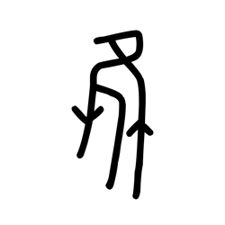

- source_zip_member: `Sub-character Images/y0f5gu3q0a/y0f5gu3q0a/2ew3aoqyg9.png`
- checksum_sha256: see `06_component-visual-index.csv`.
- review_status: `needs_human_visual_review`
- caution: source-marked review image only.

## asset-012390

- source_zip_member: `Sub-character Images/y0f5gu3q0a/y0f5gu3q0a/2mx4cepx11.png`
- checksum_sha256: see `06_component-visual-index.csv`.
- review_status: `needs_human_visual_review`
- caution: source-marked review image only.

## asset-012391

- source_zip_member: `Sub-character Images/y0f5gu3q0a/y0f5gu3q0a/2r9ql1h8kp.png`
- checksum_sha256: see `06_component-visual-index.csv`.
- review_status: `needs_human_visual_review`
- caution: source-marked review image only.

## asset-012392

- source_zip_member: `Sub-character Images/y0f5gu3q0a/y0f5gu3q0a/2uq53gzug2.png`
- checksum_sha256: see `06_component-visual-index.csv`.
- review_status: `needs_human_visual_review`
- caution: source-marked review image only.

## asset-012393

- source_zip_member: `Sub-character Images/y0f5gu3q0a/y0f5gu3q0a/2v34vgxvpg.png`
- checksum_sha256: see `06_component-visual-index.csv`.
- review_status: `needs_human_visual_review`
- caution: source-marked review image only.

## asset-012394

- source_zip_member: `Sub-character Images/y0f5gu3q0a/y0f5gu3q0a/2wr82h46ub.png`
- checksum_sha256: see `06_component-visual-index.csv`.
- review_status: `needs_human_visual_review`
- caution: source-marked review image only.

## asset-012395

- source_zip_member: `Sub-character Images/y0f5gu3q0a/y0f5gu3q0a/31mayv8lc9.png`
- checksum_sha256: see `06_component-visual-index.csv`.
- review_status: `needs_human_visual_review`
- caution: source-marked review image only.

## asset-012396

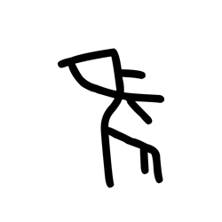

- source_zip_member: `Sub-character Images/y0f5gu3q0a/y0f5gu3q0a/325uq0k5ot.png`
- checksum_sha256: see `06_component-visual-index.csv`.
- review_status: `needs_human_visual_review`
- caution: source-marked review image only.

## asset-012397

- source_zip_member: `Sub-character Images/y0f5gu3q0a/y0f5gu3q0a/32rotfaqby.png`
- checksum_sha256: see `06_component-visual-index.csv`.
- review_status: `needs_human_visual_review`
- caution: source-marked review image only.

## asset-012398

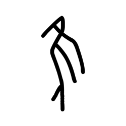

- source_zip_member: `Sub-character Images/y0f5gu3q0a/y0f5gu3q0a/33pjfnlk5p.png`
- checksum_sha256: see `06_component-visual-index.csv`.
- review_status: `needs_human_visual_review`
- caution: source-marked review image only.

## asset-012399

- source_zip_member: `Sub-character Images/y0f5gu3q0a/y0f5gu3q0a/3a7rsq9y77.png`
- checksum_sha256: see `06_component-visual-index.csv`.
- review_status: `needs_human_visual_review`
- caution: source-marked review image only.

## asset-012400

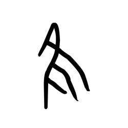

- source_zip_member: `Sub-character Images/y0f5gu3q0a/y0f5gu3q0a/3fkqhzhia6.png`
- checksum_sha256: see `06_component-visual-index.csv`.
- review_status: `needs_human_visual_review`
- caution: source-marked review image only.

## asset-012401

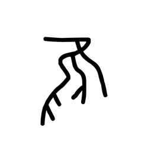

- source_zip_member: `Sub-character Images/y0f5gu3q0a/y0f5gu3q0a/3hjg83q3bv.png`
- checksum_sha256: see `06_component-visual-index.csv`.
- review_status: `needs_human_visual_review`
- caution: source-marked review image only.

## asset-012402

- source_zip_member: `Sub-character Images/y0f5gu3q0a/y0f5gu3q0a/45e8f2d9zn.png`
- checksum_sha256: see `06_component-visual-index.csv`.
- review_status: `needs_human_visual_review`
- caution: source-marked review image only.

## asset-012403

- source_zip_member: `Sub-character Images/y0f5gu3q0a/y0f5gu3q0a/49tv11dcwj.png`
- checksum_sha256: see `06_component-visual-index.csv`.
- review_status: `needs_human_visual_review`
- caution: source-marked review image only.

## asset-012404

- source_zip_member: `Sub-character Images/y0f5gu3q0a/y0f5gu3q0a/4cgsolfn8s.png`
- checksum_sha256: see `06_component-visual-index.csv`.
- review_status: `needs_human_visual_review`
- caution: source-marked review image only.

## asset-012405

- source_zip_member: `Sub-character Images/y0f5gu3q0a/y0f5gu3q0a/4qw6a3rf96.png`
- checksum_sha256: see `06_component-visual-index.csv`.
- review_status: `needs_human_visual_review`
- caution: source-marked review image only.

## asset-012406

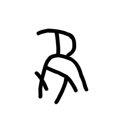

- source_zip_member: `Sub-character Images/y0f5gu3q0a/y0f5gu3q0a/52yl0f8ugn.png`
- checksum_sha256: see `06_component-visual-index.csv`.
- review_status: `needs_human_visual_review`
- caution: source-marked review image only.

## asset-012407

- source_zip_member: `Sub-character Images/y0f5gu3q0a/y0f5gu3q0a/53a238tnh5.png`
- checksum_sha256: see `06_component-visual-index.csv`.
- review_status: `needs_human_visual_review`
- caution: source-marked review image only.

## asset-012408

- source_zip_member: `Sub-character Images/y0f5gu3q0a/y0f5gu3q0a/5754nsk06s.png`
- checksum_sha256: see `06_component-visual-index.csv`.
- review_status: `needs_human_visual_review`
- caution: source-marked review image only.

## asset-012409

- source_zip_member: `Sub-character Images/y0f5gu3q0a/y0f5gu3q0a/58cin91s13.png`
- checksum_sha256: see `06_component-visual-index.csv`.
- review_status: `needs_human_visual_review`
- caution: source-marked review image only.

## asset-012410

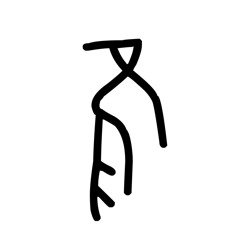

- source_zip_member: `Sub-character Images/y0f5gu3q0a/y0f5gu3q0a/5ap511frm1.png`
- checksum_sha256: see `06_component-visual-index.csv`.
- review_status: `needs_human_visual_review`
- caution: source-marked review image only.

## asset-012411

- source_zip_member: `Sub-character Images/y0f5gu3q0a/y0f5gu3q0a/5d73860ug3.png`
- checksum_sha256: see `06_component-visual-index.csv`.
- review_status: `needs_human_visual_review`
- caution: source-marked review image only.

## asset-012412

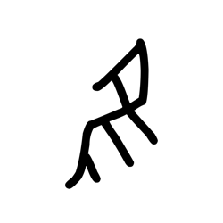

- source_zip_member: `Sub-character Images/y0f5gu3q0a/y0f5gu3q0a/5u51e6jbkt.png`
- checksum_sha256: see `06_component-visual-index.csv`.
- review_status: `needs_human_visual_review`
- caution: source-marked review image only.

## asset-012413

- source_zip_member: `Sub-character Images/y0f5gu3q0a/y0f5gu3q0a/5wnmc8jssx.png`
- checksum_sha256: see `06_component-visual-index.csv`.
- review_status: `needs_human_visual_review`
- caution: source-marked review image only.

## asset-012414

- source_zip_member: `Sub-character Images/y0f5gu3q0a/y0f5gu3q0a/63izftelp7.png`
- checksum_sha256: see `06_component-visual-index.csv`.
- review_status: `needs_human_visual_review`
- caution: source-marked review image only.

## asset-012415

- source_zip_member: `Sub-character Images/y0f5gu3q0a/y0f5gu3q0a/63xlbj6vce.png`
- checksum_sha256: see `06_component-visual-index.csv`.
- review_status: `needs_human_visual_review`
- caution: source-marked review image only.

## asset-012416

- source_zip_member: `Sub-character Images/y0f5gu3q0a/y0f5gu3q0a/6kv4yn7bfx.png`
- checksum_sha256: see `06_component-visual-index.csv`.
- review_status: `needs_human_visual_review`
- caution: source-marked review image only.

## asset-012417

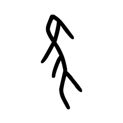

- source_zip_member: `Sub-character Images/y0f5gu3q0a/y0f5gu3q0a/6qzbpsegcb.png`
- checksum_sha256: see `06_component-visual-index.csv`.
- review_status: `needs_human_visual_review`
- caution: source-marked review image only.

## asset-012418

- source_zip_member: `Sub-character Images/y0f5gu3q0a/y0f5gu3q0a/6s5cfxg4ya.png`
- checksum_sha256: see `06_component-visual-index.csv`.
- review_status: `needs_human_visual_review`
- caution: source-marked review image only.

## asset-012419

- source_zip_member: `Sub-character Images/y0f5gu3q0a/y0f5gu3q0a/6vil616pda.png`
- checksum_sha256: see `06_component-visual-index.csv`.
- review_status: `needs_human_visual_review`
- caution: source-marked review image only.

## asset-012420

- source_zip_member: `Sub-character Images/y0f5gu3q0a/y0f5gu3q0a/77obup0rff.png`
- checksum_sha256: see `06_component-visual-index.csv`.
- review_status: `needs_human_visual_review`
- caution: source-marked review image only.

## asset-012421

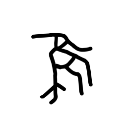

- source_zip_member: `Sub-character Images/y0f5gu3q0a/y0f5gu3q0a/7bibe0eecx.png`
- checksum_sha256: see `06_component-visual-index.csv`.
- review_status: `needs_human_visual_review`
- caution: source-marked review image only.

## asset-012422

- source_zip_member: `Sub-character Images/y0f5gu3q0a/y0f5gu3q0a/7odwhls2b8.png`
- checksum_sha256: see `06_component-visual-index.csv`.
- review_status: `needs_human_visual_review`
- caution: source-marked review image only.

## asset-012423

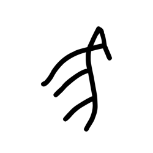

- source_zip_member: `Sub-character Images/y0f5gu3q0a/y0f5gu3q0a/7psgrr3x21.png`
- checksum_sha256: see `06_component-visual-index.csv`.
- review_status: `needs_human_visual_review`
- caution: source-marked review image only.

## asset-012424

- source_zip_member: `Sub-character Images/y0f5gu3q0a/y0f5gu3q0a/8gk11ed16b.png`
- checksum_sha256: see `06_component-visual-index.csv`.
- review_status: `needs_human_visual_review`
- caution: source-marked review image only.

## asset-012425

- source_zip_member: `Sub-character Images/y0f5gu3q0a/y0f5gu3q0a/8gnz4gpyo3.png`
- checksum_sha256: see `06_component-visual-index.csv`.
- review_status: `needs_human_visual_review`
- caution: source-marked review image only.

## asset-012426

- source_zip_member: `Sub-character Images/y0f5gu3q0a/y0f5gu3q0a/8ppf7xjgad.png`
- checksum_sha256: see `06_component-visual-index.csv`.
- review_status: `needs_human_visual_review`
- caution: source-marked review image only.

## asset-012427

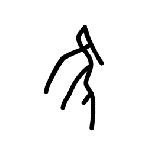

- source_zip_member: `Sub-character Images/y0f5gu3q0a/y0f5gu3q0a/8qqhhu42af.png`
- checksum_sha256: see `06_component-visual-index.csv`.
- review_status: `needs_human_visual_review`
- caution: source-marked review image only.

## asset-012428

- source_zip_member: `Sub-character Images/y0f5gu3q0a/y0f5gu3q0a/8sblpu3u1d.png`
- checksum_sha256: see `06_component-visual-index.csv`.
- review_status: `needs_human_visual_review`
- caution: source-marked review image only.

## asset-012429

- source_zip_member: `Sub-character Images/y0f5gu3q0a/y0f5gu3q0a/8wypib2bgn.png`
- checksum_sha256: see `06_component-visual-index.csv`.
- review_status: `needs_human_visual_review`
- caution: source-marked review image only.

## asset-012430

- source_zip_member: `Sub-character Images/y0f5gu3q0a/y0f5gu3q0a/8xtptf4f1l.png`
- checksum_sha256: see `06_component-visual-index.csv`.
- review_status: `needs_human_visual_review`
- caution: source-marked review image only.

## asset-012431

- source_zip_member: `Sub-character Images/y0f5gu3q0a/y0f5gu3q0a/9alaqwnpw9.png`
- checksum_sha256: see `06_component-visual-index.csv`.
- review_status: `needs_human_visual_review`
- caution: source-marked review image only.

## asset-012432

- source_zip_member: `Sub-character Images/y0f5gu3q0a/y0f5gu3q0a/9ca65gmhqv.png`
- checksum_sha256: see `06_component-visual-index.csv`.
- review_status: `needs_human_visual_review`
- caution: source-marked review image only.

## asset-012433

- source_zip_member: `Sub-character Images/y0f5gu3q0a/y0f5gu3q0a/9k5jn33mcg.png`
- checksum_sha256: see `06_component-visual-index.csv`.
- review_status: `needs_human_visual_review`
- caution: source-marked review image only.

## asset-012434

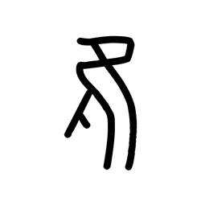

- source_zip_member: `Sub-character Images/y0f5gu3q0a/y0f5gu3q0a/alv8bzs02n.png`
- checksum_sha256: see `06_component-visual-index.csv`.
- review_status: `needs_human_visual_review`
- caution: source-marked review image only.

## asset-012435

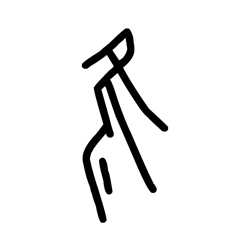

- source_zip_member: `Sub-character Images/y0f5gu3q0a/y0f5gu3q0a/aoln6cogn7.png`
- checksum_sha256: see `06_component-visual-index.csv`.
- review_status: `needs_human_visual_review`
- caution: source-marked review image only.

## asset-012436

- source_zip_member: `Sub-character Images/y0f5gu3q0a/y0f5gu3q0a/apxe5d0rag.png`
- checksum_sha256: see `06_component-visual-index.csv`.
- review_status: `needs_human_visual_review`
- caution: source-marked review image only.

## asset-012437

- source_zip_member: `Sub-character Images/y0f5gu3q0a/y0f5gu3q0a/awiaw431pj.png`
- checksum_sha256: see `06_component-visual-index.csv`.
- review_status: `needs_human_visual_review`
- caution: source-marked review image only.

## asset-012438

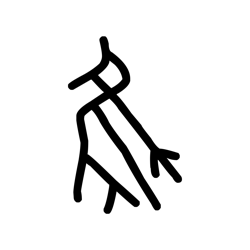

- source_zip_member: `Sub-character Images/y0f5gu3q0a/y0f5gu3q0a/ayzmj441gi.png`
- checksum_sha256: see `06_component-visual-index.csv`.
- review_status: `needs_human_visual_review`
- caution: source-marked review image only.

## asset-012439

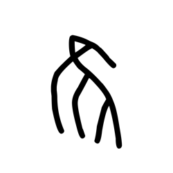

- source_zip_member: `Sub-character Images/y0f5gu3q0a/y0f5gu3q0a/az1eyky9oa.png`
- checksum_sha256: see `06_component-visual-index.csv`.
- review_status: `needs_human_visual_review`
- caution: source-marked review image only.

## asset-012440

- source_zip_member: `Sub-character Images/y0f5gu3q0a/y0f5gu3q0a/b413rzfh7e.png`
- checksum_sha256: see `06_component-visual-index.csv`.
- review_status: `needs_human_visual_review`
- caution: source-marked review image only.

## asset-012441

- source_zip_member: `Sub-character Images/y0f5gu3q0a/y0f5gu3q0a/b5z6ajbblq.png`
- checksum_sha256: see `06_component-visual-index.csv`.
- review_status: `needs_human_visual_review`
- caution: source-marked review image only.

## asset-012442

- source_zip_member: `Sub-character Images/y0f5gu3q0a/y0f5gu3q0a/bgdifaguwb.png`
- checksum_sha256: see `06_component-visual-index.csv`.
- review_status: `needs_human_visual_review`
- caution: source-marked review image only.

## asset-012443

- source_zip_member: `Sub-character Images/y0f5gu3q0a/y0f5gu3q0a/bw3dcxetgu.png`
- checksum_sha256: see `06_component-visual-index.csv`.
- review_status: `needs_human_visual_review`
- caution: source-marked review image only.

## asset-012444

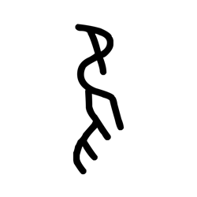

- source_zip_member: `Sub-character Images/y0f5gu3q0a/y0f5gu3q0a/bxy8z6q2q8.png`
- checksum_sha256: see `06_component-visual-index.csv`.
- review_status: `needs_human_visual_review`
- caution: source-marked review image only.

## asset-012445

- source_zip_member: `Sub-character Images/y0f5gu3q0a/y0f5gu3q0a/c0mrdk6v9n.png`
- checksum_sha256: see `06_component-visual-index.csv`.
- review_status: `needs_human_visual_review`
- caution: source-marked review image only.

## asset-012446

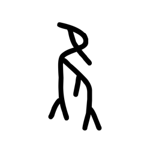

- source_zip_member: `Sub-character Images/y0f5gu3q0a/y0f5gu3q0a/c3talwt0gd.png`
- checksum_sha256: see `06_component-visual-index.csv`.
- review_status: `needs_human_visual_review`
- caution: source-marked review image only.

## asset-012447

- source_zip_member: `Sub-character Images/y0f5gu3q0a/y0f5gu3q0a/c7kyfm7yg1.png`
- checksum_sha256: see `06_component-visual-index.csv`.
- review_status: `needs_human_visual_review`
- caution: source-marked review image only.

## asset-012448

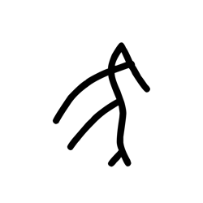

- source_zip_member: `Sub-character Images/y0f5gu3q0a/y0f5gu3q0a/cis76eatlh.png`
- checksum_sha256: see `06_component-visual-index.csv`.
- review_status: `needs_human_visual_review`
- caution: source-marked review image only.

## asset-012449

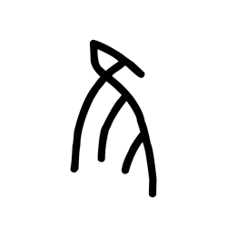

- source_zip_member: `Sub-character Images/y0f5gu3q0a/y0f5gu3q0a/cotwhhwyug.png`
- checksum_sha256: see `06_component-visual-index.csv`.
- review_status: `needs_human_visual_review`
- caution: source-marked review image only.

## asset-012450

- source_zip_member: `Sub-character Images/y0f5gu3q0a/y0f5gu3q0a/cq8krv4q1i.png`
- checksum_sha256: see `06_component-visual-index.csv`.
- review_status: `needs_human_visual_review`
- caution: source-marked review image only.

## asset-012451

- source_zip_member: `Sub-character Images/y0f5gu3q0a/y0f5gu3q0a/cqoa77cxg8.png`
- checksum_sha256: see `06_component-visual-index.csv`.
- review_status: `needs_human_visual_review`
- caution: source-marked review image only.

## asset-012452

- source_zip_member: `Sub-character Images/y0f5gu3q0a/y0f5gu3q0a/dbo2mooljj.png`
- checksum_sha256: see `06_component-visual-index.csv`.
- review_status: `needs_human_visual_review`
- caution: source-marked review image only.

## asset-012453

- source_zip_member: `Sub-character Images/y0f5gu3q0a/y0f5gu3q0a/der32tsdin.png`
- checksum_sha256: see `06_component-visual-index.csv`.
- review_status: `needs_human_visual_review`
- caution: source-marked review image only.

## asset-012454

- source_zip_member: `Sub-character Images/y0f5gu3q0a/y0f5gu3q0a/dyen5o6y7r.png`
- checksum_sha256: see `06_component-visual-index.csv`.
- review_status: `needs_human_visual_review`
- caution: source-marked review image only.

## asset-012455

- source_zip_member: `Sub-character Images/y0f5gu3q0a/y0f5gu3q0a/eh2jzb2or8.png`
- checksum_sha256: see `06_component-visual-index.csv`.
- review_status: `needs_human_visual_review`
- caution: source-marked review image only.

## asset-012456

- source_zip_member: `Sub-character Images/y0f5gu3q0a/y0f5gu3q0a/exkz5pqi3y.png`
- checksum_sha256: see `06_component-visual-index.csv`.
- review_status: `needs_human_visual_review`
- caution: source-marked review image only.

## asset-012457

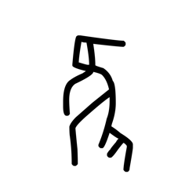

- source_zip_member: `Sub-character Images/y0f5gu3q0a/y0f5gu3q0a/eya9r7qkha.png`
- checksum_sha256: see `06_component-visual-index.csv`.
- review_status: `needs_human_visual_review`
- caution: source-marked review image only.

## asset-012458

- source_zip_member: `Sub-character Images/y0f5gu3q0a/y0f5gu3q0a/eyqlgj136d.png`
- checksum_sha256: see `06_component-visual-index.csv`.
- review_status: `needs_human_visual_review`
- caution: source-marked review image only.

## asset-012459

- source_zip_member: `Sub-character Images/y0f5gu3q0a/y0f5gu3q0a/f44nfvp7fz.png`
- checksum_sha256: see `06_component-visual-index.csv`.
- review_status: `needs_human_visual_review`
- caution: source-marked review image only.

## asset-012460

- source_zip_member: `Sub-character Images/y0f5gu3q0a/y0f5gu3q0a/f9uot3zlpq.png`
- checksum_sha256: see `06_component-visual-index.csv`.
- review_status: `needs_human_visual_review`
- caution: source-marked review image only.

## asset-012461

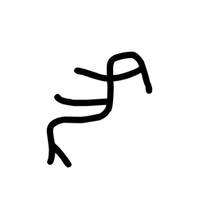

- source_zip_member: `Sub-character Images/y0f5gu3q0a/y0f5gu3q0a/fs5pflhh71.png`
- checksum_sha256: see `06_component-visual-index.csv`.
- review_status: `needs_human_visual_review`
- caution: source-marked review image only.

## asset-012462

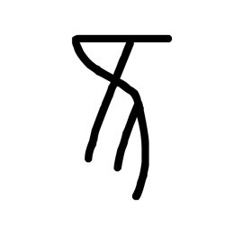

- source_zip_member: `Sub-character Images/y0f5gu3q0a/y0f5gu3q0a/ft6yadj2sx.png`
- checksum_sha256: see `06_component-visual-index.csv`.
- review_status: `needs_human_visual_review`
- caution: source-marked review image only.

## asset-012463

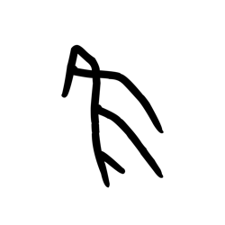

- source_zip_member: `Sub-character Images/y0f5gu3q0a/y0f5gu3q0a/fxppq3j9md.png`
- checksum_sha256: see `06_component-visual-index.csv`.
- review_status: `needs_human_visual_review`
- caution: source-marked review image only.

## asset-012464

- source_zip_member: `Sub-character Images/y0f5gu3q0a/y0f5gu3q0a/fzgwon3q3l.png`
- checksum_sha256: see `06_component-visual-index.csv`.
- review_status: `needs_human_visual_review`
- caution: source-marked review image only.

## asset-012465

- source_zip_member: `Sub-character Images/y0f5gu3q0a/y0f5gu3q0a/g71x2s8948.png`
- checksum_sha256: see `06_component-visual-index.csv`.
- review_status: `needs_human_visual_review`
- caution: source-marked review image only.

## asset-012466

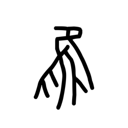

- source_zip_member: `Sub-character Images/y0f5gu3q0a/y0f5gu3q0a/geb0p898wk.png`
- checksum_sha256: see `06_component-visual-index.csv`.
- review_status: `needs_human_visual_review`
- caution: source-marked review image only.

## asset-012467

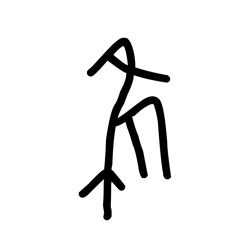

- source_zip_member: `Sub-character Images/y0f5gu3q0a/y0f5gu3q0a/gi6sksrc4w.png`
- checksum_sha256: see `06_component-visual-index.csv`.
- review_status: `needs_human_visual_review`
- caution: source-marked review image only.

## asset-012468

- source_zip_member: `Sub-character Images/y0f5gu3q0a/y0f5gu3q0a/gq0wdmoats.png`
- checksum_sha256: see `06_component-visual-index.csv`.
- review_status: `needs_human_visual_review`
- caution: source-marked review image only.

## asset-012469

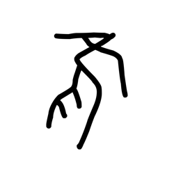

- source_zip_member: `Sub-character Images/y0f5gu3q0a/y0f5gu3q0a/grz5t8cg91.png`
- checksum_sha256: see `06_component-visual-index.csv`.
- review_status: `needs_human_visual_review`
- caution: source-marked review image only.

## asset-012470

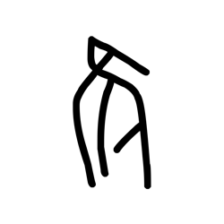

- source_zip_member: `Sub-character Images/y0f5gu3q0a/y0f5gu3q0a/h06kqr2xt7.png`
- checksum_sha256: see `06_component-visual-index.csv`.
- review_status: `needs_human_visual_review`
- caution: source-marked review image only.

## asset-012471

- source_zip_member: `Sub-character Images/y0f5gu3q0a/y0f5gu3q0a/he2kiwtluq.png`
- checksum_sha256: see `06_component-visual-index.csv`.
- review_status: `needs_human_visual_review`
- caution: source-marked review image only.

## asset-012472

- source_zip_member: `Sub-character Images/y0f5gu3q0a/y0f5gu3q0a/hj3xhb1lz0.png`
- checksum_sha256: see `06_component-visual-index.csv`.
- review_status: `needs_human_visual_review`
- caution: source-marked review image only.

## asset-012473

- source_zip_member: `Sub-character Images/y0f5gu3q0a/y0f5gu3q0a/hlth1ih176.png`
- checksum_sha256: see `06_component-visual-index.csv`.
- review_status: `needs_human_visual_review`
- caution: source-marked review image only.

## asset-012474

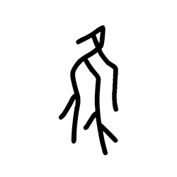

- source_zip_member: `Sub-character Images/y0f5gu3q0a/y0f5gu3q0a/ho3uyk0tup.png`
- checksum_sha256: see `06_component-visual-index.csv`.
- review_status: `needs_human_visual_review`
- caution: source-marked review image only.

## asset-012475

- source_zip_member: `Sub-character Images/y0f5gu3q0a/y0f5gu3q0a/hwexz8fpfw.png`
- checksum_sha256: see `06_component-visual-index.csv`.
- review_status: `needs_human_visual_review`
- caution: source-marked review image only.

## asset-012476

- source_zip_member: `Sub-character Images/y0f5gu3q0a/y0f5gu3q0a/i4qbafwvxb.png`
- checksum_sha256: see `06_component-visual-index.csv`.
- review_status: `needs_human_visual_review`
- caution: source-marked review image only.

## asset-012477

- source_zip_member: `Sub-character Images/y0f5gu3q0a/y0f5gu3q0a/ibmaetfhv7.png`
- checksum_sha256: see `06_component-visual-index.csv`.
- review_status: `needs_human_visual_review`
- caution: source-marked review image only.

## asset-012478

- source_zip_member: `Sub-character Images/y0f5gu3q0a/y0f5gu3q0a/ieeq9uebbs.png`
- checksum_sha256: see `06_component-visual-index.csv`.
- review_status: `needs_human_visual_review`
- caution: source-marked review image only.

## asset-012479

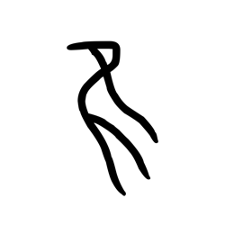

- source_zip_member: `Sub-character Images/y0f5gu3q0a/y0f5gu3q0a/imkm8gagrm.png`
- checksum_sha256: see `06_component-visual-index.csv`.
- review_status: `needs_human_visual_review`
- caution: source-marked review image only.

## asset-012480

- source_zip_member: `Sub-character Images/y0f5gu3q0a/y0f5gu3q0a/inyxtn9cyn.png`
- checksum_sha256: see `06_component-visual-index.csv`.
- review_status: `needs_human_visual_review`
- caution: source-marked review image only.

## asset-012481

- source_zip_member: `Sub-character Images/y0f5gu3q0a/y0f5gu3q0a/ipmdq25ds9.png`
- checksum_sha256: see `06_component-visual-index.csv`.
- review_status: `needs_human_visual_review`
- caution: source-marked review image only.

## asset-012482

- source_zip_member: `Sub-character Images/y0f5gu3q0a/y0f5gu3q0a/ir0hfxbz2b.png`
- checksum_sha256: see `06_component-visual-index.csv`.
- review_status: `needs_human_visual_review`
- caution: source-marked review image only.

## asset-012483

- source_zip_member: `Sub-character Images/y0f5gu3q0a/y0f5gu3q0a/iszr5chscl.png`
- checksum_sha256: see `06_component-visual-index.csv`.
- review_status: `needs_human_visual_review`
- caution: source-marked review image only.

## asset-012484

- source_zip_member: `Sub-character Images/y0f5gu3q0a/y0f5gu3q0a/iua0ugvc73.png`
- checksum_sha256: see `06_component-visual-index.csv`.
- review_status: `needs_human_visual_review`
- caution: source-marked review image only.

## asset-012485

- source_zip_member: `Sub-character Images/y0f5gu3q0a/y0f5gu3q0a/ivxhxhjsgm.png`
- checksum_sha256: see `06_component-visual-index.csv`.
- review_status: `needs_human_visual_review`
- caution: source-marked review image only.

## asset-012486

- source_zip_member: `Sub-character Images/y0f5gu3q0a/y0f5gu3q0a/izig3a7yty.png`
- checksum_sha256: see `06_component-visual-index.csv`.
- review_status: `needs_human_visual_review`
- caution: source-marked review image only.

## asset-012487

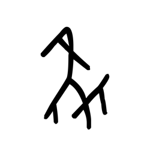

- source_zip_member: `Sub-character Images/y0f5gu3q0a/y0f5gu3q0a/j1xpxm7kr7.png`
- checksum_sha256: see `06_component-visual-index.csv`.
- review_status: `needs_human_visual_review`
- caution: source-marked review image only.

## asset-012488

- source_zip_member: `Sub-character Images/y0f5gu3q0a/y0f5gu3q0a/j7wynb5b1f.png`
- checksum_sha256: see `06_component-visual-index.csv`.
- review_status: `needs_human_visual_review`
- caution: source-marked review image only.

## asset-012489

- source_zip_member: `Sub-character Images/y0f5gu3q0a/y0f5gu3q0a/j81uxuggvn.png`
- checksum_sha256: see `06_component-visual-index.csv`.
- review_status: `needs_human_visual_review`
- caution: source-marked review image only.

## asset-012490

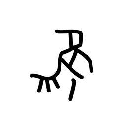

- source_zip_member: `Sub-character Images/y0f5gu3q0a/y0f5gu3q0a/jhq6hjuxfv.png`
- checksum_sha256: see `06_component-visual-index.csv`.
- review_status: `needs_human_visual_review`
- caution: source-marked review image only.

## asset-012491

- source_zip_member: `Sub-character Images/y0f5gu3q0a/y0f5gu3q0a/jqd7889upt.png`
- checksum_sha256: see `06_component-visual-index.csv`.
- review_status: `needs_human_visual_review`
- caution: source-marked review image only.

## asset-012492

- source_zip_member: `Sub-character Images/y0f5gu3q0a/y0f5gu3q0a/jz4a3euhwg.png`
- checksum_sha256: see `06_component-visual-index.csv`.
- review_status: `needs_human_visual_review`
- caution: source-marked review image only.

## asset-012493

- source_zip_member: `Sub-character Images/y0f5gu3q0a/y0f5gu3q0a/k3pmf2s09o.png`
- checksum_sha256: see `06_component-visual-index.csv`.
- review_status: `needs_human_visual_review`
- caution: source-marked review image only.

## asset-012494

- source_zip_member: `Sub-character Images/y0f5gu3q0a/y0f5gu3q0a/k6r36xx4dl.png`
- checksum_sha256: see `06_component-visual-index.csv`.
- review_status: `needs_human_visual_review`
- caution: source-marked review image only.

## asset-012495

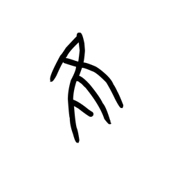

- source_zip_member: `Sub-character Images/y0f5gu3q0a/y0f5gu3q0a/kf84y24mok.png`
- checksum_sha256: see `06_component-visual-index.csv`.
- review_status: `needs_human_visual_review`
- caution: source-marked review image only.

## asset-012496

- source_zip_member: `Sub-character Images/y0f5gu3q0a/y0f5gu3q0a/kzau1ijm7k.png`
- checksum_sha256: see `06_component-visual-index.csv`.
- review_status: `needs_human_visual_review`
- caution: source-marked review image only.

## asset-012497

- source_zip_member: `Sub-character Images/y0f5gu3q0a/y0f5gu3q0a/ld83q6hcmv.png`
- checksum_sha256: see `06_component-visual-index.csv`.
- review_status: `needs_human_visual_review`
- caution: source-marked review image only.

## asset-012498

- source_zip_member: `Sub-character Images/y0f5gu3q0a/y0f5gu3q0a/li9ggxwrit.png`
- checksum_sha256: see `06_component-visual-index.csv`.
- review_status: `needs_human_visual_review`
- caution: source-marked review image only.

## asset-012499

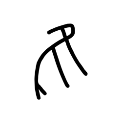

- source_zip_member: `Sub-character Images/y0f5gu3q0a/y0f5gu3q0a/lpmszvk9f1.png`
- checksum_sha256: see `06_component-visual-index.csv`.
- review_status: `needs_human_visual_review`
- caution: source-marked review image only.

## asset-012500

- source_zip_member: `Sub-character Images/y0f5gu3q0a/y0f5gu3q0a/luscvgv918.png`
- checksum_sha256: see `06_component-visual-index.csv`.
- review_status: `needs_human_visual_review`
- caution: source-marked review image only.

## asset-012501

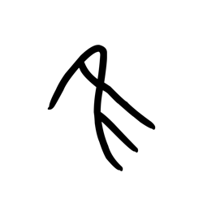

- source_zip_member: `Sub-character Images/y0f5gu3q0a/y0f5gu3q0a/m0xbbjaikt.png`
- checksum_sha256: see `06_component-visual-index.csv`.
- review_status: `needs_human_visual_review`
- caution: source-marked review image only.

## asset-012502

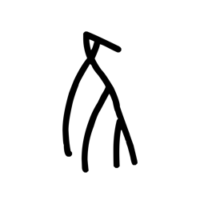

- source_zip_member: `Sub-character Images/y0f5gu3q0a/y0f5gu3q0a/m17gv5x2cw.png`
- checksum_sha256: see `06_component-visual-index.csv`.
- review_status: `needs_human_visual_review`
- caution: source-marked review image only.

## asset-012503

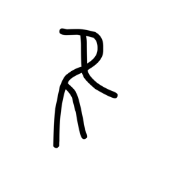

- source_zip_member: `Sub-character Images/y0f5gu3q0a/y0f5gu3q0a/m4znexoddw.png`
- checksum_sha256: see `06_component-visual-index.csv`.
- review_status: `needs_human_visual_review`
- caution: source-marked review image only.

## asset-012504

- source_zip_member: `Sub-character Images/y0f5gu3q0a/y0f5gu3q0a/m5mttfrpia.png`
- checksum_sha256: see `06_component-visual-index.csv`.
- review_status: `needs_human_visual_review`
- caution: source-marked review image only.

## asset-012505

- source_zip_member: `Sub-character Images/y0f5gu3q0a/y0f5gu3q0a/mcrmuvon8f.png`
- checksum_sha256: see `06_component-visual-index.csv`.
- review_status: `needs_human_visual_review`
- caution: source-marked review image only.

## asset-012506

- source_zip_member: `Sub-character Images/y0f5gu3q0a/y0f5gu3q0a/mkg1wyh4go.png`
- checksum_sha256: see `06_component-visual-index.csv`.
- review_status: `needs_human_visual_review`
- caution: source-marked review image only.

## asset-012507

- source_zip_member: `Sub-character Images/y0f5gu3q0a/y0f5gu3q0a/mkrevh7xk6.png`
- checksum_sha256: see `06_component-visual-index.csv`.
- review_status: `needs_human_visual_review`
- caution: source-marked review image only.

## asset-012508

- source_zip_member: `Sub-character Images/y0f5gu3q0a/y0f5gu3q0a/mllj6eokwj.png`
- checksum_sha256: see `06_component-visual-index.csv`.
- review_status: `needs_human_visual_review`
- caution: source-marked review image only.

## asset-012509

- source_zip_member: `Sub-character Images/y0f5gu3q0a/y0f5gu3q0a/mmyp4y9jsh.png`
- checksum_sha256: see `06_component-visual-index.csv`.
- review_status: `needs_human_visual_review`
- caution: source-marked review image only.

## asset-012510

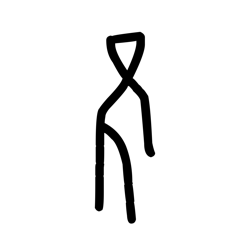

- source_zip_member: `Sub-character Images/y0f5gu3q0a/y0f5gu3q0a/mures18mfb.png`
- checksum_sha256: see `06_component-visual-index.csv`.
- review_status: `needs_human_visual_review`
- caution: source-marked review image only.

## asset-012511

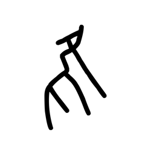

- source_zip_member: `Sub-character Images/y0f5gu3q0a/y0f5gu3q0a/my7vrz87id.png`
- checksum_sha256: see `06_component-visual-index.csv`.
- review_status: `needs_human_visual_review`
- caution: source-marked review image only.

## asset-012512

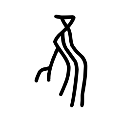

- source_zip_member: `Sub-character Images/y0f5gu3q0a/y0f5gu3q0a/n5nsy0ce20.png`
- checksum_sha256: see `06_component-visual-index.csv`.
- review_status: `needs_human_visual_review`
- caution: source-marked review image only.

## asset-012513

- source_zip_member: `Sub-character Images/y0f5gu3q0a/y0f5gu3q0a/n5uro0iqr8.png`
- checksum_sha256: see `06_component-visual-index.csv`.
- review_status: `needs_human_visual_review`
- caution: source-marked review image only.

## asset-012514

- source_zip_member: `Sub-character Images/y0f5gu3q0a/y0f5gu3q0a/n77u74cc6c.png`
- checksum_sha256: see `06_component-visual-index.csv`.
- review_status: `needs_human_visual_review`
- caution: source-marked review image only.

## asset-012515

- source_zip_member: `Sub-character Images/y0f5gu3q0a/y0f5gu3q0a/nh1w3t00py.png`
- checksum_sha256: see `06_component-visual-index.csv`.
- review_status: `needs_human_visual_review`
- caution: source-marked review image only.

## asset-012516

- source_zip_member: `Sub-character Images/y0f5gu3q0a/y0f5gu3q0a/nsa5fgl9fm.png`
- checksum_sha256: see `06_component-visual-index.csv`.
- review_status: `needs_human_visual_review`
- caution: source-marked review image only.

## asset-012517

- source_zip_member: `Sub-character Images/y0f5gu3q0a/y0f5gu3q0a/nwbuwdjbwm.png`
- checksum_sha256: see `06_component-visual-index.csv`.
- review_status: `needs_human_visual_review`
- caution: source-marked review image only.

## asset-012518

- source_zip_member: `Sub-character Images/y0f5gu3q0a/y0f5gu3q0a/nxc4urme71.png`
- checksum_sha256: see `06_component-visual-index.csv`.
- review_status: `needs_human_visual_review`
- caution: source-marked review image only.

## asset-012519

- source_zip_member: `Sub-character Images/y0f5gu3q0a/y0f5gu3q0a/ob5cl2xqjm.png`
- checksum_sha256: see `06_component-visual-index.csv`.
- review_status: `needs_human_visual_review`
- caution: source-marked review image only.

## asset-012520

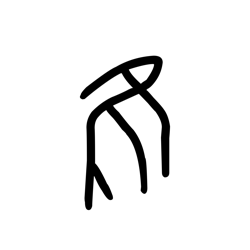

- source_zip_member: `Sub-character Images/y0f5gu3q0a/y0f5gu3q0a/ohfi2j7yr5.png`
- checksum_sha256: see `06_component-visual-index.csv`.
- review_status: `needs_human_visual_review`
- caution: source-marked review image only.

## asset-012521

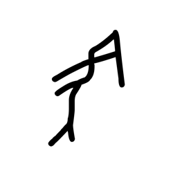

- source_zip_member: `Sub-character Images/y0f5gu3q0a/y0f5gu3q0a/okdc8paywx.png`
- checksum_sha256: see `06_component-visual-index.csv`.
- review_status: `needs_human_visual_review`
- caution: source-marked review image only.

## asset-012522

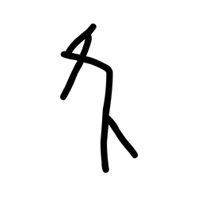

- source_zip_member: `Sub-character Images/y0f5gu3q0a/y0f5gu3q0a/om8p3rk7cd.png`
- checksum_sha256: see `06_component-visual-index.csv`.
- review_status: `needs_human_visual_review`
- caution: source-marked review image only.

## asset-012523

- source_zip_member: `Sub-character Images/y0f5gu3q0a/y0f5gu3q0a/ot7r1mids3.png`
- checksum_sha256: see `06_component-visual-index.csv`.
- review_status: `needs_human_visual_review`
- caution: source-marked review image only.

## asset-012524

- source_zip_member: `Sub-character Images/y0f5gu3q0a/y0f5gu3q0a/oy1d7tlvp6.png`
- checksum_sha256: see `06_component-visual-index.csv`.
- review_status: `needs_human_visual_review`
- caution: source-marked review image only.

## asset-012525

- source_zip_member: `Sub-character Images/y0f5gu3q0a/y0f5gu3q0a/p0w83mej0s.png`
- checksum_sha256: see `06_component-visual-index.csv`.
- review_status: `needs_human_visual_review`
- caution: source-marked review image only.

## asset-012526

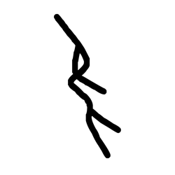

- source_zip_member: `Sub-character Images/y0f5gu3q0a/y0f5gu3q0a/pkq0udf0wd.png`
- checksum_sha256: see `06_component-visual-index.csv`.
- review_status: `needs_human_visual_review`
- caution: source-marked review image only.

## asset-012527

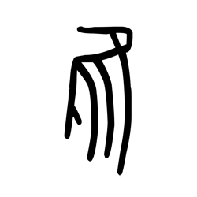

- source_zip_member: `Sub-character Images/y0f5gu3q0a/y0f5gu3q0a/pygjf1zfa0.png`
- checksum_sha256: see `06_component-visual-index.csv`.
- review_status: `needs_human_visual_review`
- caution: source-marked review image only.

## asset-012528

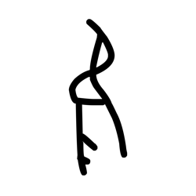

- source_zip_member: `Sub-character Images/y0f5gu3q0a/y0f5gu3q0a/q458xshkvb.png`
- checksum_sha256: see `06_component-visual-index.csv`.
- review_status: `needs_human_visual_review`
- caution: source-marked review image only.

## asset-012529

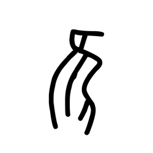

- source_zip_member: `Sub-character Images/y0f5gu3q0a/y0f5gu3q0a/q61lz3c6xa.png`
- checksum_sha256: see `06_component-visual-index.csv`.
- review_status: `needs_human_visual_review`
- caution: source-marked review image only.

## asset-012530

- source_zip_member: `Sub-character Images/y0f5gu3q0a/y0f5gu3q0a/q73ywxz7sm.png`
- checksum_sha256: see `06_component-visual-index.csv`.
- review_status: `needs_human_visual_review`
- caution: source-marked review image only.

## asset-012531

- source_zip_member: `Sub-character Images/y0f5gu3q0a/y0f5gu3q0a/qbj3l2q57e.png`
- checksum_sha256: see `06_component-visual-index.csv`.
- review_status: `needs_human_visual_review`
- caution: source-marked review image only.

## asset-012532

- source_zip_member: `Sub-character Images/y0f5gu3q0a/y0f5gu3q0a/qhwv345new.png`
- checksum_sha256: see `06_component-visual-index.csv`.
- review_status: `needs_human_visual_review`
- caution: source-marked review image only.

## asset-012533

- source_zip_member: `Sub-character Images/y0f5gu3q0a/y0f5gu3q0a/qqqf2fu70r.png`
- checksum_sha256: see `06_component-visual-index.csv`.
- review_status: `needs_human_visual_review`
- caution: source-marked review image only.

## asset-012534

- source_zip_member: `Sub-character Images/y0f5gu3q0a/y0f5gu3q0a/qzoilznoy5.png`
- checksum_sha256: see `06_component-visual-index.csv`.
- review_status: `needs_human_visual_review`
- caution: source-marked review image only.

## asset-012535

- source_zip_member: `Sub-character Images/y0f5gu3q0a/y0f5gu3q0a/r1kch9nloq.png`
- checksum_sha256: see `06_component-visual-index.csv`.
- review_status: `needs_human_visual_review`
- caution: source-marked review image only.

## asset-012536

- source_zip_member: `Sub-character Images/y0f5gu3q0a/y0f5gu3q0a/r2qtylt8ir.png`
- checksum_sha256: see `06_component-visual-index.csv`.
- review_status: `needs_human_visual_review`
- caution: source-marked review image only.

## asset-012537

- source_zip_member: `Sub-character Images/y0f5gu3q0a/y0f5gu3q0a/r4ib4n2jr7.png`
- checksum_sha256: see `06_component-visual-index.csv`.
- review_status: `needs_human_visual_review`
- caution: source-marked review image only.

## asset-012538

- source_zip_member: `Sub-character Images/y0f5gu3q0a/y0f5gu3q0a/rmminiyrxp.png`
- checksum_sha256: see `06_component-visual-index.csv`.
- review_status: `needs_human_visual_review`
- caution: source-marked review image only.

## asset-012539

- source_zip_member: `Sub-character Images/y0f5gu3q0a/y0f5gu3q0a/rzqjgr674u.png`
- checksum_sha256: see `06_component-visual-index.csv`.
- review_status: `needs_human_visual_review`
- caution: source-marked review image only.

## asset-012540

- source_zip_member: `Sub-character Images/y0f5gu3q0a/y0f5gu3q0a/s2f6389ew4.png`
- checksum_sha256: see `06_component-visual-index.csv`.
- review_status: `needs_human_visual_review`
- caution: source-marked review image only.

## asset-012541

- source_zip_member: `Sub-character Images/y0f5gu3q0a/y0f5gu3q0a/sfls07erb4.png`
- checksum_sha256: see `06_component-visual-index.csv`.
- review_status: `needs_human_visual_review`
- caution: source-marked review image only.

## asset-012542

- source_zip_member: `Sub-character Images/y0f5gu3q0a/y0f5gu3q0a/snx66yz5bb.png`
- checksum_sha256: see `06_component-visual-index.csv`.
- review_status: `needs_human_visual_review`
- caution: source-marked review image only.

## asset-012543

- source_zip_member: `Sub-character Images/y0f5gu3q0a/y0f5gu3q0a/sq3udsl7e3.png`
- checksum_sha256: see `06_component-visual-index.csv`.
- review_status: `needs_human_visual_review`
- caution: source-marked review image only.

## asset-012544

- source_zip_member: `Sub-character Images/y0f5gu3q0a/y0f5gu3q0a/sqhzkatqxl.png`
- checksum_sha256: see `06_component-visual-index.csv`.
- review_status: `needs_human_visual_review`
- caution: source-marked review image only.

## asset-012545

- source_zip_member: `Sub-character Images/y0f5gu3q0a/y0f5gu3q0a/sv7urwvnaz.png`
- checksum_sha256: see `06_component-visual-index.csv`.
- review_status: `needs_human_visual_review`
- caution: source-marked review image only.

## asset-012546

- source_zip_member: `Sub-character Images/y0f5gu3q0a/y0f5gu3q0a/tiicn5bcuy.png`
- checksum_sha256: see `06_component-visual-index.csv`.
- review_status: `needs_human_visual_review`
- caution: source-marked review image only.

## asset-012547

- source_zip_member: `Sub-character Images/y0f5gu3q0a/y0f5gu3q0a/tijpidt681.png`
- checksum_sha256: see `06_component-visual-index.csv`.
- review_status: `needs_human_visual_review`
- caution: source-marked review image only.

## asset-012548

- source_zip_member: `Sub-character Images/y0f5gu3q0a/y0f5gu3q0a/tkxs1y7vna.png`
- checksum_sha256: see `06_component-visual-index.csv`.
- review_status: `needs_human_visual_review`
- caution: source-marked review image only.

## asset-012549

- source_zip_member: `Sub-character Images/y0f5gu3q0a/y0f5gu3q0a/tlpxvepeut.png`
- checksum_sha256: see `06_component-visual-index.csv`.
- review_status: `needs_human_visual_review`
- caution: source-marked review image only.

## asset-012550

- source_zip_member: `Sub-character Images/y0f5gu3q0a/y0f5gu3q0a/ts8lnkywo9.png`
- checksum_sha256: see `06_component-visual-index.csv`.
- review_status: `needs_human_visual_review`
- caution: source-marked review image only.

## asset-012551

- source_zip_member: `Sub-character Images/y0f5gu3q0a/y0f5gu3q0a/u1z5neshn1.png`
- checksum_sha256: see `06_component-visual-index.csv`.
- review_status: `needs_human_visual_review`
- caution: source-marked review image only.

## asset-012552

- source_zip_member: `Sub-character Images/y0f5gu3q0a/y0f5gu3q0a/u276g0fxbv.png`
- checksum_sha256: see `06_component-visual-index.csv`.
- review_status: `needs_human_visual_review`
- caution: source-marked review image only.

## asset-012553

- source_zip_member: `Sub-character Images/y0f5gu3q0a/y0f5gu3q0a/ufnwxcslek.png`
- checksum_sha256: see `06_component-visual-index.csv`.
- review_status: `needs_human_visual_review`
- caution: source-marked review image only.

## asset-012554

- source_zip_member: `Sub-character Images/y0f5gu3q0a/y0f5gu3q0a/uh0bjmw4i6.png`
- checksum_sha256: see `06_component-visual-index.csv`.
- review_status: `needs_human_visual_review`
- caution: source-marked review image only.

## asset-012555

- source_zip_member: `Sub-character Images/y0f5gu3q0a/y0f5gu3q0a/uh55l79awq.png`
- checksum_sha256: see `06_component-visual-index.csv`.
- review_status: `needs_human_visual_review`
- caution: source-marked review image only.

## asset-012556

- source_zip_member: `Sub-character Images/y0f5gu3q0a/y0f5gu3q0a/uiul44rrns.png`
- checksum_sha256: see `06_component-visual-index.csv`.
- review_status: `needs_human_visual_review`
- caution: source-marked review image only.

## asset-012557

- source_zip_member: `Sub-character Images/y0f5gu3q0a/y0f5gu3q0a/ukianypyw6.png`
- checksum_sha256: see `06_component-visual-index.csv`.
- review_status: `needs_human_visual_review`
- caution: source-marked review image only.

## asset-012558

- source_zip_member: `Sub-character Images/y0f5gu3q0a/y0f5gu3q0a/urukelaf0y.png`
- checksum_sha256: see `06_component-visual-index.csv`.
- review_status: `needs_human_visual_review`
- caution: source-marked review image only.

## asset-012559

- source_zip_member: `Sub-character Images/y0f5gu3q0a/y0f5gu3q0a/usqht7c42n.png`
- checksum_sha256: see `06_component-visual-index.csv`.
- review_status: `needs_human_visual_review`
- caution: source-marked review image only.

## asset-012560

- source_zip_member: `Sub-character Images/y0f5gu3q0a/y0f5gu3q0a/v4t2r5lwnz.png`
- checksum_sha256: see `06_component-visual-index.csv`.
- review_status: `needs_human_visual_review`
- caution: source-marked review image only.

## asset-012561

- source_zip_member: `Sub-character Images/y0f5gu3q0a/y0f5gu3q0a/vaebv1l4nw.png`
- checksum_sha256: see `06_component-visual-index.csv`.
- review_status: `needs_human_visual_review`
- caution: source-marked review image only.

## asset-012562

- source_zip_member: `Sub-character Images/y0f5gu3q0a/y0f5gu3q0a/vxdu5kpfsp.png`
- checksum_sha256: see `06_component-visual-index.csv`.
- review_status: `needs_human_visual_review`
- caution: source-marked review image only.

## asset-012563

- source_zip_member: `Sub-character Images/y0f5gu3q0a/y0f5gu3q0a/w7eb2aja4m.png`
- checksum_sha256: see `06_component-visual-index.csv`.
- review_status: `needs_human_visual_review`
- caution: source-marked review image only.

## asset-012564

- source_zip_member: `Sub-character Images/y0f5gu3q0a/y0f5gu3q0a/w8ne0k6lo0.png`
- checksum_sha256: see `06_component-visual-index.csv`.
- review_status: `needs_human_visual_review`
- caution: source-marked review image only.

## asset-012565

- source_zip_member: `Sub-character Images/y0f5gu3q0a/y0f5gu3q0a/wpao6jrl94.png`
- checksum_sha256: see `06_component-visual-index.csv`.
- review_status: `needs_human_visual_review`
- caution: source-marked review image only.

## asset-012566

- source_zip_member: `Sub-character Images/y0f5gu3q0a/y0f5gu3q0a/wpr4j57aca.png`
- checksum_sha256: see `06_component-visual-index.csv`.
- review_status: `needs_human_visual_review`
- caution: source-marked review image only.

## asset-012567

- source_zip_member: `Sub-character Images/y0f5gu3q0a/y0f5gu3q0a/wq9r6m47eq.png`
- checksum_sha256: see `06_component-visual-index.csv`.
- review_status: `needs_human_visual_review`
- caution: source-marked review image only.

## asset-012568

- source_zip_member: `Sub-character Images/y0f5gu3q0a/y0f5gu3q0a/wx0efxnfvh.png`
- checksum_sha256: see `06_component-visual-index.csv`.
- review_status: `needs_human_visual_review`
- caution: source-marked review image only.

## asset-012569

- source_zip_member: `Sub-character Images/y0f5gu3q0a/y0f5gu3q0a/wyybi591dj.png`
- checksum_sha256: see `06_component-visual-index.csv`.
- review_status: `needs_human_visual_review`
- caution: source-marked review image only.

## asset-012570

- source_zip_member: `Sub-character Images/y0f5gu3q0a/y0f5gu3q0a/wzav9h12ec.png`
- checksum_sha256: see `06_component-visual-index.csv`.
- review_status: `needs_human_visual_review`
- caution: source-marked review image only.

## asset-012571

- source_zip_member: `Sub-character Images/y0f5gu3q0a/y0f5gu3q0a/x22x65g666.png`
- checksum_sha256: see `06_component-visual-index.csv`.
- review_status: `needs_human_visual_review`
- caution: source-marked review image only.

## asset-012572

- source_zip_member: `Sub-character Images/y0f5gu3q0a/y0f5gu3q0a/x7fyqwihb8.png`
- checksum_sha256: see `06_component-visual-index.csv`.
- review_status: `needs_human_visual_review`
- caution: source-marked review image only.

## asset-012573

- source_zip_member: `Sub-character Images/y0f5gu3q0a/y0f5gu3q0a/x9hdmznais.png`
- checksum_sha256: see `06_component-visual-index.csv`.
- review_status: `needs_human_visual_review`
- caution: source-marked review image only.

## asset-012574

- source_zip_member: `Sub-character Images/y0f5gu3q0a/y0f5gu3q0a/xferdme96d.png`
- checksum_sha256: see `06_component-visual-index.csv`.
- review_status: `needs_human_visual_review`
- caution: source-marked review image only.

## asset-012575

- source_zip_member: `Sub-character Images/y0f5gu3q0a/y0f5gu3q0a/xmrg4cyj6u.png`
- checksum_sha256: see `06_component-visual-index.csv`.
- review_status: `needs_human_visual_review`
- caution: source-marked review image only.

## asset-012576

- source_zip_member: `Sub-character Images/y0f5gu3q0a/y0f5gu3q0a/xpwwgd4kct.png`
- checksum_sha256: see `06_component-visual-index.csv`.
- review_status: `needs_human_visual_review`
- caution: source-marked review image only.

## asset-012577

- source_zip_member: `Sub-character Images/y0f5gu3q0a/y0f5gu3q0a/xrfon0vo0p.png`
- checksum_sha256: see `06_component-visual-index.csv`.
- review_status: `needs_human_visual_review`
- caution: source-marked review image only.

## asset-012578

- source_zip_member: `Sub-character Images/y0f5gu3q0a/y0f5gu3q0a/xy2xvzz6fr.png`
- checksum_sha256: see `06_component-visual-index.csv`.
- review_status: `needs_human_visual_review`
- caution: source-marked review image only.

## asset-012579

- source_zip_member: `Sub-character Images/y0f5gu3q0a/y0f5gu3q0a/xyjk0grqzu.png`
- checksum_sha256: see `06_component-visual-index.csv`.
- review_status: `needs_human_visual_review`
- caution: source-marked review image only.

## asset-012580

- source_zip_member: `Sub-character Images/y0f5gu3q0a/y0f5gu3q0a/y0f5gu3q0a.png`
- checksum_sha256: see `06_component-visual-index.csv`.
- review_status: `needs_human_visual_review`
- caution: source-marked review image only.

## asset-012581

- source_zip_member: `Sub-character Images/y0f5gu3q0a/y0f5gu3q0a/y2e4tci41j.png`
- checksum_sha256: see `06_component-visual-index.csv`.
- review_status: `needs_human_visual_review`
- caution: source-marked review image only.

## asset-012582

- source_zip_member: `Sub-character Images/y0f5gu3q0a/y0f5gu3q0a/y5ghx0taeb.png`
- checksum_sha256: see `06_component-visual-index.csv`.
- review_status: `needs_human_visual_review`
- caution: source-marked review image only.

## asset-012583

- source_zip_member: `Sub-character Images/y0f5gu3q0a/y0f5gu3q0a/y75yfmiu6n.png`
- checksum_sha256: see `06_component-visual-index.csv`.
- review_status: `needs_human_visual_review`
- caution: source-marked review image only.

## asset-012584

- source_zip_member: `Sub-character Images/y0f5gu3q0a/y0f5gu3q0a/ycvo4xmv35.png`
- checksum_sha256: see `06_component-visual-index.csv`.
- review_status: `needs_human_visual_review`
- caution: source-marked review image only.

## asset-012585

- source_zip_member: `Sub-character Images/y0f5gu3q0a/y0f5gu3q0a/yerh5m44kh.png`
- checksum_sha256: see `06_component-visual-index.csv`.
- review_status: `needs_human_visual_review`
- caution: source-marked review image only.

## asset-012586

- source_zip_member: `Sub-character Images/y0f5gu3q0a/y0f5gu3q0a/yl8qd5ki1b.png`
- checksum_sha256: see `06_component-visual-index.csv`.
- review_status: `needs_human_visual_review`
- caution: source-marked review image only.

## asset-012587

- source_zip_member: `Sub-character Images/y0f5gu3q0a/y0f5gu3q0a/yobr3c68zw.png`
- checksum_sha256: see `06_component-visual-index.csv`.
- review_status: `needs_human_visual_review`
- caution: source-marked review image only.

## asset-012588

- source_zip_member: `Sub-character Images/y0f5gu3q0a/y0f5gu3q0a/ypzvoqye30.png`
- checksum_sha256: see `06_component-visual-index.csv`.
- review_status: `needs_human_visual_review`
- caution: source-marked review image only.

## asset-012589

- source_zip_member: `Sub-character Images/y0f5gu3q0a/y0f5gu3q0a/yqke88l327.png`
- checksum_sha256: see `06_component-visual-index.csv`.
- review_status: `needs_human_visual_review`
- caution: source-marked review image only.

## asset-012590

- source_zip_member: `Sub-character Images/y0f5gu3q0a/y0f5gu3q0a/ywbn1bv95b.png`
- checksum_sha256: see `06_component-visual-index.csv`.
- review_status: `needs_human_visual_review`
- caution: source-marked review image only.

## asset-012591

- source_zip_member: `Sub-character Images/y0f5gu3q0a/y0f5gu3q0a/yxfvrwbfrp.png`
- checksum_sha256: see `06_component-visual-index.csv`.
- review_status: `needs_human_visual_review`
- caution: source-marked review image only.

## asset-012592

- source_zip_member: `Sub-character Images/y0f5gu3q0a/y0f5gu3q0a/z298pemxbt.png`
- checksum_sha256: see `06_component-visual-index.csv`.
- review_status: `needs_human_visual_review`
- caution: source-marked review image only.

## asset-012593

- source_zip_member: `Sub-character Images/y0f5gu3q0a/y0f5gu3q0a/z2wtknabce.png`
- checksum_sha256: see `06_component-visual-index.csv`.
- review_status: `needs_human_visual_review`
- caution: source-marked review image only.

## asset-012594

- source_zip_member: `Sub-character Images/y0f5gu3q0a/y0f5gu3q0a/z3669rsse7.png`
- checksum_sha256: see `06_component-visual-index.csv`.
- review_status: `needs_human_visual_review`
- caution: source-marked review image only.

## asset-012595

- source_zip_member: `Sub-character Images/y0f5gu3q0a/y0f5gu3q0a/z8xk9moz4d.png`
- checksum_sha256: see `06_component-visual-index.csv`.
- review_status: `needs_human_visual_review`
- caution: source-marked review image only.

## asset-012596

- source_zip_member: `Sub-character Images/y0f5gu3q0a/y0f5gu3q0a/zisvmeyr2f.png`
- checksum_sha256: see `06_component-visual-index.csv`.
- review_status: `needs_human_visual_review`
- caution: source-marked review image only.

## asset-012597

- source_zip_member: `Sub-character Images/y0f5gu3q0a/y0f5gu3q0a/zjb91t27cs.png`
- checksum_sha256: see `06_component-visual-index.csv`.
- review_status: `needs_human_visual_review`
- caution: source-marked review image only.

## asset-012598

- source_zip_member: `Sub-character Images/y0f5gu3q0a/y0f5gu3q0a/zrzov5ezcb.png`
- checksum_sha256: see `06_component-visual-index.csv`.
- review_status: `needs_human_visual_review`
- caution: source-marked review image only.

## asset-012599

- source_zip_member: `Sub-character Images/y0f5gu3q0a/y0f5gu3q0a/zv5c0oo6y3.png`
- checksum_sha256: see `06_component-visual-index.csv`.
- review_status: `needs_human_visual_review`
- caution: source-marked review image only.
