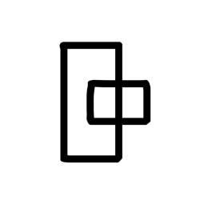
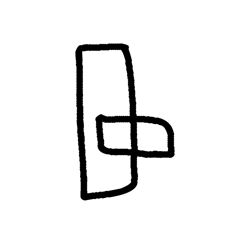
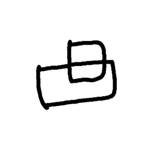
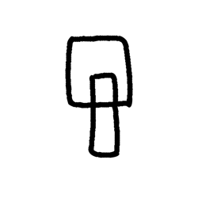
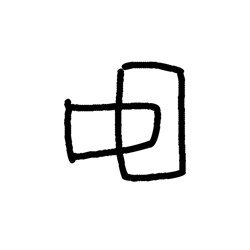

# Component Visual Gallery / 构件图像查看: obs-comp-cand-000466

English:
This page displays OBIMD subcharacter PNG assets extracted into this concrete corpus object directory for human review.

简体中文：
本页展示抽取到当前具体 corpus 对象目录内的 OBIMD subcharacter PNG 资料，供人工复核使用。

Boundary / 边界：dataset image candidate only; not a confirmed component form, component assignment, or decipherment claim.

## asset-012614

- source_zip_member: `Sub-character Images/8gro2b24ja/1kn5q2g92n/1kn5q2g92n.png`
- checksum_sha256: `4eaf609567c0011335ff2ef95a370a1908a3a5361c8b40ffa069701a3727edd4`
- review_status: `needs_human_visual_review`
- caution: OBIMD subcharacter image is a source-marked review asset only; it is not a confirmed component form, component assignment, or decipherment conclusion.

## asset-012615

- source_zip_member: `Sub-character Images/8gro2b24ja/1kn5q2g92n/f2sf0k4rok.png`
- checksum_sha256: `a635ba6ebd7d15037397ac3ba7248b0b7e635a32ee024aa9a8f0ddf441d09bb8`
- review_status: `needs_human_visual_review`
- caution: OBIMD subcharacter image is a source-marked review asset only; it is not a confirmed component form, component assignment, or decipherment conclusion.

## asset-012616

- source_zip_member: `Sub-character Images/8gro2b24ja/1kn5q2g92n/fwvq43ch9u.png`
- checksum_sha256: `6e4e9f41b848b23b9adef45c6c45052e34ea19049d7011a577ef92760324c08b`
- review_status: `needs_human_visual_review`
- caution: OBIMD subcharacter image is a source-marked review asset only; it is not a confirmed component form, component assignment, or decipherment conclusion.

## asset-012617

- source_zip_member: `Sub-character Images/8gro2b24ja/1kn5q2g92n/sot5rxvc7q.png`
- checksum_sha256: `ad21feea2252eb0c872f42135a4886ee1b69aa097fb4ae3b7e019ab1e8a5cbf8`
- review_status: `needs_human_visual_review`
- caution: OBIMD subcharacter image is a source-marked review asset only; it is not a confirmed component form, component assignment, or decipherment conclusion.

## asset-012618

- source_zip_member: `Sub-character Images/8gro2b24ja/1kn5q2g92n/wng2kn9fjb.png`
- checksum_sha256: `8e5366813633d11fa317c1afcb1f2a3ff02a7dba9eb16adc661416b66f1e13e6`
- review_status: `needs_human_visual_review`
- caution: OBIMD subcharacter image is a source-marked review asset only; it is not a confirmed component form, component assignment, or decipherment conclusion.
