# Component Visual Gallery / 构件图像查看: obs-comp-cand-000479

English:
This page displays OBIMD subcharacter PNG assets extracted into this concrete
corpus object directory for human review.

简体中文：
本页展示抽取到当前具体 corpus 对象目录内的 OBIMD subcharacter PNG 资料，供人工复核使用。

Boundary / 边界：
dataset image candidate only; not a confirmed component form, not a component
assignment, and not a decipherment claim.
- not a confirmed component form
- not a component assignment
- not a decipherment claim

## Concrete Questions To Check / 具体待查问题

- Open 06_component-visual-index.csv and name the local image row.
- 打开 06_component-visual-index.csv，写明本地图像行。
- Open 09_component-visual-route-index.csv and name the source route row.
- 打开 09_component-visual-route-index.csv，写明来源路线行。
- Open 13_component-context-evidence-dossier.md for character context.
- 打开 13_component-context-evidence-dossier.md，核对单字与卜辞上下文。
- Record the missing image, near-shape, source, or context route.
- 记录缺失的图像、近形、来源或上下文路线。

## asset-012628

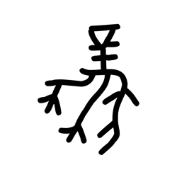

- source_zip_member: `Sub-character Images/x0wt5y5bs2/x0wt5y5bs2/0qp8oj43k8.png`
- checksum_sha256: see `06_component-visual-index.csv`.
- review_status: `needs_human_visual_review`
- caution: source-marked review image only.

## asset-012629

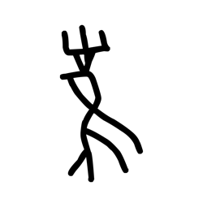

- source_zip_member: `Sub-character Images/x0wt5y5bs2/x0wt5y5bs2/1u9a386ogy.png`
- checksum_sha256: see `06_component-visual-index.csv`.
- review_status: `needs_human_visual_review`
- caution: source-marked review image only.

## asset-012630

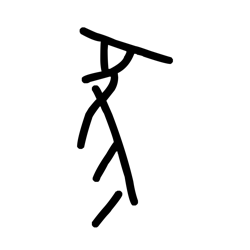

- source_zip_member: `Sub-character Images/x0wt5y5bs2/x0wt5y5bs2/2bj9fi0nsb.png`
- checksum_sha256: see `06_component-visual-index.csv`.
- review_status: `needs_human_visual_review`
- caution: source-marked review image only.

## asset-012631

- source_zip_member: `Sub-character Images/x0wt5y5bs2/x0wt5y5bs2/2bqp06z3bg.png`
- checksum_sha256: see `06_component-visual-index.csv`.
- review_status: `needs_human_visual_review`
- caution: source-marked review image only.

## asset-012632

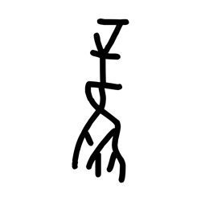

- source_zip_member: `Sub-character Images/x0wt5y5bs2/x0wt5y5bs2/2wdm2xm3my.png`
- checksum_sha256: see `06_component-visual-index.csv`.
- review_status: `needs_human_visual_review`
- caution: source-marked review image only.

## asset-012633

- source_zip_member: `Sub-character Images/x0wt5y5bs2/x0wt5y5bs2/4u84hwmqtz.png`
- checksum_sha256: see `06_component-visual-index.csv`.
- review_status: `needs_human_visual_review`
- caution: source-marked review image only.

## asset-012634

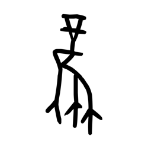

- source_zip_member: `Sub-character Images/x0wt5y5bs2/x0wt5y5bs2/5rp522ji13.png`
- checksum_sha256: see `06_component-visual-index.csv`.
- review_status: `needs_human_visual_review`
- caution: source-marked review image only.

## asset-012635

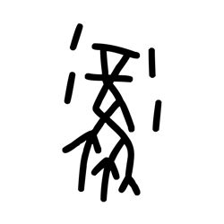

- source_zip_member: `Sub-character Images/x0wt5y5bs2/x0wt5y5bs2/6c4d43hozd.png`
- checksum_sha256: see `06_component-visual-index.csv`.
- review_status: `needs_human_visual_review`
- caution: source-marked review image only.

## asset-012636

- source_zip_member: `Sub-character Images/x0wt5y5bs2/x0wt5y5bs2/78mrz1j5kg.png`
- checksum_sha256: see `06_component-visual-index.csv`.
- review_status: `needs_human_visual_review`
- caution: source-marked review image only.

## asset-012637

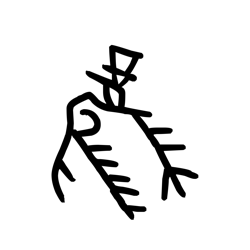

- source_zip_member: `Sub-character Images/x0wt5y5bs2/x0wt5y5bs2/7a19punwcr.png`
- checksum_sha256: see `06_component-visual-index.csv`.
- review_status: `needs_human_visual_review`
- caution: source-marked review image only.

## asset-012638

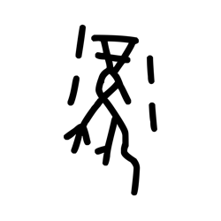

- source_zip_member: `Sub-character Images/x0wt5y5bs2/x0wt5y5bs2/7nqbd5kz1h.png`
- checksum_sha256: see `06_component-visual-index.csv`.
- review_status: `needs_human_visual_review`
- caution: source-marked review image only.

## asset-012639

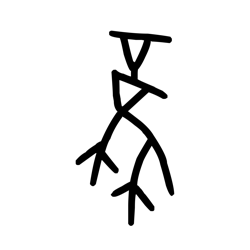

- source_zip_member: `Sub-character Images/x0wt5y5bs2/x0wt5y5bs2/9sb8z1byez.png`
- checksum_sha256: see `06_component-visual-index.csv`.
- review_status: `needs_human_visual_review`
- caution: source-marked review image only.

## asset-012640

- source_zip_member: `Sub-character Images/x0wt5y5bs2/x0wt5y5bs2/an4k618b5r.png`
- checksum_sha256: see `06_component-visual-index.csv`.
- review_status: `needs_human_visual_review`
- caution: source-marked review image only.

## asset-012641

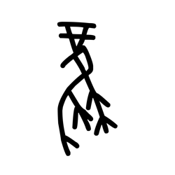

- source_zip_member: `Sub-character Images/x0wt5y5bs2/x0wt5y5bs2/azmnj2i2fu.png`
- checksum_sha256: see `06_component-visual-index.csv`.
- review_status: `needs_human_visual_review`
- caution: source-marked review image only.

## asset-012642

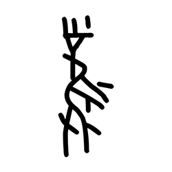

- source_zip_member: `Sub-character Images/x0wt5y5bs2/x0wt5y5bs2/besca3xi1r.png`
- checksum_sha256: see `06_component-visual-index.csv`.
- review_status: `needs_human_visual_review`
- caution: source-marked review image only.

## asset-012643

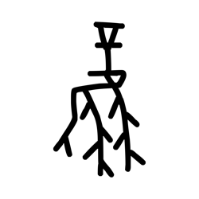

- source_zip_member: `Sub-character Images/x0wt5y5bs2/x0wt5y5bs2/bpcwb4ml5b.png`
- checksum_sha256: see `06_component-visual-index.csv`.
- review_status: `needs_human_visual_review`
- caution: source-marked review image only.

## asset-012644

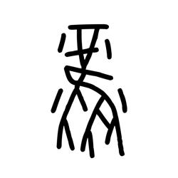

- source_zip_member: `Sub-character Images/x0wt5y5bs2/x0wt5y5bs2/bree7ylu32.png`
- checksum_sha256: see `06_component-visual-index.csv`.
- review_status: `needs_human_visual_review`
- caution: source-marked review image only.

## asset-012645

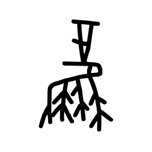

- source_zip_member: `Sub-character Images/x0wt5y5bs2/x0wt5y5bs2/bupaybi8bg.png`
- checksum_sha256: see `06_component-visual-index.csv`.
- review_status: `needs_human_visual_review`
- caution: source-marked review image only.

## asset-012646

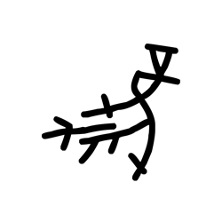

- source_zip_member: `Sub-character Images/x0wt5y5bs2/x0wt5y5bs2/buz3p10h3i.png`
- checksum_sha256: see `06_component-visual-index.csv`.
- review_status: `needs_human_visual_review`
- caution: source-marked review image only.

## asset-012647

- source_zip_member: `Sub-character Images/x0wt5y5bs2/x0wt5y5bs2/c62py31oh0.png`
- checksum_sha256: see `06_component-visual-index.csv`.
- review_status: `needs_human_visual_review`
- caution: source-marked review image only.

## asset-012648

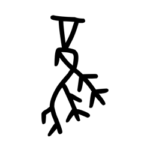

- source_zip_member: `Sub-character Images/x0wt5y5bs2/x0wt5y5bs2/csvyj7uuke.png`
- checksum_sha256: see `06_component-visual-index.csv`.
- review_status: `needs_human_visual_review`
- caution: source-marked review image only.

## asset-012649

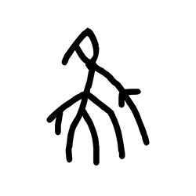

- source_zip_member: `Sub-character Images/x0wt5y5bs2/x0wt5y5bs2/ctn46q84kb.png`
- checksum_sha256: see `06_component-visual-index.csv`.
- review_status: `needs_human_visual_review`
- caution: source-marked review image only.

## asset-012650

- source_zip_member: `Sub-character Images/x0wt5y5bs2/x0wt5y5bs2/dm2bm1z4a4.png`
- checksum_sha256: see `06_component-visual-index.csv`.
- review_status: `needs_human_visual_review`
- caution: source-marked review image only.

## asset-012651

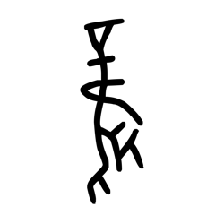

- source_zip_member: `Sub-character Images/x0wt5y5bs2/x0wt5y5bs2/dxsrdwt22h.png`
- checksum_sha256: see `06_component-visual-index.csv`.
- review_status: `needs_human_visual_review`
- caution: source-marked review image only.

## asset-012652

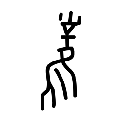

- source_zip_member: `Sub-character Images/x0wt5y5bs2/x0wt5y5bs2/e109a2rpib.png`
- checksum_sha256: see `06_component-visual-index.csv`.
- review_status: `needs_human_visual_review`
- caution: source-marked review image only.

## asset-012653

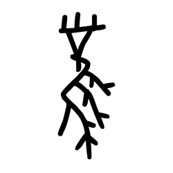

- source_zip_member: `Sub-character Images/x0wt5y5bs2/x0wt5y5bs2/ea358co4p1.png`
- checksum_sha256: see `06_component-visual-index.csv`.
- review_status: `needs_human_visual_review`
- caution: source-marked review image only.

## asset-012654

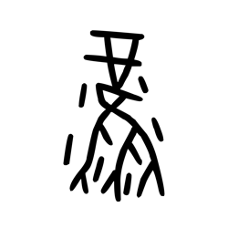

- source_zip_member: `Sub-character Images/x0wt5y5bs2/x0wt5y5bs2/ebsfrz5xw9.png`
- checksum_sha256: see `06_component-visual-index.csv`.
- review_status: `needs_human_visual_review`
- caution: source-marked review image only.

## asset-012655

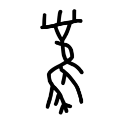

- source_zip_member: `Sub-character Images/x0wt5y5bs2/x0wt5y5bs2/epcdvme3y7.png`
- checksum_sha256: see `06_component-visual-index.csv`.
- review_status: `needs_human_visual_review`
- caution: source-marked review image only.

## asset-012656

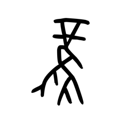

- source_zip_member: `Sub-character Images/x0wt5y5bs2/x0wt5y5bs2/f54dowbz5i.png`
- checksum_sha256: see `06_component-visual-index.csv`.
- review_status: `needs_human_visual_review`
- caution: source-marked review image only.

## asset-012657

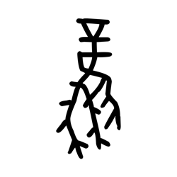

- source_zip_member: `Sub-character Images/x0wt5y5bs2/x0wt5y5bs2/flncuvqqyq.png`
- checksum_sha256: see `06_component-visual-index.csv`.
- review_status: `needs_human_visual_review`
- caution: source-marked review image only.

## asset-012658

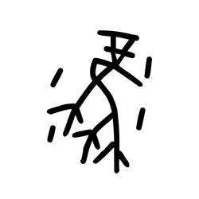

- source_zip_member: `Sub-character Images/x0wt5y5bs2/x0wt5y5bs2/fm24zuwwpf.png`
- checksum_sha256: see `06_component-visual-index.csv`.
- review_status: `needs_human_visual_review`
- caution: source-marked review image only.

## asset-012659

- source_zip_member: `Sub-character Images/x0wt5y5bs2/x0wt5y5bs2/fpucf4jucz.png`
- checksum_sha256: see `06_component-visual-index.csv`.
- review_status: `needs_human_visual_review`
- caution: source-marked review image only.

## asset-012660

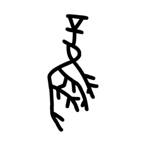

- source_zip_member: `Sub-character Images/x0wt5y5bs2/x0wt5y5bs2/fvjab0zlzy.png`
- checksum_sha256: see `06_component-visual-index.csv`.
- review_status: `needs_human_visual_review`
- caution: source-marked review image only.

## asset-012661

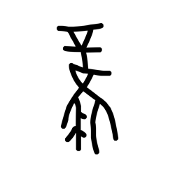

- source_zip_member: `Sub-character Images/x0wt5y5bs2/x0wt5y5bs2/g8qrmyqdjg.png`
- checksum_sha256: see `06_component-visual-index.csv`.
- review_status: `needs_human_visual_review`
- caution: source-marked review image only.

## asset-012662

- source_zip_member: `Sub-character Images/x0wt5y5bs2/x0wt5y5bs2/gebeh49obi.png`
- checksum_sha256: see `06_component-visual-index.csv`.
- review_status: `needs_human_visual_review`
- caution: source-marked review image only.

## asset-012663

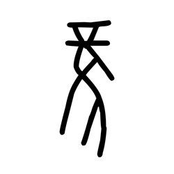

- source_zip_member: `Sub-character Images/x0wt5y5bs2/x0wt5y5bs2/gjdi563khw.png`
- checksum_sha256: see `06_component-visual-index.csv`.
- review_status: `needs_human_visual_review`
- caution: source-marked review image only.

## asset-012664

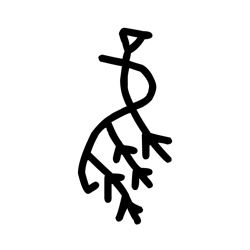

- source_zip_member: `Sub-character Images/x0wt5y5bs2/x0wt5y5bs2/gro5n4wueo.png`
- checksum_sha256: see `06_component-visual-index.csv`.
- review_status: `needs_human_visual_review`
- caution: source-marked review image only.

## asset-012665

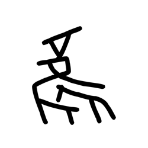

- source_zip_member: `Sub-character Images/x0wt5y5bs2/x0wt5y5bs2/h17k7yg6uu.png`
- checksum_sha256: see `06_component-visual-index.csv`.
- review_status: `needs_human_visual_review`
- caution: source-marked review image only.

## asset-012666

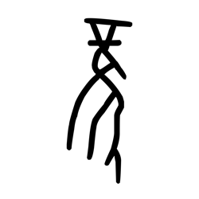

- source_zip_member: `Sub-character Images/x0wt5y5bs2/x0wt5y5bs2/h6hkobu708.png`
- checksum_sha256: see `06_component-visual-index.csv`.
- review_status: `needs_human_visual_review`
- caution: source-marked review image only.

## asset-012667

- source_zip_member: `Sub-character Images/x0wt5y5bs2/x0wt5y5bs2/he447aisva.png`
- checksum_sha256: see `06_component-visual-index.csv`.
- review_status: `needs_human_visual_review`
- caution: source-marked review image only.

## asset-012668

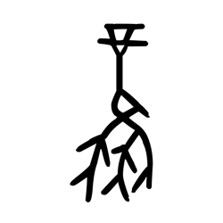

- source_zip_member: `Sub-character Images/x0wt5y5bs2/x0wt5y5bs2/hs7alryzo9.png`
- checksum_sha256: see `06_component-visual-index.csv`.
- review_status: `needs_human_visual_review`
- caution: source-marked review image only.

## asset-012669

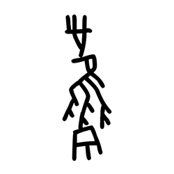

- source_zip_member: `Sub-character Images/x0wt5y5bs2/x0wt5y5bs2/htifymnnor.png`
- checksum_sha256: see `06_component-visual-index.csv`.
- review_status: `needs_human_visual_review`
- caution: source-marked review image only.

## asset-012670

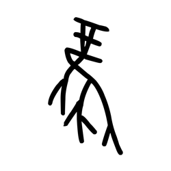

- source_zip_member: `Sub-character Images/x0wt5y5bs2/x0wt5y5bs2/idw91s87yy.png`
- checksum_sha256: see `06_component-visual-index.csv`.
- review_status: `needs_human_visual_review`
- caution: source-marked review image only.

## asset-012671

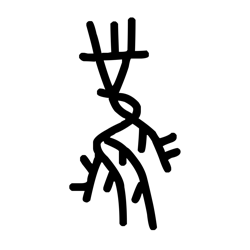

- source_zip_member: `Sub-character Images/x0wt5y5bs2/x0wt5y5bs2/jap2yjzoze.png`
- checksum_sha256: see `06_component-visual-index.csv`.
- review_status: `needs_human_visual_review`
- caution: source-marked review image only.

## asset-012672

- source_zip_member: `Sub-character Images/x0wt5y5bs2/x0wt5y5bs2/jvh4o9p74h.png`
- checksum_sha256: see `06_component-visual-index.csv`.
- review_status: `needs_human_visual_review`
- caution: source-marked review image only.

## asset-012673

- source_zip_member: `Sub-character Images/x0wt5y5bs2/x0wt5y5bs2/kcmi7raqt4.png`
- checksum_sha256: see `06_component-visual-index.csv`.
- review_status: `needs_human_visual_review`
- caution: source-marked review image only.

## asset-012674

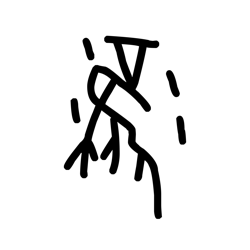

- source_zip_member: `Sub-character Images/x0wt5y5bs2/x0wt5y5bs2/kiq2238wsy.png`
- checksum_sha256: see `06_component-visual-index.csv`.
- review_status: `needs_human_visual_review`
- caution: source-marked review image only.

## asset-012675

- source_zip_member: `Sub-character Images/x0wt5y5bs2/x0wt5y5bs2/ldjxxwvwen.png`
- checksum_sha256: see `06_component-visual-index.csv`.
- review_status: `needs_human_visual_review`
- caution: source-marked review image only.

## asset-012676

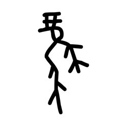

- source_zip_member: `Sub-character Images/x0wt5y5bs2/x0wt5y5bs2/ljjupsal6t.png`
- checksum_sha256: see `06_component-visual-index.csv`.
- review_status: `needs_human_visual_review`
- caution: source-marked review image only.

## asset-012677

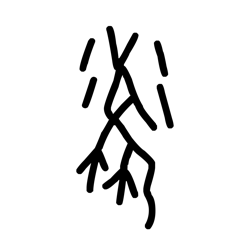

- source_zip_member: `Sub-character Images/x0wt5y5bs2/x0wt5y5bs2/mzrigahe4g.png`
- checksum_sha256: see `06_component-visual-index.csv`.
- review_status: `needs_human_visual_review`
- caution: source-marked review image only.

## asset-012678

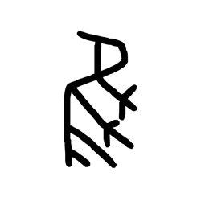

- source_zip_member: `Sub-character Images/x0wt5y5bs2/x0wt5y5bs2/nhlqiwgyrn.png`
- checksum_sha256: see `06_component-visual-index.csv`.
- review_status: `needs_human_visual_review`
- caution: source-marked review image only.

## asset-012679

- source_zip_member: `Sub-character Images/x0wt5y5bs2/x0wt5y5bs2/njd02ixy6s.png`
- checksum_sha256: see `06_component-visual-index.csv`.
- review_status: `needs_human_visual_review`
- caution: source-marked review image only.

## asset-012680

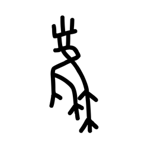

- source_zip_member: `Sub-character Images/x0wt5y5bs2/x0wt5y5bs2/nptdd9dq2d.png`
- checksum_sha256: see `06_component-visual-index.csv`.
- review_status: `needs_human_visual_review`
- caution: source-marked review image only.

## asset-012681

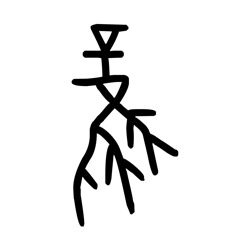

- source_zip_member: `Sub-character Images/x0wt5y5bs2/x0wt5y5bs2/o852yp16am.png`
- checksum_sha256: see `06_component-visual-index.csv`.
- review_status: `needs_human_visual_review`
- caution: source-marked review image only.

## asset-012682

- source_zip_member: `Sub-character Images/x0wt5y5bs2/x0wt5y5bs2/o9l1wx3uav.png`
- checksum_sha256: see `06_component-visual-index.csv`.
- review_status: `needs_human_visual_review`
- caution: source-marked review image only.

## asset-012683

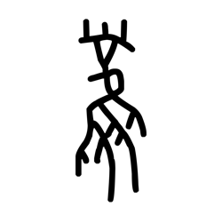

- source_zip_member: `Sub-character Images/x0wt5y5bs2/x0wt5y5bs2/oyyyag9ni4.png`
- checksum_sha256: see `06_component-visual-index.csv`.
- review_status: `needs_human_visual_review`
- caution: source-marked review image only.

## asset-012684

- source_zip_member: `Sub-character Images/x0wt5y5bs2/x0wt5y5bs2/p3y6c30i9b.png`
- checksum_sha256: see `06_component-visual-index.csv`.
- review_status: `needs_human_visual_review`
- caution: source-marked review image only.

## asset-012685

- source_zip_member: `Sub-character Images/x0wt5y5bs2/x0wt5y5bs2/p75ksfvrpf.png`
- checksum_sha256: see `06_component-visual-index.csv`.
- review_status: `needs_human_visual_review`
- caution: source-marked review image only.

## asset-012686

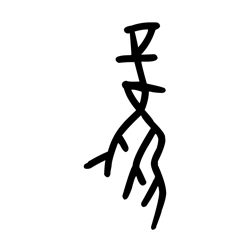

- source_zip_member: `Sub-character Images/x0wt5y5bs2/x0wt5y5bs2/pet7hyy8b4.png`
- checksum_sha256: see `06_component-visual-index.csv`.
- review_status: `needs_human_visual_review`
- caution: source-marked review image only.

## asset-012687

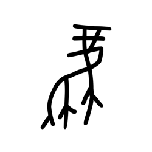

- source_zip_member: `Sub-character Images/x0wt5y5bs2/x0wt5y5bs2/pjsl43dvla.png`
- checksum_sha256: see `06_component-visual-index.csv`.
- review_status: `needs_human_visual_review`
- caution: source-marked review image only.

## asset-012688

- source_zip_member: `Sub-character Images/x0wt5y5bs2/x0wt5y5bs2/pxsz9tcx9b.png`
- checksum_sha256: see `06_component-visual-index.csv`.
- review_status: `needs_human_visual_review`
- caution: source-marked review image only.

## asset-012689

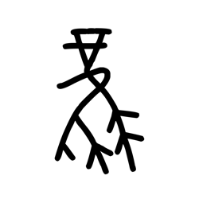

- source_zip_member: `Sub-character Images/x0wt5y5bs2/x0wt5y5bs2/q0iqzb1wid.png`
- checksum_sha256: see `06_component-visual-index.csv`.
- review_status: `needs_human_visual_review`
- caution: source-marked review image only.

## asset-012690

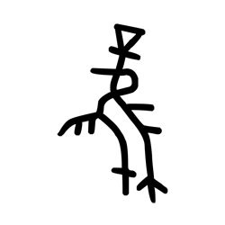

- source_zip_member: `Sub-character Images/x0wt5y5bs2/x0wt5y5bs2/q3l4f5p7xm.png`
- checksum_sha256: see `06_component-visual-index.csv`.
- review_status: `needs_human_visual_review`
- caution: source-marked review image only.

## asset-012691

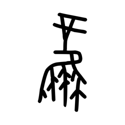

- source_zip_member: `Sub-character Images/x0wt5y5bs2/x0wt5y5bs2/q7tx6sn7y0.png`
- checksum_sha256: see `06_component-visual-index.csv`.
- review_status: `needs_human_visual_review`
- caution: source-marked review image only.

## asset-012692

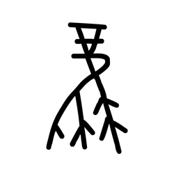

- source_zip_member: `Sub-character Images/x0wt5y5bs2/x0wt5y5bs2/qe744r533h.png`
- checksum_sha256: see `06_component-visual-index.csv`.
- review_status: `needs_human_visual_review`
- caution: source-marked review image only.

## asset-012693

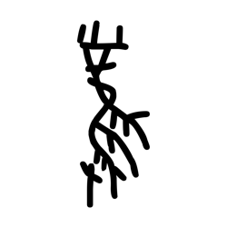

- source_zip_member: `Sub-character Images/x0wt5y5bs2/x0wt5y5bs2/qgixxhpoev.png`
- checksum_sha256: see `06_component-visual-index.csv`.
- review_status: `needs_human_visual_review`
- caution: source-marked review image only.

## asset-012694

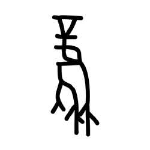

- source_zip_member: `Sub-character Images/x0wt5y5bs2/x0wt5y5bs2/qp7enzcr2r.png`
- checksum_sha256: see `06_component-visual-index.csv`.
- review_status: `needs_human_visual_review`
- caution: source-marked review image only.

## asset-012695

- source_zip_member: `Sub-character Images/x0wt5y5bs2/x0wt5y5bs2/qylrtz3pii.png`
- checksum_sha256: see `06_component-visual-index.csv`.
- review_status: `needs_human_visual_review`
- caution: source-marked review image only.

## asset-012696

- source_zip_member: `Sub-character Images/x0wt5y5bs2/x0wt5y5bs2/s3qpk186ip.png`
- checksum_sha256: see `06_component-visual-index.csv`.
- review_status: `needs_human_visual_review`
- caution: source-marked review image only.

## asset-012697

- source_zip_member: `Sub-character Images/x0wt5y5bs2/x0wt5y5bs2/sjf70any71.png`
- checksum_sha256: see `06_component-visual-index.csv`.
- review_status: `needs_human_visual_review`
- caution: source-marked review image only.

## asset-012698

- source_zip_member: `Sub-character Images/x0wt5y5bs2/x0wt5y5bs2/t6j9ilhb1a.png`
- checksum_sha256: see `06_component-visual-index.csv`.
- review_status: `needs_human_visual_review`
- caution: source-marked review image only.

## asset-012699

- source_zip_member: `Sub-character Images/x0wt5y5bs2/x0wt5y5bs2/u12d1xvd9a.png`
- checksum_sha256: see `06_component-visual-index.csv`.
- review_status: `needs_human_visual_review`
- caution: source-marked review image only.

## asset-012700

- source_zip_member: `Sub-character Images/x0wt5y5bs2/x0wt5y5bs2/u4c2jvjuup.png`
- checksum_sha256: see `06_component-visual-index.csv`.
- review_status: `needs_human_visual_review`
- caution: source-marked review image only.

## asset-012701

- source_zip_member: `Sub-character Images/x0wt5y5bs2/x0wt5y5bs2/u5m7nxbqbo.png`
- checksum_sha256: see `06_component-visual-index.csv`.
- review_status: `needs_human_visual_review`
- caution: source-marked review image only.

## asset-012702

- source_zip_member: `Sub-character Images/x0wt5y5bs2/x0wt5y5bs2/ufwtusw6jp.png`
- checksum_sha256: see `06_component-visual-index.csv`.
- review_status: `needs_human_visual_review`
- caution: source-marked review image only.

## asset-012703

- source_zip_member: `Sub-character Images/x0wt5y5bs2/x0wt5y5bs2/v957q94q7a.png`
- checksum_sha256: see `06_component-visual-index.csv`.
- review_status: `needs_human_visual_review`
- caution: source-marked review image only.

## asset-012704

- source_zip_member: `Sub-character Images/x0wt5y5bs2/x0wt5y5bs2/vwq6s8prpd.png`
- checksum_sha256: see `06_component-visual-index.csv`.
- review_status: `needs_human_visual_review`
- caution: source-marked review image only.

## asset-012705

- source_zip_member: `Sub-character Images/x0wt5y5bs2/x0wt5y5bs2/vzhfoawxya.png`
- checksum_sha256: see `06_component-visual-index.csv`.
- review_status: `needs_human_visual_review`
- caution: source-marked review image only.

## asset-012706

- source_zip_member: `Sub-character Images/x0wt5y5bs2/x0wt5y5bs2/x0i2aaxho9.png`
- checksum_sha256: see `06_component-visual-index.csv`.
- review_status: `needs_human_visual_review`
- caution: source-marked review image only.

## asset-012707

- source_zip_member: `Sub-character Images/x0wt5y5bs2/x0wt5y5bs2/x0wt5y5bs2.png`
- checksum_sha256: see `06_component-visual-index.csv`.
- review_status: `needs_human_visual_review`
- caution: source-marked review image only.

## asset-012708

- source_zip_member: `Sub-character Images/x0wt5y5bs2/x0wt5y5bs2/xnjluundst.png`
- checksum_sha256: see `06_component-visual-index.csv`.
- review_status: `needs_human_visual_review`
- caution: source-marked review image only.

## asset-012709

- source_zip_member: `Sub-character Images/x0wt5y5bs2/x0wt5y5bs2/xrk9fix9mw.png`
- checksum_sha256: see `06_component-visual-index.csv`.
- review_status: `needs_human_visual_review`
- caution: source-marked review image only.

## asset-012710

- source_zip_member: `Sub-character Images/x0wt5y5bs2/x0wt5y5bs2/y9pui9ud8t.png`
- checksum_sha256: see `06_component-visual-index.csv`.
- review_status: `needs_human_visual_review`
- caution: source-marked review image only.

## asset-012711

- source_zip_member: `Sub-character Images/x0wt5y5bs2/x0wt5y5bs2/yzfq1v0bll.png`
- checksum_sha256: see `06_component-visual-index.csv`.
- review_status: `needs_human_visual_review`
- caution: source-marked review image only.

## asset-012712

- source_zip_member: `Sub-character Images/x0wt5y5bs2/x0wt5y5bs2/z4bsvx01np.png`
- checksum_sha256: see `06_component-visual-index.csv`.
- review_status: `needs_human_visual_review`
- caution: source-marked review image only.

## asset-012713

- source_zip_member: `Sub-character Images/x0wt5y5bs2/x0wt5y5bs2/z58r1itm3o.png`
- checksum_sha256: see `06_component-visual-index.csv`.
- review_status: `needs_human_visual_review`
- caution: source-marked review image only.

## asset-012714

- source_zip_member: `Sub-character Images/x0wt5y5bs2/x0wt5y5bs2/z9l6v16hhw.png`
- checksum_sha256: see `06_component-visual-index.csv`.
- review_status: `needs_human_visual_review`
- caution: source-marked review image only.

## asset-012715

- source_zip_member: `Sub-character Images/x0wt5y5bs2/x0wt5y5bs2/zpu55obr6i.png`
- checksum_sha256: see `06_component-visual-index.csv`.
- review_status: `needs_human_visual_review`
- caution: source-marked review image only.
