# Component Visual Gallery / 构件图像查看: obs-comp-cand-000552

English:
This page displays OBIMD subcharacter PNG assets extracted into this concrete
corpus object directory for human review.

简体中文：
本页展示抽取到当前具体 corpus 对象目录内的 OBIMD subcharacter PNG 资料，供人工复核使用。

Boundary / 边界：
dataset image candidate only; not a confirmed component form, not a component
assignment, and not a decipherment claim.
- not a confirmed component form
- not a component assignment
- not a decipherment claim

## Concrete Questions To Check / 具体待查问题

- Open 06_component-visual-index.csv and name the local image row.
- 打开 06_component-visual-index.csv，写明本地图像行。
- Open 09_component-visual-route-index.csv and name the source route row.
- 打开 09_component-visual-route-index.csv，写明来源路线行。
- Open 13_component-context-evidence-dossier.md for character context.
- 打开 13_component-context-evidence-dossier.md，核对单字与卜辞上下文。
- Record the missing image, near-shape, source, or context route.
- 记录缺失的图像、近形、来源或上下文路线。

## asset-012785

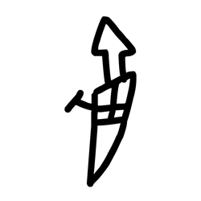

- source_zip_member: `Sub-character Images/ghaj284ctb/ghaj284ctb/0k4q43mnav.png`
- checksum_sha256: see `06_component-visual-index.csv`.
- review_status: `needs_human_visual_review`
- caution: source-marked review image only.

## asset-012786

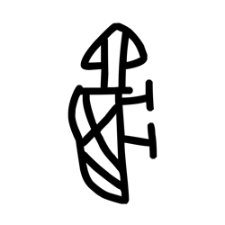

- source_zip_member: `Sub-character Images/ghaj284ctb/ghaj284ctb/0v91xutfms.png`
- checksum_sha256: see `06_component-visual-index.csv`.
- review_status: `needs_human_visual_review`
- caution: source-marked review image only.

## asset-012787

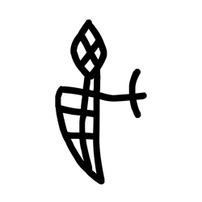

- source_zip_member: `Sub-character Images/ghaj284ctb/ghaj284ctb/bsyv21zqkq.png`
- checksum_sha256: see `06_component-visual-index.csv`.
- review_status: `needs_human_visual_review`
- caution: source-marked review image only.

## asset-012788

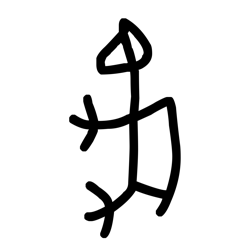

- source_zip_member: `Sub-character Images/ghaj284ctb/ghaj284ctb/eaebrja8yo.png`
- checksum_sha256: see `06_component-visual-index.csv`.
- review_status: `needs_human_visual_review`
- caution: source-marked review image only.

## asset-012789

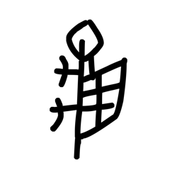

- source_zip_member: `Sub-character Images/ghaj284ctb/ghaj284ctb/fipy8k3pv8.png`
- checksum_sha256: see `06_component-visual-index.csv`.
- review_status: `needs_human_visual_review`
- caution: source-marked review image only.

## asset-012790

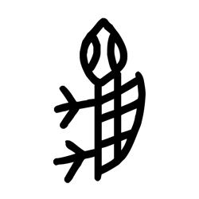

- source_zip_member: `Sub-character Images/ghaj284ctb/ghaj284ctb/ghaj284ctb.png`
- checksum_sha256: see `06_component-visual-index.csv`.
- review_status: `needs_human_visual_review`
- caution: source-marked review image only.

## asset-012791

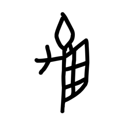

- source_zip_member: `Sub-character Images/ghaj284ctb/ghaj284ctb/gp5svkoq1b.png`
- checksum_sha256: see `06_component-visual-index.csv`.
- review_status: `needs_human_visual_review`
- caution: source-marked review image only.

## asset-012792

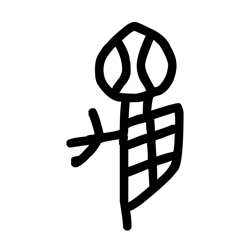

- source_zip_member: `Sub-character Images/ghaj284ctb/ghaj284ctb/hh47jaju7q.png`
- checksum_sha256: see `06_component-visual-index.csv`.
- review_status: `needs_human_visual_review`
- caution: source-marked review image only.

## asset-012793

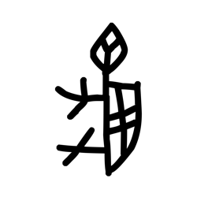

- source_zip_member: `Sub-character Images/ghaj284ctb/ghaj284ctb/jrun1c6vi6.png`
- checksum_sha256: see `06_component-visual-index.csv`.
- review_status: `needs_human_visual_review`
- caution: source-marked review image only.

## asset-012794

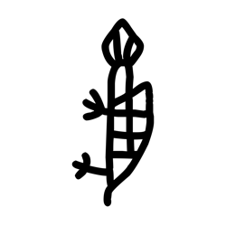

- source_zip_member: `Sub-character Images/ghaj284ctb/ghaj284ctb/l17t9vx0z7.png`
- checksum_sha256: see `06_component-visual-index.csv`.
- review_status: `needs_human_visual_review`
- caution: source-marked review image only.

## asset-012795

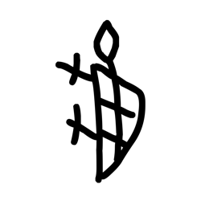

- source_zip_member: `Sub-character Images/ghaj284ctb/ghaj284ctb/niya1kz9gi.png`
- checksum_sha256: see `06_component-visual-index.csv`.
- review_status: `needs_human_visual_review`
- caution: source-marked review image only.

## asset-012796

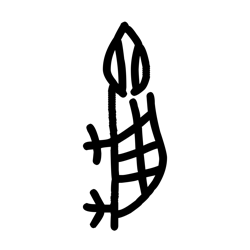

- source_zip_member: `Sub-character Images/ghaj284ctb/ghaj284ctb/nyhxfl0nvr.png`
- checksum_sha256: see `06_component-visual-index.csv`.
- review_status: `needs_human_visual_review`
- caution: source-marked review image only.

## asset-012797

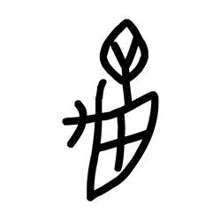

- source_zip_member: `Sub-character Images/ghaj284ctb/ghaj284ctb/o935x08szl.png`
- checksum_sha256: see `06_component-visual-index.csv`.
- review_status: `needs_human_visual_review`
- caution: source-marked review image only.

## asset-012798

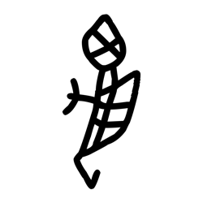

- source_zip_member: `Sub-character Images/ghaj284ctb/ghaj284ctb/p31gxfg16f.png`
- checksum_sha256: see `06_component-visual-index.csv`.
- review_status: `needs_human_visual_review`
- caution: source-marked review image only.

## asset-012799

- source_zip_member: `Sub-character Images/ghaj284ctb/ghaj284ctb/thvumgej9g.png`
- checksum_sha256: see `06_component-visual-index.csv`.
- review_status: `needs_human_visual_review`
- caution: source-marked review image only.

## asset-012800

- source_zip_member: `Sub-character Images/ghaj284ctb/ghaj284ctb/vhk2vhul4t.png`
- checksum_sha256: see `06_component-visual-index.csv`.
- review_status: `needs_human_visual_review`
- caution: source-marked review image only.

## asset-012801

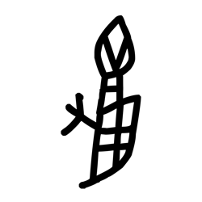

- source_zip_member: `Sub-character Images/ghaj284ctb/ghaj284ctb/vt2aea55vq.png`
- checksum_sha256: see `06_component-visual-index.csv`.
- review_status: `needs_human_visual_review`
- caution: source-marked review image only.

## asset-012802

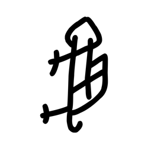

- source_zip_member: `Sub-character Images/ghaj284ctb/ghaj284ctb/whh2wzqfej.png`
- checksum_sha256: see `06_component-visual-index.csv`.
- review_status: `needs_human_visual_review`
- caution: source-marked review image only.

## asset-012803

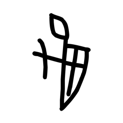

- source_zip_member: `Sub-character Images/ghaj284ctb/ghaj284ctb/yz5bxw03l0.png`
- checksum_sha256: see `06_component-visual-index.csv`.
- review_status: `needs_human_visual_review`
- caution: source-marked review image only.

## asset-012804

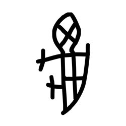

- source_zip_member: `Sub-character Images/ghaj284ctb/ghaj284ctb/zupkdzagui.png`
- checksum_sha256: see `06_component-visual-index.csv`.
- review_status: `needs_human_visual_review`
- caution: source-marked review image only.
