# Component Visual Gallery / 构件图像查看: obs-comp-cand-000574

English:
This page displays OBIMD subcharacter PNG assets extracted into this concrete
corpus object directory for human review.

简体中文：
本页展示抽取到当前具体 corpus 对象目录内的 OBIMD subcharacter PNG 资料，供人工复核使用。

Boundary / 边界：
dataset image candidate only; not a confirmed component form, not a component
assignment, and not a decipherment claim.
- not a confirmed component form
- not a component assignment
- not a decipherment claim

## Concrete Questions To Check / 具体待查问题

- Which local image should be opened first?
- 应先打开哪一张本地构件图像？
- Which source zip member anchors this image?
- 哪一个 source zip member 能定位这张图像？
- Which near-shape or variant comparison is still missing?
- 还缺哪些近形或异体比较？
- Which character or inscription context should be checked next?
- 下一步应核对哪些单字或卜辞上下文？
- What evidence is missing before a component assignment?
- 正式构件归属前还缺哪些证据？

## asset-012826

- source_zip_member: `Sub-character Images/hlxb5g91kc/hlxb5g91kc/01x617r92n.png`
- checksum_sha256: see `06_component-visual-index.csv`.
- review_status: `needs_human_visual_review`
- caution: source-marked review image only.

## asset-012827

- source_zip_member: `Sub-character Images/hlxb5g91kc/hlxb5g91kc/07yy63i1j3.png`
- checksum_sha256: see `06_component-visual-index.csv`.
- review_status: `needs_human_visual_review`
- caution: source-marked review image only.

## asset-012828

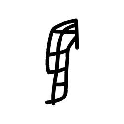

- source_zip_member: `Sub-character Images/hlxb5g91kc/hlxb5g91kc/0b95f46iv1.png`
- checksum_sha256: see `06_component-visual-index.csv`.
- review_status: `needs_human_visual_review`
- caution: source-marked review image only.

## asset-012829

- source_zip_member: `Sub-character Images/hlxb5g91kc/hlxb5g91kc/0gqg6pkbw7.png`
- checksum_sha256: see `06_component-visual-index.csv`.
- review_status: `needs_human_visual_review`
- caution: source-marked review image only.

## asset-012830

- source_zip_member: `Sub-character Images/hlxb5g91kc/hlxb5g91kc/0t6tsxdjzn.png`
- checksum_sha256: see `06_component-visual-index.csv`.
- review_status: `needs_human_visual_review`
- caution: source-marked review image only.

## asset-012831

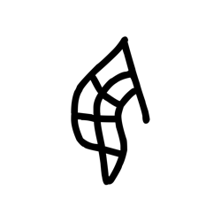

- source_zip_member: `Sub-character Images/hlxb5g91kc/hlxb5g91kc/0zi2kl70jt.png`
- checksum_sha256: see `06_component-visual-index.csv`.
- review_status: `needs_human_visual_review`
- caution: source-marked review image only.

## asset-012832

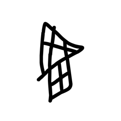

- source_zip_member: `Sub-character Images/hlxb5g91kc/hlxb5g91kc/11nrlnssqz.png`
- checksum_sha256: see `06_component-visual-index.csv`.
- review_status: `needs_human_visual_review`
- caution: source-marked review image only.

## asset-012833

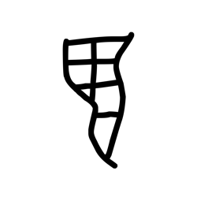

- source_zip_member: `Sub-character Images/hlxb5g91kc/hlxb5g91kc/1cq2fqdqnu.png`
- checksum_sha256: see `06_component-visual-index.csv`.
- review_status: `needs_human_visual_review`
- caution: source-marked review image only.

## asset-012834

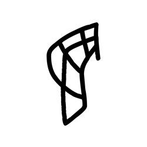

- source_zip_member: `Sub-character Images/hlxb5g91kc/hlxb5g91kc/1m0yba456b.png`
- checksum_sha256: see `06_component-visual-index.csv`.
- review_status: `needs_human_visual_review`
- caution: source-marked review image only.

## asset-012835

- source_zip_member: `Sub-character Images/hlxb5g91kc/hlxb5g91kc/1quxm22haw.png`
- checksum_sha256: see `06_component-visual-index.csv`.
- review_status: `needs_human_visual_review`
- caution: source-marked review image only.

## asset-012836

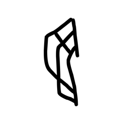

- source_zip_member: `Sub-character Images/hlxb5g91kc/hlxb5g91kc/1xjodesaas.png`
- checksum_sha256: see `06_component-visual-index.csv`.
- review_status: `needs_human_visual_review`
- caution: source-marked review image only.

## asset-012837

- source_zip_member: `Sub-character Images/hlxb5g91kc/hlxb5g91kc/20vth7po2i.png`
- checksum_sha256: see `06_component-visual-index.csv`.
- review_status: `needs_human_visual_review`
- caution: source-marked review image only.

## asset-012838

- source_zip_member: `Sub-character Images/hlxb5g91kc/hlxb5g91kc/210b842km4.png`
- checksum_sha256: see `06_component-visual-index.csv`.
- review_status: `needs_human_visual_review`
- caution: source-marked review image only.

## asset-012839

- source_zip_member: `Sub-character Images/hlxb5g91kc/hlxb5g91kc/28adz5q5qy.png`
- checksum_sha256: see `06_component-visual-index.csv`.
- review_status: `needs_human_visual_review`
- caution: source-marked review image only.

## asset-012840

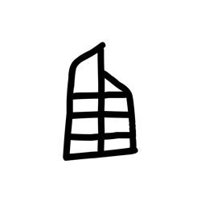

- source_zip_member: `Sub-character Images/hlxb5g91kc/hlxb5g91kc/2ao7keg48b.png`
- checksum_sha256: see `06_component-visual-index.csv`.
- review_status: `needs_human_visual_review`
- caution: source-marked review image only.

## asset-012841

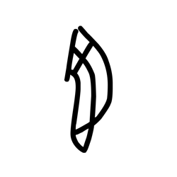

- source_zip_member: `Sub-character Images/hlxb5g91kc/hlxb5g91kc/2cadyejob4.png`
- checksum_sha256: see `06_component-visual-index.csv`.
- review_status: `needs_human_visual_review`
- caution: source-marked review image only.

## asset-012842

- source_zip_member: `Sub-character Images/hlxb5g91kc/hlxb5g91kc/2qu1pexfkc.png`
- checksum_sha256: see `06_component-visual-index.csv`.
- review_status: `needs_human_visual_review`
- caution: source-marked review image only.

## asset-012843

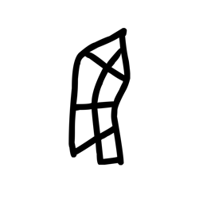

- source_zip_member: `Sub-character Images/hlxb5g91kc/hlxb5g91kc/2s3v2z5qqq.png`
- checksum_sha256: see `06_component-visual-index.csv`.
- review_status: `needs_human_visual_review`
- caution: source-marked review image only.

## asset-012844

- source_zip_member: `Sub-character Images/hlxb5g91kc/hlxb5g91kc/37ohibjg3m.png`
- checksum_sha256: see `06_component-visual-index.csv`.
- review_status: `needs_human_visual_review`
- caution: source-marked review image only.

## asset-012845

- source_zip_member: `Sub-character Images/hlxb5g91kc/hlxb5g91kc/38bzk94aqs.png`
- checksum_sha256: see `06_component-visual-index.csv`.
- review_status: `needs_human_visual_review`
- caution: source-marked review image only.

## asset-012846

- source_zip_member: `Sub-character Images/hlxb5g91kc/hlxb5g91kc/38spcn8rvl.png`
- checksum_sha256: see `06_component-visual-index.csv`.
- review_status: `needs_human_visual_review`
- caution: source-marked review image only.

## asset-012847

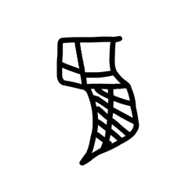

- source_zip_member: `Sub-character Images/hlxb5g91kc/hlxb5g91kc/3aqy6ryz3s.png`
- checksum_sha256: see `06_component-visual-index.csv`.
- review_status: `needs_human_visual_review`
- caution: source-marked review image only.

## asset-012848

- source_zip_member: `Sub-character Images/hlxb5g91kc/hlxb5g91kc/3ig1dkmspl.png`
- checksum_sha256: see `06_component-visual-index.csv`.
- review_status: `needs_human_visual_review`
- caution: source-marked review image only.

## asset-012849

- source_zip_member: `Sub-character Images/hlxb5g91kc/hlxb5g91kc/3pk47ppz37.png`
- checksum_sha256: see `06_component-visual-index.csv`.
- review_status: `needs_human_visual_review`
- caution: source-marked review image only.

## asset-012850

- source_zip_member: `Sub-character Images/hlxb5g91kc/hlxb5g91kc/3whmquwun9.png`
- checksum_sha256: see `06_component-visual-index.csv`.
- review_status: `needs_human_visual_review`
- caution: source-marked review image only.

## asset-012851

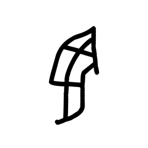

- source_zip_member: `Sub-character Images/hlxb5g91kc/hlxb5g91kc/4gl1faittk.png`
- checksum_sha256: see `06_component-visual-index.csv`.
- review_status: `needs_human_visual_review`
- caution: source-marked review image only.

## asset-012852

- source_zip_member: `Sub-character Images/hlxb5g91kc/hlxb5g91kc/4i68cdg5ji.png`
- checksum_sha256: see `06_component-visual-index.csv`.
- review_status: `needs_human_visual_review`
- caution: source-marked review image only.

## asset-012853

- source_zip_member: `Sub-character Images/hlxb5g91kc/hlxb5g91kc/4t83qb84wc.png`
- checksum_sha256: see `06_component-visual-index.csv`.
- review_status: `needs_human_visual_review`
- caution: source-marked review image only.

## asset-012854

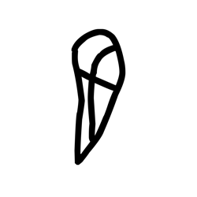

- source_zip_member: `Sub-character Images/hlxb5g91kc/hlxb5g91kc/4vwwfbg2d3.png`
- checksum_sha256: see `06_component-visual-index.csv`.
- review_status: `needs_human_visual_review`
- caution: source-marked review image only.

## asset-012855

- source_zip_member: `Sub-character Images/hlxb5g91kc/hlxb5g91kc/51vfxqvvxl.png`
- checksum_sha256: see `06_component-visual-index.csv`.
- review_status: `needs_human_visual_review`
- caution: source-marked review image only.

## asset-012856

- source_zip_member: `Sub-character Images/hlxb5g91kc/hlxb5g91kc/54bk3cb9m6.png`
- checksum_sha256: see `06_component-visual-index.csv`.
- review_status: `needs_human_visual_review`
- caution: source-marked review image only.

## asset-012857

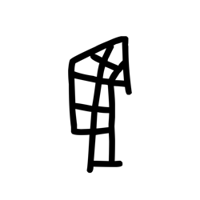

- source_zip_member: `Sub-character Images/hlxb5g91kc/hlxb5g91kc/5d01u9h0p7.png`
- checksum_sha256: see `06_component-visual-index.csv`.
- review_status: `needs_human_visual_review`
- caution: source-marked review image only.

## asset-012858

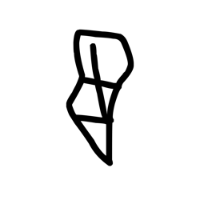

- source_zip_member: `Sub-character Images/hlxb5g91kc/hlxb5g91kc/5k3njz31pk.png`
- checksum_sha256: see `06_component-visual-index.csv`.
- review_status: `needs_human_visual_review`
- caution: source-marked review image only.

## asset-012859

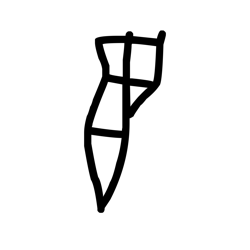

- source_zip_member: `Sub-character Images/hlxb5g91kc/hlxb5g91kc/5ol06c776q.png`
- checksum_sha256: see `06_component-visual-index.csv`.
- review_status: `needs_human_visual_review`
- caution: source-marked review image only.

## asset-012860

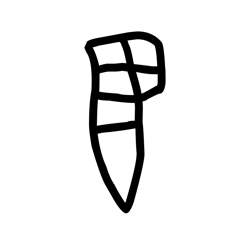

- source_zip_member: `Sub-character Images/hlxb5g91kc/hlxb5g91kc/5ufi1xtgn8.png`
- checksum_sha256: see `06_component-visual-index.csv`.
- review_status: `needs_human_visual_review`
- caution: source-marked review image only.

## asset-012861

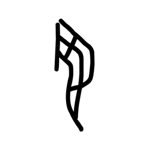

- source_zip_member: `Sub-character Images/hlxb5g91kc/hlxb5g91kc/6ba0ka6m0j.png`
- checksum_sha256: see `06_component-visual-index.csv`.
- review_status: `needs_human_visual_review`
- caution: source-marked review image only.

## asset-012862

- source_zip_member: `Sub-character Images/hlxb5g91kc/hlxb5g91kc/6eam6jzkho.png`
- checksum_sha256: see `06_component-visual-index.csv`.
- review_status: `needs_human_visual_review`
- caution: source-marked review image only.

## asset-012863

- source_zip_member: `Sub-character Images/hlxb5g91kc/hlxb5g91kc/6gw4grgy81.png`
- checksum_sha256: see `06_component-visual-index.csv`.
- review_status: `needs_human_visual_review`
- caution: source-marked review image only.

## asset-012864

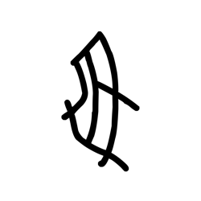

- source_zip_member: `Sub-character Images/hlxb5g91kc/hlxb5g91kc/6otpj70s5b.png`
- checksum_sha256: see `06_component-visual-index.csv`.
- review_status: `needs_human_visual_review`
- caution: source-marked review image only.

## asset-012865

- source_zip_member: `Sub-character Images/hlxb5g91kc/hlxb5g91kc/6siy0bkbfa.png`
- checksum_sha256: see `06_component-visual-index.csv`.
- review_status: `needs_human_visual_review`
- caution: source-marked review image only.

## asset-012866

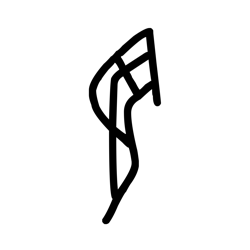

- source_zip_member: `Sub-character Images/hlxb5g91kc/hlxb5g91kc/6tksfzyfoa.png`
- checksum_sha256: see `06_component-visual-index.csv`.
- review_status: `needs_human_visual_review`
- caution: source-marked review image only.

## asset-012867

- source_zip_member: `Sub-character Images/hlxb5g91kc/hlxb5g91kc/71qpl93jro.png`
- checksum_sha256: see `06_component-visual-index.csv`.
- review_status: `needs_human_visual_review`
- caution: source-marked review image only.

## asset-012868

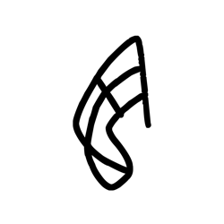

- source_zip_member: `Sub-character Images/hlxb5g91kc/hlxb5g91kc/7812vx7k9j.png`
- checksum_sha256: see `06_component-visual-index.csv`.
- review_status: `needs_human_visual_review`
- caution: source-marked review image only.

## asset-012869

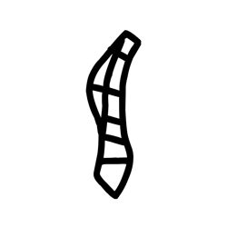

- source_zip_member: `Sub-character Images/hlxb5g91kc/hlxb5g91kc/7fs6v11o6e.png`
- checksum_sha256: see `06_component-visual-index.csv`.
- review_status: `needs_human_visual_review`
- caution: source-marked review image only.

## asset-012870

- source_zip_member: `Sub-character Images/hlxb5g91kc/hlxb5g91kc/7mqoauk2rb.png`
- checksum_sha256: see `06_component-visual-index.csv`.
- review_status: `needs_human_visual_review`
- caution: source-marked review image only.

## asset-012871

- source_zip_member: `Sub-character Images/hlxb5g91kc/hlxb5g91kc/7rw68w6fne.png`
- checksum_sha256: see `06_component-visual-index.csv`.
- review_status: `needs_human_visual_review`
- caution: source-marked review image only.

## asset-012872

- source_zip_member: `Sub-character Images/hlxb5g91kc/hlxb5g91kc/7uzdpn8uwd.png`
- checksum_sha256: see `06_component-visual-index.csv`.
- review_status: `needs_human_visual_review`
- caution: source-marked review image only.

## asset-012873

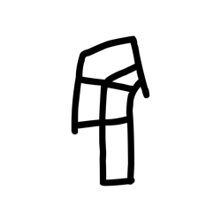

- source_zip_member: `Sub-character Images/hlxb5g91kc/hlxb5g91kc/8a8soyz1dw.png`
- checksum_sha256: see `06_component-visual-index.csv`.
- review_status: `needs_human_visual_review`
- caution: source-marked review image only.

## asset-012874

- source_zip_member: `Sub-character Images/hlxb5g91kc/hlxb5g91kc/8evt9zocmp.png`
- checksum_sha256: see `06_component-visual-index.csv`.
- review_status: `needs_human_visual_review`
- caution: source-marked review image only.

## asset-012875

- source_zip_member: `Sub-character Images/hlxb5g91kc/hlxb5g91kc/8fermllfm5.png`
- checksum_sha256: see `06_component-visual-index.csv`.
- review_status: `needs_human_visual_review`
- caution: source-marked review image only.

## asset-012876

- source_zip_member: `Sub-character Images/hlxb5g91kc/hlxb5g91kc/8fk3g2fz2i.png`
- checksum_sha256: see `06_component-visual-index.csv`.
- review_status: `needs_human_visual_review`
- caution: source-marked review image only.

## asset-012877

- source_zip_member: `Sub-character Images/hlxb5g91kc/hlxb5g91kc/8khyodlgvc.png`
- checksum_sha256: see `06_component-visual-index.csv`.
- review_status: `needs_human_visual_review`
- caution: source-marked review image only.

## asset-012878

- source_zip_member: `Sub-character Images/hlxb5g91kc/hlxb5g91kc/8oeczbti82.png`
- checksum_sha256: see `06_component-visual-index.csv`.
- review_status: `needs_human_visual_review`
- caution: source-marked review image only.

## asset-012879

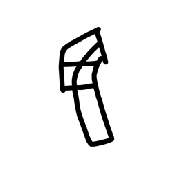

- source_zip_member: `Sub-character Images/hlxb5g91kc/hlxb5g91kc/8prkz4nhk7.png`
- checksum_sha256: see `06_component-visual-index.csv`.
- review_status: `needs_human_visual_review`
- caution: source-marked review image only.

## asset-012880

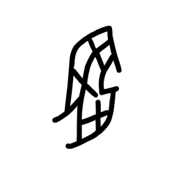

- source_zip_member: `Sub-character Images/hlxb5g91kc/hlxb5g91kc/8qgw277439.png`
- checksum_sha256: see `06_component-visual-index.csv`.
- review_status: `needs_human_visual_review`
- caution: source-marked review image only.

## asset-012881

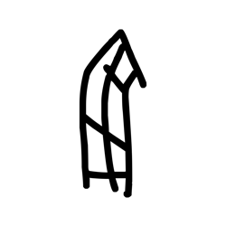

- source_zip_member: `Sub-character Images/hlxb5g91kc/hlxb5g91kc/8sksqr0y8y.png`
- checksum_sha256: see `06_component-visual-index.csv`.
- review_status: `needs_human_visual_review`
- caution: source-marked review image only.

## asset-012882

- source_zip_member: `Sub-character Images/hlxb5g91kc/hlxb5g91kc/8yyacxr1gg.png`
- checksum_sha256: see `06_component-visual-index.csv`.
- review_status: `needs_human_visual_review`
- caution: source-marked review image only.

## asset-012883

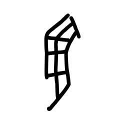

- source_zip_member: `Sub-character Images/hlxb5g91kc/hlxb5g91kc/94jlr7yxws.png`
- checksum_sha256: see `06_component-visual-index.csv`.
- review_status: `needs_human_visual_review`
- caution: source-marked review image only.

## asset-012884

- source_zip_member: `Sub-character Images/hlxb5g91kc/hlxb5g91kc/9an24x4gmz.png`
- checksum_sha256: see `06_component-visual-index.csv`.
- review_status: `needs_human_visual_review`
- caution: source-marked review image only.

## asset-012885

- source_zip_member: `Sub-character Images/hlxb5g91kc/hlxb5g91kc/9c1faif9l0.png`
- checksum_sha256: see `06_component-visual-index.csv`.
- review_status: `needs_human_visual_review`
- caution: source-marked review image only.

## asset-012886

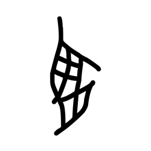

- source_zip_member: `Sub-character Images/hlxb5g91kc/hlxb5g91kc/9fyz3n8de4.png`
- checksum_sha256: see `06_component-visual-index.csv`.
- review_status: `needs_human_visual_review`
- caution: source-marked review image only.

## asset-012887

- source_zip_member: `Sub-character Images/hlxb5g91kc/hlxb5g91kc/9klbt9nw5c.png`
- checksum_sha256: see `06_component-visual-index.csv`.
- review_status: `needs_human_visual_review`
- caution: source-marked review image only.

## asset-012888

- source_zip_member: `Sub-character Images/hlxb5g91kc/hlxb5g91kc/9m5vgtz2nw.png`
- checksum_sha256: see `06_component-visual-index.csv`.
- review_status: `needs_human_visual_review`
- caution: source-marked review image only.

## asset-012889

- source_zip_member: `Sub-character Images/hlxb5g91kc/hlxb5g91kc/9ntipdk6a2.png`
- checksum_sha256: see `06_component-visual-index.csv`.
- review_status: `needs_human_visual_review`
- caution: source-marked review image only.

## asset-012890

- source_zip_member: `Sub-character Images/hlxb5g91kc/hlxb5g91kc/9p7crvpiay.png`
- checksum_sha256: see `06_component-visual-index.csv`.
- review_status: `needs_human_visual_review`
- caution: source-marked review image only.

## asset-012891

- source_zip_member: `Sub-character Images/hlxb5g91kc/hlxb5g91kc/9y049baf8q.png`
- checksum_sha256: see `06_component-visual-index.csv`.
- review_status: `needs_human_visual_review`
- caution: source-marked review image only.

## asset-012892

- source_zip_member: `Sub-character Images/hlxb5g91kc/hlxb5g91kc/a36cxo1rir.png`
- checksum_sha256: see `06_component-visual-index.csv`.
- review_status: `needs_human_visual_review`
- caution: source-marked review image only.

## asset-012893

- source_zip_member: `Sub-character Images/hlxb5g91kc/hlxb5g91kc/a6nqu1gvp2.png`
- checksum_sha256: see `06_component-visual-index.csv`.
- review_status: `needs_human_visual_review`
- caution: source-marked review image only.

## asset-012894

- source_zip_member: `Sub-character Images/hlxb5g91kc/hlxb5g91kc/a79v6kcylo.png`
- checksum_sha256: see `06_component-visual-index.csv`.
- review_status: `needs_human_visual_review`
- caution: source-marked review image only.

## asset-012895

- source_zip_member: `Sub-character Images/hlxb5g91kc/hlxb5g91kc/a8rluyjs1m.png`
- checksum_sha256: see `06_component-visual-index.csv`.
- review_status: `needs_human_visual_review`
- caution: source-marked review image only.

## asset-012896

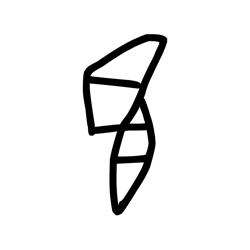

- source_zip_member: `Sub-character Images/hlxb5g91kc/hlxb5g91kc/a9b352nto7.png`
- checksum_sha256: see `06_component-visual-index.csv`.
- review_status: `needs_human_visual_review`
- caution: source-marked review image only.

## asset-012897

- source_zip_member: `Sub-character Images/hlxb5g91kc/hlxb5g91kc/al4qss670x.png`
- checksum_sha256: see `06_component-visual-index.csv`.
- review_status: `needs_human_visual_review`
- caution: source-marked review image only.

## asset-012898

- source_zip_member: `Sub-character Images/hlxb5g91kc/hlxb5g91kc/alm56hhrmz.png`
- checksum_sha256: see `06_component-visual-index.csv`.
- review_status: `needs_human_visual_review`
- caution: source-marked review image only.

## asset-012899

- source_zip_member: `Sub-character Images/hlxb5g91kc/hlxb5g91kc/ao4x6c4ipd.png`
- checksum_sha256: see `06_component-visual-index.csv`.
- review_status: `needs_human_visual_review`
- caution: source-marked review image only.

## asset-012900

- source_zip_member: `Sub-character Images/hlxb5g91kc/hlxb5g91kc/ap71rl0cro.png`
- checksum_sha256: see `06_component-visual-index.csv`.
- review_status: `needs_human_visual_review`
- caution: source-marked review image only.

## asset-012901

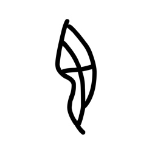

- source_zip_member: `Sub-character Images/hlxb5g91kc/hlxb5g91kc/apzosfgt8g.png`
- checksum_sha256: see `06_component-visual-index.csv`.
- review_status: `needs_human_visual_review`
- caution: source-marked review image only.

## asset-012902

- source_zip_member: `Sub-character Images/hlxb5g91kc/hlxb5g91kc/b1urzwekwk.png`
- checksum_sha256: see `06_component-visual-index.csv`.
- review_status: `needs_human_visual_review`
- caution: source-marked review image only.

## asset-012903

- source_zip_member: `Sub-character Images/hlxb5g91kc/hlxb5g91kc/bahic06nch.png`
- checksum_sha256: see `06_component-visual-index.csv`.
- review_status: `needs_human_visual_review`
- caution: source-marked review image only.

## asset-012904

- source_zip_member: `Sub-character Images/hlxb5g91kc/hlxb5g91kc/bban51xmh5.png`
- checksum_sha256: see `06_component-visual-index.csv`.
- review_status: `needs_human_visual_review`
- caution: source-marked review image only.

## asset-012905

- source_zip_member: `Sub-character Images/hlxb5g91kc/hlxb5g91kc/bdhnqvantl.png`
- checksum_sha256: see `06_component-visual-index.csv`.
- review_status: `needs_human_visual_review`
- caution: source-marked review image only.

## asset-012906

- source_zip_member: `Sub-character Images/hlxb5g91kc/hlxb5g91kc/bhxn3c6t41.png`
- checksum_sha256: see `06_component-visual-index.csv`.
- review_status: `needs_human_visual_review`
- caution: source-marked review image only.

## asset-012907

- source_zip_member: `Sub-character Images/hlxb5g91kc/hlxb5g91kc/bi3m9yyrgk.png`
- checksum_sha256: see `06_component-visual-index.csv`.
- review_status: `needs_human_visual_review`
- caution: source-marked review image only.

## asset-012908

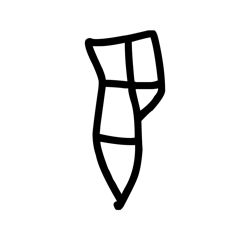

- source_zip_member: `Sub-character Images/hlxb5g91kc/hlxb5g91kc/bubyfuf0ya.png`
- checksum_sha256: see `06_component-visual-index.csv`.
- review_status: `needs_human_visual_review`
- caution: source-marked review image only.

## asset-012909

- source_zip_member: `Sub-character Images/hlxb5g91kc/hlxb5g91kc/buse2lfsn2.png`
- checksum_sha256: see `06_component-visual-index.csv`.
- review_status: `needs_human_visual_review`
- caution: source-marked review image only.

## asset-012910

- source_zip_member: `Sub-character Images/hlxb5g91kc/hlxb5g91kc/bvjfzpkihx.png`
- checksum_sha256: see `06_component-visual-index.csv`.
- review_status: `needs_human_visual_review`
- caution: source-marked review image only.

## asset-012911

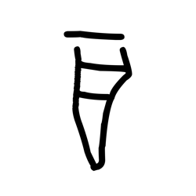

- source_zip_member: `Sub-character Images/hlxb5g91kc/hlxb5g91kc/c7v1gkt8ip.png`
- checksum_sha256: see `06_component-visual-index.csv`.
- review_status: `needs_human_visual_review`
- caution: source-marked review image only.

## asset-012912

- source_zip_member: `Sub-character Images/hlxb5g91kc/hlxb5g91kc/c8ptmzznns.png`
- checksum_sha256: see `06_component-visual-index.csv`.
- review_status: `needs_human_visual_review`
- caution: source-marked review image only.

## asset-012913

- source_zip_member: `Sub-character Images/hlxb5g91kc/hlxb5g91kc/cee2jcfnnn.png`
- checksum_sha256: see `06_component-visual-index.csv`.
- review_status: `needs_human_visual_review`
- caution: source-marked review image only.

## asset-012914

- source_zip_member: `Sub-character Images/hlxb5g91kc/hlxb5g91kc/cgzhyq174r.png`
- checksum_sha256: see `06_component-visual-index.csv`.
- review_status: `needs_human_visual_review`
- caution: source-marked review image only.

## asset-012915

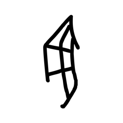

- source_zip_member: `Sub-character Images/hlxb5g91kc/hlxb5g91kc/cig5slpmeq.png`
- checksum_sha256: see `06_component-visual-index.csv`.
- review_status: `needs_human_visual_review`
- caution: source-marked review image only.

## asset-012916

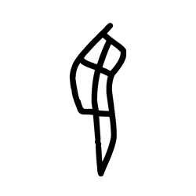

- source_zip_member: `Sub-character Images/hlxb5g91kc/hlxb5g91kc/cmthuaoh5h.png`
- checksum_sha256: see `06_component-visual-index.csv`.
- review_status: `needs_human_visual_review`
- caution: source-marked review image only.

## asset-012917

- source_zip_member: `Sub-character Images/hlxb5g91kc/hlxb5g91kc/cqkty9feed.png`
- checksum_sha256: see `06_component-visual-index.csv`.
- review_status: `needs_human_visual_review`
- caution: source-marked review image only.

## asset-012918

- source_zip_member: `Sub-character Images/hlxb5g91kc/hlxb5g91kc/cr0ogvpydm.png`
- checksum_sha256: see `06_component-visual-index.csv`.
- review_status: `needs_human_visual_review`
- caution: source-marked review image only.

## asset-012919

- source_zip_member: `Sub-character Images/hlxb5g91kc/hlxb5g91kc/cusjp2dctz.png`
- checksum_sha256: see `06_component-visual-index.csv`.
- review_status: `needs_human_visual_review`
- caution: source-marked review image only.

## asset-012920

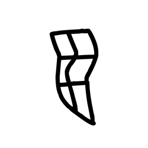

- source_zip_member: `Sub-character Images/hlxb5g91kc/hlxb5g91kc/d2vs2f0bjh.png`
- checksum_sha256: see `06_component-visual-index.csv`.
- review_status: `needs_human_visual_review`
- caution: source-marked review image only.

## asset-012921

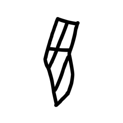

- source_zip_member: `Sub-character Images/hlxb5g91kc/hlxb5g91kc/d989mla3ek.png`
- checksum_sha256: see `06_component-visual-index.csv`.
- review_status: `needs_human_visual_review`
- caution: source-marked review image only.

## asset-012922

- source_zip_member: `Sub-character Images/hlxb5g91kc/hlxb5g91kc/dbrdxxxqv3.png`
- checksum_sha256: see `06_component-visual-index.csv`.
- review_status: `needs_human_visual_review`
- caution: source-marked review image only.

## asset-012923

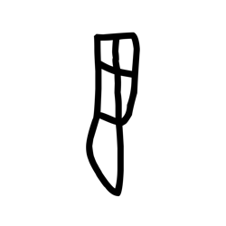

- source_zip_member: `Sub-character Images/hlxb5g91kc/hlxb5g91kc/depl4585m4.png`
- checksum_sha256: see `06_component-visual-index.csv`.
- review_status: `needs_human_visual_review`
- caution: source-marked review image only.

## asset-012924

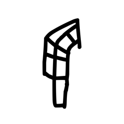

- source_zip_member: `Sub-character Images/hlxb5g91kc/hlxb5g91kc/dgp6hxbfdw.png`
- checksum_sha256: see `06_component-visual-index.csv`.
- review_status: `needs_human_visual_review`
- caution: source-marked review image only.

## asset-012925

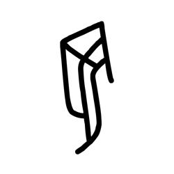

- source_zip_member: `Sub-character Images/hlxb5g91kc/hlxb5g91kc/dyvv8z2fbo.png`
- checksum_sha256: see `06_component-visual-index.csv`.
- review_status: `needs_human_visual_review`
- caution: source-marked review image only.

## asset-012926

- source_zip_member: `Sub-character Images/hlxb5g91kc/hlxb5g91kc/e57lij4wah.png`
- checksum_sha256: see `06_component-visual-index.csv`.
- review_status: `needs_human_visual_review`
- caution: source-marked review image only.

## asset-012927

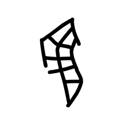

- source_zip_member: `Sub-character Images/hlxb5g91kc/hlxb5g91kc/e5kq2veaja.png`
- checksum_sha256: see `06_component-visual-index.csv`.
- review_status: `needs_human_visual_review`
- caution: source-marked review image only.

## asset-012928

- source_zip_member: `Sub-character Images/hlxb5g91kc/hlxb5g91kc/e8mu2ibpzf.png`
- checksum_sha256: see `06_component-visual-index.csv`.
- review_status: `needs_human_visual_review`
- caution: source-marked review image only.

## asset-012929

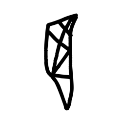

- source_zip_member: `Sub-character Images/hlxb5g91kc/hlxb5g91kc/e9zguob8fg.png`
- checksum_sha256: see `06_component-visual-index.csv`.
- review_status: `needs_human_visual_review`
- caution: source-marked review image only.

## asset-012930

- source_zip_member: `Sub-character Images/hlxb5g91kc/hlxb5g91kc/ecl4tavp35.png`
- checksum_sha256: see `06_component-visual-index.csv`.
- review_status: `needs_human_visual_review`
- caution: source-marked review image only.

## asset-012931

- source_zip_member: `Sub-character Images/hlxb5g91kc/hlxb5g91kc/egina9pduv.png`
- checksum_sha256: see `06_component-visual-index.csv`.
- review_status: `needs_human_visual_review`
- caution: source-marked review image only.

## asset-012932

- source_zip_member: `Sub-character Images/hlxb5g91kc/hlxb5g91kc/ehhqtqacb7.png`
- checksum_sha256: see `06_component-visual-index.csv`.
- review_status: `needs_human_visual_review`
- caution: source-marked review image only.

## asset-012933

- source_zip_member: `Sub-character Images/hlxb5g91kc/hlxb5g91kc/epns9fekf8.png`
- checksum_sha256: see `06_component-visual-index.csv`.
- review_status: `needs_human_visual_review`
- caution: source-marked review image only.

## asset-012934

- source_zip_member: `Sub-character Images/hlxb5g91kc/hlxb5g91kc/eyxjun9aok.png`
- checksum_sha256: see `06_component-visual-index.csv`.
- review_status: `needs_human_visual_review`
- caution: source-marked review image only.

## asset-012935

- source_zip_member: `Sub-character Images/hlxb5g91kc/hlxb5g91kc/f07qs4rg1x.png`
- checksum_sha256: see `06_component-visual-index.csv`.
- review_status: `needs_human_visual_review`
- caution: source-marked review image only.

## asset-012936

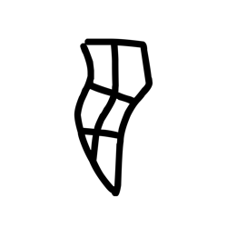

- source_zip_member: `Sub-character Images/hlxb5g91kc/hlxb5g91kc/f8rohhyn1p.png`
- checksum_sha256: see `06_component-visual-index.csv`.
- review_status: `needs_human_visual_review`
- caution: source-marked review image only.

## asset-012937

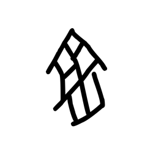

- source_zip_member: `Sub-character Images/hlxb5g91kc/hlxb5g91kc/ffuqx39cnx.png`
- checksum_sha256: see `06_component-visual-index.csv`.
- review_status: `needs_human_visual_review`
- caution: source-marked review image only.

## asset-012938

- source_zip_member: `Sub-character Images/hlxb5g91kc/hlxb5g91kc/fwpbok49o2.png`
- checksum_sha256: see `06_component-visual-index.csv`.
- review_status: `needs_human_visual_review`
- caution: source-marked review image only.

## asset-012939

- source_zip_member: `Sub-character Images/hlxb5g91kc/hlxb5g91kc/g7byk5sl0w.png`
- checksum_sha256: see `06_component-visual-index.csv`.
- review_status: `needs_human_visual_review`
- caution: source-marked review image only.

## asset-012940

- source_zip_member: `Sub-character Images/hlxb5g91kc/hlxb5g91kc/gcznk5vaea.png`
- checksum_sha256: see `06_component-visual-index.csv`.
- review_status: `needs_human_visual_review`
- caution: source-marked review image only.

## asset-012941

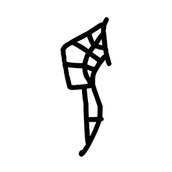

- source_zip_member: `Sub-character Images/hlxb5g91kc/hlxb5g91kc/gezd3pzg3j.png`
- checksum_sha256: see `06_component-visual-index.csv`.
- review_status: `needs_human_visual_review`
- caution: source-marked review image only.

## asset-012942

- source_zip_member: `Sub-character Images/hlxb5g91kc/hlxb5g91kc/giul26g5mg.png`
- checksum_sha256: see `06_component-visual-index.csv`.
- review_status: `needs_human_visual_review`
- caution: source-marked review image only.

## asset-012943

- source_zip_member: `Sub-character Images/hlxb5g91kc/hlxb5g91kc/glw9oj9bjg.png`
- checksum_sha256: see `06_component-visual-index.csv`.
- review_status: `needs_human_visual_review`
- caution: source-marked review image only.

## asset-012944

- source_zip_member: `Sub-character Images/hlxb5g91kc/hlxb5g91kc/gm8z8aucj6.png`
- checksum_sha256: see `06_component-visual-index.csv`.
- review_status: `needs_human_visual_review`
- caution: source-marked review image only.

## asset-012945

- source_zip_member: `Sub-character Images/hlxb5g91kc/hlxb5g91kc/guxaej1erl.png`
- checksum_sha256: see `06_component-visual-index.csv`.
- review_status: `needs_human_visual_review`
- caution: source-marked review image only.

## asset-012946

- source_zip_member: `Sub-character Images/hlxb5g91kc/hlxb5g91kc/gvfmkkx6hx.png`
- checksum_sha256: see `06_component-visual-index.csv`.
- review_status: `needs_human_visual_review`
- caution: source-marked review image only.

## asset-012947

- source_zip_member: `Sub-character Images/hlxb5g91kc/hlxb5g91kc/h0fj1h6w6b.png`
- checksum_sha256: see `06_component-visual-index.csv`.
- review_status: `needs_human_visual_review`
- caution: source-marked review image only.

## asset-012948

- source_zip_member: `Sub-character Images/hlxb5g91kc/hlxb5g91kc/h9mqvc76lc.png`
- checksum_sha256: see `06_component-visual-index.csv`.
- review_status: `needs_human_visual_review`
- caution: source-marked review image only.

## asset-012949

- source_zip_member: `Sub-character Images/hlxb5g91kc/hlxb5g91kc/ha3nw08d0p.png`
- checksum_sha256: see `06_component-visual-index.csv`.
- review_status: `needs_human_visual_review`
- caution: source-marked review image only.

## asset-012950

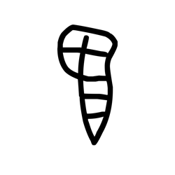

- source_zip_member: `Sub-character Images/hlxb5g91kc/hlxb5g91kc/hcld4gpo1b.png`
- checksum_sha256: see `06_component-visual-index.csv`.
- review_status: `needs_human_visual_review`
- caution: source-marked review image only.

## asset-012951

- source_zip_member: `Sub-character Images/hlxb5g91kc/hlxb5g91kc/hfud551u5p.png`
- checksum_sha256: see `06_component-visual-index.csv`.
- review_status: `needs_human_visual_review`
- caution: source-marked review image only.

## asset-012952

- source_zip_member: `Sub-character Images/hlxb5g91kc/hlxb5g91kc/hlxb5g91kc.png`
- checksum_sha256: see `06_component-visual-index.csv`.
- review_status: `needs_human_visual_review`
- caution: source-marked review image only.

## asset-012953

- source_zip_member: `Sub-character Images/hlxb5g91kc/hlxb5g91kc/hmi47dkiwb.png`
- checksum_sha256: see `06_component-visual-index.csv`.
- review_status: `needs_human_visual_review`
- caution: source-marked review image only.

## asset-012954

- source_zip_member: `Sub-character Images/hlxb5g91kc/hlxb5g91kc/hnkgkr30xr.png`
- checksum_sha256: see `06_component-visual-index.csv`.
- review_status: `needs_human_visual_review`
- caution: source-marked review image only.

## asset-012955

- source_zip_member: `Sub-character Images/hlxb5g91kc/hlxb5g91kc/hnyotiawg5.png`
- checksum_sha256: see `06_component-visual-index.csv`.
- review_status: `needs_human_visual_review`
- caution: source-marked review image only.

## asset-012956

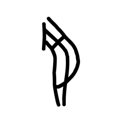

- source_zip_member: `Sub-character Images/hlxb5g91kc/hlxb5g91kc/huatyodw2x.png`
- checksum_sha256: see `06_component-visual-index.csv`.
- review_status: `needs_human_visual_review`
- caution: source-marked review image only.

## asset-012957

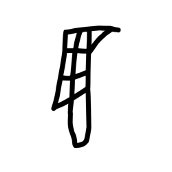

- source_zip_member: `Sub-character Images/hlxb5g91kc/hlxb5g91kc/hxnc0dm6gp.png`
- checksum_sha256: see `06_component-visual-index.csv`.
- review_status: `needs_human_visual_review`
- caution: source-marked review image only.

## asset-012958

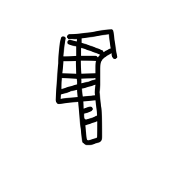

- source_zip_member: `Sub-character Images/hlxb5g91kc/hlxb5g91kc/i3x960xkeq.png`
- checksum_sha256: see `06_component-visual-index.csv`.
- review_status: `needs_human_visual_review`
- caution: source-marked review image only.

## asset-012959

- source_zip_member: `Sub-character Images/hlxb5g91kc/hlxb5g91kc/i6o3hy6pxl.png`
- checksum_sha256: see `06_component-visual-index.csv`.
- review_status: `needs_human_visual_review`
- caution: source-marked review image only.

## asset-012960

- source_zip_member: `Sub-character Images/hlxb5g91kc/hlxb5g91kc/ijelsg1k48.png`
- checksum_sha256: see `06_component-visual-index.csv`.
- review_status: `needs_human_visual_review`
- caution: source-marked review image only.

## asset-012961

- source_zip_member: `Sub-character Images/hlxb5g91kc/hlxb5g91kc/il127nul36.png`
- checksum_sha256: see `06_component-visual-index.csv`.
- review_status: `needs_human_visual_review`
- caution: source-marked review image only.

## asset-012962

- source_zip_member: `Sub-character Images/hlxb5g91kc/hlxb5g91kc/in3ah5mhvh.png`
- checksum_sha256: see `06_component-visual-index.csv`.
- review_status: `needs_human_visual_review`
- caution: source-marked review image only.

## asset-012963

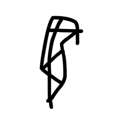

- source_zip_member: `Sub-character Images/hlxb5g91kc/hlxb5g91kc/iz6hgs3pn0.png`
- checksum_sha256: see `06_component-visual-index.csv`.
- review_status: `needs_human_visual_review`
- caution: source-marked review image only.

## asset-012964

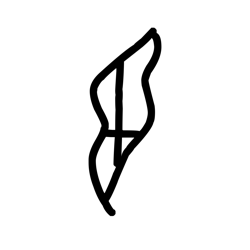

- source_zip_member: `Sub-character Images/hlxb5g91kc/hlxb5g91kc/j4ehvtawav.png`
- checksum_sha256: see `06_component-visual-index.csv`.
- review_status: `needs_human_visual_review`
- caution: source-marked review image only.

## asset-012965

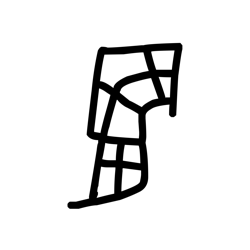

- source_zip_member: `Sub-character Images/hlxb5g91kc/hlxb5g91kc/j8m4u8fo8r.png`
- checksum_sha256: see `06_component-visual-index.csv`.
- review_status: `needs_human_visual_review`
- caution: source-marked review image only.

## asset-012966

- source_zip_member: `Sub-character Images/hlxb5g91kc/hlxb5g91kc/jbovv4w9kd.png`
- checksum_sha256: see `06_component-visual-index.csv`.
- review_status: `needs_human_visual_review`
- caution: source-marked review image only.

## asset-012967

- source_zip_member: `Sub-character Images/hlxb5g91kc/hlxb5g91kc/jcop9bbig8.png`
- checksum_sha256: see `06_component-visual-index.csv`.
- review_status: `needs_human_visual_review`
- caution: source-marked review image only.

## asset-012968

- source_zip_member: `Sub-character Images/hlxb5g91kc/hlxb5g91kc/jdz4amgiq5.png`
- checksum_sha256: see `06_component-visual-index.csv`.
- review_status: `needs_human_visual_review`
- caution: source-marked review image only.

## asset-012969

- source_zip_member: `Sub-character Images/hlxb5g91kc/hlxb5g91kc/jf2bhlbg83.png`
- checksum_sha256: see `06_component-visual-index.csv`.
- review_status: `needs_human_visual_review`
- caution: source-marked review image only.

## asset-012970

- source_zip_member: `Sub-character Images/hlxb5g91kc/hlxb5g91kc/jlzq6pj8ux.png`
- checksum_sha256: see `06_component-visual-index.csv`.
- review_status: `needs_human_visual_review`
- caution: source-marked review image only.

## asset-012971

- source_zip_member: `Sub-character Images/hlxb5g91kc/hlxb5g91kc/jqy4go5772.png`
- checksum_sha256: see `06_component-visual-index.csv`.
- review_status: `needs_human_visual_review`
- caution: source-marked review image only.

## asset-012972

- source_zip_member: `Sub-character Images/hlxb5g91kc/hlxb5g91kc/jrk2qd6z64.png`
- checksum_sha256: see `06_component-visual-index.csv`.
- review_status: `needs_human_visual_review`
- caution: source-marked review image only.

## asset-012973

- source_zip_member: `Sub-character Images/hlxb5g91kc/hlxb5g91kc/js0j46qx7u.png`
- checksum_sha256: see `06_component-visual-index.csv`.
- review_status: `needs_human_visual_review`
- caution: source-marked review image only.

## asset-012974

- source_zip_member: `Sub-character Images/hlxb5g91kc/hlxb5g91kc/judbaa82qu.png`
- checksum_sha256: see `06_component-visual-index.csv`.
- review_status: `needs_human_visual_review`
- caution: source-marked review image only.

## asset-012975

- source_zip_member: `Sub-character Images/hlxb5g91kc/hlxb5g91kc/jwyzvel979.png`
- checksum_sha256: see `06_component-visual-index.csv`.
- review_status: `needs_human_visual_review`
- caution: source-marked review image only.

## asset-012976

- source_zip_member: `Sub-character Images/hlxb5g91kc/hlxb5g91kc/k2mdp7s3sv.png`
- checksum_sha256: see `06_component-visual-index.csv`.
- review_status: `needs_human_visual_review`
- caution: source-marked review image only.

## asset-012977

- source_zip_member: `Sub-character Images/hlxb5g91kc/hlxb5g91kc/k5j5db2fwr.png`
- checksum_sha256: see `06_component-visual-index.csv`.
- review_status: `needs_human_visual_review`
- caution: source-marked review image only.

## asset-012978

- source_zip_member: `Sub-character Images/hlxb5g91kc/hlxb5g91kc/k7wxuzr6og.png`
- checksum_sha256: see `06_component-visual-index.csv`.
- review_status: `needs_human_visual_review`
- caution: source-marked review image only.

## asset-012979

- source_zip_member: `Sub-character Images/hlxb5g91kc/hlxb5g91kc/kh1pk0iu5w.png`
- checksum_sha256: see `06_component-visual-index.csv`.
- review_status: `needs_human_visual_review`
- caution: source-marked review image only.

## asset-012980

- source_zip_member: `Sub-character Images/hlxb5g91kc/hlxb5g91kc/khh3yrf0v7.png`
- checksum_sha256: see `06_component-visual-index.csv`.
- review_status: `needs_human_visual_review`
- caution: source-marked review image only.

## asset-012981

- source_zip_member: `Sub-character Images/hlxb5g91kc/hlxb5g91kc/khhjct2my5.png`
- checksum_sha256: see `06_component-visual-index.csv`.
- review_status: `needs_human_visual_review`
- caution: source-marked review image only.

## asset-012982

- source_zip_member: `Sub-character Images/hlxb5g91kc/hlxb5g91kc/ki53lqrh9a.png`
- checksum_sha256: see `06_component-visual-index.csv`.
- review_status: `needs_human_visual_review`
- caution: source-marked review image only.

## asset-012983

- source_zip_member: `Sub-character Images/hlxb5g91kc/hlxb5g91kc/kppvjrdvfw.png`
- checksum_sha256: see `06_component-visual-index.csv`.
- review_status: `needs_human_visual_review`
- caution: source-marked review image only.

## asset-012984

- source_zip_member: `Sub-character Images/hlxb5g91kc/hlxb5g91kc/kw1nm7cnfy.png`
- checksum_sha256: see `06_component-visual-index.csv`.
- review_status: `needs_human_visual_review`
- caution: source-marked review image only.

## asset-012985

- source_zip_member: `Sub-character Images/hlxb5g91kc/hlxb5g91kc/kyovgr7pww.png`
- checksum_sha256: see `06_component-visual-index.csv`.
- review_status: `needs_human_visual_review`
- caution: source-marked review image only.

## asset-012986

- source_zip_member: `Sub-character Images/hlxb5g91kc/hlxb5g91kc/l0ztecyxc6.png`
- checksum_sha256: see `06_component-visual-index.csv`.
- review_status: `needs_human_visual_review`
- caution: source-marked review image only.

## asset-012987

- source_zip_member: `Sub-character Images/hlxb5g91kc/hlxb5g91kc/lhqjwilniw.png`
- checksum_sha256: see `06_component-visual-index.csv`.
- review_status: `needs_human_visual_review`
- caution: source-marked review image only.

## asset-012988

- source_zip_member: `Sub-character Images/hlxb5g91kc/hlxb5g91kc/ljnfb08nl3.png`
- checksum_sha256: see `06_component-visual-index.csv`.
- review_status: `needs_human_visual_review`
- caution: source-marked review image only.

## asset-012989

- source_zip_member: `Sub-character Images/hlxb5g91kc/hlxb5g91kc/ljqw43sojh.png`
- checksum_sha256: see `06_component-visual-index.csv`.
- review_status: `needs_human_visual_review`
- caution: source-marked review image only.

## asset-012990

- source_zip_member: `Sub-character Images/hlxb5g91kc/hlxb5g91kc/lsslw73qyf.png`
- checksum_sha256: see `06_component-visual-index.csv`.
- review_status: `needs_human_visual_review`
- caution: source-marked review image only.

## asset-012991

- source_zip_member: `Sub-character Images/hlxb5g91kc/hlxb5g91kc/m3v9pcqvrq.png`
- checksum_sha256: see `06_component-visual-index.csv`.
- review_status: `needs_human_visual_review`
- caution: source-marked review image only.

## asset-012992

- source_zip_member: `Sub-character Images/hlxb5g91kc/hlxb5g91kc/m7gnls93zc.png`
- checksum_sha256: see `06_component-visual-index.csv`.
- review_status: `needs_human_visual_review`
- caution: source-marked review image only.

## asset-012993

- source_zip_member: `Sub-character Images/hlxb5g91kc/hlxb5g91kc/m84liov5ji.png`
- checksum_sha256: see `06_component-visual-index.csv`.
- review_status: `needs_human_visual_review`
- caution: source-marked review image only.

## asset-012994

- source_zip_member: `Sub-character Images/hlxb5g91kc/hlxb5g91kc/md7jh3yqt8.png`
- checksum_sha256: see `06_component-visual-index.csv`.
- review_status: `needs_human_visual_review`
- caution: source-marked review image only.

## asset-012995

- source_zip_member: `Sub-character Images/hlxb5g91kc/hlxb5g91kc/mdazubc64u.png`
- checksum_sha256: see `06_component-visual-index.csv`.
- review_status: `needs_human_visual_review`
- caution: source-marked review image only.

## asset-012996

- source_zip_member: `Sub-character Images/hlxb5g91kc/hlxb5g91kc/miuwvost5y.png`
- checksum_sha256: see `06_component-visual-index.csv`.
- review_status: `needs_human_visual_review`
- caution: source-marked review image only.

## asset-012997

- source_zip_member: `Sub-character Images/hlxb5g91kc/hlxb5g91kc/mkb533cik7.png`
- checksum_sha256: see `06_component-visual-index.csv`.
- review_status: `needs_human_visual_review`
- caution: source-marked review image only.

## asset-012998

- source_zip_member: `Sub-character Images/hlxb5g91kc/hlxb5g91kc/mlvkmocvxx.png`
- checksum_sha256: see `06_component-visual-index.csv`.
- review_status: `needs_human_visual_review`
- caution: source-marked review image only.

## asset-012999

- source_zip_member: `Sub-character Images/hlxb5g91kc/hlxb5g91kc/mp1uvqh795.png`
- checksum_sha256: see `06_component-visual-index.csv`.
- review_status: `needs_human_visual_review`
- caution: source-marked review image only.

## asset-013000

- source_zip_member: `Sub-character Images/hlxb5g91kc/hlxb5g91kc/n794c1sl2w.png`
- checksum_sha256: see `06_component-visual-index.csv`.
- review_status: `needs_human_visual_review`
- caution: source-marked review image only.

## asset-013001

- source_zip_member: `Sub-character Images/hlxb5g91kc/hlxb5g91kc/n9hcskquh6.png`
- checksum_sha256: see `06_component-visual-index.csv`.
- review_status: `needs_human_visual_review`
- caution: source-marked review image only.

## asset-013002

- source_zip_member: `Sub-character Images/hlxb5g91kc/hlxb5g91kc/naske9woi3.png`
- checksum_sha256: see `06_component-visual-index.csv`.
- review_status: `needs_human_visual_review`
- caution: source-marked review image only.

## asset-013003

- source_zip_member: `Sub-character Images/hlxb5g91kc/hlxb5g91kc/nfce60lwc2.png`
- checksum_sha256: see `06_component-visual-index.csv`.
- review_status: `needs_human_visual_review`
- caution: source-marked review image only.

## asset-013004

- source_zip_member: `Sub-character Images/hlxb5g91kc/hlxb5g91kc/nnia743te3.png`
- checksum_sha256: see `06_component-visual-index.csv`.
- review_status: `needs_human_visual_review`
- caution: source-marked review image only.

## asset-013005

- source_zip_member: `Sub-character Images/hlxb5g91kc/hlxb5g91kc/ns8xjb7uyy.png`
- checksum_sha256: see `06_component-visual-index.csv`.
- review_status: `needs_human_visual_review`
- caution: source-marked review image only.

## asset-013006

- source_zip_member: `Sub-character Images/hlxb5g91kc/hlxb5g91kc/nsa50uy7d7.png`
- checksum_sha256: see `06_component-visual-index.csv`.
- review_status: `needs_human_visual_review`
- caution: source-marked review image only.

## asset-013007

- source_zip_member: `Sub-character Images/hlxb5g91kc/hlxb5g91kc/nvu50ysvne.png`
- checksum_sha256: see `06_component-visual-index.csv`.
- review_status: `needs_human_visual_review`
- caution: source-marked review image only.

## asset-013008

- source_zip_member: `Sub-character Images/hlxb5g91kc/hlxb5g91kc/nwsixyye2l.png`
- checksum_sha256: see `06_component-visual-index.csv`.
- review_status: `needs_human_visual_review`
- caution: source-marked review image only.

## asset-013009

- source_zip_member: `Sub-character Images/hlxb5g91kc/hlxb5g91kc/nx1a1bne32.png`
- checksum_sha256: see `06_component-visual-index.csv`.
- review_status: `needs_human_visual_review`
- caution: source-marked review image only.

## asset-013010

- source_zip_member: `Sub-character Images/hlxb5g91kc/hlxb5g91kc/nz4woqbngc.png`
- checksum_sha256: see `06_component-visual-index.csv`.
- review_status: `needs_human_visual_review`
- caution: source-marked review image only.

## asset-013011

- source_zip_member: `Sub-character Images/hlxb5g91kc/hlxb5g91kc/o5hnc58o4i.png`
- checksum_sha256: see `06_component-visual-index.csv`.
- review_status: `needs_human_visual_review`
- caution: source-marked review image only.

## asset-013012

- source_zip_member: `Sub-character Images/hlxb5g91kc/hlxb5g91kc/o672lci9ra.png`
- checksum_sha256: see `06_component-visual-index.csv`.
- review_status: `needs_human_visual_review`
- caution: source-marked review image only.

## asset-013013

- source_zip_member: `Sub-character Images/hlxb5g91kc/hlxb5g91kc/om9agyd7ia.png`
- checksum_sha256: see `06_component-visual-index.csv`.
- review_status: `needs_human_visual_review`
- caution: source-marked review image only.

## asset-013014

- source_zip_member: `Sub-character Images/hlxb5g91kc/hlxb5g91kc/p55xc36xhf.png`
- checksum_sha256: see `06_component-visual-index.csv`.
- review_status: `needs_human_visual_review`
- caution: source-marked review image only.

## asset-013015

- source_zip_member: `Sub-character Images/hlxb5g91kc/hlxb5g91kc/p9retcekvw.png`
- checksum_sha256: see `06_component-visual-index.csv`.
- review_status: `needs_human_visual_review`
- caution: source-marked review image only.

## asset-013016

- source_zip_member: `Sub-character Images/hlxb5g91kc/hlxb5g91kc/pam2bdlhrk.png`
- checksum_sha256: see `06_component-visual-index.csv`.
- review_status: `needs_human_visual_review`
- caution: source-marked review image only.

## asset-013017

- source_zip_member: `Sub-character Images/hlxb5g91kc/hlxb5g91kc/pmq462r5wu.png`
- checksum_sha256: see `06_component-visual-index.csv`.
- review_status: `needs_human_visual_review`
- caution: source-marked review image only.

## asset-013018

- source_zip_member: `Sub-character Images/hlxb5g91kc/hlxb5g91kc/psozwvhn0d.png`
- checksum_sha256: see `06_component-visual-index.csv`.
- review_status: `needs_human_visual_review`
- caution: source-marked review image only.

## asset-013019

- source_zip_member: `Sub-character Images/hlxb5g91kc/hlxb5g91kc/pupru2lvq3.png`
- checksum_sha256: see `06_component-visual-index.csv`.
- review_status: `needs_human_visual_review`
- caution: source-marked review image only.

## asset-013020

- source_zip_member: `Sub-character Images/hlxb5g91kc/hlxb5g91kc/q1h9ayq4px.png`
- checksum_sha256: see `06_component-visual-index.csv`.
- review_status: `needs_human_visual_review`
- caution: source-marked review image only.

## asset-013021

- source_zip_member: `Sub-character Images/hlxb5g91kc/hlxb5g91kc/qearvo0n3y.png`
- checksum_sha256: see `06_component-visual-index.csv`.
- review_status: `needs_human_visual_review`
- caution: source-marked review image only.

## asset-013022

- source_zip_member: `Sub-character Images/hlxb5g91kc/hlxb5g91kc/qz6psgddt1.png`
- checksum_sha256: see `06_component-visual-index.csv`.
- review_status: `needs_human_visual_review`
- caution: source-marked review image only.

## asset-013023

- source_zip_member: `Sub-character Images/hlxb5g91kc/hlxb5g91kc/r1pgwyfvak.png`
- checksum_sha256: see `06_component-visual-index.csv`.
- review_status: `needs_human_visual_review`
- caution: source-marked review image only.

## asset-013024

- source_zip_member: `Sub-character Images/hlxb5g91kc/hlxb5g91kc/r2r2grp8wb.png`
- checksum_sha256: see `06_component-visual-index.csv`.
- review_status: `needs_human_visual_review`
- caution: source-marked review image only.

## asset-013025

- source_zip_member: `Sub-character Images/hlxb5g91kc/hlxb5g91kc/r96l29g5v1.png`
- checksum_sha256: see `06_component-visual-index.csv`.
- review_status: `needs_human_visual_review`
- caution: source-marked review image only.

## asset-013026

- source_zip_member: `Sub-character Images/hlxb5g91kc/hlxb5g91kc/r9ozpwfz0a.png`
- checksum_sha256: see `06_component-visual-index.csv`.
- review_status: `needs_human_visual_review`
- caution: source-marked review image only.

## asset-013027

- source_zip_member: `Sub-character Images/hlxb5g91kc/hlxb5g91kc/rcaq6bhzlg.png`
- checksum_sha256: see `06_component-visual-index.csv`.
- review_status: `needs_human_visual_review`
- caution: source-marked review image only.

## asset-013028

- source_zip_member: `Sub-character Images/hlxb5g91kc/hlxb5g91kc/rhy7wf91sm.png`
- checksum_sha256: see `06_component-visual-index.csv`.
- review_status: `needs_human_visual_review`
- caution: source-marked review image only.

## asset-013029

- source_zip_member: `Sub-character Images/hlxb5g91kc/hlxb5g91kc/rjihrjubgr.png`
- checksum_sha256: see `06_component-visual-index.csv`.
- review_status: `needs_human_visual_review`
- caution: source-marked review image only.

## asset-013030

- source_zip_member: `Sub-character Images/hlxb5g91kc/hlxb5g91kc/rn0l2iqb3a.png`
- checksum_sha256: see `06_component-visual-index.csv`.
- review_status: `needs_human_visual_review`
- caution: source-marked review image only.

## asset-013031

- source_zip_member: `Sub-character Images/hlxb5g91kc/hlxb5g91kc/rqb1qnzc2w.png`
- checksum_sha256: see `06_component-visual-index.csv`.
- review_status: `needs_human_visual_review`
- caution: source-marked review image only.

## asset-013032

- source_zip_member: `Sub-character Images/hlxb5g91kc/hlxb5g91kc/rxob3oci3t.png`
- checksum_sha256: see `06_component-visual-index.csv`.
- review_status: `needs_human_visual_review`
- caution: source-marked review image only.

## asset-013033

- source_zip_member: `Sub-character Images/hlxb5g91kc/hlxb5g91kc/s8dybleryb.png`
- checksum_sha256: see `06_component-visual-index.csv`.
- review_status: `needs_human_visual_review`
- caution: source-marked review image only.

## asset-013034

- source_zip_member: `Sub-character Images/hlxb5g91kc/hlxb5g91kc/s8nxeao9yy.png`
- checksum_sha256: see `06_component-visual-index.csv`.
- review_status: `needs_human_visual_review`
- caution: source-marked review image only.

## asset-013035

- source_zip_member: `Sub-character Images/hlxb5g91kc/hlxb5g91kc/s8uhq5s24s.png`
- checksum_sha256: see `06_component-visual-index.csv`.
- review_status: `needs_human_visual_review`
- caution: source-marked review image only.

## asset-013036

- source_zip_member: `Sub-character Images/hlxb5g91kc/hlxb5g91kc/s98pgac8u3.png`
- checksum_sha256: see `06_component-visual-index.csv`.
- review_status: `needs_human_visual_review`
- caution: source-marked review image only.

## asset-013037

- source_zip_member: `Sub-character Images/hlxb5g91kc/hlxb5g91kc/s9kih843qy.png`
- checksum_sha256: see `06_component-visual-index.csv`.
- review_status: `needs_human_visual_review`
- caution: source-marked review image only.

## asset-013038

- source_zip_member: `Sub-character Images/hlxb5g91kc/hlxb5g91kc/sida13m736.png`
- checksum_sha256: see `06_component-visual-index.csv`.
- review_status: `needs_human_visual_review`
- caution: source-marked review image only.

## asset-013039

- source_zip_member: `Sub-character Images/hlxb5g91kc/hlxb5g91kc/sio05b20kx.png`
- checksum_sha256: see `06_component-visual-index.csv`.
- review_status: `needs_human_visual_review`
- caution: source-marked review image only.

## asset-013040

- source_zip_member: `Sub-character Images/hlxb5g91kc/hlxb5g91kc/sjktmv75gb.png`
- checksum_sha256: see `06_component-visual-index.csv`.
- review_status: `needs_human_visual_review`
- caution: source-marked review image only.

## asset-013041

- source_zip_member: `Sub-character Images/hlxb5g91kc/hlxb5g91kc/snhisku7lm.png`
- checksum_sha256: see `06_component-visual-index.csv`.
- review_status: `needs_human_visual_review`
- caution: source-marked review image only.

## asset-013042

- source_zip_member: `Sub-character Images/hlxb5g91kc/hlxb5g91kc/spc6jtxlxc.png`
- checksum_sha256: see `06_component-visual-index.csv`.
- review_status: `needs_human_visual_review`
- caution: source-marked review image only.

## asset-013043

- source_zip_member: `Sub-character Images/hlxb5g91kc/hlxb5g91kc/sxq53k3w4p.png`
- checksum_sha256: see `06_component-visual-index.csv`.
- review_status: `needs_human_visual_review`
- caution: source-marked review image only.

## asset-013044

- source_zip_member: `Sub-character Images/hlxb5g91kc/hlxb5g91kc/sy1shz8gwe.png`
- checksum_sha256: see `06_component-visual-index.csv`.
- review_status: `needs_human_visual_review`
- caution: source-marked review image only.

## asset-013045

- source_zip_member: `Sub-character Images/hlxb5g91kc/hlxb5g91kc/syoml7dgkx.png`
- checksum_sha256: see `06_component-visual-index.csv`.
- review_status: `needs_human_visual_review`
- caution: source-marked review image only.

## asset-013046

- source_zip_member: `Sub-character Images/hlxb5g91kc/hlxb5g91kc/sz4ipvyj5z.png`
- checksum_sha256: see `06_component-visual-index.csv`.
- review_status: `needs_human_visual_review`
- caution: source-marked review image only.

## asset-013047

- source_zip_member: `Sub-character Images/hlxb5g91kc/hlxb5g91kc/szuahqbdck.png`
- checksum_sha256: see `06_component-visual-index.csv`.
- review_status: `needs_human_visual_review`
- caution: source-marked review image only.

## asset-013048

- source_zip_member: `Sub-character Images/hlxb5g91kc/hlxb5g91kc/t23lluzrgh.png`
- checksum_sha256: see `06_component-visual-index.csv`.
- review_status: `needs_human_visual_review`
- caution: source-marked review image only.

## asset-013049

- source_zip_member: `Sub-character Images/hlxb5g91kc/hlxb5g91kc/t5uy7yvs54.png`
- checksum_sha256: see `06_component-visual-index.csv`.
- review_status: `needs_human_visual_review`
- caution: source-marked review image only.

## asset-013050

- source_zip_member: `Sub-character Images/hlxb5g91kc/hlxb5g91kc/t8qlzmh9ei.png`
- checksum_sha256: see `06_component-visual-index.csv`.
- review_status: `needs_human_visual_review`
- caution: source-marked review image only.

## asset-013051

- source_zip_member: `Sub-character Images/hlxb5g91kc/hlxb5g91kc/tj4d7u6rnu.png`
- checksum_sha256: see `06_component-visual-index.csv`.
- review_status: `needs_human_visual_review`
- caution: source-marked review image only.

## asset-013052

- source_zip_member: `Sub-character Images/hlxb5g91kc/hlxb5g91kc/tmtmulq19w.png`
- checksum_sha256: see `06_component-visual-index.csv`.
- review_status: `needs_human_visual_review`
- caution: source-marked review image only.

## asset-013053

- source_zip_member: `Sub-character Images/hlxb5g91kc/hlxb5g91kc/tplpdexqsf.png`
- checksum_sha256: see `06_component-visual-index.csv`.
- review_status: `needs_human_visual_review`
- caution: source-marked review image only.

## asset-013054

- source_zip_member: `Sub-character Images/hlxb5g91kc/hlxb5g91kc/tr0806v67y.png`
- checksum_sha256: see `06_component-visual-index.csv`.
- review_status: `needs_human_visual_review`
- caution: source-marked review image only.

## asset-013055

- source_zip_member: `Sub-character Images/hlxb5g91kc/hlxb5g91kc/tvmluzwldr.png`
- checksum_sha256: see `06_component-visual-index.csv`.
- review_status: `needs_human_visual_review`
- caution: source-marked review image only.

## asset-013056

- source_zip_member: `Sub-character Images/hlxb5g91kc/hlxb5g91kc/u55fxmc0er.png`
- checksum_sha256: see `06_component-visual-index.csv`.
- review_status: `needs_human_visual_review`
- caution: source-marked review image only.

## asset-013057

- source_zip_member: `Sub-character Images/hlxb5g91kc/hlxb5g91kc/u8va0bub38.png`
- checksum_sha256: see `06_component-visual-index.csv`.
- review_status: `needs_human_visual_review`
- caution: source-marked review image only.

## asset-013058

- source_zip_member: `Sub-character Images/hlxb5g91kc/hlxb5g91kc/u9e49sxv06.png`
- checksum_sha256: see `06_component-visual-index.csv`.
- review_status: `needs_human_visual_review`
- caution: source-marked review image only.

## asset-013059

- source_zip_member: `Sub-character Images/hlxb5g91kc/hlxb5g91kc/uc7ue8fxmx.png`
- checksum_sha256: see `06_component-visual-index.csv`.
- review_status: `needs_human_visual_review`
- caution: source-marked review image only.

## asset-013060

- source_zip_member: `Sub-character Images/hlxb5g91kc/hlxb5g91kc/uderjseb1j.png`
- checksum_sha256: see `06_component-visual-index.csv`.
- review_status: `needs_human_visual_review`
- caution: source-marked review image only.

## asset-013061

- source_zip_member: `Sub-character Images/hlxb5g91kc/hlxb5g91kc/ued225xoj1.png`
- checksum_sha256: see `06_component-visual-index.csv`.
- review_status: `needs_human_visual_review`
- caution: source-marked review image only.

## asset-013062

- source_zip_member: `Sub-character Images/hlxb5g91kc/hlxb5g91kc/uif7471ii5.png`
- checksum_sha256: see `06_component-visual-index.csv`.
- review_status: `needs_human_visual_review`
- caution: source-marked review image only.

## asset-013063

- source_zip_member: `Sub-character Images/hlxb5g91kc/hlxb5g91kc/uihp067fky.png`
- checksum_sha256: see `06_component-visual-index.csv`.
- review_status: `needs_human_visual_review`
- caution: source-marked review image only.

## asset-013064

- source_zip_member: `Sub-character Images/hlxb5g91kc/hlxb5g91kc/um97ww7ibx.png`
- checksum_sha256: see `06_component-visual-index.csv`.
- review_status: `needs_human_visual_review`
- caution: source-marked review image only.

## asset-013065

- source_zip_member: `Sub-character Images/hlxb5g91kc/hlxb5g91kc/umxg3w1ecu.png`
- checksum_sha256: see `06_component-visual-index.csv`.
- review_status: `needs_human_visual_review`
- caution: source-marked review image only.

## asset-013066

- source_zip_member: `Sub-character Images/hlxb5g91kc/hlxb5g91kc/upeh3a5nvw.png`
- checksum_sha256: see `06_component-visual-index.csv`.
- review_status: `needs_human_visual_review`
- caution: source-marked review image only.

## asset-013067

- source_zip_member: `Sub-character Images/hlxb5g91kc/hlxb5g91kc/uubixrl49f.png`
- checksum_sha256: see `06_component-visual-index.csv`.
- review_status: `needs_human_visual_review`
- caution: source-marked review image only.

## asset-013068

- source_zip_member: `Sub-character Images/hlxb5g91kc/hlxb5g91kc/uvkayrttzm.png`
- checksum_sha256: see `06_component-visual-index.csv`.
- review_status: `needs_human_visual_review`
- caution: source-marked review image only.

## asset-013069

- source_zip_member: `Sub-character Images/hlxb5g91kc/hlxb5g91kc/uvl883rucy.png`
- checksum_sha256: see `06_component-visual-index.csv`.
- review_status: `needs_human_visual_review`
- caution: source-marked review image only.

## asset-013070

- source_zip_member: `Sub-character Images/hlxb5g91kc/hlxb5g91kc/uzrspbiucl.png`
- checksum_sha256: see `06_component-visual-index.csv`.
- review_status: `needs_human_visual_review`
- caution: source-marked review image only.

## asset-013071

- source_zip_member: `Sub-character Images/hlxb5g91kc/hlxb5g91kc/v01lt6sosy.png`
- checksum_sha256: see `06_component-visual-index.csv`.
- review_status: `needs_human_visual_review`
- caution: source-marked review image only.

## asset-013072

- source_zip_member: `Sub-character Images/hlxb5g91kc/hlxb5g91kc/v8eiomwa2n.png`
- checksum_sha256: see `06_component-visual-index.csv`.
- review_status: `needs_human_visual_review`
- caution: source-marked review image only.

## asset-013073

- source_zip_member: `Sub-character Images/hlxb5g91kc/hlxb5g91kc/v8j9lsvnw7.png`
- checksum_sha256: see `06_component-visual-index.csv`.
- review_status: `needs_human_visual_review`
- caution: source-marked review image only.

## asset-013074

- source_zip_member: `Sub-character Images/hlxb5g91kc/hlxb5g91kc/vbfvpc2tgu.png`
- checksum_sha256: see `06_component-visual-index.csv`.
- review_status: `needs_human_visual_review`
- caution: source-marked review image only.

## asset-013075

- source_zip_member: `Sub-character Images/hlxb5g91kc/hlxb5g91kc/vdmbe7vw08.png`
- checksum_sha256: see `06_component-visual-index.csv`.
- review_status: `needs_human_visual_review`
- caution: source-marked review image only.

## asset-013076

- source_zip_member: `Sub-character Images/hlxb5g91kc/hlxb5g91kc/vgly9l0yni.png`
- checksum_sha256: see `06_component-visual-index.csv`.
- review_status: `needs_human_visual_review`
- caution: source-marked review image only.

## asset-013077

- source_zip_member: `Sub-character Images/hlxb5g91kc/hlxb5g91kc/vm0pzdzv3j.png`
- checksum_sha256: see `06_component-visual-index.csv`.
- review_status: `needs_human_visual_review`
- caution: source-marked review image only.

## asset-013078

- source_zip_member: `Sub-character Images/hlxb5g91kc/hlxb5g91kc/vqdgjn12oh.png`
- checksum_sha256: see `06_component-visual-index.csv`.
- review_status: `needs_human_visual_review`
- caution: source-marked review image only.

## asset-013079

- source_zip_member: `Sub-character Images/hlxb5g91kc/hlxb5g91kc/vy88mwwo9o.png`
- checksum_sha256: see `06_component-visual-index.csv`.
- review_status: `needs_human_visual_review`
- caution: source-marked review image only.

## asset-013080

- source_zip_member: `Sub-character Images/hlxb5g91kc/hlxb5g91kc/w31kh7o77f.png`
- checksum_sha256: see `06_component-visual-index.csv`.
- review_status: `needs_human_visual_review`
- caution: source-marked review image only.

## asset-013081

- source_zip_member: `Sub-character Images/hlxb5g91kc/hlxb5g91kc/wlecpc2qkw.png`
- checksum_sha256: see `06_component-visual-index.csv`.
- review_status: `needs_human_visual_review`
- caution: source-marked review image only.

## asset-013082

- source_zip_member: `Sub-character Images/hlxb5g91kc/hlxb5g91kc/ws33adfgnl.png`
- checksum_sha256: see `06_component-visual-index.csv`.
- review_status: `needs_human_visual_review`
- caution: source-marked review image only.

## asset-013083

- source_zip_member: `Sub-character Images/hlxb5g91kc/hlxb5g91kc/wtoaoem289.png`
- checksum_sha256: see `06_component-visual-index.csv`.
- review_status: `needs_human_visual_review`
- caution: source-marked review image only.

## asset-013084

- source_zip_member: `Sub-character Images/hlxb5g91kc/hlxb5g91kc/wva1ybxu9t.png`
- checksum_sha256: see `06_component-visual-index.csv`.
- review_status: `needs_human_visual_review`
- caution: source-marked review image only.

## asset-013085

- source_zip_member: `Sub-character Images/hlxb5g91kc/hlxb5g91kc/wvluc9b4ew.png`
- checksum_sha256: see `06_component-visual-index.csv`.
- review_status: `needs_human_visual_review`
- caution: source-marked review image only.

## asset-013086

- source_zip_member: `Sub-character Images/hlxb5g91kc/hlxb5g91kc/wyyx5r64il.png`
- checksum_sha256: see `06_component-visual-index.csv`.
- review_status: `needs_human_visual_review`
- caution: source-marked review image only.

## asset-013087

- source_zip_member: `Sub-character Images/hlxb5g91kc/hlxb5g91kc/wzby6ovwuc.png`
- checksum_sha256: see `06_component-visual-index.csv`.
- review_status: `needs_human_visual_review`
- caution: source-marked review image only.

## asset-013088

- source_zip_member: `Sub-character Images/hlxb5g91kc/hlxb5g91kc/x1vbp8phba.png`
- checksum_sha256: see `06_component-visual-index.csv`.
- review_status: `needs_human_visual_review`
- caution: source-marked review image only.

## asset-013089

- source_zip_member: `Sub-character Images/hlxb5g91kc/hlxb5g91kc/x3tjc1dzk9.png`
- checksum_sha256: see `06_component-visual-index.csv`.
- review_status: `needs_human_visual_review`
- caution: source-marked review image only.

## asset-013090

- source_zip_member: `Sub-character Images/hlxb5g91kc/hlxb5g91kc/xdy27ktu4o.png`
- checksum_sha256: see `06_component-visual-index.csv`.
- review_status: `needs_human_visual_review`
- caution: source-marked review image only.

## asset-013091

- source_zip_member: `Sub-character Images/hlxb5g91kc/hlxb5g91kc/xohwn7jwrf.png`
- checksum_sha256: see `06_component-visual-index.csv`.
- review_status: `needs_human_visual_review`
- caution: source-marked review image only.

## asset-013092

- source_zip_member: `Sub-character Images/hlxb5g91kc/hlxb5g91kc/y0l2k6ak5g.png`
- checksum_sha256: see `06_component-visual-index.csv`.
- review_status: `needs_human_visual_review`
- caution: source-marked review image only.

## asset-013093

- source_zip_member: `Sub-character Images/hlxb5g91kc/hlxb5g91kc/y6kpahoxe8.png`
- checksum_sha256: see `06_component-visual-index.csv`.
- review_status: `needs_human_visual_review`
- caution: source-marked review image only.

## asset-013094

- source_zip_member: `Sub-character Images/hlxb5g91kc/hlxb5g91kc/y8wcl1k60o.png`
- checksum_sha256: see `06_component-visual-index.csv`.
- review_status: `needs_human_visual_review`
- caution: source-marked review image only.

## asset-013095

- source_zip_member: `Sub-character Images/hlxb5g91kc/hlxb5g91kc/yf8oj91rla.png`
- checksum_sha256: see `06_component-visual-index.csv`.
- review_status: `needs_human_visual_review`
- caution: source-marked review image only.

## asset-013096

- source_zip_member: `Sub-character Images/hlxb5g91kc/hlxb5g91kc/yvejlscwer.png`
- checksum_sha256: see `06_component-visual-index.csv`.
- review_status: `needs_human_visual_review`
- caution: source-marked review image only.

## asset-013097

- source_zip_member: `Sub-character Images/hlxb5g91kc/hlxb5g91kc/z4pgymtt3o.png`
- checksum_sha256: see `06_component-visual-index.csv`.
- review_status: `needs_human_visual_review`
- caution: source-marked review image only.

## asset-013098

- source_zip_member: `Sub-character Images/hlxb5g91kc/hlxb5g91kc/zdru0k8s0w.png`
- checksum_sha256: see `06_component-visual-index.csv`.
- review_status: `needs_human_visual_review`
- caution: source-marked review image only.

## asset-013099

- source_zip_member: `Sub-character Images/hlxb5g91kc/hlxb5g91kc/zecx3rz1y1.png`
- checksum_sha256: see `06_component-visual-index.csv`.
- review_status: `needs_human_visual_review`
- caution: source-marked review image only.

## asset-013100

- source_zip_member: `Sub-character Images/hlxb5g91kc/hlxb5g91kc/zf7jjotbu1.png`
- checksum_sha256: see `06_component-visual-index.csv`.
- review_status: `needs_human_visual_review`
- caution: source-marked review image only.

## asset-013101

- source_zip_member: `Sub-character Images/hlxb5g91kc/hlxb5g91kc/zh1fv6qwxa.png`
- checksum_sha256: see `06_component-visual-index.csv`.
- review_status: `needs_human_visual_review`
- caution: source-marked review image only.

## asset-013102

- source_zip_member: `Sub-character Images/hlxb5g91kc/hlxb5g91kc/zjaz3c0mii.png`
- checksum_sha256: see `06_component-visual-index.csv`.
- review_status: `needs_human_visual_review`
- caution: source-marked review image only.
