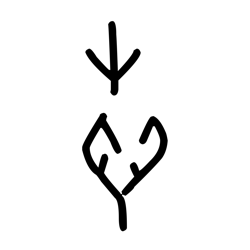
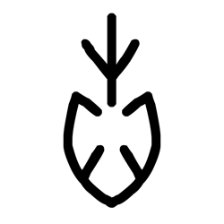
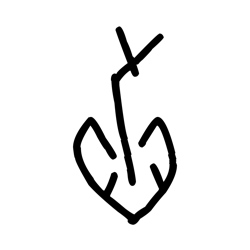
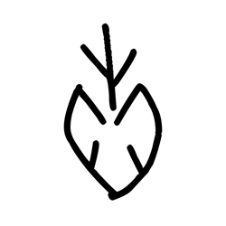
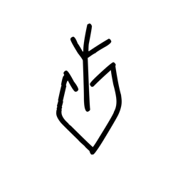
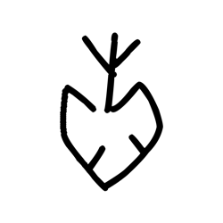

# Component Visual Gallery / 构件图像查看: obs-comp-cand-000598

English:
This page displays OBIMD subcharacter PNG assets extracted into this concrete corpus object directory for human review.

简体中文：
本页展示抽取到当前具体 corpus 对象目录内的 OBIMD subcharacter PNG 资料，供人工复核使用。

Boundary / 边界：dataset image candidate only; not a confirmed component form, component assignment, or decipherment claim.

## asset-013126

- source_zip_member: `Sub-character Images/846cza5dwl/bfjr233zys/67658f8o6x.png`
- checksum_sha256: `869d90c8e707a938a85833799c4b7386fccb549bedeaabc0aac8668a8c9b79e8`
- review_status: `needs_human_visual_review`
- caution: OBIMD subcharacter image is a source-marked review asset only; it is not a confirmed component form, component assignment, or decipherment conclusion.

## asset-013127

- source_zip_member: `Sub-character Images/846cza5dwl/bfjr233zys/bfjr233zys.png`
- checksum_sha256: `777598c11c8633b466cc0282df61b21876096a94708887a699f8a7c584324585`
- review_status: `needs_human_visual_review`
- caution: OBIMD subcharacter image is a source-marked review asset only; it is not a confirmed component form, component assignment, or decipherment conclusion.

## asset-013128

- source_zip_member: `Sub-character Images/846cza5dwl/bfjr233zys/cvltxbuq7m.png`
- checksum_sha256: `21f0bf16605666b5c0f3483553d9a8656d5dce52e35da69bf28568acd5486947`
- review_status: `needs_human_visual_review`
- caution: OBIMD subcharacter image is a source-marked review asset only; it is not a confirmed component form, component assignment, or decipherment conclusion.

## asset-013129

- source_zip_member: `Sub-character Images/846cza5dwl/bfjr233zys/fwxlvm8jrv.png`
- checksum_sha256: `38c0c86c67a1581cef926585b741816abf008e808ec524670bf0f0a90f7fdf96`
- review_status: `needs_human_visual_review`
- caution: OBIMD subcharacter image is a source-marked review asset only; it is not a confirmed component form, component assignment, or decipherment conclusion.

## asset-013130

- source_zip_member: `Sub-character Images/846cza5dwl/bfjr233zys/ktq9y1cskb.png`
- checksum_sha256: `36411ed5b4849f42975b16a1e76f23f86ede63787f137f55a414ebefe19509e3`
- review_status: `needs_human_visual_review`
- caution: OBIMD subcharacter image is a source-marked review asset only; it is not a confirmed component form, component assignment, or decipherment conclusion.

## asset-013131

- source_zip_member: `Sub-character Images/846cza5dwl/bfjr233zys/x75cqsy7bo.png`
- checksum_sha256: `270ca8e5df6eb5d3ac21875e82008e24d7a6ab324f42c5e4ca605971ce72fa81`
- review_status: `needs_human_visual_review`
- caution: OBIMD subcharacter image is a source-marked review asset only; it is not a confirmed component form, component assignment, or decipherment conclusion.
