# Component Visual Gallery / 构件图像查看: obs-comp-cand-000606

English:
This page displays OBIMD subcharacter PNG assets extracted into this concrete corpus object directory for human review.

简体中文：
本页展示抽取到当前具体 corpus 对象目录内的 OBIMD subcharacter PNG 资料，供人工复核使用。

Boundary / 边界：dataset image candidate only; not a confirmed component form, component assignment, or decipherment claim.

## asset-013139

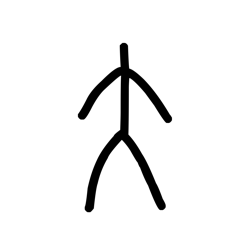

- source_zip_member: `Sub-character Images/s9y9vbblxa/s9y9vbblxa/16x4yt5cpk.png`
- checksum_sha256: `5fa51a846d6127418554182b448e12411fd2c7c5a692eb34dec823c5b36e65c5`
- review_status: `needs_human_visual_review`
- caution: OBIMD subcharacter image is a source-marked review asset only; it is not a confirmed component form, component assignment, or decipherment conclusion.

## asset-013140

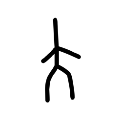

- source_zip_member: `Sub-character Images/s9y9vbblxa/s9y9vbblxa/4i9gfg6w66.png`
- checksum_sha256: `2f5ac463b147dbf1eb1a4245d0eb3eb6bb7d12a00bfe120f5f241b5063a9a187`
- review_status: `needs_human_visual_review`
- caution: OBIMD subcharacter image is a source-marked review asset only; it is not a confirmed component form, component assignment, or decipherment conclusion.

## asset-013141

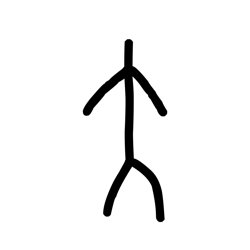

- source_zip_member: `Sub-character Images/s9y9vbblxa/s9y9vbblxa/593qdknmx4.png`
- checksum_sha256: `a2343869489a05cc8f3b68440b7c03e357a71cf2a7f0e46d1b670c0402f2831f`
- review_status: `needs_human_visual_review`
- caution: OBIMD subcharacter image is a source-marked review asset only; it is not a confirmed component form, component assignment, or decipherment conclusion.

## asset-013142

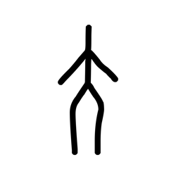

- source_zip_member: `Sub-character Images/s9y9vbblxa/s9y9vbblxa/94k4tvhrc5.png`
- checksum_sha256: `c11fe66862168931bf131f1f69ff279745d1d765074158833baec1ae55dfd6bc`
- review_status: `needs_human_visual_review`
- caution: OBIMD subcharacter image is a source-marked review asset only; it is not a confirmed component form, component assignment, or decipherment conclusion.

## asset-013143

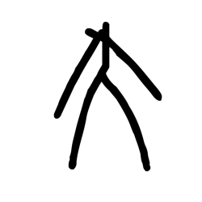

- source_zip_member: `Sub-character Images/s9y9vbblxa/s9y9vbblxa/ay8h8cktku.png`
- checksum_sha256: `db3d2cdd4bd3bca469e5083497c3c7cb4339c49bb6044facc6ad7991eb010410`
- review_status: `needs_human_visual_review`
- caution: OBIMD subcharacter image is a source-marked review asset only; it is not a confirmed component form, component assignment, or decipherment conclusion.

## asset-013144

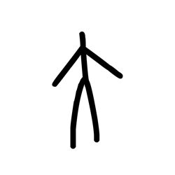

- source_zip_member: `Sub-character Images/s9y9vbblxa/s9y9vbblxa/i7f8s8k2t5.png`
- checksum_sha256: `c3980f7809a715079b2353047f5fcbb4419ea18c0a07f1630d14ba4c67705623`
- review_status: `needs_human_visual_review`
- caution: OBIMD subcharacter image is a source-marked review asset only; it is not a confirmed component form, component assignment, or decipherment conclusion.

## asset-013145

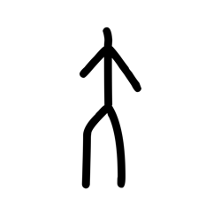

- source_zip_member: `Sub-character Images/s9y9vbblxa/s9y9vbblxa/jvy5cgqkmz.png`
- checksum_sha256: `565b744676b91bc89858d152a309c44c3e880682dfae91d3ba7375b0f36ea0ba`
- review_status: `needs_human_visual_review`
- caution: OBIMD subcharacter image is a source-marked review asset only; it is not a confirmed component form, component assignment, or decipherment conclusion.

## asset-013146

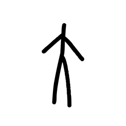

- source_zip_member: `Sub-character Images/s9y9vbblxa/s9y9vbblxa/lbmcfwtyzt.png`
- checksum_sha256: `70fdce32fe1ab2bc3d29dfced69dd25bf9ba574ccdd4565f73d6d05446f9b71d`
- review_status: `needs_human_visual_review`
- caution: OBIMD subcharacter image is a source-marked review asset only; it is not a confirmed component form, component assignment, or decipherment conclusion.

## asset-013147

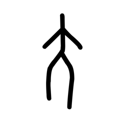

- source_zip_member: `Sub-character Images/s9y9vbblxa/s9y9vbblxa/m86wfufwm5.png`
- checksum_sha256: `5856e0c04509076c7cd817d3094d3f6f048b7c462c82102c1572bff2cb1f433d`
- review_status: `needs_human_visual_review`
- caution: OBIMD subcharacter image is a source-marked review asset only; it is not a confirmed component form, component assignment, or decipherment conclusion.

## asset-013148

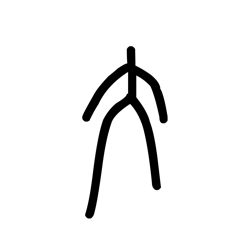

- source_zip_member: `Sub-character Images/s9y9vbblxa/s9y9vbblxa/n2v0290muu.png`
- checksum_sha256: `12dc45adfa2976a4c0194bfd4bc17dba486c0870b7b21b8b59afe7ba6bc8271a`
- review_status: `needs_human_visual_review`
- caution: OBIMD subcharacter image is a source-marked review asset only; it is not a confirmed component form, component assignment, or decipherment conclusion.

## asset-013149

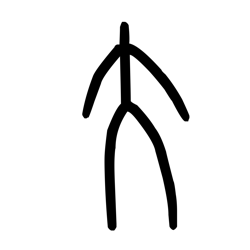

- source_zip_member: `Sub-character Images/s9y9vbblxa/s9y9vbblxa/n3meuh0hsu.png`
- checksum_sha256: `8475fec795ffc0c65a2c273a1eb10e2d4bbab78cb50b9bf00610a823b8968670`
- review_status: `needs_human_visual_review`
- caution: OBIMD subcharacter image is a source-marked review asset only; it is not a confirmed component form, component assignment, or decipherment conclusion.

## asset-013150

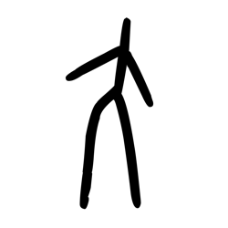

- source_zip_member: `Sub-character Images/s9y9vbblxa/s9y9vbblxa/norjd819xz.png`
- checksum_sha256: `84640cf70fb63cdd15bb02900db859fc5653dcc5806f45690f2a7cb4a2c94457`
- review_status: `needs_human_visual_review`
- caution: OBIMD subcharacter image is a source-marked review asset only; it is not a confirmed component form, component assignment, or decipherment conclusion.

## asset-013151

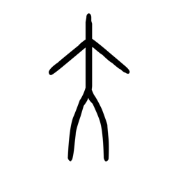

- source_zip_member: `Sub-character Images/s9y9vbblxa/s9y9vbblxa/s9y9vbblxa.png`
- checksum_sha256: `9e87a51cb04b32c028ca90bf685a8102b2e6c34a6f69b794a73508f225c22f0f`
- review_status: `needs_human_visual_review`
- caution: OBIMD subcharacter image is a source-marked review asset only; it is not a confirmed component form, component assignment, or decipherment conclusion.

## asset-013152

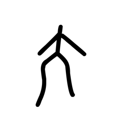

- source_zip_member: `Sub-character Images/s9y9vbblxa/s9y9vbblxa/sssev3958r.png`
- checksum_sha256: `2620e26a4db817c102d5ac537d4131fb3ad4d2e60d81e706bcf859c3f4ceb499`
- review_status: `needs_human_visual_review`
- caution: OBIMD subcharacter image is a source-marked review asset only; it is not a confirmed component form, component assignment, or decipherment conclusion.

## asset-013153

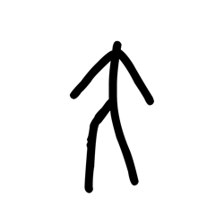

- source_zip_member: `Sub-character Images/s9y9vbblxa/s9y9vbblxa/wyetiktgvi.png`
- checksum_sha256: `b39b6633e076405b42aabeb16f23c0d525abf47a6cdae8f89a98de59e3eb396a`
- review_status: `needs_human_visual_review`
- caution: OBIMD subcharacter image is a source-marked review asset only; it is not a confirmed component form, component assignment, or decipherment conclusion.

## asset-013154

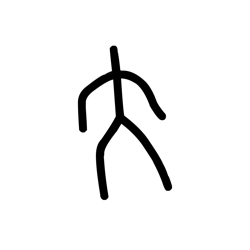

- source_zip_member: `Sub-character Images/s9y9vbblxa/s9y9vbblxa/z05z4z3je8.png`
- checksum_sha256: `7216be46e9f1f2fe5cbc006bd53c6fc96c2a36f9160b6ec9538facea1249af6b`
- review_status: `needs_human_visual_review`
- caution: OBIMD subcharacter image is a source-marked review asset only; it is not a confirmed component form, component assignment, or decipherment conclusion.
