# Component Visual Gallery / 构件图像查看: obs-comp-cand-000609

English:
This page displays OBIMD subcharacter PNG assets extracted into this concrete corpus object directory for human review.

简体中文：
本页展示抽取到当前具体 corpus 对象目录内的 OBIMD subcharacter PNG 资料，供人工复核使用。

Boundary / 边界：dataset image candidate only; not a confirmed component form, component assignment, or decipherment claim.

## asset-013157

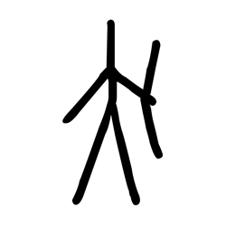

- source_zip_member: `Sub-character Images/l3wc3uouh6/l3wc3uouh6/004d909j4t.png`
- checksum_sha256: `dc19c9f6dfef2fa1e5b1ae6257042aeae8b58bd79da6f877331646e081e3accc`
- review_status: `needs_human_visual_review`
- caution: OBIMD subcharacter image is a source-marked review asset only; it is not a confirmed component form, component assignment, or decipherment conclusion.

## asset-013158

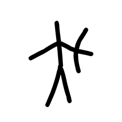

- source_zip_member: `Sub-character Images/l3wc3uouh6/l3wc3uouh6/0fwlwmvjyk.png`
- checksum_sha256: `883687f3f0afb0e45ff793289134282ecfb3ffdc221112597e7fe596fe025aaf`
- review_status: `needs_human_visual_review`
- caution: OBIMD subcharacter image is a source-marked review asset only; it is not a confirmed component form, component assignment, or decipherment conclusion.

## asset-013159

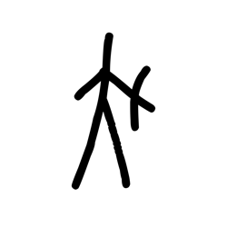

- source_zip_member: `Sub-character Images/l3wc3uouh6/l3wc3uouh6/0wsvivu1pq.png`
- checksum_sha256: `dea7f99dd38c9a1838a3f77df1c270d23736b64d0b13437d1c382b136f3dc9d4`
- review_status: `needs_human_visual_review`
- caution: OBIMD subcharacter image is a source-marked review asset only; it is not a confirmed component form, component assignment, or decipherment conclusion.

## asset-013160

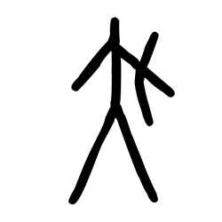

- source_zip_member: `Sub-character Images/l3wc3uouh6/l3wc3uouh6/2i1okensnc.png`
- checksum_sha256: `e975f1095d338246691a5f2d74f1876f1204f15cdcb4e15c7f55d11d75ce6bc8`
- review_status: `needs_human_visual_review`
- caution: OBIMD subcharacter image is a source-marked review asset only; it is not a confirmed component form, component assignment, or decipherment conclusion.

## asset-013161

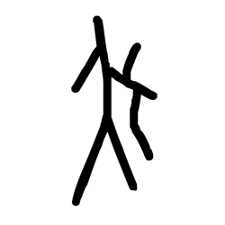

- source_zip_member: `Sub-character Images/l3wc3uouh6/l3wc3uouh6/4y6n851wi2.png`
- checksum_sha256: `9689c6cc272691b725bb79c8eabc0152a229f0a9f0c302ffe531c9be2c48ca64`
- review_status: `needs_human_visual_review`
- caution: OBIMD subcharacter image is a source-marked review asset only; it is not a confirmed component form, component assignment, or decipherment conclusion.

## asset-013162

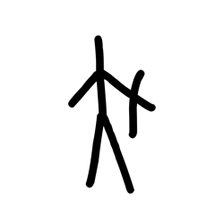

- source_zip_member: `Sub-character Images/l3wc3uouh6/l3wc3uouh6/69l2q5p4ff.png`
- checksum_sha256: `c76571bcdd88a4911a92207e7e0f22fa293f2d5e6d87fd8b565d887e3b3969a5`
- review_status: `needs_human_visual_review`
- caution: OBIMD subcharacter image is a source-marked review asset only; it is not a confirmed component form, component assignment, or decipherment conclusion.

## asset-013163

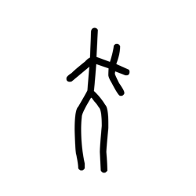

- source_zip_member: `Sub-character Images/l3wc3uouh6/l3wc3uouh6/6tag0elzvl.png`
- checksum_sha256: `a9123399ae1c929890e549b958e3c7673885a3dad861557f21acd9dbf2841db8`
- review_status: `needs_human_visual_review`
- caution: OBIMD subcharacter image is a source-marked review asset only; it is not a confirmed component form, component assignment, or decipherment conclusion.

## asset-013164

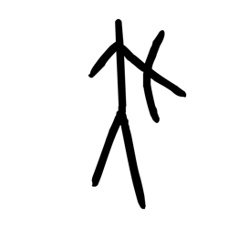

- source_zip_member: `Sub-character Images/l3wc3uouh6/l3wc3uouh6/dy9pkf7hjh.png`
- checksum_sha256: `ad6a1627ded4b12a9ef84af665f808797f6e530d557244455dd263076d508217`
- review_status: `needs_human_visual_review`
- caution: OBIMD subcharacter image is a source-marked review asset only; it is not a confirmed component form, component assignment, or decipherment conclusion.

## asset-013165

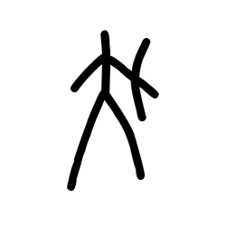

- source_zip_member: `Sub-character Images/l3wc3uouh6/l3wc3uouh6/eri63vk8ph.png`
- checksum_sha256: `4522bde649914c0e1ca7179d99363562f4e1e1d267367c8bb5a8ac4a08b81c84`
- review_status: `needs_human_visual_review`
- caution: OBIMD subcharacter image is a source-marked review asset only; it is not a confirmed component form, component assignment, or decipherment conclusion.

## asset-013166

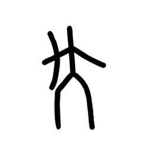

- source_zip_member: `Sub-character Images/l3wc3uouh6/l3wc3uouh6/jqb1tcv3w4.png`
- checksum_sha256: `1d19fdf80ab9131a764cc6ce426d9e1b0512915dd499266d3a28982132fd89c5`
- review_status: `needs_human_visual_review`
- caution: OBIMD subcharacter image is a source-marked review asset only; it is not a confirmed component form, component assignment, or decipherment conclusion.

## asset-013167

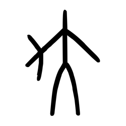

- source_zip_member: `Sub-character Images/l3wc3uouh6/l3wc3uouh6/l3wc3uouh6.png`
- checksum_sha256: `3f4e8178d0535382a8c5d9db4d02c32e6d7d1a7f9975baf24496f44cfc1ddd38`
- review_status: `needs_human_visual_review`
- caution: OBIMD subcharacter image is a source-marked review asset only; it is not a confirmed component form, component assignment, or decipherment conclusion.

## asset-013168

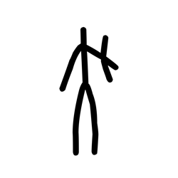

- source_zip_member: `Sub-character Images/l3wc3uouh6/l3wc3uouh6/len5mvi8ls.png`
- checksum_sha256: `286b4f4d3176617884ff216102e4182df216dbde2a42dfb68985aa4ce96b0a19`
- review_status: `needs_human_visual_review`
- caution: OBIMD subcharacter image is a source-marked review asset only; it is not a confirmed component form, component assignment, or decipherment conclusion.

## asset-013169

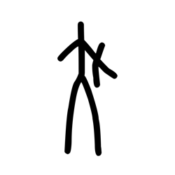

- source_zip_member: `Sub-character Images/l3wc3uouh6/l3wc3uouh6/sxudgh2qb4.png`
- checksum_sha256: `34397f9aeea388e35a795dd2175c13514e72e27da25369bfcc712956696440fd`
- review_status: `needs_human_visual_review`
- caution: OBIMD subcharacter image is a source-marked review asset only; it is not a confirmed component form, component assignment, or decipherment conclusion.

## asset-013170

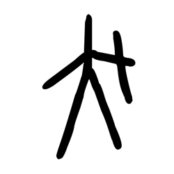

- source_zip_member: `Sub-character Images/l3wc3uouh6/l3wc3uouh6/u8x51kucrv.png`
- checksum_sha256: `a7bf9077e7d261acea59b72dd8943ea24a0c2f7e6ac93c7e304b5d8dc2bd506d`
- review_status: `needs_human_visual_review`
- caution: OBIMD subcharacter image is a source-marked review asset only; it is not a confirmed component form, component assignment, or decipherment conclusion.

## asset-013171

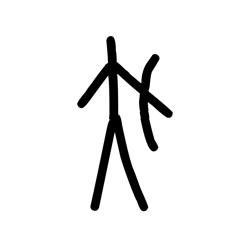

- source_zip_member: `Sub-character Images/l3wc3uouh6/l3wc3uouh6/v1jgdogm9f.png`
- checksum_sha256: `16db3684928bea39a78cfcabee60169aa09fed51c54a94c6ae8ccfc30b102048`
- review_status: `needs_human_visual_review`
- caution: OBIMD subcharacter image is a source-marked review asset only; it is not a confirmed component form, component assignment, or decipherment conclusion.

## asset-013172

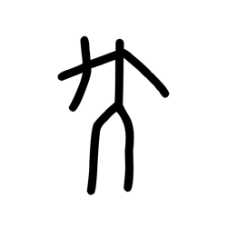

- source_zip_member: `Sub-character Images/l3wc3uouh6/l3wc3uouh6/yzfyeb8ydy.png`
- checksum_sha256: `eb73324d57d65814f41f8446b72213cd76dd1492479638d1ffd866d52b896feb`
- review_status: `needs_human_visual_review`
- caution: OBIMD subcharacter image is a source-marked review asset only; it is not a confirmed component form, component assignment, or decipherment conclusion.
