# Component Visual Gallery / 构件图像查看: obs-comp-cand-000676

English:
This page displays OBIMD subcharacter PNG assets extracted into this concrete
corpus object directory for human review.

简体中文：
本页展示抽取到当前具体 corpus 对象目录内的 OBIMD subcharacter PNG 资料，供人工复核使用。

Boundary / 边界：
dataset image candidate only; not a confirmed component form, not a component
assignment, and not a decipherment claim.
- not a confirmed component form
- not a component assignment
- not a decipherment claim

## Concrete Questions To Check / 具体待查问题

- Open 06_component-visual-index.csv and name the local image row.
- 打开 06_component-visual-index.csv，写明本地图像行。
- Open 09_component-visual-route-index.csv and name the source route row.
- 打开 09_component-visual-route-index.csv，写明来源路线行。
- Open 13_component-context-evidence-dossier.md for character context.
- 打开 13_component-context-evidence-dossier.md，核对单字与卜辞上下文。
- Record the missing image, near-shape, source, or context route.
- 记录缺失的图像、近形、来源或上下文路线。

## asset-013239

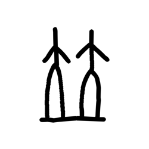

- source_zip_member: `Sub-character Images/xmfpjivigx/xmfpjivigx/4p5u3tkqec.png`
- checksum_sha256: see `06_component-visual-index.csv`.
- review_status: `needs_human_visual_review`
- caution: source-marked review image only.

## asset-013240

- source_zip_member: `Sub-character Images/xmfpjivigx/xmfpjivigx/4rrh5fqkdk.png`
- checksum_sha256: see `06_component-visual-index.csv`.
- review_status: `needs_human_visual_review`
- caution: source-marked review image only.

## asset-013241

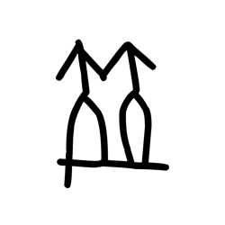

- source_zip_member: `Sub-character Images/xmfpjivigx/xmfpjivigx/78eztvyzig.png`
- checksum_sha256: see `06_component-visual-index.csv`.
- review_status: `needs_human_visual_review`
- caution: source-marked review image only.

## asset-013242

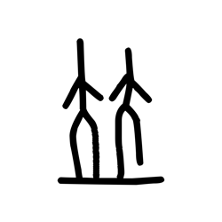

- source_zip_member: `Sub-character Images/xmfpjivigx/xmfpjivigx/7iz2xswp6d.png`
- checksum_sha256: see `06_component-visual-index.csv`.
- review_status: `needs_human_visual_review`
- caution: source-marked review image only.

## asset-013243

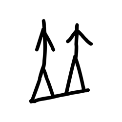

- source_zip_member: `Sub-character Images/xmfpjivigx/xmfpjivigx/7ysdpky4p4.png`
- checksum_sha256: see `06_component-visual-index.csv`.
- review_status: `needs_human_visual_review`
- caution: source-marked review image only.

## asset-013244

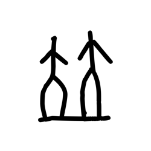

- source_zip_member: `Sub-character Images/xmfpjivigx/xmfpjivigx/8p3hbbeo3x.png`
- checksum_sha256: see `06_component-visual-index.csv`.
- review_status: `needs_human_visual_review`
- caution: source-marked review image only.

## asset-013245

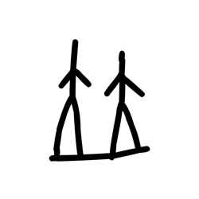

- source_zip_member: `Sub-character Images/xmfpjivigx/xmfpjivigx/ahgvvk3tci.png`
- checksum_sha256: see `06_component-visual-index.csv`.
- review_status: `needs_human_visual_review`
- caution: source-marked review image only.

## asset-013246

- source_zip_member: `Sub-character Images/xmfpjivigx/xmfpjivigx/cw1j88yhy7.png`
- checksum_sha256: see `06_component-visual-index.csv`.
- review_status: `needs_human_visual_review`
- caution: source-marked review image only.

## asset-013247

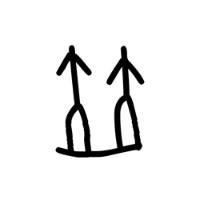

- source_zip_member: `Sub-character Images/xmfpjivigx/xmfpjivigx/guf6oqv6x6.png`
- checksum_sha256: see `06_component-visual-index.csv`.
- review_status: `needs_human_visual_review`
- caution: source-marked review image only.

## asset-013248

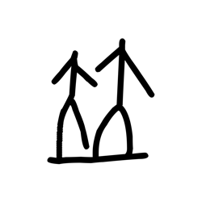

- source_zip_member: `Sub-character Images/xmfpjivigx/xmfpjivigx/i3nj3ssee9.png`
- checksum_sha256: see `06_component-visual-index.csv`.
- review_status: `needs_human_visual_review`
- caution: source-marked review image only.

## asset-013249

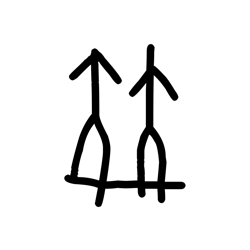

- source_zip_member: `Sub-character Images/xmfpjivigx/xmfpjivigx/kxsd54vhd8.png`
- checksum_sha256: see `06_component-visual-index.csv`.
- review_status: `needs_human_visual_review`
- caution: source-marked review image only.

## asset-013250

- source_zip_member: `Sub-character Images/xmfpjivigx/xmfpjivigx/lp4urr8rmx.png`
- checksum_sha256: see `06_component-visual-index.csv`.
- review_status: `needs_human_visual_review`
- caution: source-marked review image only.

## asset-013251

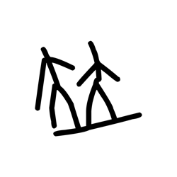

- source_zip_member: `Sub-character Images/xmfpjivigx/xmfpjivigx/mfdd2axst5.png`
- checksum_sha256: see `06_component-visual-index.csv`.
- review_status: `needs_human_visual_review`
- caution: source-marked review image only.

## asset-013252

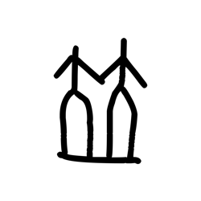

- source_zip_member: `Sub-character Images/xmfpjivigx/xmfpjivigx/mxdz59wnx4.png`
- checksum_sha256: see `06_component-visual-index.csv`.
- review_status: `needs_human_visual_review`
- caution: source-marked review image only.

## asset-013253

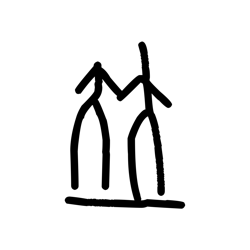

- source_zip_member: `Sub-character Images/xmfpjivigx/xmfpjivigx/o13k0jqyvx.png`
- checksum_sha256: see `06_component-visual-index.csv`.
- review_status: `needs_human_visual_review`
- caution: source-marked review image only.

## asset-013254

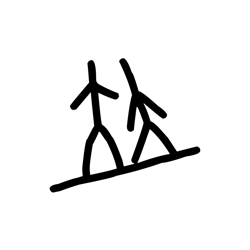

- source_zip_member: `Sub-character Images/xmfpjivigx/xmfpjivigx/o1y6zk5enq.png`
- checksum_sha256: see `06_component-visual-index.csv`.
- review_status: `needs_human_visual_review`
- caution: source-marked review image only.

## asset-013255

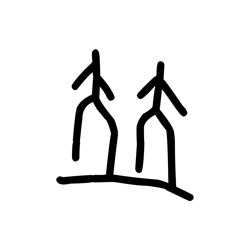

- source_zip_member: `Sub-character Images/xmfpjivigx/xmfpjivigx/ofjl9xzfrh.png`
- checksum_sha256: see `06_component-visual-index.csv`.
- review_status: `needs_human_visual_review`
- caution: source-marked review image only.

## asset-013256

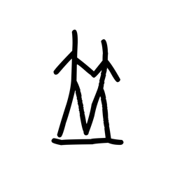

- source_zip_member: `Sub-character Images/xmfpjivigx/xmfpjivigx/oolhbj3nt4.png`
- checksum_sha256: see `06_component-visual-index.csv`.
- review_status: `needs_human_visual_review`
- caution: source-marked review image only.

## asset-013257

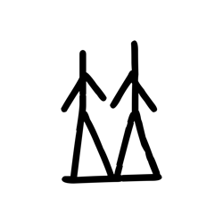

- source_zip_member: `Sub-character Images/xmfpjivigx/xmfpjivigx/oyodijtmgl.png`
- checksum_sha256: see `06_component-visual-index.csv`.
- review_status: `needs_human_visual_review`
- caution: source-marked review image only.

## asset-013258

- source_zip_member: `Sub-character Images/xmfpjivigx/xmfpjivigx/pi1tzl48yb.png`
- checksum_sha256: see `06_component-visual-index.csv`.
- review_status: `needs_human_visual_review`
- caution: source-marked review image only.

## asset-013259

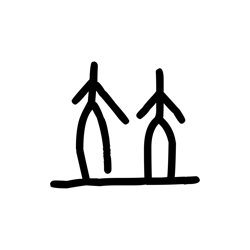

- source_zip_member: `Sub-character Images/xmfpjivigx/xmfpjivigx/ppkxybalen.png`
- checksum_sha256: see `06_component-visual-index.csv`.
- review_status: `needs_human_visual_review`
- caution: source-marked review image only.

## asset-013260

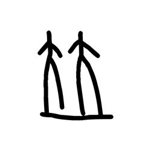

- source_zip_member: `Sub-character Images/xmfpjivigx/xmfpjivigx/qsbscvvqj6.png`
- checksum_sha256: see `06_component-visual-index.csv`.
- review_status: `needs_human_visual_review`
- caution: source-marked review image only.

## asset-013261

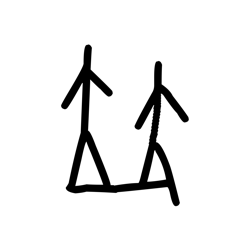

- source_zip_member: `Sub-character Images/xmfpjivigx/xmfpjivigx/r29xsp6tqp.png`
- checksum_sha256: see `06_component-visual-index.csv`.
- review_status: `needs_human_visual_review`
- caution: source-marked review image only.

## asset-013262

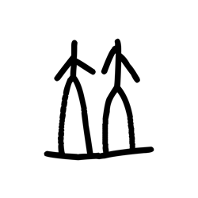

- source_zip_member: `Sub-character Images/xmfpjivigx/xmfpjivigx/r7pq8w2xmt.png`
- checksum_sha256: see `06_component-visual-index.csv`.
- review_status: `needs_human_visual_review`
- caution: source-marked review image only.

## asset-013263

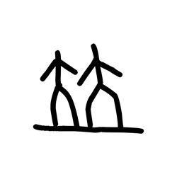

- source_zip_member: `Sub-character Images/xmfpjivigx/xmfpjivigx/sf7lmy6xtz.png`
- checksum_sha256: see `06_component-visual-index.csv`.
- review_status: `needs_human_visual_review`
- caution: source-marked review image only.

## asset-013264

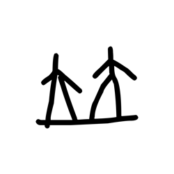

- source_zip_member: `Sub-character Images/xmfpjivigx/xmfpjivigx/spl73s3u4w.png`
- checksum_sha256: see `06_component-visual-index.csv`.
- review_status: `needs_human_visual_review`
- caution: source-marked review image only.

## asset-013265

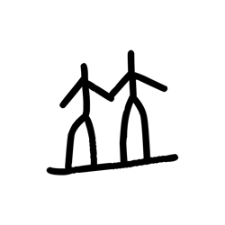

- source_zip_member: `Sub-character Images/xmfpjivigx/xmfpjivigx/t92rbgxfvc.png`
- checksum_sha256: see `06_component-visual-index.csv`.
- review_status: `needs_human_visual_review`
- caution: source-marked review image only.

## asset-013266

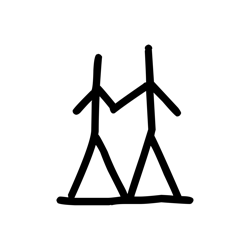

- source_zip_member: `Sub-character Images/xmfpjivigx/xmfpjivigx/tn1ytswbar.png`
- checksum_sha256: see `06_component-visual-index.csv`.
- review_status: `needs_human_visual_review`
- caution: source-marked review image only.

## asset-013267

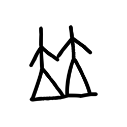

- source_zip_member: `Sub-character Images/xmfpjivigx/xmfpjivigx/u7ollhcxth.png`
- checksum_sha256: see `06_component-visual-index.csv`.
- review_status: `needs_human_visual_review`
- caution: source-marked review image only.

## asset-013268

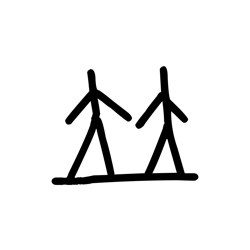

- source_zip_member: `Sub-character Images/xmfpjivigx/xmfpjivigx/urbpcvtbsd.png`
- checksum_sha256: see `06_component-visual-index.csv`.
- review_status: `needs_human_visual_review`
- caution: source-marked review image only.

## asset-013269

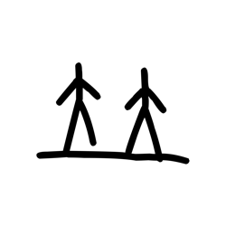

- source_zip_member: `Sub-character Images/xmfpjivigx/xmfpjivigx/v9uewo80k6.png`
- checksum_sha256: see `06_component-visual-index.csv`.
- review_status: `needs_human_visual_review`
- caution: source-marked review image only.

## asset-013270

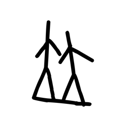

- source_zip_member: `Sub-character Images/xmfpjivigx/xmfpjivigx/vdktqt7col.png`
- checksum_sha256: see `06_component-visual-index.csv`.
- review_status: `needs_human_visual_review`
- caution: source-marked review image only.

## asset-013271

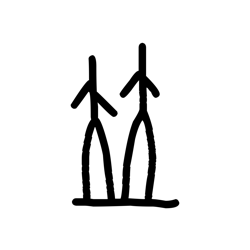

- source_zip_member: `Sub-character Images/xmfpjivigx/xmfpjivigx/vtm43b26tu.png`
- checksum_sha256: see `06_component-visual-index.csv`.
- review_status: `needs_human_visual_review`
- caution: source-marked review image only.

## asset-013272

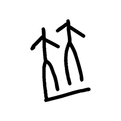

- source_zip_member: `Sub-character Images/xmfpjivigx/xmfpjivigx/wy6du70gza.png`
- checksum_sha256: see `06_component-visual-index.csv`.
- review_status: `needs_human_visual_review`
- caution: source-marked review image only.

## asset-013273

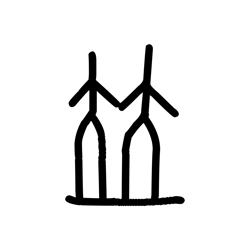

- source_zip_member: `Sub-character Images/xmfpjivigx/xmfpjivigx/xipc3gz58l.png`
- checksum_sha256: see `06_component-visual-index.csv`.
- review_status: `needs_human_visual_review`
- caution: source-marked review image only.

## asset-013274

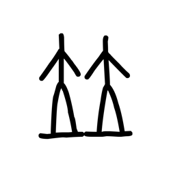

- source_zip_member: `Sub-character Images/xmfpjivigx/xmfpjivigx/xmfpjivigx.png`
- checksum_sha256: see `06_component-visual-index.csv`.
- review_status: `needs_human_visual_review`
- caution: source-marked review image only.

## asset-013275

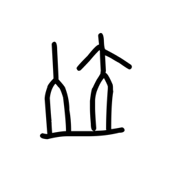

- source_zip_member: `Sub-character Images/xmfpjivigx/xmfpjivigx/zmgz7g6c8j.png`
- checksum_sha256: see `06_component-visual-index.csv`.
- review_status: `needs_human_visual_review`
- caution: source-marked review image only.
