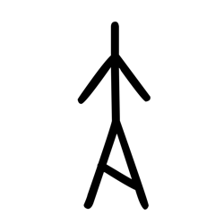

# Component Visual Gallery / 构件图像查看: obs-comp-cand-000681

English:
This page displays OBIMD subcharacter PNG assets extracted into this concrete corpus object directory for human review.

简体中文：
本页展示抽取到当前具体 corpus 对象目录内的 OBIMD subcharacter PNG 资料，供人工复核使用。

Boundary / 边界：dataset image candidate only; not a confirmed component form, component assignment, or decipherment claim.

## asset-013280

- source_zip_member: `Sub-character Images/uzw48xncgx/uzw48xncgx/uzw48xncgx.png`
- checksum_sha256: `e208d9df616f8837b60e37bfc5da3f431d8cc6c2b508fa8bd97c7bdbdec09421`
- review_status: `needs_human_visual_review`
- caution: OBIMD subcharacter image is a source-marked review asset only; it is not a confirmed component form, component assignment, or decipherment conclusion.
