# Component Visual Gallery / 构件图像查看: obs-comp-cand-000702

English:
This page displays OBIMD subcharacter PNG assets extracted into this concrete
corpus object directory for human review.

简体中文：
本页展示抽取到当前具体 corpus 对象目录内的 OBIMD subcharacter PNG 资料，供人工复核使用。

Boundary / 边界：
dataset image candidate only; not a confirmed component form, not a component
assignment, and not a decipherment claim.
- not a confirmed component form
- not a component assignment
- not a decipherment claim

## Concrete Questions To Check / 具体待查问题

- Open 06_component-visual-index.csv and name the local image row.
- 打开 06_component-visual-index.csv，写明本地图像行。
- Open 09_component-visual-route-index.csv and name the source route row.
- 打开 09_component-visual-route-index.csv，写明来源路线行。
- Open 13_component-context-evidence-dossier.md for character context.
- 打开 13_component-context-evidence-dossier.md，核对单字与卜辞上下文。
- Record the missing image, near-shape, source, or context route.
- 记录缺失的图像、近形、来源或上下文路线。

## asset-013301

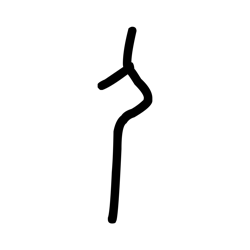

- source_zip_member: `Sub-character Images/p6uj3n0aze/p6uj3n0aze/2j1ndxubsk.png`
- checksum_sha256: see `06_component-visual-index.csv`.
- review_status: `needs_human_visual_review`
- caution: source-marked review image only.

## asset-013302

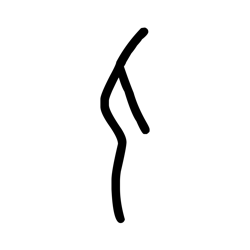

- source_zip_member: `Sub-character Images/p6uj3n0aze/p6uj3n0aze/3ngvu9qyrs.png`
- checksum_sha256: see `06_component-visual-index.csv`.
- review_status: `needs_human_visual_review`
- caution: source-marked review image only.

## asset-013303

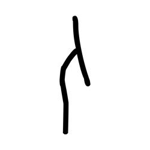

- source_zip_member: `Sub-character Images/p6uj3n0aze/p6uj3n0aze/3tbqievctq.png`
- checksum_sha256: see `06_component-visual-index.csv`.
- review_status: `needs_human_visual_review`
- caution: source-marked review image only.

## asset-013304

- source_zip_member: `Sub-character Images/p6uj3n0aze/p6uj3n0aze/4yyxv8amsu.png`
- checksum_sha256: see `06_component-visual-index.csv`.
- review_status: `needs_human_visual_review`
- caution: source-marked review image only.

## asset-013305

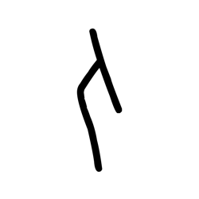

- source_zip_member: `Sub-character Images/p6uj3n0aze/p6uj3n0aze/5dc71lgsif.png`
- checksum_sha256: see `06_component-visual-index.csv`.
- review_status: `needs_human_visual_review`
- caution: source-marked review image only.

## asset-013306

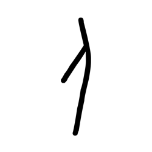

- source_zip_member: `Sub-character Images/p6uj3n0aze/p6uj3n0aze/67vazv22z9.png`
- checksum_sha256: see `06_component-visual-index.csv`.
- review_status: `needs_human_visual_review`
- caution: source-marked review image only.

## asset-013307

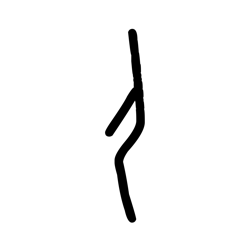

- source_zip_member: `Sub-character Images/p6uj3n0aze/p6uj3n0aze/788hwd2d0l.png`
- checksum_sha256: see `06_component-visual-index.csv`.
- review_status: `needs_human_visual_review`
- caution: source-marked review image only.

## asset-013308

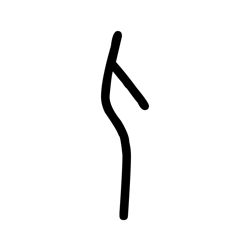

- source_zip_member: `Sub-character Images/p6uj3n0aze/p6uj3n0aze/9ndefsgr2g.png`
- checksum_sha256: see `06_component-visual-index.csv`.
- review_status: `needs_human_visual_review`
- caution: source-marked review image only.

## asset-013309

- source_zip_member: `Sub-character Images/p6uj3n0aze/p6uj3n0aze/bbspvio4qr.png`
- checksum_sha256: see `06_component-visual-index.csv`.
- review_status: `needs_human_visual_review`
- caution: source-marked review image only.

## asset-013310

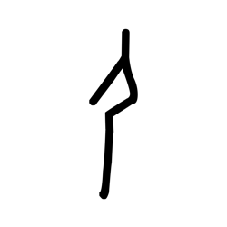

- source_zip_member: `Sub-character Images/p6uj3n0aze/p6uj3n0aze/bvvgfeih3h.png`
- checksum_sha256: see `06_component-visual-index.csv`.
- review_status: `needs_human_visual_review`
- caution: source-marked review image only.

## asset-013311

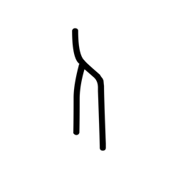

- source_zip_member: `Sub-character Images/p6uj3n0aze/p6uj3n0aze/cf18so4abe.png`
- checksum_sha256: see `06_component-visual-index.csv`.
- review_status: `needs_human_visual_review`
- caution: source-marked review image only.

## asset-013312

- source_zip_member: `Sub-character Images/p6uj3n0aze/p6uj3n0aze/cz73h5h0i1.png`
- checksum_sha256: see `06_component-visual-index.csv`.
- review_status: `needs_human_visual_review`
- caution: source-marked review image only.

## asset-013313

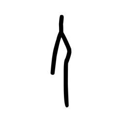

- source_zip_member: `Sub-character Images/p6uj3n0aze/p6uj3n0aze/eizrt1cnid.png`
- checksum_sha256: see `06_component-visual-index.csv`.
- review_status: `needs_human_visual_review`
- caution: source-marked review image only.

## asset-013314

- source_zip_member: `Sub-character Images/p6uj3n0aze/p6uj3n0aze/f4mnhe55tq.png`
- checksum_sha256: see `06_component-visual-index.csv`.
- review_status: `needs_human_visual_review`
- caution: source-marked review image only.

## asset-013315

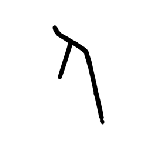

- source_zip_member: `Sub-character Images/p6uj3n0aze/p6uj3n0aze/fvainangnb.png`
- checksum_sha256: see `06_component-visual-index.csv`.
- review_status: `needs_human_visual_review`
- caution: source-marked review image only.

## asset-013316

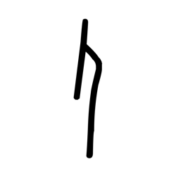

- source_zip_member: `Sub-character Images/p6uj3n0aze/p6uj3n0aze/gyvykk5vs8.png`
- checksum_sha256: see `06_component-visual-index.csv`.
- review_status: `needs_human_visual_review`
- caution: source-marked review image only.

## asset-013317

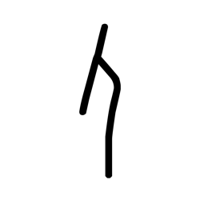

- source_zip_member: `Sub-character Images/p6uj3n0aze/p6uj3n0aze/h1ckoeh9mi.png`
- checksum_sha256: see `06_component-visual-index.csv`.
- review_status: `needs_human_visual_review`
- caution: source-marked review image only.

## asset-013318

- source_zip_member: `Sub-character Images/p6uj3n0aze/p6uj3n0aze/h9wvalej2t.png`
- checksum_sha256: see `06_component-visual-index.csv`.
- review_status: `needs_human_visual_review`
- caution: source-marked review image only.

## asset-013319

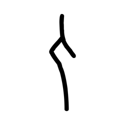

- source_zip_member: `Sub-character Images/p6uj3n0aze/p6uj3n0aze/hcz4ermjgi.png`
- checksum_sha256: see `06_component-visual-index.csv`.
- review_status: `needs_human_visual_review`
- caution: source-marked review image only.

## asset-013320

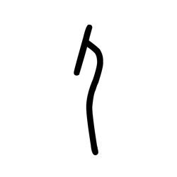

- source_zip_member: `Sub-character Images/p6uj3n0aze/p6uj3n0aze/j3ni2yrwm1.png`
- checksum_sha256: see `06_component-visual-index.csv`.
- review_status: `needs_human_visual_review`
- caution: source-marked review image only.

## asset-013321

- source_zip_member: `Sub-character Images/p6uj3n0aze/p6uj3n0aze/kc2o8a0hn1.png`
- checksum_sha256: see `06_component-visual-index.csv`.
- review_status: `needs_human_visual_review`
- caution: source-marked review image only.

## asset-013322

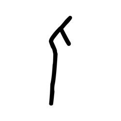

- source_zip_member: `Sub-character Images/p6uj3n0aze/p6uj3n0aze/lc9yvznk23.png`
- checksum_sha256: see `06_component-visual-index.csv`.
- review_status: `needs_human_visual_review`
- caution: source-marked review image only.

## asset-013323

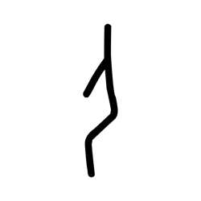

- source_zip_member: `Sub-character Images/p6uj3n0aze/p6uj3n0aze/ljyhjk23aw.png`
- checksum_sha256: see `06_component-visual-index.csv`.
- review_status: `needs_human_visual_review`
- caution: source-marked review image only.

## asset-013324

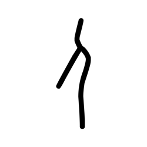

- source_zip_member: `Sub-character Images/p6uj3n0aze/p6uj3n0aze/lxbikc9omf.png`
- checksum_sha256: see `06_component-visual-index.csv`.
- review_status: `needs_human_visual_review`
- caution: source-marked review image only.

## asset-013325

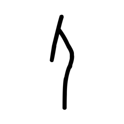

- source_zip_member: `Sub-character Images/p6uj3n0aze/p6uj3n0aze/m8204zn9gq.png`
- checksum_sha256: see `06_component-visual-index.csv`.
- review_status: `needs_human_visual_review`
- caution: source-marked review image only.

## asset-013326

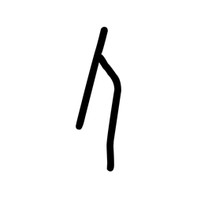

- source_zip_member: `Sub-character Images/p6uj3n0aze/p6uj3n0aze/oirnb6m8ki.png`
- checksum_sha256: see `06_component-visual-index.csv`.
- review_status: `needs_human_visual_review`
- caution: source-marked review image only.

## asset-013327

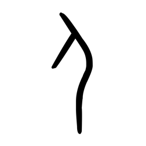

- source_zip_member: `Sub-character Images/p6uj3n0aze/p6uj3n0aze/p6uj3n0aze.png`
- checksum_sha256: see `06_component-visual-index.csv`.
- review_status: `needs_human_visual_review`
- caution: source-marked review image only.

## asset-013328

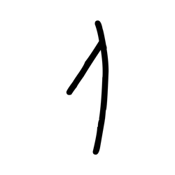

- source_zip_member: `Sub-character Images/p6uj3n0aze/p6uj3n0aze/pgphhn5l9g.png`
- checksum_sha256: see `06_component-visual-index.csv`.
- review_status: `needs_human_visual_review`
- caution: source-marked review image only.

## asset-013329

- source_zip_member: `Sub-character Images/p6uj3n0aze/p6uj3n0aze/pnhu7t9o4n.png`
- checksum_sha256: see `06_component-visual-index.csv`.
- review_status: `needs_human_visual_review`
- caution: source-marked review image only.

## asset-013330

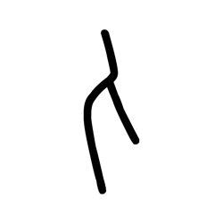

- source_zip_member: `Sub-character Images/p6uj3n0aze/p6uj3n0aze/ptr1ybsy1k.png`
- checksum_sha256: see `06_component-visual-index.csv`.
- review_status: `needs_human_visual_review`
- caution: source-marked review image only.

## asset-013331

- source_zip_member: `Sub-character Images/p6uj3n0aze/p6uj3n0aze/qd3688olbl.png`
- checksum_sha256: see `06_component-visual-index.csv`.
- review_status: `needs_human_visual_review`
- caution: source-marked review image only.

## asset-013332

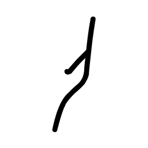

- source_zip_member: `Sub-character Images/p6uj3n0aze/p6uj3n0aze/qnn9fjt6nm.png`
- checksum_sha256: see `06_component-visual-index.csv`.
- review_status: `needs_human_visual_review`
- caution: source-marked review image only.

## asset-013333

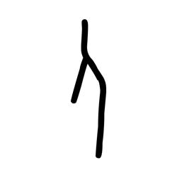

- source_zip_member: `Sub-character Images/p6uj3n0aze/p6uj3n0aze/rn5nzuhgro.png`
- checksum_sha256: see `06_component-visual-index.csv`.
- review_status: `needs_human_visual_review`
- caution: source-marked review image only.

## asset-013334

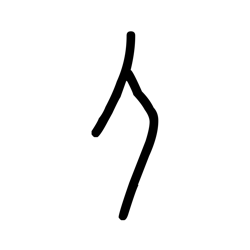

- source_zip_member: `Sub-character Images/p6uj3n0aze/p6uj3n0aze/rt6g5zvzwk.png`
- checksum_sha256: see `06_component-visual-index.csv`.
- review_status: `needs_human_visual_review`
- caution: source-marked review image only.

## asset-013335

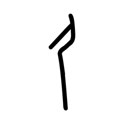

- source_zip_member: `Sub-character Images/p6uj3n0aze/p6uj3n0aze/se79o8i0qj.png`
- checksum_sha256: see `06_component-visual-index.csv`.
- review_status: `needs_human_visual_review`
- caution: source-marked review image only.

## asset-013336

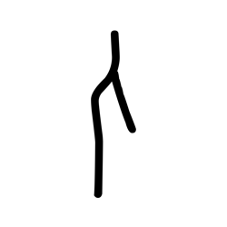

- source_zip_member: `Sub-character Images/p6uj3n0aze/p6uj3n0aze/tbeag94ysx.png`
- checksum_sha256: see `06_component-visual-index.csv`.
- review_status: `needs_human_visual_review`
- caution: source-marked review image only.

## asset-013337

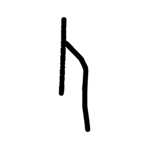

- source_zip_member: `Sub-character Images/p6uj3n0aze/p6uj3n0aze/ugxlo2j3ui.png`
- checksum_sha256: see `06_component-visual-index.csv`.
- review_status: `needs_human_visual_review`
- caution: source-marked review image only.

## asset-013338

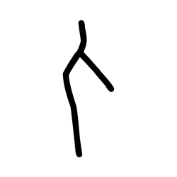

- source_zip_member: `Sub-character Images/p6uj3n0aze/p6uj3n0aze/x8etxln1mx.png`
- checksum_sha256: see `06_component-visual-index.csv`.
- review_status: `needs_human_visual_review`
- caution: source-marked review image only.

## asset-013339

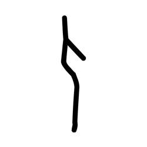

- source_zip_member: `Sub-character Images/p6uj3n0aze/p6uj3n0aze/y92h6u25vo.png`
- checksum_sha256: see `06_component-visual-index.csv`.
- review_status: `needs_human_visual_review`
- caution: source-marked review image only.

## asset-013340

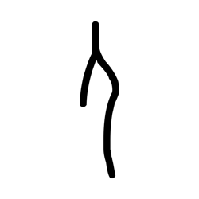

- source_zip_member: `Sub-character Images/p6uj3n0aze/p6uj3n0aze/z7fay73x7k.png`
- checksum_sha256: see `06_component-visual-index.csv`.
- review_status: `needs_human_visual_review`
- caution: source-marked review image only.

## asset-013341

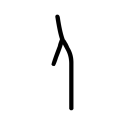

- source_zip_member: `Sub-character Images/p6uj3n0aze/p6uj3n0aze/zm7mgfkerb.png`
- checksum_sha256: see `06_component-visual-index.csv`.
- review_status: `needs_human_visual_review`
- caution: source-marked review image only.

## asset-013342

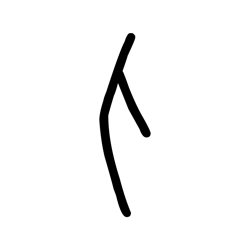

- source_zip_member: `Sub-character Images/p6uj3n0aze/p6uj3n0aze/zvziqd555s.png`
- checksum_sha256: see `06_component-visual-index.csv`.
- review_status: `needs_human_visual_review`
- caution: source-marked review image only.
