# Component Visual Gallery / 构件图像查看: obs-comp-cand-000704

English:
This page displays OBIMD subcharacter PNG assets extracted into this concrete
corpus object directory for human review.

简体中文：
本页展示抽取到当前具体 corpus 对象目录内的 OBIMD subcharacter PNG 资料，供人工复核使用。

Boundary / 边界：
dataset image candidate only; not a confirmed component form, not a component
assignment, and not a decipherment claim.
- not a confirmed component form
- not a component assignment
- not a decipherment claim

## Concrete Questions To Check / 具体待查问题

- Which local image should be opened first?
- 应先打开哪一张本地构件图像？
- Which source zip member anchors this image?
- 哪一个 source zip member 能定位这张图像？
- Which near-shape or variant comparison is still missing?
- 还缺哪些近形或异体比较？
- Which character or inscription context should be checked next?
- 下一步应核对哪些单字或卜辞上下文？
- What evidence is missing before a component assignment?
- 正式构件归属前还缺哪些证据？

## asset-013344

- source_zip_member: `Sub-character Images/i3lktxnh52/tz8yg6ysxa/1rz4vfy6ew.png`
- checksum_sha256: see `06_component-visual-index.csv`.
- review_status: `needs_human_visual_review`
- caution: source-marked review image only.

## asset-013345

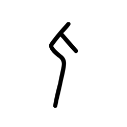

- source_zip_member: `Sub-character Images/i3lktxnh52/tz8yg6ysxa/31p0w6fo4w.png`
- checksum_sha256: see `06_component-visual-index.csv`.
- review_status: `needs_human_visual_review`
- caution: source-marked review image only.

## asset-013346

- source_zip_member: `Sub-character Images/i3lktxnh52/tz8yg6ysxa/4y8fd0u4iw.png`
- checksum_sha256: see `06_component-visual-index.csv`.
- review_status: `needs_human_visual_review`
- caution: source-marked review image only.

## asset-013347

- source_zip_member: `Sub-character Images/i3lktxnh52/tz8yg6ysxa/7jqt69h0cd.png`
- checksum_sha256: see `06_component-visual-index.csv`.
- review_status: `needs_human_visual_review`
- caution: source-marked review image only.

## asset-013348

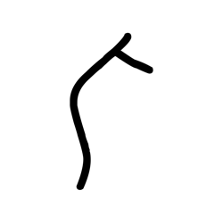

- source_zip_member: `Sub-character Images/i3lktxnh52/tz8yg6ysxa/99w6qrw2jb.png`
- checksum_sha256: see `06_component-visual-index.csv`.
- review_status: `needs_human_visual_review`
- caution: source-marked review image only.

## asset-013349

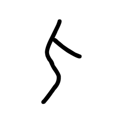

- source_zip_member: `Sub-character Images/i3lktxnh52/tz8yg6ysxa/axx2x18t8v.png`
- checksum_sha256: see `06_component-visual-index.csv`.
- review_status: `needs_human_visual_review`
- caution: source-marked review image only.

## asset-013350

- source_zip_member: `Sub-character Images/i3lktxnh52/tz8yg6ysxa/bngsw40iqf.png`
- checksum_sha256: see `06_component-visual-index.csv`.
- review_status: `needs_human_visual_review`
- caution: source-marked review image only.

## asset-013351

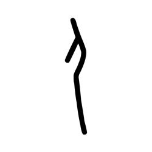

- source_zip_member: `Sub-character Images/i3lktxnh52/tz8yg6ysxa/cwf1ic7d4w.png`
- checksum_sha256: see `06_component-visual-index.csv`.
- review_status: `needs_human_visual_review`
- caution: source-marked review image only.

## asset-013352

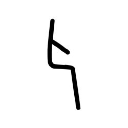

- source_zip_member: `Sub-character Images/i3lktxnh52/tz8yg6ysxa/d0zws2wmas.png`
- checksum_sha256: see `06_component-visual-index.csv`.
- review_status: `needs_human_visual_review`
- caution: source-marked review image only.

## asset-013353

- source_zip_member: `Sub-character Images/i3lktxnh52/tz8yg6ysxa/d7u1ho8j7t.png`
- checksum_sha256: see `06_component-visual-index.csv`.
- review_status: `needs_human_visual_review`
- caution: source-marked review image only.

## asset-013354

- source_zip_member: `Sub-character Images/i3lktxnh52/tz8yg6ysxa/f6deim3sd0.png`
- checksum_sha256: see `06_component-visual-index.csv`.
- review_status: `needs_human_visual_review`
- caution: source-marked review image only.

## asset-013355

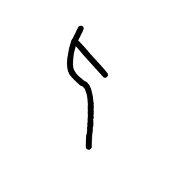

- source_zip_member: `Sub-character Images/i3lktxnh52/tz8yg6ysxa/ftcd25iuk3.png`
- checksum_sha256: see `06_component-visual-index.csv`.
- review_status: `needs_human_visual_review`
- caution: source-marked review image only.

## asset-013356

- source_zip_member: `Sub-character Images/i3lktxnh52/tz8yg6ysxa/g29jfzn6pa.png`
- checksum_sha256: see `06_component-visual-index.csv`.
- review_status: `needs_human_visual_review`
- caution: source-marked review image only.

## asset-013357

- source_zip_member: `Sub-character Images/i3lktxnh52/tz8yg6ysxa/gm3f3o1anl.png`
- checksum_sha256: see `06_component-visual-index.csv`.
- review_status: `needs_human_visual_review`
- caution: source-marked review image only.

## asset-013358

- source_zip_member: `Sub-character Images/i3lktxnh52/tz8yg6ysxa/hx6sm17snu.png`
- checksum_sha256: see `06_component-visual-index.csv`.
- review_status: `needs_human_visual_review`
- caution: source-marked review image only.

## asset-013359

- source_zip_member: `Sub-character Images/i3lktxnh52/tz8yg6ysxa/jbm5biky7k.png`
- checksum_sha256: see `06_component-visual-index.csv`.
- review_status: `needs_human_visual_review`
- caution: source-marked review image only.

## asset-013360

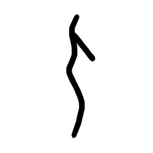

- source_zip_member: `Sub-character Images/i3lktxnh52/tz8yg6ysxa/kenrfui1yw.png`
- checksum_sha256: see `06_component-visual-index.csv`.
- review_status: `needs_human_visual_review`
- caution: source-marked review image only.

## asset-013361

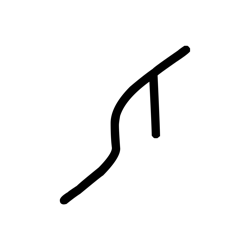

- source_zip_member: `Sub-character Images/i3lktxnh52/tz8yg6ysxa/moq3pfeish.png`
- checksum_sha256: see `06_component-visual-index.csv`.
- review_status: `needs_human_visual_review`
- caution: source-marked review image only.

## asset-013362

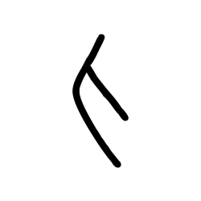

- source_zip_member: `Sub-character Images/i3lktxnh52/tz8yg6ysxa/nj75rwk21i.png`
- checksum_sha256: see `06_component-visual-index.csv`.
- review_status: `needs_human_visual_review`
- caution: source-marked review image only.

## asset-013363

- source_zip_member: `Sub-character Images/i3lktxnh52/tz8yg6ysxa/ojkkeibnf7.png`
- checksum_sha256: see `06_component-visual-index.csv`.
- review_status: `needs_human_visual_review`
- caution: source-marked review image only.

## asset-013364

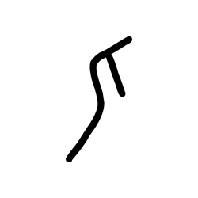

- source_zip_member: `Sub-character Images/i3lktxnh52/tz8yg6ysxa/pegteva8ud.png`
- checksum_sha256: see `06_component-visual-index.csv`.
- review_status: `needs_human_visual_review`
- caution: source-marked review image only.

## asset-013365

- source_zip_member: `Sub-character Images/i3lktxnh52/tz8yg6ysxa/q1uix2zfhp.png`
- checksum_sha256: see `06_component-visual-index.csv`.
- review_status: `needs_human_visual_review`
- caution: source-marked review image only.

## asset-013366

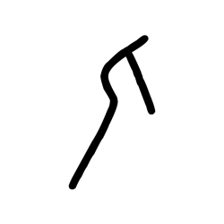

- source_zip_member: `Sub-character Images/i3lktxnh52/tz8yg6ysxa/q2ef4j0jcj.png`
- checksum_sha256: see `06_component-visual-index.csv`.
- review_status: `needs_human_visual_review`
- caution: source-marked review image only.

## asset-013367

- source_zip_member: `Sub-character Images/i3lktxnh52/tz8yg6ysxa/qe9vur5hoh.png`
- checksum_sha256: see `06_component-visual-index.csv`.
- review_status: `needs_human_visual_review`
- caution: source-marked review image only.

## asset-013368

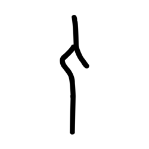

- source_zip_member: `Sub-character Images/i3lktxnh52/tz8yg6ysxa/qjz00l2fjc.png`
- checksum_sha256: see `06_component-visual-index.csv`.
- review_status: `needs_human_visual_review`
- caution: source-marked review image only.

## asset-013369

- source_zip_member: `Sub-character Images/i3lktxnh52/tz8yg6ysxa/qkorbt4wne.png`
- checksum_sha256: see `06_component-visual-index.csv`.
- review_status: `needs_human_visual_review`
- caution: source-marked review image only.

## asset-013370

- source_zip_member: `Sub-character Images/i3lktxnh52/tz8yg6ysxa/tz8yg6ysxa.png`
- checksum_sha256: see `06_component-visual-index.csv`.
- review_status: `needs_human_visual_review`
- caution: source-marked review image only.

## asset-013371

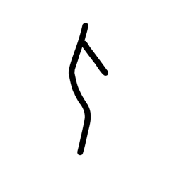

- source_zip_member: `Sub-character Images/i3lktxnh52/tz8yg6ysxa/vb6j8onz44.png`
- checksum_sha256: see `06_component-visual-index.csv`.
- review_status: `needs_human_visual_review`
- caution: source-marked review image only.

## asset-013372

- source_zip_member: `Sub-character Images/i3lktxnh52/tz8yg6ysxa/wf3i11juce.png`
- checksum_sha256: see `06_component-visual-index.csv`.
- review_status: `needs_human_visual_review`
- caution: source-marked review image only.

## asset-013373

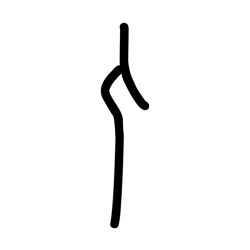

- source_zip_member: `Sub-character Images/i3lktxnh52/tz8yg6ysxa/wg4m9y66bs.png`
- checksum_sha256: see `06_component-visual-index.csv`.
- review_status: `needs_human_visual_review`
- caution: source-marked review image only.

## asset-013374

- source_zip_member: `Sub-character Images/i3lktxnh52/tz8yg6ysxa/x63w5ipa7k.png`
- checksum_sha256: see `06_component-visual-index.csv`.
- review_status: `needs_human_visual_review`
- caution: source-marked review image only.

## asset-013375

- source_zip_member: `Sub-character Images/i3lktxnh52/tz8yg6ysxa/xshvflyjgc.png`
- checksum_sha256: see `06_component-visual-index.csv`.
- review_status: `needs_human_visual_review`
- caution: source-marked review image only.

## asset-013376

- source_zip_member: `Sub-character Images/i3lktxnh52/tz8yg6ysxa/yb3i2g4q6j.png`
- checksum_sha256: see `06_component-visual-index.csv`.
- review_status: `needs_human_visual_review`
- caution: source-marked review image only.

## asset-013377

- source_zip_member: `Sub-character Images/i3lktxnh52/tz8yg6ysxa/yruzjmcd2b.png`
- checksum_sha256: see `06_component-visual-index.csv`.
- review_status: `needs_human_visual_review`
- caution: source-marked review image only.

## asset-013378

- source_zip_member: `Sub-character Images/i3lktxnh52/tz8yg6ysxa/yx0tvmtdfu.png`
- checksum_sha256: see `06_component-visual-index.csv`.
- review_status: `needs_human_visual_review`
- caution: source-marked review image only.

## asset-013379

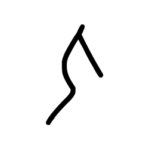

- source_zip_member: `Sub-character Images/i3lktxnh52/tz8yg6ysxa/z4bfmhka4k.png`
- checksum_sha256: see `06_component-visual-index.csv`.
- review_status: `needs_human_visual_review`
- caution: source-marked review image only.

## asset-013380

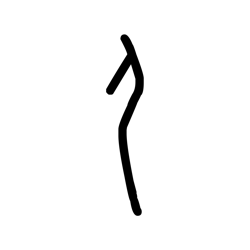

- source_zip_member: `Sub-character Images/i3lktxnh52/tz8yg6ysxa/zh04pc25mi.png`
- checksum_sha256: see `06_component-visual-index.csv`.
- review_status: `needs_human_visual_review`
- caution: source-marked review image only.
