# Component Visual Gallery / 构件图像查看: obs-comp-cand-000708

English:
This page displays OBIMD subcharacter PNG assets extracted into this concrete corpus object directory for human review.

简体中文：
本页展示抽取到当前具体 corpus 对象目录内的 OBIMD subcharacter PNG 资料，供人工复核使用。

Boundary / 边界：dataset image candidate only; not a confirmed component form, component assignment, or decipherment claim.

## asset-013384

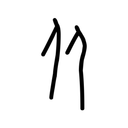

- source_zip_member: `Sub-character Images/fd2xhqwsjk/fd2xhqwsjk/0mi6v4bgxd.png`
- checksum_sha256: `8c0042bf4f46e4907a2ced1895a6c59f079ab030de1bcbf24ebd8e5ea87946cb`
- review_status: `needs_human_visual_review`
- caution: OBIMD subcharacter image is a source-marked review asset only; it is not a confirmed component form, component assignment, or decipherment conclusion.

## asset-013385

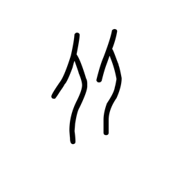

- source_zip_member: `Sub-character Images/fd2xhqwsjk/fd2xhqwsjk/13wkdw3j11.png`
- checksum_sha256: `4acd3a75f479bdc146b14ca388eb879962287f15e3746538ea49092eb78968f9`
- review_status: `needs_human_visual_review`
- caution: OBIMD subcharacter image is a source-marked review asset only; it is not a confirmed component form, component assignment, or decipherment conclusion.

## asset-013386

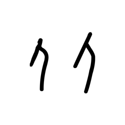

- source_zip_member: `Sub-character Images/fd2xhqwsjk/fd2xhqwsjk/1iq8w6ho6m.png`
- checksum_sha256: `d19ef618d2a3b4fd5f527f259b77222a172f53410d210ad30bd329adc453813e`
- review_status: `needs_human_visual_review`
- caution: OBIMD subcharacter image is a source-marked review asset only; it is not a confirmed component form, component assignment, or decipherment conclusion.

## asset-013387

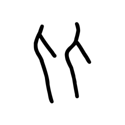

- source_zip_member: `Sub-character Images/fd2xhqwsjk/fd2xhqwsjk/3q64gcdph6.png`
- checksum_sha256: `30a9ede28afa6949d45223efaef5c60227cb56f22d9f21c70fb9ca1055dd56b8`
- review_status: `needs_human_visual_review`
- caution: OBIMD subcharacter image is a source-marked review asset only; it is not a confirmed component form, component assignment, or decipherment conclusion.

## asset-013388

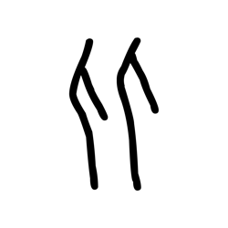

- source_zip_member: `Sub-character Images/fd2xhqwsjk/fd2xhqwsjk/4i90mwdp3e.png`
- checksum_sha256: `c4cc21b7bd8bba23f9c1097e5b13a23926a1948a6e4bd5a8dd5b4a2990e5db52`
- review_status: `needs_human_visual_review`
- caution: OBIMD subcharacter image is a source-marked review asset only; it is not a confirmed component form, component assignment, or decipherment conclusion.

## asset-013389

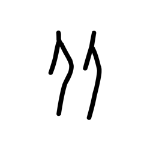

- source_zip_member: `Sub-character Images/fd2xhqwsjk/fd2xhqwsjk/4t2u8etkpg.png`
- checksum_sha256: `bf0b8204858aade9d88169a6748f2bbffe94836ecb50614e68209f565a46b536`
- review_status: `needs_human_visual_review`
- caution: OBIMD subcharacter image is a source-marked review asset only; it is not a confirmed component form, component assignment, or decipherment conclusion.

## asset-013390

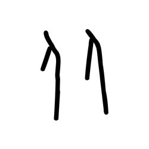

- source_zip_member: `Sub-character Images/fd2xhqwsjk/fd2xhqwsjk/63lelv2ymu.png`
- checksum_sha256: `46f0cc503481af500ae8e2b8e4d0f276ba8ac47ddcc60fbab5f50bda31b7e9b6`
- review_status: `needs_human_visual_review`
- caution: OBIMD subcharacter image is a source-marked review asset only; it is not a confirmed component form, component assignment, or decipherment conclusion.

## asset-013391

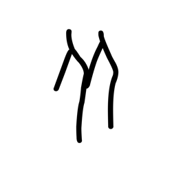

- source_zip_member: `Sub-character Images/fd2xhqwsjk/fd2xhqwsjk/6mz00uv9d0.png`
- checksum_sha256: `b0aa5f67ac2769aa7378b0f456ed107c3ff70eb270ad849abd43a9bab88f7b24`
- review_status: `needs_human_visual_review`
- caution: OBIMD subcharacter image is a source-marked review asset only; it is not a confirmed component form, component assignment, or decipherment conclusion.

## asset-013392

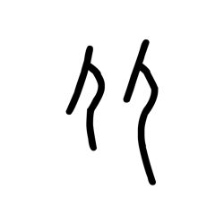

- source_zip_member: `Sub-character Images/fd2xhqwsjk/fd2xhqwsjk/6p8tv08whb.png`
- checksum_sha256: `e2539684045cbe57d73738e391eb63cda4b7dc665fa40a486937dbe57cb4b9c9`
- review_status: `needs_human_visual_review`
- caution: OBIMD subcharacter image is a source-marked review asset only; it is not a confirmed component form, component assignment, or decipherment conclusion.

## asset-013393

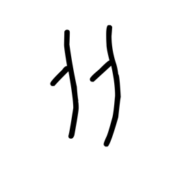

- source_zip_member: `Sub-character Images/fd2xhqwsjk/fd2xhqwsjk/7e5xdjmm1r.png`
- checksum_sha256: `85db0d2f044152bb9c264dc34c819a02e28c1f158f204f42b60f97abcf95a505`
- review_status: `needs_human_visual_review`
- caution: OBIMD subcharacter image is a source-marked review asset only; it is not a confirmed component form, component assignment, or decipherment conclusion.

## asset-013394

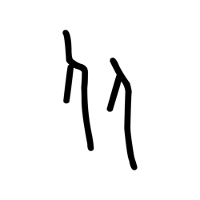

- source_zip_member: `Sub-character Images/fd2xhqwsjk/fd2xhqwsjk/7rc7tb6wli.png`
- checksum_sha256: `b6fd4a3346fe6d5fd3caa04a5f8a8f05f4095d7dc73d25322a7379934dcf7cd3`
- review_status: `needs_human_visual_review`
- caution: OBIMD subcharacter image is a source-marked review asset only; it is not a confirmed component form, component assignment, or decipherment conclusion.

## asset-013395

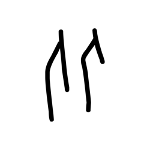

- source_zip_member: `Sub-character Images/fd2xhqwsjk/fd2xhqwsjk/8gqk72g254.png`
- checksum_sha256: `71a1703399a9f3c189bca87cdb3847748e7fcb3c9bb0ae789352acee6b1d47b8`
- review_status: `needs_human_visual_review`
- caution: OBIMD subcharacter image is a source-marked review asset only; it is not a confirmed component form, component assignment, or decipherment conclusion.

## asset-013396

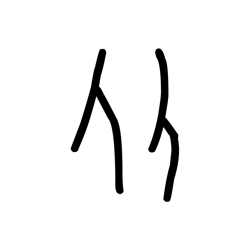

- source_zip_member: `Sub-character Images/fd2xhqwsjk/fd2xhqwsjk/8ojwy17snx.png`
- checksum_sha256: `9e4ce74b867e7685cdb0a98e406769fd908f25ba0f7778d6ccc01ba9a82ef5ce`
- review_status: `needs_human_visual_review`
- caution: OBIMD subcharacter image is a source-marked review asset only; it is not a confirmed component form, component assignment, or decipherment conclusion.

## asset-013397

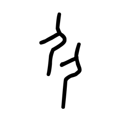

- source_zip_member: `Sub-character Images/fd2xhqwsjk/fd2xhqwsjk/9h6hsqwgrd.png`
- checksum_sha256: `540191fd66ed326c0e543c4b0fbf4532a4f1492a31e3866958bf37cc31248271`
- review_status: `needs_human_visual_review`
- caution: OBIMD subcharacter image is a source-marked review asset only; it is not a confirmed component form, component assignment, or decipherment conclusion.

## asset-013398

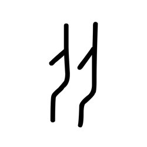

- source_zip_member: `Sub-character Images/fd2xhqwsjk/fd2xhqwsjk/a6t2qfazi5.png`
- checksum_sha256: `1f2d749b427a8dc4b2ae9a6fe592993d510a141d0946e5c3f453e4cc5ab2f696`
- review_status: `needs_human_visual_review`
- caution: OBIMD subcharacter image is a source-marked review asset only; it is not a confirmed component form, component assignment, or decipherment conclusion.

## asset-013399

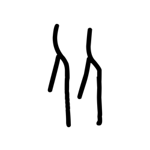

- source_zip_member: `Sub-character Images/fd2xhqwsjk/fd2xhqwsjk/bf2ikr5b8v.png`
- checksum_sha256: `796890ed3b79a956e91fe7597eb2751eee2c217865e73a1447d9922c7d6b754b`
- review_status: `needs_human_visual_review`
- caution: OBIMD subcharacter image is a source-marked review asset only; it is not a confirmed component form, component assignment, or decipherment conclusion.

## asset-013400

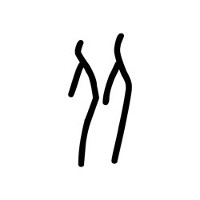

- source_zip_member: `Sub-character Images/fd2xhqwsjk/fd2xhqwsjk/cl6zm1lllt.png`
- checksum_sha256: `254a6b9ec8991598ad52c0d71f9562f286741d46d87bf6ba98dd6fac2edb7d9b`
- review_status: `needs_human_visual_review`
- caution: OBIMD subcharacter image is a source-marked review asset only; it is not a confirmed component form, component assignment, or decipherment conclusion.

## asset-013401

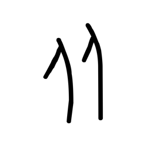

- source_zip_member: `Sub-character Images/fd2xhqwsjk/fd2xhqwsjk/d26zf17cyf.png`
- checksum_sha256: `2d85198244f3a37e50af17d182f1f882d60c3ea92442eeb750b448d94aeda860`
- review_status: `needs_human_visual_review`
- caution: OBIMD subcharacter image is a source-marked review asset only; it is not a confirmed component form, component assignment, or decipherment conclusion.

## asset-013402

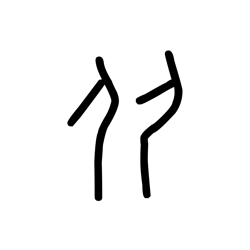

- source_zip_member: `Sub-character Images/fd2xhqwsjk/fd2xhqwsjk/dka2wq6wdo.png`
- checksum_sha256: `e1b576be1071763ca5c658726e12eb403bbc7e5008f22fb2cd6eafd947323e61`
- review_status: `needs_human_visual_review`
- caution: OBIMD subcharacter image is a source-marked review asset only; it is not a confirmed component form, component assignment, or decipherment conclusion.

## asset-013403

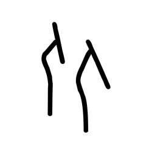

- source_zip_member: `Sub-character Images/fd2xhqwsjk/fd2xhqwsjk/e12tklwc78.png`
- checksum_sha256: `5a6a0efaf3b91dcf469aa35bf8c94e75d8b724e61de0f4dc4f75369b78a8311a`
- review_status: `needs_human_visual_review`
- caution: OBIMD subcharacter image is a source-marked review asset only; it is not a confirmed component form, component assignment, or decipherment conclusion.

## asset-013404

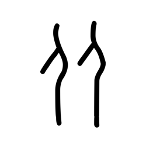

- source_zip_member: `Sub-character Images/fd2xhqwsjk/fd2xhqwsjk/fd2xhqwsjk.png`
- checksum_sha256: `4eb437af6e58e795867a8c0cc5e3308fc8194461d8e5278ab0744acc0b4bde9a`
- review_status: `needs_human_visual_review`
- caution: OBIMD subcharacter image is a source-marked review asset only; it is not a confirmed component form, component assignment, or decipherment conclusion.

## asset-013405

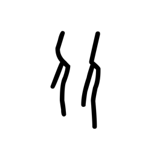

- source_zip_member: `Sub-character Images/fd2xhqwsjk/fd2xhqwsjk/fec6x2712y.png`
- checksum_sha256: `120bf15f519534018a9670595c50f7f6f27cc469e65451dc5e1ffcfc51aede59`
- review_status: `needs_human_visual_review`
- caution: OBIMD subcharacter image is a source-marked review asset only; it is not a confirmed component form, component assignment, or decipherment conclusion.

## asset-013406

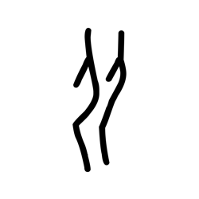

- source_zip_member: `Sub-character Images/fd2xhqwsjk/fd2xhqwsjk/fkkcfv5tnx.png`
- checksum_sha256: `022af38a369fe2d7fe142a3d6f2d4d3e7bc37c74e861090a469863f3c80184e7`
- review_status: `needs_human_visual_review`
- caution: OBIMD subcharacter image is a source-marked review asset only; it is not a confirmed component form, component assignment, or decipherment conclusion.

## asset-013407

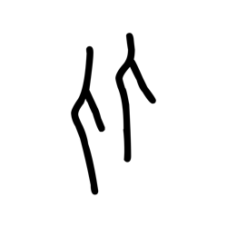

- source_zip_member: `Sub-character Images/fd2xhqwsjk/fd2xhqwsjk/fqtz823w5s.png`
- checksum_sha256: `0989c764e3b56629ed3e652fb01cb3e75a8e86d86a51bdb1d3e82c029d6aa047`
- review_status: `needs_human_visual_review`
- caution: OBIMD subcharacter image is a source-marked review asset only; it is not a confirmed component form, component assignment, or decipherment conclusion.

## asset-013408

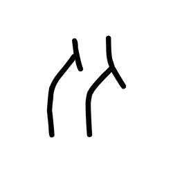

- source_zip_member: `Sub-character Images/fd2xhqwsjk/fd2xhqwsjk/gc3ckfcm93.png`
- checksum_sha256: `d862662ea8620272eb707e9366f471af9593e98158a1d3f80ebcb45973ef687b`
- review_status: `needs_human_visual_review`
- caution: OBIMD subcharacter image is a source-marked review asset only; it is not a confirmed component form, component assignment, or decipherment conclusion.

## asset-013409

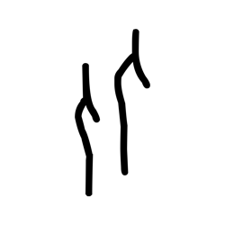

- source_zip_member: `Sub-character Images/fd2xhqwsjk/fd2xhqwsjk/gw24qg9l8f.png`
- checksum_sha256: `dba4c14b11fa978a0487c17672bccbf7c988794039668b4c31fa74b7dd308a29`
- review_status: `needs_human_visual_review`
- caution: OBIMD subcharacter image is a source-marked review asset only; it is not a confirmed component form, component assignment, or decipherment conclusion.

## asset-013410

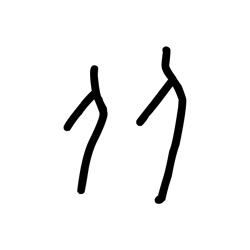

- source_zip_member: `Sub-character Images/fd2xhqwsjk/fd2xhqwsjk/lk42pag75i.png`
- checksum_sha256: `e4b89195c1b6a048f5c25b82097a8b3dd59f1a957e6c8c1ee59648a6f61237a1`
- review_status: `needs_human_visual_review`
- caution: OBIMD subcharacter image is a source-marked review asset only; it is not a confirmed component form, component assignment, or decipherment conclusion.

## asset-013411

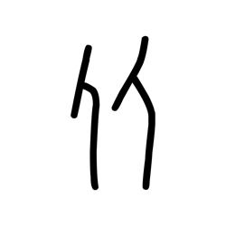

- source_zip_member: `Sub-character Images/fd2xhqwsjk/fd2xhqwsjk/n0vij9l5ut.png`
- checksum_sha256: `be9a5930cab5868a0938873917d06ea85dc14f528b4a5c3fdbedf0008565f2e3`
- review_status: `needs_human_visual_review`
- caution: OBIMD subcharacter image is a source-marked review asset only; it is not a confirmed component form, component assignment, or decipherment conclusion.

## asset-013412

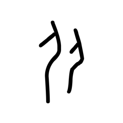

- source_zip_member: `Sub-character Images/fd2xhqwsjk/fd2xhqwsjk/o3qwfkzkbu.png`
- checksum_sha256: `d323e3668f2038c532a680ed37834094b1a68197d7956582d2a60c22d694d712`
- review_status: `needs_human_visual_review`
- caution: OBIMD subcharacter image is a source-marked review asset only; it is not a confirmed component form, component assignment, or decipherment conclusion.

## asset-013413

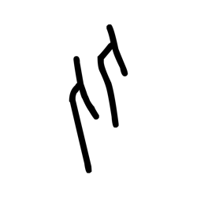

- source_zip_member: `Sub-character Images/fd2xhqwsjk/fd2xhqwsjk/rp57tpudi4.png`
- checksum_sha256: `f24182e38ad01961a3d00a59659d55f396b142e74fdfbcc31c5906c768872cea`
- review_status: `needs_human_visual_review`
- caution: OBIMD subcharacter image is a source-marked review asset only; it is not a confirmed component form, component assignment, or decipherment conclusion.

## asset-013414

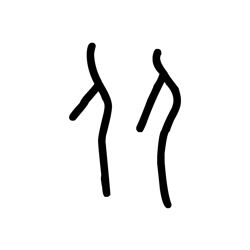

- source_zip_member: `Sub-character Images/fd2xhqwsjk/fd2xhqwsjk/sdykxs5okc.png`
- checksum_sha256: `a13959bc29f542670eacc95c2aebbbf265af4a32b1c8ce1e47322b73b89d18fa`
- review_status: `needs_human_visual_review`
- caution: OBIMD subcharacter image is a source-marked review asset only; it is not a confirmed component form, component assignment, or decipherment conclusion.

## asset-013415

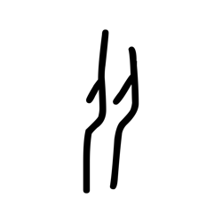

- source_zip_member: `Sub-character Images/fd2xhqwsjk/fd2xhqwsjk/slrn5tbiyi.png`
- checksum_sha256: `461fc7570420a78b0e1e1539974e77e8b72e5f861c957fdc7be99f442af979b2`
- review_status: `needs_human_visual_review`
- caution: OBIMD subcharacter image is a source-marked review asset only; it is not a confirmed component form, component assignment, or decipherment conclusion.

## asset-013416

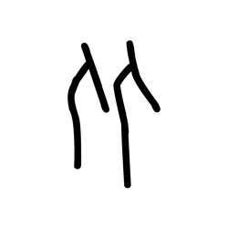

- source_zip_member: `Sub-character Images/fd2xhqwsjk/fd2xhqwsjk/tm6kho2p2g.png`
- checksum_sha256: `4fb058c011423f926235eb2187813c4ffa7c26fdf65b4c8d3c1c6840ec7b663c`
- review_status: `needs_human_visual_review`
- caution: OBIMD subcharacter image is a source-marked review asset only; it is not a confirmed component form, component assignment, or decipherment conclusion.

## asset-013417

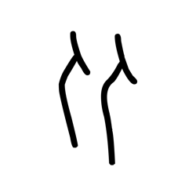

- source_zip_member: `Sub-character Images/fd2xhqwsjk/fd2xhqwsjk/w4361vjzag.png`
- checksum_sha256: `5a775e1784a95388f80ae9e32246004815b0225ab81d6faa87baade8fccc076a`
- review_status: `needs_human_visual_review`
- caution: OBIMD subcharacter image is a source-marked review asset only; it is not a confirmed component form, component assignment, or decipherment conclusion.

## asset-013418

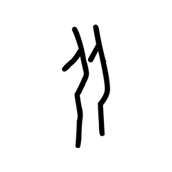

- source_zip_member: `Sub-character Images/fd2xhqwsjk/fd2xhqwsjk/w8wuyzbvpa.png`
- checksum_sha256: `6b1f94a80a7fac2b2031102646892167572d8d4ab25fa95b8109666faaa47ba6`
- review_status: `needs_human_visual_review`
- caution: OBIMD subcharacter image is a source-marked review asset only; it is not a confirmed component form, component assignment, or decipherment conclusion.

## asset-013419

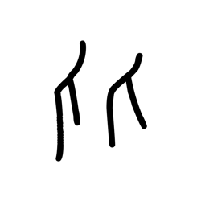

- source_zip_member: `Sub-character Images/fd2xhqwsjk/fd2xhqwsjk/xoejqwa9tl.png`
- checksum_sha256: `ee6928d8048e0187cac6c5e35629bca24c7d63bddf5080b19c1c9e8c4c71b5ad`
- review_status: `needs_human_visual_review`
- caution: OBIMD subcharacter image is a source-marked review asset only; it is not a confirmed component form, component assignment, or decipherment conclusion.

## asset-013420

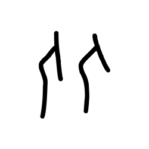

- source_zip_member: `Sub-character Images/fd2xhqwsjk/fd2xhqwsjk/ytwsuawiwu.png`
- checksum_sha256: `2154400b4738aa392c0da06c71638a0e1641c04aeb72edf02e881ec9b02bdb7b`
- review_status: `needs_human_visual_review`
- caution: OBIMD subcharacter image is a source-marked review asset only; it is not a confirmed component form, component assignment, or decipherment conclusion.
