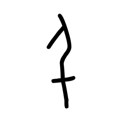
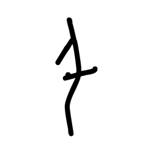
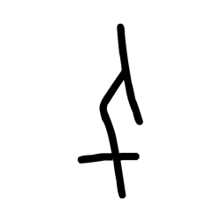
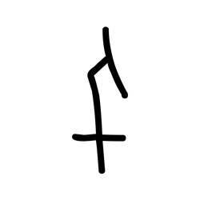
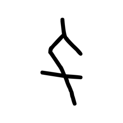
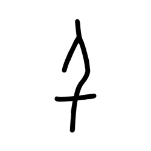
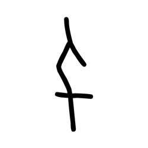
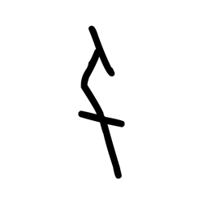
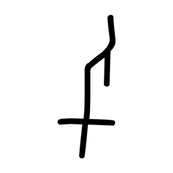

# Component Visual Gallery / 构件图像查看: obs-comp-cand-000721

English:
This page displays OBIMD subcharacter PNG assets extracted into this concrete
corpus object directory for human review.

简体中文：
本页展示抽取到当前具体 corpus 对象目录内的 OBIMD subcharacter PNG 资料，供人工复核使用。

Boundary / 边界：
dataset image candidate only; not a confirmed component form, not a component
assignment, and not a decipherment claim.
- not a confirmed component form
- not a component assignment
- not a decipherment claim

## Concrete Questions To Check / 具体待查问题

- Open 06_component-visual-index.csv and name the local image row.
- 打开 06_component-visual-index.csv，写明本地图像行。
- Open 09_component-visual-route-index.csv and name the source route row.
- 打开 09_component-visual-route-index.csv，写明来源路线行。
- Open 13_component-context-evidence-dossier.md for character context.
- 打开 13_component-context-evidence-dossier.md，核对单字与卜辞上下文。
- Record the missing image, near-shape, source, or context route.
- 记录缺失的图像、近形、来源或上下文路线。

## asset-013433

- source_zip_member: `Sub-character Images/1bdnhihf1z/1bdnhihf1z/1bdnhihf1z.png`
- checksum_sha256: see `06_component-visual-index.csv`.
- review_status: `needs_human_visual_review`
- caution: source-marked review image only.

## asset-013434

- source_zip_member: `Sub-character Images/1bdnhihf1z/1bdnhihf1z/2xpg2g2iu0.png`
- checksum_sha256: see `06_component-visual-index.csv`.
- review_status: `needs_human_visual_review`
- caution: source-marked review image only.

## asset-013435

- source_zip_member: `Sub-character Images/1bdnhihf1z/1bdnhihf1z/3o3b9m2zc8.png`
- checksum_sha256: see `06_component-visual-index.csv`.
- review_status: `needs_human_visual_review`
- caution: source-marked review image only.

## asset-013436

- source_zip_member: `Sub-character Images/1bdnhihf1z/1bdnhihf1z/4jy8v1nxnm.png`
- checksum_sha256: see `06_component-visual-index.csv`.
- review_status: `needs_human_visual_review`
- caution: source-marked review image only.

## asset-013437

- source_zip_member: `Sub-character Images/1bdnhihf1z/1bdnhihf1z/4ud0fxmj2e.png`
- checksum_sha256: see `06_component-visual-index.csv`.
- review_status: `needs_human_visual_review`
- caution: source-marked review image only.

## asset-013438

- source_zip_member: `Sub-character Images/1bdnhihf1z/1bdnhihf1z/5qd6ptf25n.png`
- checksum_sha256: see `06_component-visual-index.csv`.
- review_status: `needs_human_visual_review`
- caution: source-marked review image only.

## asset-013439

- source_zip_member: `Sub-character Images/1bdnhihf1z/1bdnhihf1z/bxmmfmu9dm.png`
- checksum_sha256: see `06_component-visual-index.csv`.
- review_status: `needs_human_visual_review`
- caution: source-marked review image only.

## asset-013440

- source_zip_member: `Sub-character Images/1bdnhihf1z/1bdnhihf1z/c1sza5k9fz.png`
- checksum_sha256: see `06_component-visual-index.csv`.
- review_status: `needs_human_visual_review`
- caution: source-marked review image only.

## asset-013441

- source_zip_member: `Sub-character Images/1bdnhihf1z/1bdnhihf1z/duivwahe4x.png`
- checksum_sha256: see `06_component-visual-index.csv`.
- review_status: `needs_human_visual_review`
- caution: source-marked review image only.

## asset-013442

- source_zip_member: `Sub-character Images/1bdnhihf1z/1bdnhihf1z/m7ltwovv0y.png`
- checksum_sha256: see `06_component-visual-index.csv`.
- review_status: `needs_human_visual_review`
- caution: source-marked review image only.

## asset-013443

- source_zip_member: `Sub-character Images/1bdnhihf1z/1bdnhihf1z/mfsvj67wlb.png`
- checksum_sha256: see `06_component-visual-index.csv`.
- review_status: `needs_human_visual_review`
- caution: source-marked review image only.

## asset-013444

- source_zip_member: `Sub-character Images/1bdnhihf1z/1bdnhihf1z/pjyzsf7p3v.png`
- checksum_sha256: see `06_component-visual-index.csv`.
- review_status: `needs_human_visual_review`
- caution: source-marked review image only.

## asset-013445

- source_zip_member: `Sub-character Images/1bdnhihf1z/1bdnhihf1z/qvt4x5ck6k.png`
- checksum_sha256: see `06_component-visual-index.csv`.
- review_status: `needs_human_visual_review`
- caution: source-marked review image only.

## asset-013446

- source_zip_member: `Sub-character Images/1bdnhihf1z/1bdnhihf1z/tlm74pp2wh.png`
- checksum_sha256: see `06_component-visual-index.csv`.
- review_status: `needs_human_visual_review`
- caution: source-marked review image only.

## asset-013447

- source_zip_member: `Sub-character Images/1bdnhihf1z/1bdnhihf1z/wryupq505q.png`
- checksum_sha256: see `06_component-visual-index.csv`.
- review_status: `needs_human_visual_review`
- caution: source-marked review image only.

## asset-013448

- source_zip_member: `Sub-character Images/1bdnhihf1z/1bdnhihf1z/x5wdrmazs1.png`
- checksum_sha256: see `06_component-visual-index.csv`.
- review_status: `needs_human_visual_review`
- caution: source-marked review image only.
