# Component Visual Gallery / 构件图像查看: obs-comp-cand-000742

English:
This page displays OBIMD subcharacter PNG assets extracted into this concrete
corpus object directory for human review.

简体中文：
本页展示抽取到当前具体 corpus 对象目录内的 OBIMD subcharacter PNG 资料，供人工复核使用。

Boundary / 边界：
dataset image candidate only; not a confirmed component form, not a component
assignment, and not a decipherment claim.
- not a confirmed component form
- not a component assignment
- not a decipherment claim

## Concrete Questions To Check / 具体待查问题

- Open 06_component-visual-index.csv and name the local image row.
- 打开 06_component-visual-index.csv，写明本地图像行。
- Open 09_component-visual-route-index.csv and name the source route row.
- 打开 09_component-visual-route-index.csv，写明来源路线行。
- Open 13_component-context-evidence-dossier.md for character context.
- 打开 13_component-context-evidence-dossier.md，核对单字与卜辞上下文。
- Record the missing image, near-shape, source, or context route.
- 记录缺失的图像、近形、来源或上下文路线。

## asset-013469

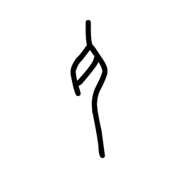

- source_zip_member: `Sub-character Images/5n30uigzj6/5n30uigzj6/012t3k765p.png`
- checksum_sha256: see `06_component-visual-index.csv`.
- review_status: `needs_human_visual_review`
- caution: source-marked review image only.

## asset-013470

- source_zip_member: `Sub-character Images/5n30uigzj6/5n30uigzj6/1rvewiial9.png`
- checksum_sha256: see `06_component-visual-index.csv`.
- review_status: `needs_human_visual_review`
- caution: source-marked review image only.

## asset-013471

- source_zip_member: `Sub-character Images/5n30uigzj6/5n30uigzj6/2higmnx9ow.png`
- checksum_sha256: see `06_component-visual-index.csv`.
- review_status: `needs_human_visual_review`
- caution: source-marked review image only.

## asset-013472

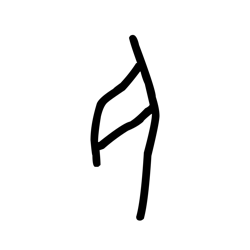

- source_zip_member: `Sub-character Images/5n30uigzj6/5n30uigzj6/2vp2l7ftpx.png`
- checksum_sha256: see `06_component-visual-index.csv`.
- review_status: `needs_human_visual_review`
- caution: source-marked review image only.

## asset-013473

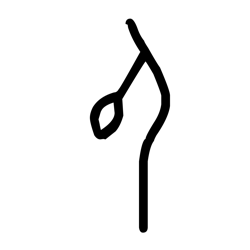

- source_zip_member: `Sub-character Images/5n30uigzj6/5n30uigzj6/5n30uigzj6.png`
- checksum_sha256: see `06_component-visual-index.csv`.
- review_status: `needs_human_visual_review`
- caution: source-marked review image only.

## asset-013474

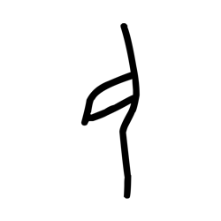

- source_zip_member: `Sub-character Images/5n30uigzj6/5n30uigzj6/5njzql2ll3.png`
- checksum_sha256: see `06_component-visual-index.csv`.
- review_status: `needs_human_visual_review`
- caution: source-marked review image only.

## asset-013475

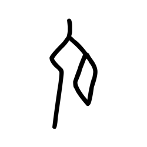

- source_zip_member: `Sub-character Images/5n30uigzj6/5n30uigzj6/7u35bh538g.png`
- checksum_sha256: see `06_component-visual-index.csv`.
- review_status: `needs_human_visual_review`
- caution: source-marked review image only.

## asset-013476

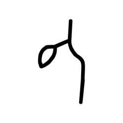

- source_zip_member: `Sub-character Images/5n30uigzj6/5n30uigzj6/8am5zgwv90.png`
- checksum_sha256: see `06_component-visual-index.csv`.
- review_status: `needs_human_visual_review`
- caution: source-marked review image only.

## asset-013477

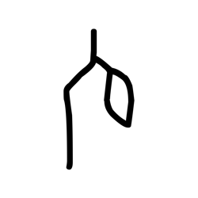

- source_zip_member: `Sub-character Images/5n30uigzj6/5n30uigzj6/8j6gwp81wo.png`
- checksum_sha256: see `06_component-visual-index.csv`.
- review_status: `needs_human_visual_review`
- caution: source-marked review image only.

## asset-013478

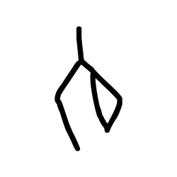

- source_zip_member: `Sub-character Images/5n30uigzj6/5n30uigzj6/cg50m03uzu.png`
- checksum_sha256: see `06_component-visual-index.csv`.
- review_status: `needs_human_visual_review`
- caution: source-marked review image only.

## asset-013479

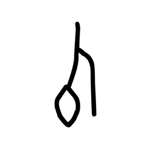

- source_zip_member: `Sub-character Images/5n30uigzj6/5n30uigzj6/d9jb9tl9fq.png`
- checksum_sha256: see `06_component-visual-index.csv`.
- review_status: `needs_human_visual_review`
- caution: source-marked review image only.

## asset-013480

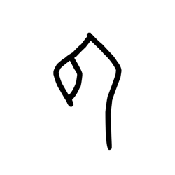

- source_zip_member: `Sub-character Images/5n30uigzj6/5n30uigzj6/ee3p665qz3.png`
- checksum_sha256: see `06_component-visual-index.csv`.
- review_status: `needs_human_visual_review`
- caution: source-marked review image only.

## asset-013481

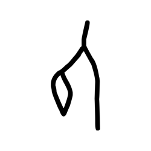

- source_zip_member: `Sub-character Images/5n30uigzj6/5n30uigzj6/ejkun0ckve.png`
- checksum_sha256: see `06_component-visual-index.csv`.
- review_status: `needs_human_visual_review`
- caution: source-marked review image only.

## asset-013482

- source_zip_member: `Sub-character Images/5n30uigzj6/5n30uigzj6/fv2hpjkla8.png`
- checksum_sha256: see `06_component-visual-index.csv`.
- review_status: `needs_human_visual_review`
- caution: source-marked review image only.

## asset-013483

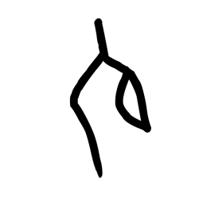

- source_zip_member: `Sub-character Images/5n30uigzj6/5n30uigzj6/g8egb1pra5.png`
- checksum_sha256: see `06_component-visual-index.csv`.
- review_status: `needs_human_visual_review`
- caution: source-marked review image only.

## asset-013484

- source_zip_member: `Sub-character Images/5n30uigzj6/5n30uigzj6/iohuusv6o1.png`
- checksum_sha256: see `06_component-visual-index.csv`.
- review_status: `needs_human_visual_review`
- caution: source-marked review image only.

## asset-013485

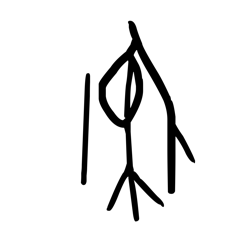

- source_zip_member: `Sub-character Images/5n30uigzj6/5n30uigzj6/jfwzu25716.png`
- checksum_sha256: see `06_component-visual-index.csv`.
- review_status: `needs_human_visual_review`
- caution: source-marked review image only.

## asset-013486

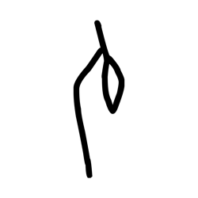

- source_zip_member: `Sub-character Images/5n30uigzj6/5n30uigzj6/k7hycajgqt.png`
- checksum_sha256: see `06_component-visual-index.csv`.
- review_status: `needs_human_visual_review`
- caution: source-marked review image only.

## asset-013487

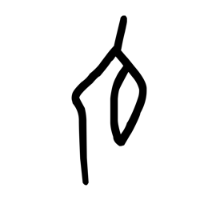

- source_zip_member: `Sub-character Images/5n30uigzj6/5n30uigzj6/m5aiaj4pwi.png`
- checksum_sha256: see `06_component-visual-index.csv`.
- review_status: `needs_human_visual_review`
- caution: source-marked review image only.

## asset-013488

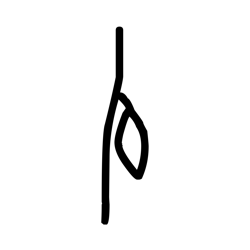

- source_zip_member: `Sub-character Images/5n30uigzj6/5n30uigzj6/m918kulrlc.png`
- checksum_sha256: see `06_component-visual-index.csv`.
- review_status: `needs_human_visual_review`
- caution: source-marked review image only.

## asset-013489

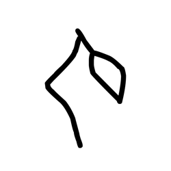

- source_zip_member: `Sub-character Images/5n30uigzj6/5n30uigzj6/mvc39py2k7.png`
- checksum_sha256: see `06_component-visual-index.csv`.
- review_status: `needs_human_visual_review`
- caution: source-marked review image only.

## asset-013490

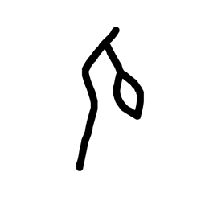

- source_zip_member: `Sub-character Images/5n30uigzj6/5n30uigzj6/pisqzi6dqo.png`
- checksum_sha256: see `06_component-visual-index.csv`.
- review_status: `needs_human_visual_review`
- caution: source-marked review image only.

## asset-013491

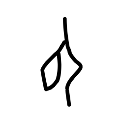

- source_zip_member: `Sub-character Images/5n30uigzj6/5n30uigzj6/pwbgapoqac.png`
- checksum_sha256: see `06_component-visual-index.csv`.
- review_status: `needs_human_visual_review`
- caution: source-marked review image only.

## asset-013492

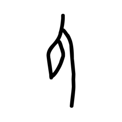

- source_zip_member: `Sub-character Images/5n30uigzj6/5n30uigzj6/pyoq2lthqa.png`
- checksum_sha256: see `06_component-visual-index.csv`.
- review_status: `needs_human_visual_review`
- caution: source-marked review image only.

## asset-013493

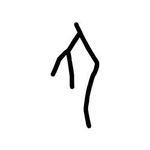

- source_zip_member: `Sub-character Images/5n30uigzj6/5n30uigzj6/qtnn9pplxe.png`
- checksum_sha256: see `06_component-visual-index.csv`.
- review_status: `needs_human_visual_review`
- caution: source-marked review image only.

## asset-013494

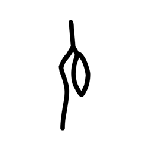

- source_zip_member: `Sub-character Images/5n30uigzj6/5n30uigzj6/uc10xj2gaq.png`
- checksum_sha256: see `06_component-visual-index.csv`.
- review_status: `needs_human_visual_review`
- caution: source-marked review image only.

## asset-013495

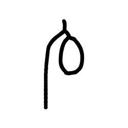

- source_zip_member: `Sub-character Images/5n30uigzj6/5n30uigzj6/wtuhze0m9s.png`
- checksum_sha256: see `06_component-visual-index.csv`.
- review_status: `needs_human_visual_review`
- caution: source-marked review image only.

## asset-013496

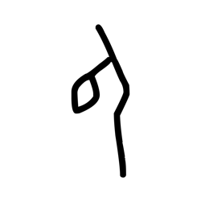

- source_zip_member: `Sub-character Images/5n30uigzj6/5n30uigzj6/xla06tbm9n.png`
- checksum_sha256: see `06_component-visual-index.csv`.
- review_status: `needs_human_visual_review`
- caution: source-marked review image only.

## asset-013497

- source_zip_member: `Sub-character Images/5n30uigzj6/5n30uigzj6/ziqjqgdnk7.png`
- checksum_sha256: see `06_component-visual-index.csv`.
- review_status: `needs_human_visual_review`
- caution: source-marked review image only.
