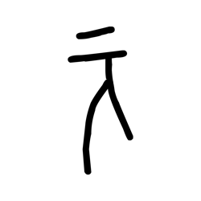
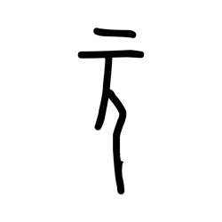
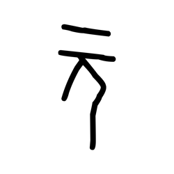
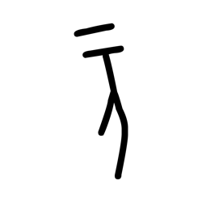
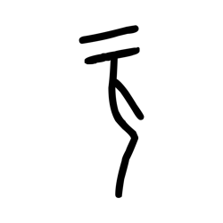
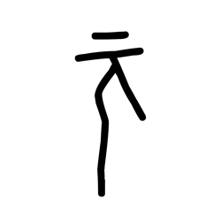
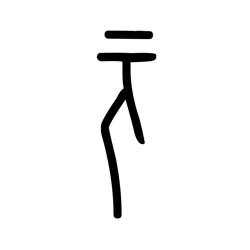

# Component Visual Gallery / 构件图像查看: obs-comp-cand-000744

English:
This page displays OBIMD subcharacter PNG assets extracted into this concrete
corpus object directory for human review.

简体中文：
本页展示抽取到当前具体 corpus 对象目录内的 OBIMD subcharacter PNG 资料，供人工复核使用。

Boundary / 边界：
dataset image candidate only; not a confirmed component form, not a component
assignment, and not a decipherment claim.
- not a confirmed component form
- not a component assignment
- not a decipherment claim

## Concrete Questions To Check / 具体待查问题

- Open 06_component-visual-index.csv and name the local image row.
- 打开 06_component-visual-index.csv，写明本地图像行。
- Open 09_component-visual-route-index.csv and name the source route row.
- 打开 09_component-visual-route-index.csv，写明来源路线行。
- Open 13_component-context-evidence-dossier.md for character context.
- 打开 13_component-context-evidence-dossier.md，核对单字与卜辞上下文。
- Record the missing image, near-shape, source, or context route.
- 记录缺失的图像、近形、来源或上下文路线。

## asset-013499

- source_zip_member: `Sub-character Images/n0bfvspr0d/n0bfvspr0d/bajaum6p8r.png`
- checksum_sha256: see `06_component-visual-index.csv`.
- review_status: `needs_human_visual_review`
- caution: source-marked review image only.

## asset-013500

- source_zip_member: `Sub-character Images/n0bfvspr0d/n0bfvspr0d/fvwds08lqm.png`
- checksum_sha256: see `06_component-visual-index.csv`.
- review_status: `needs_human_visual_review`
- caution: source-marked review image only.

## asset-013501

- source_zip_member: `Sub-character Images/n0bfvspr0d/n0bfvspr0d/jf6ojxym50.png`
- checksum_sha256: see `06_component-visual-index.csv`.
- review_status: `needs_human_visual_review`
- caution: source-marked review image only.

## asset-013502

- source_zip_member: `Sub-character Images/n0bfvspr0d/n0bfvspr0d/k3fulhkhr7.png`
- checksum_sha256: see `06_component-visual-index.csv`.
- review_status: `needs_human_visual_review`
- caution: source-marked review image only.

## asset-013503

- source_zip_member: `Sub-character Images/n0bfvspr0d/n0bfvspr0d/lgs9k73b6n.png`
- checksum_sha256: see `06_component-visual-index.csv`.
- review_status: `needs_human_visual_review`
- caution: source-marked review image only.

## asset-013504

- source_zip_member: `Sub-character Images/n0bfvspr0d/n0bfvspr0d/n0bfvspr0d.png`
- checksum_sha256: see `06_component-visual-index.csv`.
- review_status: `needs_human_visual_review`
- caution: source-marked review image only.

## asset-013505

- source_zip_member: `Sub-character Images/n0bfvspr0d/n0bfvspr0d/nzvwjp3n7m.png`
- checksum_sha256: see `06_component-visual-index.csv`.
- review_status: `needs_human_visual_review`
- caution: source-marked review image only.

## asset-013506

- source_zip_member: `Sub-character Images/n0bfvspr0d/n0bfvspr0d/rgsa9rbvyp.png`
- checksum_sha256: see `06_component-visual-index.csv`.
- review_status: `needs_human_visual_review`
- caution: source-marked review image only.

## asset-013507

- source_zip_member: `Sub-character Images/n0bfvspr0d/n0bfvspr0d/rh7hv8gzjb.png`
- checksum_sha256: see `06_component-visual-index.csv`.
- review_status: `needs_human_visual_review`
- caution: source-marked review image only.

## asset-013508

- source_zip_member: `Sub-character Images/n0bfvspr0d/n0bfvspr0d/x5dhwz0zax.png`
- checksum_sha256: see `06_component-visual-index.csv`.
- review_status: `needs_human_visual_review`
- caution: source-marked review image only.

## asset-013509

- source_zip_member: `Sub-character Images/n0bfvspr0d/n0bfvspr0d/zausr8j4gr.png`
- checksum_sha256: see `06_component-visual-index.csv`.
- review_status: `needs_human_visual_review`
- caution: source-marked review image only.
