# Component Visual Gallery / 构件图像查看: obs-comp-cand-000785

English:
This page displays OBIMD subcharacter PNG assets extracted into this concrete corpus object directory for human review.

简体中文：
本页展示抽取到当前具体 corpus 对象目录内的 OBIMD subcharacter PNG 资料，供人工复核使用。

Boundary / 边界：dataset image candidate only; not a confirmed component form, component assignment, or decipherment claim.

## asset-013547

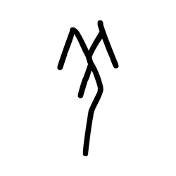

- source_zip_member: `Sub-character Images/6p9s6p6wyb/6p9s6p6wyb/0k83gzaooi.png`
- checksum_sha256: `2ac8172af5ccede585c71143d07449aba536ee9a792e44b48cbaa27cad80b455`
- review_status: `needs_human_visual_review`
- caution: OBIMD subcharacter image is a source-marked review asset only; it is not a confirmed component form, component assignment, or decipherment conclusion.

## asset-013548

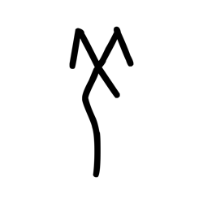

- source_zip_member: `Sub-character Images/6p9s6p6wyb/6p9s6p6wyb/3m83j35gt7.png`
- checksum_sha256: `75dd3e9a0d9e5695a84eb850808431a49439117a5fdab8a5a629fe4f44d0d90c`
- review_status: `needs_human_visual_review`
- caution: OBIMD subcharacter image is a source-marked review asset only; it is not a confirmed component form, component assignment, or decipherment conclusion.

## asset-013549

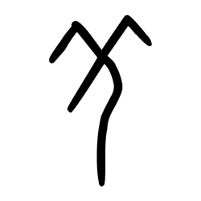

- source_zip_member: `Sub-character Images/6p9s6p6wyb/6p9s6p6wyb/6p9s6p6wyb.png`
- checksum_sha256: `7c2bdc1c6d1f2256c9ecea9226d264332053382ca41cc83c87774443013f918c`
- review_status: `needs_human_visual_review`
- caution: OBIMD subcharacter image is a source-marked review asset only; it is not a confirmed component form, component assignment, or decipherment conclusion.

## asset-013550

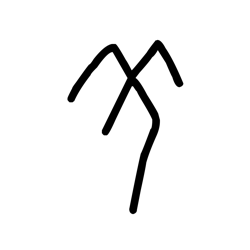

- source_zip_member: `Sub-character Images/6p9s6p6wyb/6p9s6p6wyb/7043v7n2u5.png`
- checksum_sha256: `c5f2d63fdde833489f29557baca37bbd314a86bd77d26180b4bcd77de62ae43f`
- review_status: `needs_human_visual_review`
- caution: OBIMD subcharacter image is a source-marked review asset only; it is not a confirmed component form, component assignment, or decipherment conclusion.

## asset-013551

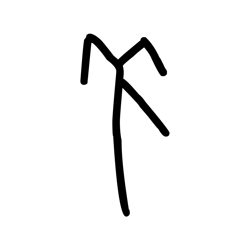

- source_zip_member: `Sub-character Images/6p9s6p6wyb/6p9s6p6wyb/75i7fgchzz.png`
- checksum_sha256: `843a61250abdda9a17398a4d51d09e29943ec174a73c92b79fc02105315ae1ef`
- review_status: `needs_human_visual_review`
- caution: OBIMD subcharacter image is a source-marked review asset only; it is not a confirmed component form, component assignment, or decipherment conclusion.

## asset-013552

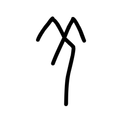

- source_zip_member: `Sub-character Images/6p9s6p6wyb/6p9s6p6wyb/8e6xlm9x72.png`
- checksum_sha256: `fc985885b541aa9b13446aeb96ba7effd97535742ff58eca08225105a22b2c65`
- review_status: `needs_human_visual_review`
- caution: OBIMD subcharacter image is a source-marked review asset only; it is not a confirmed component form, component assignment, or decipherment conclusion.

## asset-013553

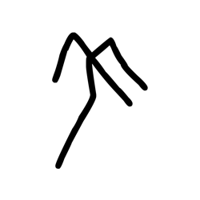

- source_zip_member: `Sub-character Images/6p9s6p6wyb/6p9s6p6wyb/bmuiuixlfm.png`
- checksum_sha256: `82b0dfa9b7b71316faf7c831f0cfd4b439e2a2bdbb5aa06ab268b9525ca6f0ec`
- review_status: `needs_human_visual_review`
- caution: OBIMD subcharacter image is a source-marked review asset only; it is not a confirmed component form, component assignment, or decipherment conclusion.

## asset-013554

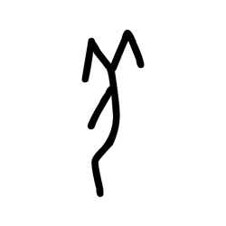

- source_zip_member: `Sub-character Images/6p9s6p6wyb/6p9s6p6wyb/c4flc2xywa.png`
- checksum_sha256: `90694ffdf8d01e7eec36306842e947caa884d494dcd00bf02bb1ce4c518246d2`
- review_status: `needs_human_visual_review`
- caution: OBIMD subcharacter image is a source-marked review asset only; it is not a confirmed component form, component assignment, or decipherment conclusion.

## asset-013555

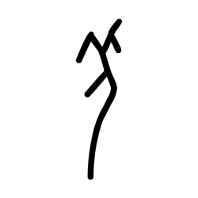

- source_zip_member: `Sub-character Images/6p9s6p6wyb/6p9s6p6wyb/cxrhfyjmyx.png`
- checksum_sha256: `5cc7896d57a8d5c124cd12caec7de773588f8d73d8aa7a46134f62fc34dcc9da`
- review_status: `needs_human_visual_review`
- caution: OBIMD subcharacter image is a source-marked review asset only; it is not a confirmed component form, component assignment, or decipherment conclusion.

## asset-013556

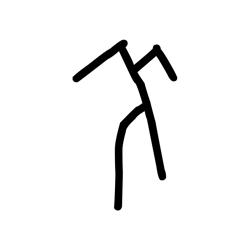

- source_zip_member: `Sub-character Images/6p9s6p6wyb/6p9s6p6wyb/d10y4cy8e7.png`
- checksum_sha256: `009653326fb711db389bf77a03d767a7c7dc72fd849aad6b659cadc8e240b22f`
- review_status: `needs_human_visual_review`
- caution: OBIMD subcharacter image is a source-marked review asset only; it is not a confirmed component form, component assignment, or decipherment conclusion.

## asset-013557

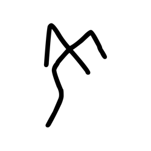

- source_zip_member: `Sub-character Images/6p9s6p6wyb/6p9s6p6wyb/d476orvtw8.png`
- checksum_sha256: `db65dad208784871722f668da055f2bd5241a16541133164f33950155ab906cb`
- review_status: `needs_human_visual_review`
- caution: OBIMD subcharacter image is a source-marked review asset only; it is not a confirmed component form, component assignment, or decipherment conclusion.

## asset-013558

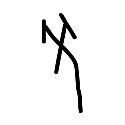

- source_zip_member: `Sub-character Images/6p9s6p6wyb/6p9s6p6wyb/f0da55x4ox.png`
- checksum_sha256: `c0d1898cfb34042d74dacd716b47a73fccd755a08cd0c50851a0c0415aaa2a93`
- review_status: `needs_human_visual_review`
- caution: OBIMD subcharacter image is a source-marked review asset only; it is not a confirmed component form, component assignment, or decipherment conclusion.

## asset-013559

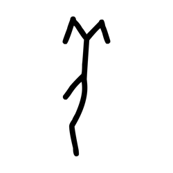

- source_zip_member: `Sub-character Images/6p9s6p6wyb/6p9s6p6wyb/izudx3xdbj.png`
- checksum_sha256: `83468e93123222943f26c8bc4a9116cec6aab6a69cf1fd1256f98d32b00648ca`
- review_status: `needs_human_visual_review`
- caution: OBIMD subcharacter image is a source-marked review asset only; it is not a confirmed component form, component assignment, or decipherment conclusion.

## asset-013560

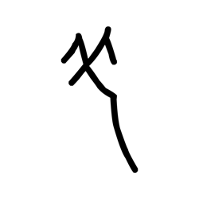

- source_zip_member: `Sub-character Images/6p9s6p6wyb/6p9s6p6wyb/k3yyln42mc.png`
- checksum_sha256: `20154f642073c2639b87fb89aac8863deeb4c1abd1f2785347aad3bdbe53e189`
- review_status: `needs_human_visual_review`
- caution: OBIMD subcharacter image is a source-marked review asset only; it is not a confirmed component form, component assignment, or decipherment conclusion.

## asset-013561

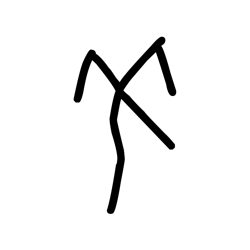

- source_zip_member: `Sub-character Images/6p9s6p6wyb/6p9s6p6wyb/l3j0emw5lh.png`
- checksum_sha256: `2dd21e5b13c93ea88642e4f355118150110b06ef27f5a279999fefe8066f96e1`
- review_status: `needs_human_visual_review`
- caution: OBIMD subcharacter image is a source-marked review asset only; it is not a confirmed component form, component assignment, or decipherment conclusion.

## asset-013562

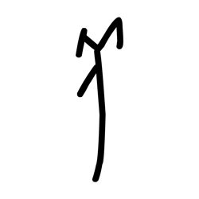

- source_zip_member: `Sub-character Images/6p9s6p6wyb/6p9s6p6wyb/ltm60aruk7.png`
- checksum_sha256: `42a679882c861f5ac26552f953883ee4d26405b834a7804d3edbdcc6b42c2bf0`
- review_status: `needs_human_visual_review`
- caution: OBIMD subcharacter image is a source-marked review asset only; it is not a confirmed component form, component assignment, or decipherment conclusion.

## asset-013563

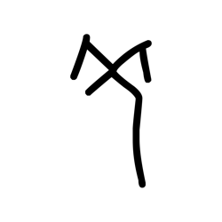

- source_zip_member: `Sub-character Images/6p9s6p6wyb/6p9s6p6wyb/nta5okmpuu.png`
- checksum_sha256: `0d1fd31acddef2f0403708a449df5257bb2a2e098d60fba1de57141fd08e5a2b`
- review_status: `needs_human_visual_review`
- caution: OBIMD subcharacter image is a source-marked review asset only; it is not a confirmed component form, component assignment, or decipherment conclusion.

## asset-013564

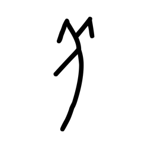

- source_zip_member: `Sub-character Images/6p9s6p6wyb/6p9s6p6wyb/o5toadcxen.png`
- checksum_sha256: `3075aae589d53b5665aceac27d4e6eefcb338349a7ac8de5c8eaa8dfed12e8bc`
- review_status: `needs_human_visual_review`
- caution: OBIMD subcharacter image is a source-marked review asset only; it is not a confirmed component form, component assignment, or decipherment conclusion.

## asset-013565

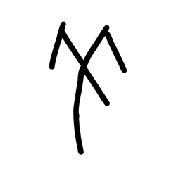

- source_zip_member: `Sub-character Images/6p9s6p6wyb/6p9s6p6wyb/omp84flhdu.png`
- checksum_sha256: `46db031f66aa7636ce67ff5d3ee38af65f6cc7ed55e7221f1167585040bc0bf4`
- review_status: `needs_human_visual_review`
- caution: OBIMD subcharacter image is a source-marked review asset only; it is not a confirmed component form, component assignment, or decipherment conclusion.

## asset-013566

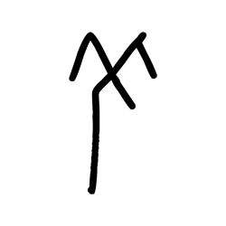

- source_zip_member: `Sub-character Images/6p9s6p6wyb/6p9s6p6wyb/pew754unwq.png`
- checksum_sha256: `0bd0f7d3d4dfe2943121a6b992ff9297b4e59c2b96fbe9eec73807f5ed5ce3d2`
- review_status: `needs_human_visual_review`
- caution: OBIMD subcharacter image is a source-marked review asset only; it is not a confirmed component form, component assignment, or decipherment conclusion.

## asset-013567

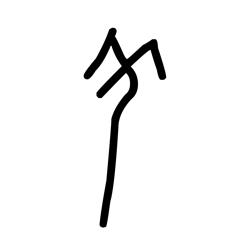

- source_zip_member: `Sub-character Images/6p9s6p6wyb/6p9s6p6wyb/sp9sx9imil.png`
- checksum_sha256: `311e9060e1d5530c1ce9096119d2d9277112ffd495b91034d2b28977e64b47af`
- review_status: `needs_human_visual_review`
- caution: OBIMD subcharacter image is a source-marked review asset only; it is not a confirmed component form, component assignment, or decipherment conclusion.

## asset-013568

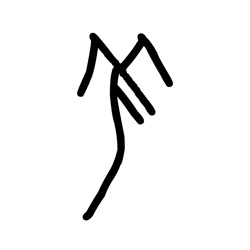

- source_zip_member: `Sub-character Images/6p9s6p6wyb/6p9s6p6wyb/vksz3y6hrl.png`
- checksum_sha256: `8fa338a857eba857b6d70acf8aded7b101875528215aa0e93407914dcaf96815`
- review_status: `needs_human_visual_review`
- caution: OBIMD subcharacter image is a source-marked review asset only; it is not a confirmed component form, component assignment, or decipherment conclusion.

## asset-013569

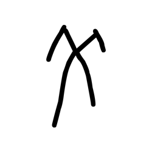

- source_zip_member: `Sub-character Images/6p9s6p6wyb/6p9s6p6wyb/vrnmvt3d7o.png`
- checksum_sha256: `92d0c33e2585b7c1a7872a83c50548f765db6a169d45e7a787950b9ac7ee04cf`
- review_status: `needs_human_visual_review`
- caution: OBIMD subcharacter image is a source-marked review asset only; it is not a confirmed component form, component assignment, or decipherment conclusion.

## asset-013570

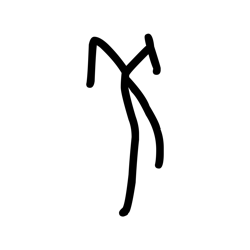

- source_zip_member: `Sub-character Images/6p9s6p6wyb/6p9s6p6wyb/zm01jn4buk.png`
- checksum_sha256: `8f4d44031cf5dda56668463b7dc770909b711d514c01aecb0568a2acd3b0e223`
- review_status: `needs_human_visual_review`
- caution: OBIMD subcharacter image is a source-marked review asset only; it is not a confirmed component form, component assignment, or decipherment conclusion.
