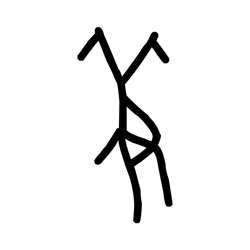
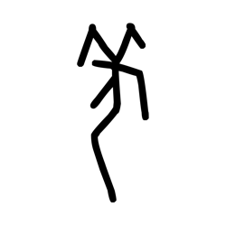
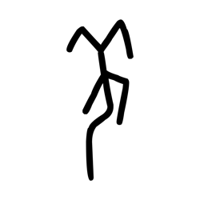
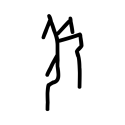
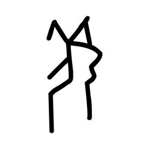
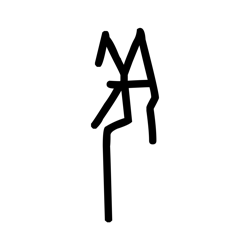
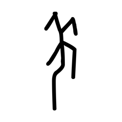
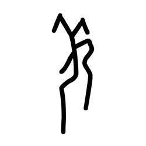
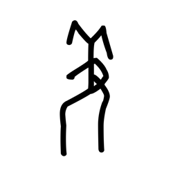

# Component Visual Gallery / 构件图像查看: obs-comp-cand-000787

English:
This page displays OBIMD subcharacter PNG assets extracted into this concrete
corpus object directory for human review.

简体中文：
本页展示抽取到当前具体 corpus 对象目录内的 OBIMD subcharacter PNG 资料，供人工复核使用。

Boundary / 边界：
dataset image candidate only; not a confirmed component form, not a component
assignment, and not a decipherment claim.
- not a confirmed component form
- not a component assignment
- not a decipherment claim

## Concrete Questions To Check / 具体待查问题

- Open 06_component-visual-index.csv and name the local image row.
- 打开 06_component-visual-index.csv，写明本地图像行。
- Open 09_component-visual-route-index.csv and name the source route row.
- 打开 09_component-visual-route-index.csv，写明来源路线行。
- Open 13_component-context-evidence-dossier.md for character context.
- 打开 13_component-context-evidence-dossier.md，核对单字与卜辞上下文。
- Record the missing image, near-shape, source, or context route.
- 记录缺失的图像、近形、来源或上下文路线。

## asset-013572

- source_zip_member: `Sub-character Images/6p9s6p6wyb/mipnbqron8/2cug6b4hh5.png`
- checksum_sha256: see `06_component-visual-index.csv`.
- review_status: `needs_human_visual_review`
- caution: source-marked review image only.

## asset-013573

- source_zip_member: `Sub-character Images/6p9s6p6wyb/mipnbqron8/2hvicum05q.png`
- checksum_sha256: see `06_component-visual-index.csv`.
- review_status: `needs_human_visual_review`
- caution: source-marked review image only.

## asset-013574

- source_zip_member: `Sub-character Images/6p9s6p6wyb/mipnbqron8/3v5xm0iah5.png`
- checksum_sha256: see `06_component-visual-index.csv`.
- review_status: `needs_human_visual_review`
- caution: source-marked review image only.

## asset-013575

- source_zip_member: `Sub-character Images/6p9s6p6wyb/mipnbqron8/3wmcv2qi4f.png`
- checksum_sha256: see `06_component-visual-index.csv`.
- review_status: `needs_human_visual_review`
- caution: source-marked review image only.

## asset-013576

- source_zip_member: `Sub-character Images/6p9s6p6wyb/mipnbqron8/4d0nvhhz5b.png`
- checksum_sha256: see `06_component-visual-index.csv`.
- review_status: `needs_human_visual_review`
- caution: source-marked review image only.

## asset-013577

- source_zip_member: `Sub-character Images/6p9s6p6wyb/mipnbqron8/4wyixzyv1f.png`
- checksum_sha256: see `06_component-visual-index.csv`.
- review_status: `needs_human_visual_review`
- caution: source-marked review image only.

## asset-013578

- source_zip_member: `Sub-character Images/6p9s6p6wyb/mipnbqron8/7pp5gjhy7p.png`
- checksum_sha256: see `06_component-visual-index.csv`.
- review_status: `needs_human_visual_review`
- caution: source-marked review image only.

## asset-013579

- source_zip_member: `Sub-character Images/6p9s6p6wyb/mipnbqron8/coie4b5ymh.png`
- checksum_sha256: see `06_component-visual-index.csv`.
- review_status: `needs_human_visual_review`
- caution: source-marked review image only.

## asset-013580

- source_zip_member: `Sub-character Images/6p9s6p6wyb/mipnbqron8/efzeyvrowo.png`
- checksum_sha256: see `06_component-visual-index.csv`.
- review_status: `needs_human_visual_review`
- caution: source-marked review image only.

## asset-013581

- source_zip_member: `Sub-character Images/6p9s6p6wyb/mipnbqron8/fjfia6344u.png`
- checksum_sha256: see `06_component-visual-index.csv`.
- review_status: `needs_human_visual_review`
- caution: source-marked review image only.

## asset-013582

- source_zip_member: `Sub-character Images/6p9s6p6wyb/mipnbqron8/glrx6a1681.png`
- checksum_sha256: see `06_component-visual-index.csv`.
- review_status: `needs_human_visual_review`
- caution: source-marked review image only.

## asset-013583

- source_zip_member: `Sub-character Images/6p9s6p6wyb/mipnbqron8/mipnbqron8.png`
- checksum_sha256: see `06_component-visual-index.csv`.
- review_status: `needs_human_visual_review`
- caution: source-marked review image only.

## asset-013584

- source_zip_member: `Sub-character Images/6p9s6p6wyb/mipnbqron8/nj3svelcxp.png`
- checksum_sha256: see `06_component-visual-index.csv`.
- review_status: `needs_human_visual_review`
- caution: source-marked review image only.

## asset-013585

- source_zip_member: `Sub-character Images/6p9s6p6wyb/mipnbqron8/ok7v76slee.png`
- checksum_sha256: see `06_component-visual-index.csv`.
- review_status: `needs_human_visual_review`
- caution: source-marked review image only.

## asset-013586

- source_zip_member: `Sub-character Images/6p9s6p6wyb/mipnbqron8/w9rpjw5lqj.png`
- checksum_sha256: see `06_component-visual-index.csv`.
- review_status: `needs_human_visual_review`
- caution: source-marked review image only.
